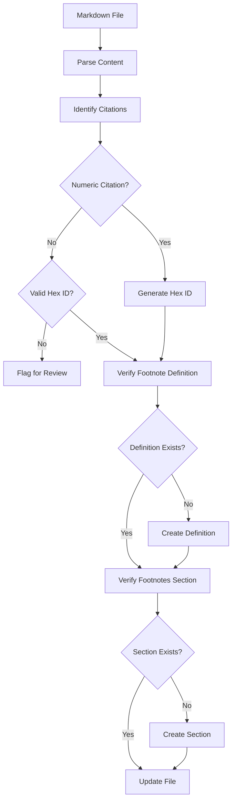
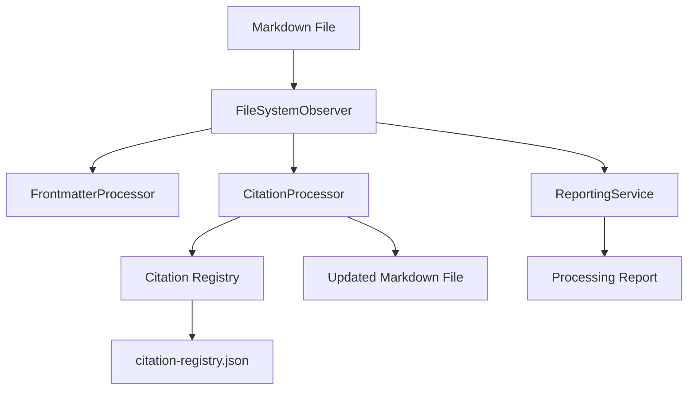

# Objective

Enhance the filesystem observer system to automatically convert numeric citations in Markdown files to unique hexadecimal identifiers, ensuring consistent citation formatting and creating a robust footnote management system.

# Background

Our existing filesystem observer monitors and maintains frontmatter consistency in Markdown files. We now need to extend this functionality to handle citations, specifically:

1. Convert numeric citations (e.g., `[^e923c9]`) to unique hexadecimal identifiers (e.g., `[^a1b2c3]`)
2. Ensure all citations have corresponding footnote definitions
3. Create or update a Footnotes section when necessary
4. Maintain a registry of citations across files for cross-referencing

# Current Implementation

The current citation system exists in our YouTube link formatter (`formatYouTubeLinks.ts`) and build scripts, which:

1. Generate random hex values for new citations
2. Create citation references (`[^a1b2c3]`) and definitions (`[^a1b2c3]: Citation text`)
3. Check for existing citations before creating new ones
4. Format citations according to a consistent template

```javascript
// Example from existing code
const formats = {};
        
// Only generate formats that don't exist
const hasFootnoteRef = content.includes(`[^${randHex}]`);
const hasFootnoteDef = content.includes(`[^${randHex}]:`);

if (!hasFootnoteRef) {
  formats.citeMarkdown = `[^${randHex}]`;
  formats.fullLineCite = `${formattedDate.year}, ${formattedDate.month} ${formattedDate.day}. "[${youtubeData.title}](${youtubeUrl})," [[${youtubeData.channelTitle}]] [^${randHex}]`;
}

if (!hasFootnoteDef) {
  formats.fullLineFootnote = `[^${randHex}]: ${formattedDate.year}, ${formattedDate.month} ${formattedDate.day}. "[${youtubeData.title}](${youtubeUrl})," [[${youtubeData.channelTitle}]]`;
}
```

# Implementation Requirements

## 1. Citation Processor Module

Create a new module in the observers system that:



## 2. Core Functions

### Citation Detection and Conversion

```typescript
/**
 * Detects and converts numeric citations to hex format
 * 
 * @param content - The markdown file content
 * @returns Object containing updated content and conversion statistics
 */
function convertNumericCitationsToHex(content: string): {
  updatedContent: string;
  stats: {
    numericCitationsFound: number;
    conversionsPerformed: number;
    existingHexCitations: number;
  }
}
```

### Footnote Management

```typescript
/**
 * Ensures all citations have corresponding footnote definitions
 * and creates a Footnotes section if needed
 * 
 * @param content - The markdown file content
 * @param citationRegistry - Registry of known citations
 * @returns Updated content with complete footnotes
 */
function ensureFootnotesComplete(
  content: string, 
  citationRegistry: Map<string, CitationData>
): string
```

### Citation Registry

```typescript
/**
 * Citation data structure for registry
 */
interface CitationData {
  hexId: string;
  sourceText?: string;
  sourceUrl?: string;
  sourceTitle?: string;
  sourceAuthor?: string;
  dateCreated: string;
  dateUpdated: string;
  files: string[]; // Files where this citation appears
}

/**
 * Maintains a registry of all citations across files
 */
class CitationRegistry {
  addCitation(hexId: string, data: Partial<CitationData>): void;
  getCitation(hexId: string): CitationData | undefined;
  updateCitationFiles(hexId: string, filePath: string): void;
  saveToDisk(): Promise<void>;
  loadFromDisk(): Promise<void>;
}
```

## 3. Integration with FileSystemObserver

Extend the existing `FileSystemObserver` class to:

1. Process citations after frontmatter validation
2. Update the citation registry when files change
3. Generate reports on citation conversions and issues

```typescript
// Example integration with FileSystemObserver
class FileSystemObserver {
  // Existing code...

  async processFile(filePath: string): Promise<void> {
    // Existing frontmatter processing...
    
    // Process citations if this is a markdown file
    if (filePath.endsWith('.md')) {
      const content = await fs.promises.readFile(filePath, 'utf8');
      
      // Convert numeric citations to hex
      const { updatedContent, stats } = convertNumericCitationsToHex(content);
      
      // Ensure footnotes are complete
      const finalContent = ensureFootnotesComplete(updatedContent, this.citationRegistry);
      
      // Write changes if needed
      if (finalContent !== content) {
        await fs.promises.writeFile(filePath, finalContent, 'utf8');
        this.reportingService.addProcessedFile(filePath, {
          citationsConverted: stats.conversionsPerformed,
          footnotesAdded: stats.missingFootnotesAdded
        });
      }
    }
  }
}
```

## 4. Configuration Options

Add new configuration options to the template system:

```typescript
// Citation template configuration
export const citationTemplate = {
  // Footnotes section format
  footnotes: {
    header: '# Footnotes',
    sectionLine: '***',
  },
  
  // Citation format
  format: {
    // Generate a random hex ID of specified length
    generateHexId: (length: number = 6): string => {
      return [...Array(length)]
        .map(() => Math.floor(Math.random() * 16).toString(16))
        .join('');
    },
    
    // Format a citation reference
    formatReference: (hexId: string): string => {
      return `[^${hexId}]`;
    },
    
    // Format a citation definition
    formatDefinition: (hexId: string, text: string): string => {
      return `[^${hexId}]: ${text}`;
    }
  },
  
  // Registry location
  registryPath: 'src/content/data/citation-registry.json'
};
```

# Testing Strategy

1. Create test files with various citation formats
2. Run the observer on these files
3. Verify:
   - Numeric citations are converted to hex
   - All citations have definitions
   - Footnotes section exists where needed
   - Registry is properly updated

```typescript
// Example test case
describe('Citation Processor', () => {
  it('converts numeric citations to hex format', async () => {
    const testContent = 'This is a test with a numeric citation[^e923c9].\n\n[^e923c9]: Test footnote.';
    const { updatedContent, stats } = convertNumericCitationsToHex(testContent);
    
    expect(stats.numericCitationsFound).toBe(1);
    expect(stats.conversionsPerformed).toBe(1);
    expect(updatedContent).not.toContain('[^e923c9]');
    expect(updatedContent).toMatch(/\[\^[0-9a-f]{6}\]/);
  });
});
```

# Implementation Plan

1. **Phase 1: Core Citation Processing**
   - Implement citation detection and conversion
   - Create citation registry
   - Add footnote management

2. **Phase 2: Observer Integration**
   - Extend FileSystemObserver
   - Add configuration options
   - Implement reporting

3. **Phase 3: Testing and Refinement**
   - Create test suite
   - Process existing content
   - Fix edge cases

# Expected Outcomes

1. All numeric citations converted to unique hex IDs
2. Complete footnote definitions for all citations
3. Properly formatted Footnotes sections
4. Comprehensive citation registry for cross-referencing
5. Detailed reports on citation processing

# Data Flow



# Potential Challenges

1. **Handling complex citation formats** - Some citations may have unusual formatting or be embedded in complex markdown structures
2. **Performance with large files** - Processing large files with many citations could be resource-intensive
3. **Maintaining context** - Ensuring citations remain in the correct context when converting
4. **Cross-file references** - Managing citations that reference content in other files

# Conclusion

This enhancement will significantly improve our content management system by ensuring consistent citation formatting and robust footnote handling. By integrating with our existing filesystem observer, we can maintain citation integrity alongside frontmatter consistency, creating a more reliable and user-friendly content ecosystem.