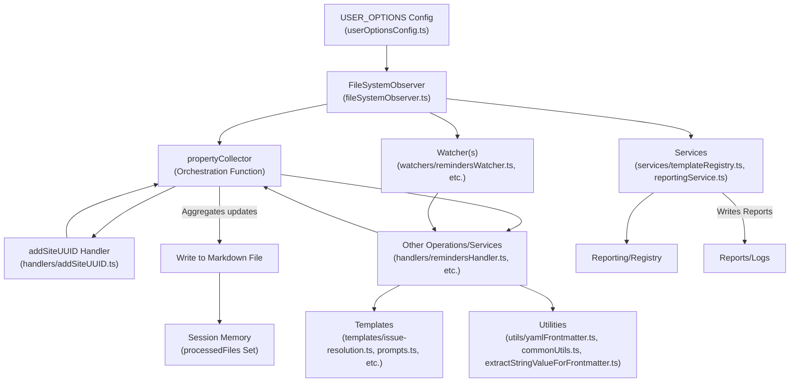

# Initial Role
You are a content manager for a small but productive marketing team.  You are the "technical" lead that works most closely with developers who build and maintain a content-driven application and site.  

# Objective
Introduce a "Issue Resolutions" content collection along the same lines as "Prompts", and "Specifications" and "Reminders". 

Use an "Observer/Watcher" pattern to assure consistent frontmatter, acknowledging there are **two separate application circumstances:** 
1. initializing the content collection, at which time frontmatter is missing or dramatically inconsistent, 
2. once an observer is initialized by the user, observing new files added to the folder -- at which time the observer-orchestrator calls dedicated files in appying a standard template.

***

# Why AI Improvisation for Frontmatter?

After months of experience, we have found that for a relatively small set of files, using scripts to add and assure initial frontmatter is less effective than having an AI Code Assistant (usually Cascade, now on GTP 4.1) walk through each file and improvise fields such as "title," "lede," "image_prompt," and "tags." This approach is:
- **More expedient:** Faster than scripting for initial setup
- **More accurate:** Handles edge cases and context better
- **More creative and sufficient:** Produces richer, more human-readable metadata

Preference should be given to evaluation and reporting over validation and overwriting. Typical YAML libraries and TypeScript validation techniques often cause more problems than they solve in this context.

***

# Suggested Implementation:

> Change Role: Software Developer

### First, the template for the observer. 

The Observer is the master orchestrator. Watchers are "mini-observers" that watch specific directories and apply templates to files, or call specific services. Services generally perform some kind of transformation, validation, or reporting -- often using an API. 

Observer: `tidyverse/observers/fileSystemObserver.ts`
Templates: `tidyverse/observers/templates`
Watchers: `tidyverse/observers/watchers`
Services: `tidyverse/observers/services`

## Task at Hand:
1. Audit the Markdown frontmatter from the following directory:
> `content/lost-in-public/issue-resolution`
2. Review the "ideal" YAML frontmatter from the starter template file:
> `tidyverse/observers/templates/issue-resolution.ts`
Review the "patterns" we have used in other templates, such as 
> `tidyverse/observers/templates/prompts.ts`.
3. Create a template that can be used in Scripts, Observers, and Watchers. The starter file has a copy of one of the frontmatter sections from a reminders file. `tidyverse/observers/templates/issue-resolution.ts`

***

# Patterns from Existing Templates (prompts.ts)

We can use THE EXACT SAME patterns and conventions extracted from `tidyverse/observers/templates/prompts.ts` for use in designing a canonical reminders template:

### **Field Order and Structure:**
- Required fields are listed first, followed by optional fields.
- Each field includes: type, description, validation function, and default value logic.
  - **NOTE:** Validation functions are intended to prevent errors, not cause them. By default, validation functions should only generate reports on detected issues; they should never attempt to automatically fix or mutate the content. All remediation must be manual or explicitly triggered by the user or a higher-level process.
- All dates use strict `YYYY-MM-DD` format (never include time component).
- Arrays (e.g., `authors`, `tags`) are validated for non-empty values and can accept both array and string (comma-separated) formats.
- Use of utility functions for UUIDs, file creation/modification dates, and tag generation from file paths.

### **Required Fields (with validation and defaults):**
- `title` (string, required, auto-generated from filename if missing)
- `lede` (string, required, brief description)
- `date_authored_initial_draft` (date, required, default = today)
- `date_authored_current_draft` (date, required, default = today)
- `at_semantic_version` (string, required, default = 0.0.0.1)
- `authors` (array or string, required, default = ['Michael Staton'])
- `status` (string, required, default = 'To-Prompt')
- `augmented_with` (string, required, default = 'Windsurf Cascade on Claude 3.5 Sonnet')
- `category` (string, required, default = 'Prompts')
- `tags` (array or string, required, auto-generated from path if possible)
- `date_created` (date, required, default = file creation date)
- `date_modified` (date, required, default = now)
- `site_uuid` (string, required, default = generated UUID)

**Optional Fields:**
- `date_authored_final_draft` (date, optional)
- `date_first_published` (date, optional)
- `date_last_updated` (date, optional)
- `date_first_run` (date, optional)
- `publish` (boolean, optional, default = false)

**Reusable Patterns:**
- Always provide a validation function for each field.
- Use default value functions for auto-population (e.g., title, tags, dates).
- Normalize and capitalize tags from directory structure for consistency.
- Use robust error handling in default generators.
- Comment each field with purpose and usage.

***

# BEWARE: 
The last many attempts we have almost always introduced an "Infinite Loop" whereby an observer triggers an operation that makes a change that triggers the observer.  

# Existing Observer Logic:
The main Filesystem Observer specification is:
> [[content/specs/Filesystem-Observer-for-Consistent-Metadata-in-Markdown-files.md|Filesystem Observer for Consistent Metadata in Markdown Files]]

> **EMPHASIS: The `propertyCollector` orchestration pattern is the critical innovation that prevents infinite observer loops.**
>
> - After the initial `addSiteUUID` operation, the `propertyCollector` receives the full frontmatter and sequentially invokes each operation/service.
> - Each operation/service returns ONLY the new or updated fields it intends to create or modify—never the whole frontmatter.
> - The `propertyCollector` accumulates these changes and writes to the Markdown file ONLY ONCE all expected updates are received.
> - After writing, it adds the file path to a session memory to ensure the same file is not re-processed in the same session, breaking the infinite loop trap.

For convenience, here's a Mermaid diagram of the logic and relationships among config, observer, watcher, template, handler, service, utility code, and the propertyCollector:

***

# One at a Time Steps

> Update Role: Software Developer for Content Marketing:

## 1. Generate script code that will apply a "site_uuid" and "date_created" property. 

This should, if possible, be part of or draw from the Observer/Watcher code. Applying these fields is usually the first step in a Watcher, and runs prior to triggering any other operations. 

#### Expected Output:

Initial script or observer code:
- [ ] uses DRY principles and does not introduce new functionality that alreaddy exists in utility, helper, or config files. 
- [ ] upon first run asserts a site_uuid and date_created property while respecting any frontmatter that was there. 
- [ ] does not overwrite any files that already have a site_uuid or date_created property.

## 2. Improvise a basic frontmatter, file by file:

> Update Role: Content Developer and Copywriter:

As an AI Code Assistant, improvise a basic frontmatter for each file, walking through each file in the directory one by one. This approach leverages the strengths of AI for detail-oriented, creative, and context-aware metadata generation.

1. Review the files and create a checklist.
2. Just walk through them one by one and do your best. No need to verify every step or even every few files. AI Code Assistants are fast, and their creativity and speed is better than human.

#### Expected Output:
- [ ] AI Code Assistant has acted as detail-oriented copywriter and created a first draft of frontmatter for each file, by walking through each file in the directory one-by-one.

> Update Role: Software Engineer and Systems Architect:

## 3. Build out the observer code:
Use existing patterns and shared functionality. ALWAYS APPLY a single source of truth, read existing code, follow existing patterns, and re-use as much as possible.  EVEN IF IT TAKES LONGER, it saves time in the long run.  

### MUST USE USER_CONFIG PATTERNS
> `tidyverse/observers/userOptionsConfig.ts`

The user should be able to turn on and off, and fine tune the functionality of any _watcher_ by changing the USER_OPTIONS in the `userOptionsConfig.ts`

#### Shared Utilties etc:
> `tidyverse/observers/utils` includes `commontUtils.ts`, `extractStringValueForFrontmatter.ts`, `yamlFrontmatter.ts`

### 4. Create a template with the same patterns as reminders:

Create the template in the following starter file:
> `tidyverse/observers/templates/issue-resolution`

1. Create a "template" with the EXACT SAME PATTERNS as 
> `tidyverse/observers/templates/reminders.ts`

When creating the "Issue Resolution" template, use the same validation flexibility, defaulting, and commenting style. Adjust field names and defaults as appropriate for "issue-resolution", but preserve the DRY, robust, and human-readable and machine-parseable conventions.

2. Create a "Watcher" with THE EXACT SAME PATTERNS as:
> `tidyverse/observer/watchers/remindersWatchers`

3. Add the "type" for TypeScript in:
> `tidyverse/observers/types/watcherTypes.ts`

### Optional or Conditional Efforts:

1. Create a "Handler" with THE EXACT SAME PATTERNS as:
> `tidyverse/observers/handlers/remindersHandler.ts`

# Success Criteria:

- [ ] Initial code run applies ONLY site_uuid and date_created properties correctly, does not overwrite files that have them.
- [ ] Follow up copywriting walkthrough generates solid first draft of frontmatter content.
- [ ] Final code uses existing patterns
- [ ] Final code calls utility, helper, and config options from relevant files.
- [ ] Final code can be turned on and off, fine tunes in the `userOptionsConfig.ts`

***
