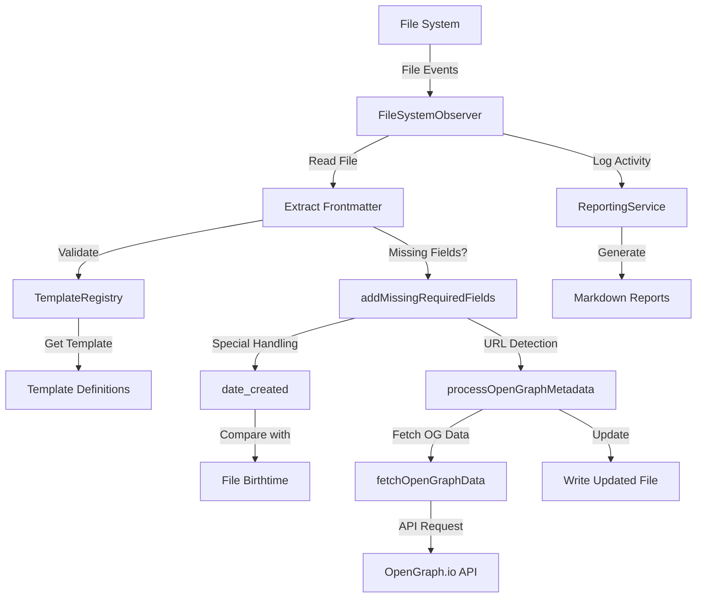

## Objective
Integrate OpenGraph metadata fetching capabilities into the existing filesystem observer system to automatically fetch and update OpenGraph-related metadata in Markdown files when URLs are present.

## Implementation Overview

This integration will enhance the filesystem observer to detect URLs in frontmatter, fetch OpenGraph metadata for those URLs, and update the frontmatter with the retrieved metadata while maintaining all existing functionality.

### System Architecture



## Core Components

### 1. OpenGraph Metadata Processing

```typescript
/**
 * Process OpenGraph metadata for a file with frontmatter
 * @param frontmatter The frontmatter object
 * @param filePath The path to the file
 * @returns The updated frontmatter and whether it was changed
 */
async function processOpenGraphMetadata(
  frontmatter: Record<string, any>,
  filePath: string
): Promise<{ updatedFrontmatter: Record<string, any>; changed: boolean }> {
  // Create a copy of the frontmatter to avoid modifying the original
  const updatedFrontmatter = { ...frontmatter };
  let changed = false;
  
  try {
    // Check if the frontmatter has a URL field
    const url = updatedFrontmatter.url || updatedFrontmatter.link;
    
    if (!url) {
      console.log(`No URL found in frontmatter for ${filePath}`);
      return { updatedFrontmatter, changed };
    }
    
    // Skip if the file already has OpenGraph metadata and no refresh is needed
    if (
      updatedFrontmatter.og_title && 
      updatedFrontmatter.og_description && 
      updatedFrontmatter.og_image &&
      !updatedFrontmatter.og_refresh_needed
    ) {
      console.log(`OpenGraph metadata already exists for ${filePath}`);
      return { updatedFrontmatter, changed };
    }
    
    // Fetch OpenGraph data
    console.log(`Fetching OpenGraph data for ${url} (${filePath})`);
    const ogData = await fetchOpenGraphData(url, filePath);
    
    if (ogData) {
      // Update frontmatter with OpenGraph data
      updatedFrontmatter.og_title = ogData.og_title;
      updatedFrontmatter.og_description = ogData.og_description;
      updatedFrontmatter.og_image = ogData.og_image;
      updatedFrontmatter.og_url = ogData.og_url;
      updatedFrontmatter.og_last_fetch = ogData.og_last_fetch;
      
      // Remove refresh flag if it exists
      if (updatedFrontmatter.og_refresh_needed) {
        delete updatedFrontmatter.og_refresh_needed;
      }
      
      // Remove error if it exists (since we now have valid data)
      if (updatedFrontmatter.og_error) {
        delete updatedFrontmatter.og_error;
      }
      
      changed = true;
      console.log(`Updated OpenGraph metadata for ${filePath}`);
    } else if (updatedFrontmatter.og_error === undefined) {
      // Only set error if there isn't one already
      updatedFrontmatter.og_error = "Failed to fetch OpenGraph data";
      updatedFrontmatter.og_last_fetch = new Date().toISOString();
      changed = true;
      console.log(`Failed to fetch OpenGraph data for ${filePath}`);
    }
    
    return { updatedFrontmatter, changed };
  } catch (error) {
    console.error(`Error processing OpenGraph metadata for ${filePath}:`, error);
    
    // Add error information to frontmatter
    updatedFrontmatter.og_error = error.message || "Unknown error fetching OpenGraph data";
    updatedFrontmatter.og_last_fetch = new Date().toISOString();
    changed = true;
    
    return { updatedFrontmatter, changed };
  }
}
```

### 2. OpenGraph Data Fetching

```typescript
/**
 * Fetch OpenGraph data for a URL
 * @param url The URL to fetch OpenGraph data for
 * @param filePath The path to the file (for logging)
 * @returns The OpenGraph data or null if the fetch failed
 */
async function fetchOpenGraphData(
  url: string,
  filePath: string
): Promise<{
  og_title: string;
  og_description: string;
  og_image: string;
  og_url: string;
  og_last_fetch: string;
} | null> {
  // Maximum number of retry attempts
  const MAX_RETRIES = 3;
  
  // Retry with exponential backoff
  for (let attempt = 1; attempt <= MAX_RETRIES; attempt++) {
    try {
      console.log(`Fetching OpenGraph data for ${url} (attempt ${attempt}/${MAX_RETRIES})`);
      
      // Get API key from environment variable
      const apiKey = process.env.OPEN_GRAPH_IO_API_KEY;
      if (!apiKey) {
        throw new Error('OPEN_GRAPH_IO_API_KEY environment variable not set');
      }
      
      // Construct API URL
      const apiUrl = `https://opengraph.io/api/1.1/site/${encodeURIComponent(url)}?app_id=${apiKey}`;
      
      // Fetch data from API
      const response = await fetch(apiUrl);
      
      if (!response.ok) {
        throw new Error(`API returned ${response.status}: ${response.statusText}`);
      }
      
      const data = await response.json();
      
      // Validate response data
      if (!data.hybridGraph) {
        throw new Error('Invalid API response: missing hybridGraph');
      }
      
      // Extract OpenGraph data
      const ogData = {
        og_title: data.hybridGraph.title || '',
        og_description: data.hybridGraph.description || '',
        og_image: data.hybridGraph.image || '',
        og_url: data.hybridGraph.url || url,
        og_last_fetch: new Date().toISOString()
      };
      
      // Clean up data (remove quotes, etc.)
      for (const [key, value] of Object.entries(ogData)) {
        if (typeof value === 'string') {
          ogData[key] = value.replace(/^["']|["']$/g, '');
        }
      }
      
      console.log(`Successfully fetched OpenGraph data for ${url}`);
      return ogData;
    } catch (error) {
      console.error(`Error fetching OpenGraph data for ${url} (attempt ${attempt}/${MAX_RETRIES}):`, error);
      
      if (attempt === MAX_RETRIES) {
        console.error(`Max retries reached for ${url}`);
        return null;
      }
      
      // Exponential backoff
      const delay = Math.pow(2, attempt) * 1000;
      console.log(`Retrying in ${delay}ms...`);
      await new Promise(resolve => setTimeout(resolve, delay));
    }
  }
  
  return null;
}
```

### 3. Integration with FileSystemObserver

To integrate OpenGraph fetching into the existing FileSystemObserver, we need to modify the `addMissingRequiredFields` function and the file change handlers to include OpenGraph metadata processing:

```typescript
// In addMissingRequiredFields function, add after the standard field processing
// Process OpenGraph metadata if URL is present
if (updatedFrontmatter.url || updatedFrontmatter.link) {
  const ogResult = await processOpenGraphMetadata(updatedFrontmatter, filePath);
  updatedFrontmatter = ogResult.updatedFrontmatter;
  changed = changed || ogResult.changed;
}
```

### 4. Statistics Tracking

The ReportingService should be extended to track OpenGraph fetching statistics:

```typescript
// Add to ReportingService class
private openGraphStats = {
  processed: 0,
  succeeded: new Set<string>(),
  failed: new Set<string>(),
  skipped: new Set<string>()
};

// Log OpenGraph processing
logOpenGraphProcessing(filePath: string, status: 'success' | 'failure' | 'skipped'): void {
  if (status === 'success') {
    this.openGraphStats.succeeded.add(filePath);
  } else if (status === 'failure') {
    this.openGraphStats.failed.add(filePath);
  } else {
    this.openGraphStats.skipped.add(filePath);
  }
  this.openGraphStats.processed++;
}

// Include OpenGraph stats in reports
generateReport(): string {
  // Skip report generation if no files were processed
  if (this.filesProcessed === 0 && this.openGraphStats.processed === 0) {
    console.log('No files were processed, skipping report generation');
    return null;
  }
  
  // Existing report generation code...
  
  // Only add OpenGraph statistics if any OpenGraph processing occurred
  if (this.openGraphStats.processed > 0) {
    report += '\n## OpenGraph Processing Statistics\n\n';
    report += `- Total files processed: ${this.openGraphStats.processed}\n`;
    report += `- Successful fetches: ${this.openGraphStats.succeeded.size}\n`;
    report += `- Failed fetches: ${this.openGraphStats.failed.size}\n`;
    report += `- Skipped (already had data): ${this.openGraphStats.skipped.size}\n`;
    
    // Add lists of files
    if (this.openGraphStats.succeeded.size > 0) {
      report += '\n### Files with successful OpenGraph fetches\n\n';
      for (const file of this.openGraphStats.succeeded) {
        report += `- [[${file.replace(/^.*\/content\//, 'content/')}]]\n`;
      }
    }
    
    if (this.openGraphStats.failed.size > 0) {
      report += '\n### Files with failed OpenGraph fetches\n\n';
      for (const file of this.openGraphStats.failed) {
        report += `- [[${file.replace(/^.*\/content\//, 'content/')}]]\n`;
      }
    }
  }
  
  return report;
}
```

### 5. Report Generation Optimization

To avoid generating empty reports, we need to modify the report generation logic in the FileSystemObserver:

```typescript
// In FileSystemObserver class
private setupReportGeneration(): void {
  // Set up periodic report generation (e.g., every 5 minutes)
  const reportInterval = setInterval(() => {
    // Only generate report if files were processed
    if (this.reportingService.hasProcessedFiles()) {
      const report = this.reportingService.generateReport();
      if (report) {
        this.saveReport(report, 'periodic');
      }
      // Reset statistics after generating report
      this.reportingService.resetStats();
    }
  }, 5 * 60 * 1000); // 5 minutes
  
  // Generate final report on process exit
  process.on('SIGINT', () => {
    clearInterval(reportInterval);
    if (this.reportingService.hasProcessedFiles()) {
      const report = this.reportingService.generateReport();
      if (report) {
        this.saveReport(report, 'final');
      }
    }
    process.exit(0);
  });
}

// Add to ReportingService class
hasProcessedFiles(): boolean {
  return this.filesProcessed > 0 || this.openGraphStats.processed > 0;
}

resetStats(): void {
  this.filesProcessed = 0;
  this.propertyConversions = {};
  this.validationIssues = {};
  this.openGraphStats = {
    processed: 0,
    succeeded: new Set<string>(),
    failed: new Set<string>(),
    skipped: new Set<string>()
  };
}
```

## Implementation Requirements

### 1. Environment Variables

The following environment variables must be set:

```
OPEN_GRAPH_IO_API_KEY=your_api_key
```

### 2. Dependencies

Add the following to package.json:

```json
{
  "dependencies": {
    "node-fetch": "^3.3.0"
  }
}
```

### 3. Error Handling

- Implement robust error handling with detailed logging
- Retry logic for API failures with exponential backoff
- Preserve existing frontmatter if OpenGraph fetch fails
- Record errors in frontmatter for debugging

### 4. Performance Considerations

- Implement request throttling to avoid API rate limits
- Cache API responses to prevent redundant requests
- Process files in parallel with appropriate concurrency limits
- Skip processing for files that already have valid OpenGraph metadata

## Implementation Plan

1. Create OpenGraph fetching utility functions
2. Integrate with FileSystemObserver
3. Extend ReportingService for OpenGraph statistics
4. Add environment variable handling
5. Implement error handling and retry logic
6. Update documentation

## Conclusion

This integration will enhance the filesystem observer to automatically fetch and update OpenGraph metadata for Markdown files with URLs, providing rich metadata that can be used for previews, social sharing, and other purposes while maintaining the existing functionality of the system.