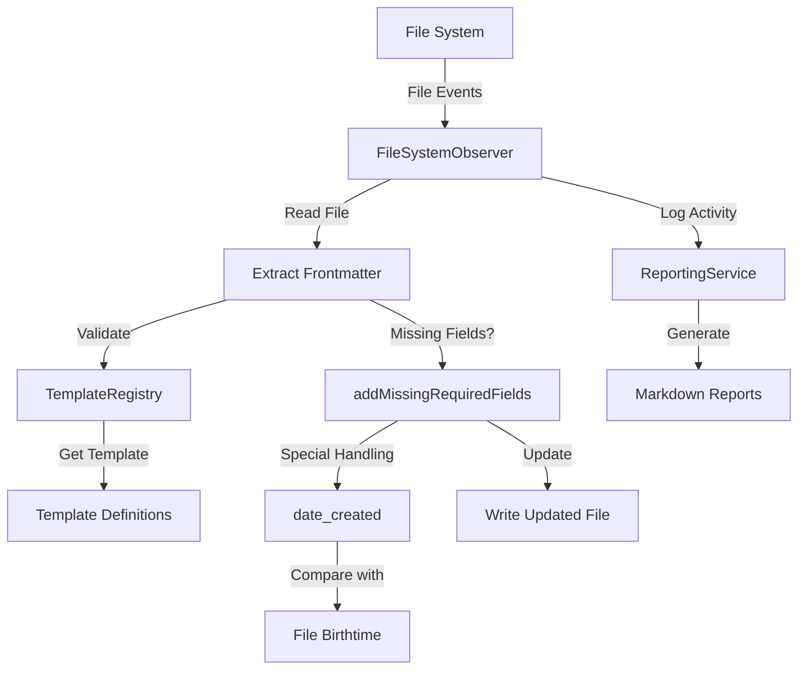

## Objective
Create a robust filesystem observer system that monitors Markdown files, validates frontmatter against predefined templates, and automatically corrects inconsistencies while preserving the most accurate metadata.

## Implementation Status
This system has been successfully implemented in the `tidyverse/observers` directory with the following key features:
- Template-based frontmatter validation
- Automatic correction of missing required fields
- Special handling for date_created using file birthtime
- Kebab-case to snake_case property conversion
- Proper YAML formatting for tags and arrays

## System Architecture



## Data Flow

1. **File Detection**:
   ```
   File System (new/modified file)
     → FileSystemObserver (event)
       → Extract Frontmatter
         → Validate Against Template
   ```

2. **Field Processing**:
   ```
   Template Registry (find matching template)
     → Check Required Fields
       → Special Handling for date_created
         → Compare with File Birthtime
           → Keep Earlier Date
   ```

3. **Reporting Flow**:
   ```
   Observer Activity
     → ReportingService
       → Log Property Conversions
         → Generate Markdown Reports
   ```

## Key Components

### 1. Template Registry
```typescript
// Template definition pattern
interface Template {
  id: string;
  name: string;
  description: string;
  
  // Path matching rules
  pathPatterns: string[];
  
  // Schema definition
  required: {
    [key: string]: {
      type: string;
      description: string;
      defaultValueFn?: (filePath: string) => any;
    }
  };
  
  optional: {
    [key: string]: {
      type: string;
      description: string;
      defaultValueFn?: (filePath: string) => any;
    }
  };
}
```

### 2. File Observer
```typescript
class FileSystemObserver {
  constructor(
    private templateRegistry: TemplateRegistry,
    private contentRoot: string
  ) {
    this.watcher = chokidar.watch(contentRoot);
  }
  
  async onFileChanged(filePath: string) {
    // Read file and extract frontmatter
    const content = await fs.readFile(filePath, 'utf8');
    const frontmatterResult = this.extractFrontmatter(content);
    
    if (frontmatterResult.frontmatter) {
      // Find matching template
      const template = this.templateRegistry.findTemplate(filePath);
      
      // Add missing required fields
      const { updatedFrontmatter, changed } = addMissingRequiredFields(
        frontmatterResult.frontmatter,
        template,
        filePath
      );
      
      // Write updated file if changes were made
      if (changed) {
        await this.writeUpdatedFile(filePath, updatedFrontmatter, frontmatterResult.content);
      }
    }
  }
}
```

### 3. Special Handling for date_created
```typescript
// In addMissingRequiredFields function
if (key === 'date_created') {
  try {
    // Get file birthtime
    const fs = require('fs');
    if (fs.existsSync(filePath)) {
      const stats = fs.statSync(filePath);
      const birthtime = stats.birthtime;
      const birthtimeIso = birthtime.toISOString();
      
      // If date_created exists, check if birthtime is earlier
      if (updatedFrontmatter[key]) {
        const existingDate = new Date(updatedFrontmatter[key]);
        
        // If birthtime is earlier than the existing date_created, update it
        if (birthtime < existingDate) {
          console.log(`Updating date_created for ${filePath} from ${updatedFrontmatter[key]} to ${birthtimeIso} (file birthtime is earlier)`);
          updatedFrontmatter[key] = birthtimeIso;
          changed = true;
        } else {
          console.log(`Keeping existing date_created for ${filePath}: ${updatedFrontmatter[key]} (earlier than file birthtime ${birthtimeIso})`);
        }
      } 
      // If date_created doesn't exist, add it
      else {
        console.log(`Adding date_created for ${filePath}: ${birthtimeIso}`);
        updatedFrontmatter[key] = birthtimeIso;
        changed = true;
      }
      
      // Skip the standard field processing for date_created
      continue;
    }
  } catch (error) {
    console.error(`Error handling date_created for ${filePath}:`, error);
    // Continue with standard processing if there was an error
  }
}
```

### 4. Template Definition for Tooling
```typescript
const toolingTemplate = {
  id: 'tooling',
  name: 'Tooling Document',
  description: 'Template for tooling documentation',
  
  pathPatterns: ['content/tooling/**/*.md'],
  
  required: {
    site_uuid: {
      type: 'string',
      description: 'Unique identifier for the site',
      defaultValueFn: () => uuidv4()
    },
    tags: {
      type: 'array',
      description: 'Categorization tags',
      defaultValueFn: (filePath) => {
        // Extract directory structure as tags
        try {
          // Extract all directory names after 'tooling'
          const pathParts = filePath.split('/');
          const toolingIndex = pathParts.findIndex(part => part === 'tooling');
          
          if (toolingIndex >= 0) {
            // Get all directory names after 'tooling' and before the filename
            const tags = pathParts.slice(toolingIndex + 1, -1).map(tag => tag.replace(/\s+/g, '-'));
            return tags.length > 0 ? tags : ['Uncategorized'];
          }
          return ['Uncategorized'];
        } catch (error) {
          console.error(`Error generating tags for ${filePath}:`, error);
          return ['Uncategorized'];
        }
      }
    },
    date_created: {
      type: 'date',
      description: 'Creation date',
      defaultValueFn: (filePath) => {
        try {
          // Use the Node.js fs module for synchronous operations
          const fs = require('fs');
          
          // Check if file exists
          if (fs.existsSync(filePath)) {
            // Get file stats to access creation time
            const stats = fs.statSync(filePath);
            
            // Use birthtime (actual file creation time) which is reliable on Mac
            const timestamp = stats.birthtime;
            
            // Return full ISO string with timezone
            return timestamp.toISOString();
          } else {
            // Return null instead of current date
            return null;
          }
        } catch (error) {
          // Return null instead of current date
          return null;
        }
      }
    },
    date_modified: {
      type: 'date',
      description: 'Last modified date',
      defaultValueFn: (filePath) => {
        // Similar to date_created but using mtime
        // Implementation details...
      }
    }
  },
  
  optional: {
    // Optional fields definition
    // Implementation details...
  }
};
```

## Best Practices

1. **Reliable File Timestamps**:
   - Use `birthtime` for `date_created` which is reliable on Mac systems
   - Compare existing values with file timestamps and keep the earlier date
   - Add proper error handling to prevent fallbacks to current date

2. **Frontmatter Consistency**:
   - Convert kebab-case properties to snake_case
   - Format tags as proper YAML lists with hyphens
   - Preserve content while updating frontmatter

3. **Reporting and Monitoring**:
   - Log all property conversions and validation issues
   - Generate periodic reports in markdown format
   - Create a final report on system shutdown

## Constraints and Limitations

1. **File System Compatibility**:
   - The `birthtime` property is reliable on Mac but may not be on all systems
   - Error handling is in place to prevent incorrect timestamps

2. **Performance Considerations**:
   - Synchronous file operations are used for simplicity but may impact performance with large numbers of files
   - Consider batch processing for large directories

3. **Template Management**:
   - Templates must be manually updated when frontmatter requirements change
   - No automatic detection of new frontmatter patterns

## Next Steps

1. **Enhanced Validation**:
   - Add more sophisticated validation rules for specific field types
   - Implement cross-field validation (e.g., date_created should be before date_modified)

2. **User Interface**:
   - Create a dashboard for monitoring observer activity
   - Add interactive controls for managing templates

3. **Integration**:
   - Connect with build process to ensure frontmatter is valid before deployment
   - Add hooks for custom processing of specific fields
