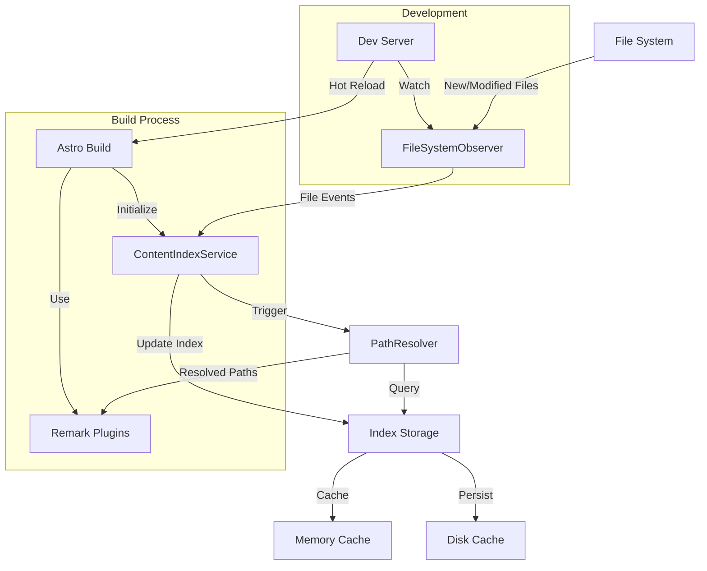

## Objective: 
Leverage the file system libraries to observe directories for new files, insert frontmatter templates.

### Background
The content team has been using Markdown files to store content, but has been very inconsistent in their use of frontmatter or extended markdown syntax. 

No amount of training the content team will assure consistent frontmatter, so we need to enable it through automation.

### Example issues:

1. Backlink extrapolation
Backlinks sometimes have a full relative path, but often do not.
So 
```markdown
#### When [[Agentic AI|AI Agents]] use [[RAG]] techniques, it's called [[Agentic RAG]]
```
Should actually be 
```markdown
#### When [[tooling/AI-Toolkit/Explainers/Agentic AI|AI Agents]] use [[vocabulary/RAG]] techniques, it's called [[vocabulary/Agentic RAG]]
```

2. Backlink accuracy

If the file 'Agentic RAG' is moved from the 'vocabulary' directory to the 'tooling/AI-Toolkit/Explainers' directory, the backlink should be updated to point to the new location.
```markdown
#### When [[tooling/AI-Toolkit/Explainers/Agentic AI|AI Agents]] use [[vocabulary/RAG]] techniques, it's called [[vocabulary/Agentic RAG]]
```
needs to magically turn into:
```markdown
#### When [[tooling/AI-Toolkit/Explainers/Agentic AI|AI Agents]] use [[vocabulary/RAG]] techniques, it's called [[tooling/AI-Toolkit/Explainers/Agentic RAG]]
```

3. Frontmatter consistency
The desired frontmatter is constantly evolving, and any clear decisions to alter or extend frontmatter within a collection or directory needs to be _rectroactively_ applied to all files in that collection or directory.

**Example:** Our prompt library and our Specifications library are somewhat redundant, but they are not consistent in their frontmatter.  Once a prompt has been developed and used, and it has turned into a full feature, it should be extended and either moved to the Specifications library or copied into the Specifications library where it will be further developed into a full Specification.  


```yaml
---
title: 'Frontmatter consistency through filesystem observer'
lede: 'Leverage the file system libraries to observe directories for new files, insert frontmatter templates.'
date_authored_initial_draft: 2025-03-30
date_authored_current_draft: 2025-04-02
date_authored_final_draft: null
date_first_published: null
date_last_updated: null
at_semantic_version: '0.0.0.2'
authors: 
  Michael Staton
status: To-Do
augmented_with: 'Windsurf Cascade on Claude 3.5 Sonnet'
category: Prompts
tags:
- Frontmatter-Validation
- File-Processing
- Build-Scripts
- File-Systems
date_created: 2025-03-23
date_modified: 2025-04-02
---
```

```yaml
---
title: 'Technical Specification: YAML Frontmatter Error Detection and Correction System'
lede: Let content teams develop content. Handle frontmatter inconsistencies gracefully for a seamless user experience.
date_authored: 2025-03-18
at_semantic_version: "0.0.1.2"
authors: 
- Michael Staton
generated_with: "Windsurf Cascade on Claude 3.5 Sonnet"
category: Technical-Specification
tags:
- YAML
- Data-Wrangling
- Frontmatter
- Error-Detection
- Error-Handling
- Workflow-Automation
- Content-Management
- Build-Scripts
- Markdown
date_created: 2025-03-18
date_modified: 2025-03-19
---
```

```yaml
---
title: Create a Content Registry for Markdown Files
date: 2025-03-16
author: "Michael Staton"
generated_with: "Windsurf IDE with Claude 3.5 Sonnet"
tags:
- Scripts
- Content-Management
- Data-Registry
- Build-Process
---
```


## System Architecture and Data Flow



## Constraints
- Must have a memorable location and format for User generated templates.  
- Must use date_created and date_modified according to the filesystem. 
- Must set up tags in the proper array syntax. 

## Data Models

### File Entry Model
```typescript
interface FileEntry {
  // Filesystem metadata
  path: string;
  created: Date;
  modified: Date;
  
  // Content metadata
  title: string;
  aliases?: string[];
  tags: string[];
  
  // Reference tracking
  inboundLinks: string[];  // Files that link to this
  outboundLinks: string[]; // Files this links to
  
  // Cache control
  lastIndexed: Date;
  contentHash: string;
}
```

## Metadata Template System

### Template Definition Pattern
```typescript
interface MetadataTemplate {
  // Core template definition
  id: string;
  name: string;
  description: string;
  
  // Matching rules
  appliesTo: {
    collections?: string[];      // Astro collection names
    directories?: string[];      // Content directory paths
    filePatterns?: string[];    // Glob patterns
  };
  
  // Schema definition
  required: {
    [key: string]: {
      type: 'string' | 'date' | 'array' | 'boolean' | 'number';
      validation?: (value: any) => boolean;
      defaultValue?: any;
      description: string;
    }
  };
  
  optional: {
    [key: string]: {
      type: 'string' | 'date' | 'array' | 'boolean' | 'number';
      validation?: (value: any) => boolean;
      defaultValue?: any;
      description: string;
    }
  };
}

// Example template for prompts
const promptTemplate: MetadataTemplate = {
  id: 'prompt',
  name: 'Prompt Document',
  description: 'Template for AI prompt documents',
  
  appliesTo: {
    directories: ['content/lost-in-public/prompts/**/*'],
  },
  
  required: {
    title: {
      type: 'string',
      description: 'Title of the prompt'
    },
    date_authored_initial_draft: {
      type: 'date',
      defaultValue: () => new Date(),
      description: 'Initial authoring date'
    },
    authors: {
      type: 'array',
      validation: (arr) => arr.length > 0,
      description: 'List of authors'
    }
  },
  
  optional: {
    augmented_with: {
      type: 'string',
      description: 'AI system used for augmentation'
    },
    tags: {
      type: 'array',
      defaultValue: [],
      description: 'Categorization tags'
    }
  }
};
```

### Template Registry Service
```typescript
class TemplateRegistry {
  private templates: Map<string, MetadataTemplate>;
  
  // Find matching template for a file
  findTemplate(filePath: string): MetadataTemplate | null {
    return this.templates.find(template => 
      this.matchesRules(filePath, template.appliesTo));
  }
  
  // Apply template to generate frontmatter
  async applyTemplate(filePath: string): Promise<string> {
    const template = this.findTemplate(filePath);
    if (!template) return '';
    
    const defaults = this.generateDefaults(template);
    const yaml = await this.convertToYaml(defaults);
    return `---\n${yaml}\n---\n`;
  }
  
  // Validate existing frontmatter against template
  validate(filePath: string, frontmatter: any): ValidationResult {
    const template = this.findTemplate(filePath);
    return this.validateAgainstTemplate(frontmatter, template);
  }
}
```

### Integration with File Observer
```typescript
class FileSystemObserver {
  constructor(
    private templateRegistry: TemplateRegistry,
    private contentRoot: string
  ) {
    this.watcher = chokidar.watch(contentRoot);
  }
  
  async onNewFile(filePath: string) {
    // Generate frontmatter from template
    const frontmatter = await this.templateRegistry
      .applyTemplate(filePath);
      
    if (frontmatter) {
      await this.insertFrontmatter(filePath, frontmatter);
    }
  }
  
  async onFileChange(filePath: string) {
    // Validate against template
    const content = await fs.readFile(filePath, 'utf8');
    const frontmatter = this.extractFrontmatter(content);
    
    const validationResult = this.templateRegistry
      .validate(filePath, frontmatter);
      
    if (!validationResult.valid) {
      this.reportValidationErrors(filePath, validationResult);
    }
  }
}
```

## Component Pipeline

1. File Detection Flow:
```text
FileSystem (new/modified file)
  → FileSystemObserver (event)
    → ContentIndexService (process)
      → Update Index
      → Trigger Rebuilds
```

2. Path Resolution Flow:
```text
Remark Plugin (finds [[link]])
  → PathResolver (resolve)
    → Check Index
      → Return Full Path
        → Update References
```

## Proposed Implementation

### 1. File Index Service
```typescript
interface FileIndexEntry {
  id: string;          // Unique identifier
  path: string;        // Full path
  aliases: string[];   // Alternative names/paths
  references: string[]; // Files that reference this file
  lastModified: Date;
  contentType: 'vocabulary' | 'organization' | 'tool' | string;
}

class ContentIndexService {
  private index: Map<string, FileIndexEntry>;
  private watcher: FSWatcher;
}
```

### 2. Observer Pattern Implementation
```typescript
import chokidar from 'chokidar';

class FileSystemObserver {
  constructor(contentRoot: string) {
    this.watcher = chokidar.watch(contentRoot, {
      ignored: /(^|[\/\\])\../,  // Ignore dot files
      persistent: true
    });
  }

  onFileChange(callback: (path: string, type: 'add'|'change'|'unlink') => void) {
    this.watcher.on('all', (event, path) => {
      // Handle file changes and update index
    });
  }
}
```

### 3. Path Resolution Strategy
```typescript
class PathResolver {
  resolveBacklink(link: string): string {
    // 1. Check exact matches
    // 2. Check aliases
    // 3. Use fuzzy matching for similar names
    // 4. Handle category-based paths (e.g., Organizations/*)
  }
}
```

### 4. Integration with Astro
- Create custom Astro integration for index initialization during build
- Provide hooks for remark plugins to query the index
- Cache the index for faster lookups

### 5. Development Workflow
```typescript
const devServer = {
  async onStart() {
    await indexService.buildInitialIndex();
    fileObserver.startWatching();
  },
  
  onFileChange(path) {
    indexService.updateEntry(path);
    // Trigger partial rebuilds for affected files
  }
};
```

### Key Features
1. Live index of all content files
2. Tracks relationships between files (backlinks)
3. Handles file moves/renames by updating all references
4. Fuzzy matching for similar paths
5. Performance caching
6. Build process integration

### Next Steps
1. Implement basic file watching with chokidar
2. Create index data structure
3. Add path resolution logic
4. Integrate with existing remark plugins
5. Add caching layer
6. Create Astro integration