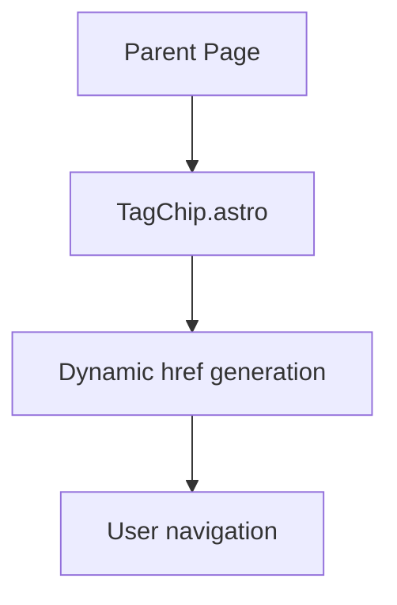
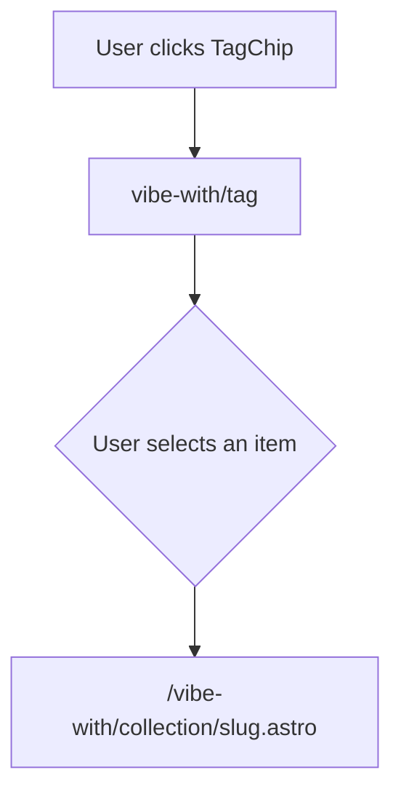

## Context

As our content-driven application gets more and more content, we need to be able to route to different pages of content based on the "origin" of the user action, to the intended destination of the user action, and to the content itself.

### Why this matters:

Without dynamic routing, we would need to create a new route for every new thread or collection of content, which would be a lot of work and would be error-prone. With dynamic routing, we can create a new route for every new thread or collection of content, and we can also create a new route for every new page of content that is added to the content library.

### Audience
- Developers, remote and contract developers, and AI Code Assistants who continue to build out our content-driven application.

#### Affected Parties:
- Content creators, editors, and developers working with Markdown files in this project.
- AI assistants or automation tools tasked with generating or updating YAML frontmatter.

### Why this prompt:

Our product team is looking to replace an instances of static routing with an instance of dynamic routing to support more "user journeys" from another origin point to another destination.

### Working Directory:
`site/src/pages/vibe-with`
`site/src/pages/vibe-with/[...slug].astro`

#### Desired User Journey:

From page `thread/[magazine].astro`

When a user clicks on a tag, they should be taken to the page `vibe-with/[...slug].astro`

#### Current Implementation:

The `site/src/components/tool-components/TagChip.astro` component is used to render tags in the content-driven application.  Right now, the component assumes clicking the tag will take the user to a dynamic page BUT ONLY for the `tooling` collection. 

Here is the current implementation:

```javascript
<a 
  href={href || `/toolkit/${tag}`} 
  class={`tool-tag${isTagSelected ? ' selected' : ''}`} 
  title={title || `Click to filter by ${normalCase}`}
  aria-label={`Filter by ${normalCase}${isTagSelected ? ' (currently selected)' : ''}`}
  data-tag={tag}
  {...rest}
>
  <p>{normalCase}</p>
  {count !== undefined && count > 0 ? <span class="count">({count})</span> : null}
</a>
```

#### Desired Implementation:
I'm assuming that we need to make the href dynamic based on the route.

```javascript
 <a 
  href={href || `/${route}/${tag}`} 
  class={`tool-tag${isTagSelected ? ' selected' : ''}`} 
  title={title || `Click to filter by ${normalCase}`}
  aria-label={`Filter by ${normalCase}${isTagSelected ? ' (currently selected)' : ''}`}
  data-tag={tag}
  {...rest}
>
  <p>{normalCase}</p>
  {count !== undefined && count > 0 ? <span class="count">({count})</span> : null}
</a>
```

### Working Analogy:

#### Working User Journey:
`site/src/pages/toolkit.astro`

When a user clicks a tag from inside the ToolChip.astro component, they should be taken to the page `toolkit/[tag].astro`

***

## Iterative Improvement Plan (2025-04-19)

### Acceptance Criteria

- [ ] TagChip.astro supports a `route` prop for dynamic routing.
- [ ] Tag links always point to the correct dynamic route (e.g., `/vibe-with/${tag}`, `/toolkit/${tag}`).
- [ ] Backward compatibility is maintained for existing usages (defaults to `/toolkit/${tag}`).
- [ ] Documentation and examples are updated.

### Data Flow

- Parent page/component determines the correct `route` string.
- Passes `route` prop to TagChip.astro.
- TagChip.astro uses `href={href || `/${route}/${tag}`} ` for link generation.

### Example Usage

```astro
<TagChip tag="example" route="vibe-with" />
<TagChip tag="example" route="toolkit" />
```

### Edge Cases

- If `route` is missing, fallback to `/toolkit/${tag}` and log a warning in development.

### Visual Diagram



***

## 2025-04-19 Iterative Update: Unified Tag Filtering and Item Rendering Logic

### New Requirement: Cross-Collection Tag Filtering & Unified Rendering

#### Context
During implementation, we identified a need for a more unified and flexible tag filtering and item rendering system. The original prompt focused on dynamic routing for tags within a single collection (e.g., toolkit or prompts). However, both the `prompts` and `specs` collections share metadata and should be rendered using the same logic. Additionally, tag filtering should allow users to view all items (from both collections) associated with a given tag.

#### Updated User Journeys

1. **Tag Filtering (Cross-Collection)**
    - **Route:** `/vibe-with/${tag}`
    - **Behavior:** When a user clicks a tag (from any component, e.g., TagChip.astro), they are routed to a page that lists all items from both `prompts` and `specs` collections that have the selected tag.
    - **Implementation:**
        - New dynamic page: `site/src/pages/vibe-with/[tag].astro`
        - This page queries both collections, filters by the tag, and displays results in a unified list.
        - TagChip.astro should generate links to this route for tag clicks.

2. **Individual Item Rendering (Unified)**
    - **Route:** `/vibe-with/[collection]/[...slug].astro`
    - **Behavior:** Renders a single prompt or spec, using a unified rendering logic/component.
    - **Implementation:**
        - This page loads the item from the specified collection and slug.
        - All item links (from tag filter, search, etc.) should point here for detail views.

#### Data Flow
- TagChip.astro uses `href={href || `/vibe-with/${tag}`}` for tag filtering links.
- Unified item rendering page `/vibe-with/[collection]/[...slug].astro` is the single source of truth for displaying individual prompts/specs.

#### Acceptance Criteria
- [ ] TagChip.astro links tags to `/vibe-with/${tag}` for filtering
- [ ] `/vibe-with/[tag].astro` lists all matching prompts and specs
- [ ] `/vibe-with/[collection]/[...slug].astro` renders individual items from either collection
- [ ] Documentation and code comments reflect this unified approach

#### Visual Diagram



#### Edge Cases
- Tag filtering page should handle cases where no items are found for a tag (show friendly message)
- TagChip.astro should maintain backward compatibility for legacy routes if needed

#### Documentation
- This logic was added as a result of implementation discoveries. It ensures a scalable, DRY, and user-friendly routing and rendering system for all tag-driven navigation and detail views.

***

#### Checklist for Review
- [ ] Are all usages of TagChip.astro updated to pass the correct route?
- [ ] Are code comments up to date? If so, please apply our flavor of commenting, which can be found in [[lost-in-public/reminders/Comprehensive-Rules-for-Code-Generation.md|Comprehensive Rules for Code Generation]]

> This section was added via iterative prompt improvement. See `/content/lost-in-public/prompts/workflow/Improve-on-a-User-Prompt-through-Iteration.md` for methodology.

***

## 2025-04-21 Iterative Update: Tag Prop Bug Fix

During iterative implementation, we discovered that Astro’s prop inference could cause the tag prop to be interpreted as a boolean if passed in shorthand (e.g., <TagChip tag />). This led to bugs where tags rendered as true or false instead of the intended string value.

Solution
Prop Naming: The TagChip.astro component now expects a tagString prop (string), not tag.
Usage: All parent components must pass tagString={tag} explicitly.
Defensive Coding: If tagString is not a string, a warning is logged in development.
Backward Compatibility: The legacy tag prop is still accepted for now, but all new code should use tagString.
Commenting: All changes are thoroughly commented, following the Comprehensive Rules for Code Generation.