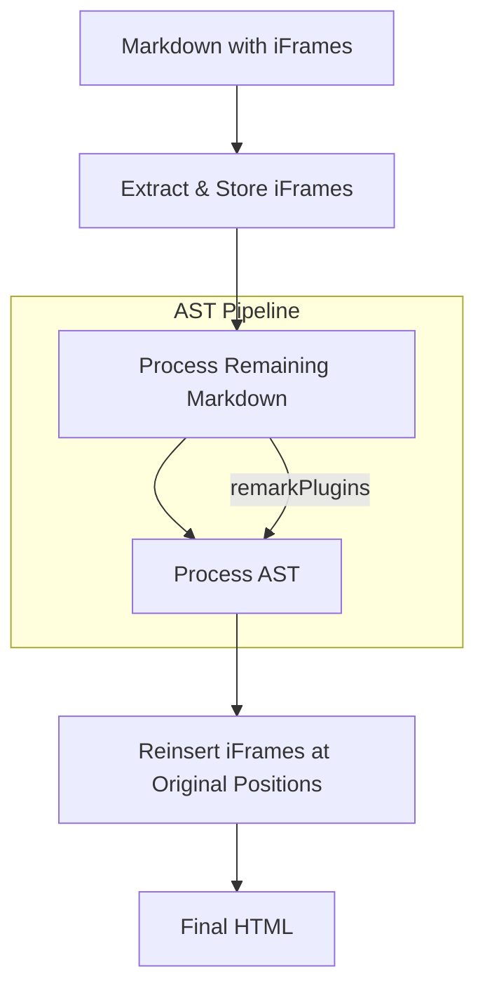

# Constraints
1. Use customary naming conventions for both files and functions. In any kind of near-scripting I prefer camelCase. 
2. Under NO CIRCUMSTANCES should you "Take a Shortcut" and try to render the iFrames through Astro's built in collection rendering system.  
3. All markdown processing work goes in: `site/src/utils/markdown`
4. The test file we will keep poking at is `content/vocabulary/agile`
5. As usual, READ DOCUMENTATION instead of just probabilistically guessing at code that might work.  We are working with Astro, Unified, Remark, and Rehype, and they all have documentation.

# Context

## Objective:

Use Remark Plugin conventions and APIs to handle iFrames in markdown content.

## Our custom AST rendering pipeline

We have a custom AST rendering pipeline that processes markdown content and renders it into HTML. The pipeline is implemented in the `site/src/utils/markdown` directory and includes several plugins that process the markdown content in different ways.

### Astro, Unified, Remark, Rehype

- Astro: The framework we use for building the website
- Unified: A framework for processing text and HTML
- Remark: A markdown processor
- Rehype: An HTML processor

### Our working rendering pipeline

#### Configuration

`site/astro.config.mjs`
```javascript
// ...code...
  integrations: [
    mdx({
      // MDX options here
      extendMarkdownConfig: true, // Extend the existing markdown config
      optimize: false // Don't minify MDX content for better debugging
    })
  ],
  markdown: {
    remarkPlugins: [
      remarkCalloutHandler, // Must be first to see raw markdown
      remarkBacklinks,      // Then handle wiki-links
      remarkImages,         // Then handle images
      remarkDefinitionList, // Handle definition lists
      remarkCitations,      // Handle citations
    ],
    remarkRehype: { handlers: defListHastHandlers },
    syntaxHighlight: 'shiki', // Use Shiki for syntax highlighting
    shikiConfig: {
      theme: 'github-dark', // Use a dark theme for better readability
      // Register our custom languages
      langs: [
        {
          id: 'litegal',
          scopeName: 'source.litegal',
          grammar: {
            patterns: [
              // Add some basic patterns for litegal syntax
              { match: '\\b(function|return|if|else|for|while)\\b', name: 'keyword.control.litegal' },
              { match: '\\b(true|false|null|undefined)\\b', name: 'constant.language.litegal' },
              { match: '"[^"]*"', name: 'string.quoted.double.litegal' },
              { match: '\'[^\']*\'', name: 'string.quoted.single.litegal' },
              { match: '//.*$', name: 'comment.line.double-slash.litegal' },
              { match: '/\\*[^*]*\\*+([^/*][^*]*\\*+)*/', name: 'comment.block.litegal' },
              { match: '\\b[0-9]+\\b', name: 'constant.numeric.litegal' }
            ]
          }
        },
//...code...
```

#### Markdown Processing

1. *remarkCalloutHandler* - Handles callout syntax, must be first because any other kind of extended markdown syntax could be present within a callout, so callouts must actually run through the rest of the processing pipeline independently and then be added back into the HAST.
2. *remarkBacklinks* - Handles wiki-links
3. *remarkImages* - Handles external image links at the moment, but we will need to handle internal image links later.
4. *remarkDefinitionList* - Handles definition lists
5. *remarkCitations* - Handles citation syntax, still under development. 

#### Directories and Files
`site/src/utils/markdown`
site/src/utils/markdown/remark-asf.ts`
`site/src/utils/markdown/remark-backlinks.ts`
`site/src/utils/markdown/remark-callout-handler.ts`
`site/src/utils/markdown/remark-citations.ts`
`site/src/utils/markdown/remark-images.ts`

#### The overkill, step-by-step approach
When we have had trouble in the past, we create a separation of concerns and test to make sure each tiny step works in isolation.  

`site/src/utils/markdown/callouts`
- Cases: `site/src/utils/markdown/callouts/calloutCases.ts`
- Types: `site/src/utils/markdown/callouts/calloutTypes.ts`
- Detection: `site/src/utils/markdown/callouts/detectMarkdownCallouts.ts`
- Embed: `site/src/utils/markdown/callouts/embedCalloutNodes.ts`
- Isolate: `site/src/utils/markdown/callouts/isolateCalloutContent.ts`
- Process: `site/src/utils/markdown/callouts/processCalloutPipeline.ts`
- Transform: `site/src/utils/markdown/callouts/transformCalloutStructure.ts`

If we don't get it right after an hour, we would implement something like this in:
`site/src/utils/markdown/iframes`

Regardless of whether or not there are separate files for each of these steps, these steps seem to be the important steps in Markdown processing using the AST. 

Best we use names like this to be consistent. 

## Debugger

Honestly, I'm not sure which one is the one that we ended up using. Probably need to figure that out and remove the one that's useless. 

`site/src/utils/markdown/debug/markdown-debugger.ts`
`site/src/utils/markdown/markdownDebugger.ts`

## Example iFrame Markdown Syntax

```markdown
# Test Document

## Video Embed
<iframe 
  style="aspect-ratio:16/9;width:100%;height:auto" 
  src="https://www.youtube.com/embed/U3MVU6JpocU?si=i84FmkbjN0xfMOF5" 
  title="YouTube video player" 
  frameborder="0" 
  allow="accelerometer; autoplay; clipboard-write; encrypted-media; gyroscope; picture-in-picture; web-share" 
  referrerpolicy="strict-origin-when-cross-origin" 
  allowfullscreen
></iframe>

## Div Wrapper around an iFrame Video Embed
<div style="position: relative; padding-bottom: 56.25%; height: 0;"><iframe src="https://www.loom.com/embed/291f2534e5a142048b7c5df73758c581?sid=d136039f-d327-4f45-bedb-e80bf456800d" frameborder="0" webkitallowfullscreen mozallowfullscreen allowfullscreen style="position: absolute; top: 0; left: 0; width: 100%; height: 100%;"></iframe></div>


## PDF Document
<iframe src="/docs/sample.pdf" />

## External Content
<iframe src="https://external-site.com/widget" />
```

## Expected Data Flow



## Directory Structure

```text
site/src/utils/markdown/
  ├── iframes/
  │   ├── types.ts               // Type definitions
  │   ├── detectIFrames.ts       // Find and store iFrames
  │   ├── reinsertIFrames.ts     // Put iFrames back into AST
  │   └── index.ts              // Plugin entry point
  └── remark-iframe-handler.ts   // Main plugin file
```

## Processing Steps

1. **Detection and Storage**
   - Find all iFrame elements in markdown
   - Store original HTML and position
   - Remove from AST temporarily

2. **AST Processing**
   - Allow other remark plugins to process remaining content
   - Preserve markers for iFrame positions

3. **Reinsertion**
   - Add iFrames back into AST at original positions
   - Maintain as raw HTML nodes
   - Preserve any attributes and structure

## Documentation-Based Implementation

Based on the official documentation, for a trusted team environment:

1. **Required Package**
```bash
pnpm add rehype-raw
```

2. **Configuration in `astro.config.mjs`**
```javascript
import { defineConfig } from 'astro/config';
import rehypeRaw from 'rehype-raw';

export default defineConfig({
  markdown: {
    remarkPlugins: [
      // Our existing plugins...
      remarkCalloutHandler,
      remarkBacklinks,
      remarkImages,
    ],
    // Allow HTML in markdown to be processed
    remarkRehype: { 
      allowDangerousHtml: true,
      handlers: {
        // Preserve existing handlers
        ...defListHastHandlers
      }
    },
    rehypePlugins: [
      // Convert raw HTML (including iframes) into proper HTML nodes
      rehypeRaw
    ]
  }
});
```

This approach:
1. Preserves iFrames exactly as written in the markdown
2. Maintains all styles and attributes
3. Works with any embed source (YouTube, Loom, etc.)
4. Requires minimal configuration

## Testing

Test file: `content/vocabulary/agile`

1. **YouTube Embed**
```markdown
<iframe 
  style="aspect-ratio:16/9;width:100%;height:auto" 
  src="https://www.youtube.com/embed/U3MVU6JpocU?si=i84FmkbjN0xfMOF5" 
  title="YouTube video player" 
  frameborder="0" 
  allow="accelerometer; autoplay; clipboard-write; encrypted-media; gyroscope; picture-in-picture; web-share" 
  referrerpolicy="strict-origin-when-cross-origin" 
  allowfullscreen
></iframe>
```

2. **Loom Embed with Responsive Container**
```markdown
<div style="position: relative; padding-bottom: 56.25%; height: 0;">
  <iframe 
    src="https://www.loom.com/embed/291f2534e5a142048b7c5df73758c581?sid=d136039f-d327-4f45-bedb-e80bf456800d" 
    frameborder="0" 
    webkitallowfullscreen 
    mozallowfullscreen 
    allowfullscreen 
    style="position: absolute; top: 0; left: 0; width: 100%; height: 100%;"
  ></iframe>
</div>
```

## TypeScript Considerations

1. **Keep Types Simple**
   - TypeScript in AST manipulation can be finicky
   - Use minimal types to avoid excessive type errors
   - Follow patterns from existing types in `site/src/types`

2. **Basic Types Example**
```typescript
// site/src/types/mdast-iframe.d.ts
import { Parent } from 'mdast';

// Simple extension of mdast types
export interface IFrameNode extends Parent {
  type: 'html';
  value: string;
}

// Keep plugin options minimal
export interface IFramePluginOptions {
  debug?: boolean;
}
```

3. **Type Location**
   - Place types in `site/src/types`
   - Use `.d.ts` extension for declaration files
   - Follow existing patterns like `mdast-callout.d.ts`

4. **Import Strategy**
```typescript
// In your plugin file
import type { IFrameNode, IFramePluginOptions } from '../types/mdast-iframe';
