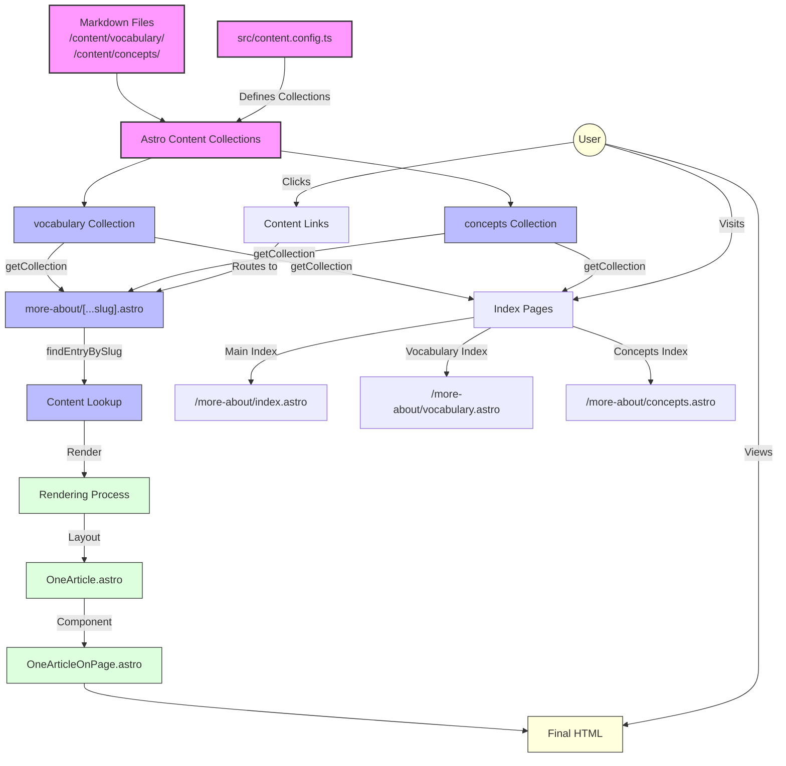
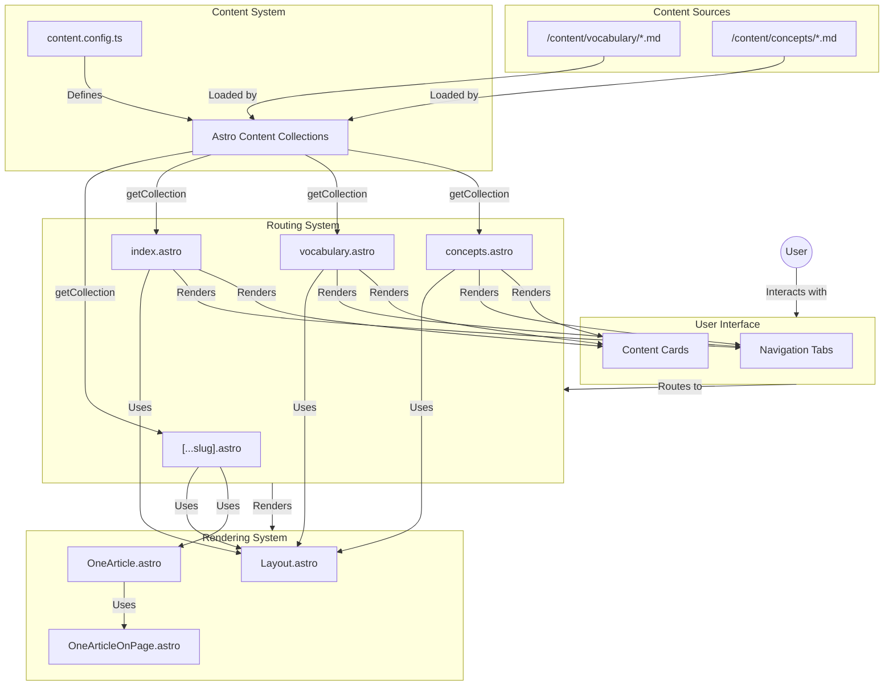

# Context

### Objective:
Render the `content/concepts` markdown files through the same `localhost:4321/more-about` dynamic router we use for `content/vocabulary`

### Starting Point:
`site/src/pages/more-about/[vocabulary].astro`
`site/src/pages/admin/route-manager.astro`
`site/src/pages/api/route-mappings.ts`
`site/src/layouts/OneArticle.astro`
`site/src/components/articles/OneArticleOnPage.astro`

### Analogous Code:
Related to the [[lost-in-public/prompts/user-interface/Create-a-Changelog-UI|Create-a-Changelog-UI]] where we were able to render the Content Changelog and the Code Changelog on the same set of pages with the same set of components.  


### Content Development

The content team develops content in Markdown files, and is increasingly using AI [[Vocabulary/Large Language Models|Large Language Models]] to generate content.  See [[lost-in-public/prompts/workflow/Create-a-Content-Generation-Engine|Create-a-Content-Generation-Engine]]. 

Two of the content streams are Vocabulary and Concepts.  These are effectively the same, and would have the same rough YAML metadata, and the same UI.  They are only differentiated and in different directories because 
- the Content team believes concepts are both more important to develop and communicate, and, 
- many of the concepts have names or terminology either obscure or even unique to us. 
- Vocabulary really is just that -- when the content team writes content and they use a technical term or a trendy word, they want to define it in the rendered content so that the reader doesn't need to go look it up elsewhere.  They can just "double-click" (or even hover to see). 

### Versatile Content Rendering
We have worked on this before, most robustly codified in [[lost-in-public/prompts/user-interface/Create-a-Reusable-Content-Collections-UI-Structure|Create-a-Reusable-Content-Collections-UI-Structure]]. 

Related files include: [[lost-in-public/prompts/render-logic/Support-Dynamic-Information-Pages|Support-Dynamic-Information-Pages]], [[lost-in-public/prompts/render-logic/Conditional-Logic-for-Content|Conditional-Logic-for-Content]].

# Implementation Insights

## Key Implementation Decisions

After successfully implementing the integration of concepts into the more-about routing system, we've identified several key insights that improved the implementation:

1. **Dynamic Catch-All Routing**: Instead of using `[content-item].astro`, we implemented a more flexible `[...slug].astro` approach that can handle nested paths and provides better future extensibility.

2. **Title Generation**: We implemented a robust title generation system that:
   - Extracts titles from frontmatter when available
   - Falls back to generating titles from filenames using proper case formatting
   - Handles hyphens, underscores, and other special characters in filenames

3. **Styling Considerations**: 
   - Used smaller font sizes (`text-sm` for titles, `text-xs` for descriptions) to create a more compact, scannable reference layout
   - Maintained consistent styling across all index pages
   - Implemented proper semantic HTML structure with appropriate heading tags

4. **Type Safety**: Used type assertions to handle TypeScript errors until Astro regenerates types for new collections, ensuring a smooth development experience.

5. **URL Generation**: Added fallback mechanisms for entries without explicit slugs, using the filename as the basis for the URL path.

## Implementation Architecture

The final implementation follows this architecture:

1. **Content Collections**:
   - `vocabulary` collection: Maps to `/content/vocabulary/` directory
   - `concepts` collection: Maps to `/content/concepts/` directory
   - Both use the same schema and transformation logic

2. **Routing System**:
   - `[...slug].astro`: Dynamic catch-all route handler for both collections
   - `index.astro`: Combined index page showing both collections
   - `vocabulary.astro`: Dedicated index for vocabulary terms
   - `concepts.astro`: Dedicated index for concepts

3. **UI Components**:
   - Consistent card-based layout for both collections
   - Proper navigation between index pages
   - Responsive grid layout that adapts to different screen sizes

# Implementation Plan

## 1. Create a Concepts Collection in Content Config

First, we need to define a `concepts` collection in the content configuration file to make Astro aware of our concepts content.

```typescript
// Add to src/content.config.ts
const conceptsCollection = defineCollection({
  loader: glob({pattern: "**/*.md", base: "../content/concepts"}),
  schema: z.object({
    aliases: z.union([
      z.string().transform(str => [str]), // Single string -> array with one string
      z.array(z.string())                 // Already an array
    ]).optional().default([])             // Default to empty array if missing
  }).passthrough().transform((data, context) => {
    // Get the filename without extension
    const filename = String(context.path).split('/').pop()?.replace(/\.md$/, '') || '';
    
    // Convert filename to title case for display
    const titleCase = filename
      .split(/[\s-]+/)  // Split on spaces or dashes
      .map(word => word.charAt(0).toUpperCase() + word.slice(1))
      .join(' ');
    
    // Merge our computed values into the data object
    return {
      ...data,  // Start with existing data
      title: data.title || titleCase,  // Use existing title or computed title
      slug: data.slug || filename.toLowerCase().replace(/\s+/g, '-'),  // Use existing slug or computed slug
      aliases: data.aliases || []  // Ensure aliases exists
    };
  })
});

// Add to paths object
export const paths = {
  // existing paths...
  'concepts': '../content/concepts'
};

// Add to collections export
export const collections = {
  // existing collections...
  'concepts': conceptsCollection
};
```

## 2. Create a Dynamic Catch-All Router

Create a dynamic catch-all router that can handle both vocabulary and concepts:

```javascript
// site/src/pages/more-about/[...slug].astro
---
import { getCollection } from 'astro:content';
import Layout from '@layouts/Layout.astro';
import OneArticle from '@layouts/OneArticle.astro';
import OneArticleOnPage from '@components/articles/OneArticleOnPage.astro';

// Helper function to convert filename to proper case
function toProperCase(str) {
  // Handle hyphenated or underscored filenames
  return str
    .replace(/[-_]/g, ' ') // Replace hyphens and underscores with spaces
    .split(' ')
    .map(word => word.charAt(0).toUpperCase() + word.slice(1).toLowerCase())
    .join(' ');
}

// Get the slug from the URL
const { slug } = Astro.params;

// Function to find an entry by slug in a collection
async function findEntryBySlug(collection, slug) {
  const entries = await getCollection(collection);
  return entries.find(entry => {
    const entrySlug = entry.data.slug || entry.id.replace(/\.md$/, '').toLowerCase().replace(/\s+/g, '-');
    return entrySlug === slug;
  });
}

// Try to find the entry in both collections
let entry;
let collection;

// First check vocabulary
entry = await findEntryBySlug('vocabulary', slug);
if (entry) {
  collection = 'vocabulary';
} else {
  // Then check concepts
  entry = await findEntryBySlug('concepts', slug);
  if (entry) {
    collection = 'concepts';
  }
}

// If no entry is found, return a 404
if (!entry) {
  return Astro.redirect('/404');
}

// Ensure the entry has a title
if (!entry.data.title) {
  const filename = entry.id.replace(/\.md$/, '');
  const filenameParts = filename.split('/');
  const baseFilename = filenameParts[filenameParts.length - 1];
  entry.data.title = toProperCase(baseFilename);
}
---

<Layout title={entry.data.title}>
  <OneArticle
    Component={OneArticleOnPage}
    content={entry.body}
    markdownFile={entry.id}
    data={{
      path: Astro.url.pathname,
      id: entry.id,
      collection: collection
    }}
  />
</Layout>
```

## 3. Create Index Pages

Create index pages to list all vocabulary terms and concepts:

```javascript
// site/src/pages/more-about/index.astro
---
import { getCollection } from 'astro:content';
import Layout from '@layouts/Layout.astro';
import ThinGradientBleedSeparator from '@components/basics/separators/ThinGradientBleedSeparator.astro';

// Helper function to convert filename to proper case
function toProperCase(str) {
  // Handle hyphenated or underscored filenames
  return str
    .replace(/[-_]/g, ' ') // Replace hyphens and underscores with spaces
    .split(' ')
    .map(word => word.charAt(0).toUpperCase() + word.slice(1).toLowerCase())
    .join(' ');
}

// Get entries from both collections
const vocabularyEntries = await getCollection('vocabulary');
// Use type assertion to avoid TypeScript errors until Astro regenerates types
const conceptsEntries = await getCollection('concepts' as any) as any[];

// Process entries to ensure they all have titles
// For entries without titles, use the filename as the title in proper case
vocabularyEntries.forEach(entry => {
  if (!entry.data.title) {
    const filename = entry.id.replace(/\.md$/, '');
    const filenameParts = filename.split('/');
    const baseFilename = filenameParts[filenameParts.length - 1];
    entry.data.title = toProperCase(baseFilename);
  }
});

conceptsEntries.forEach(entry => {
  if (!entry.data.title) {
    const filename = entry.id.replace(/\.md$/, '');
    const filenameParts = filename.split('/');
    const baseFilename = filenameParts[filenameParts.length - 1];
    entry.data.title = toProperCase(baseFilename);
  }
});

// Sort entries alphabetically by title
vocabularyEntries.sort((a, b) => a.data.title.localeCompare(b.data.title));
conceptsEntries.sort((a, b) => a.data.title.localeCompare(b.data.title));
---

<Layout title="Reference - Vocabulary & Concepts">
  <div class="container mx-auto py-8 px-4">
    <h1 class="text-3xl font-bold mb-6">Reference Library</h1>
    <p class="text-lg mb-8">Browse our collection of vocabulary terms and conceptual frameworks.</p>
    
    <!-- Navigation tabs -->
    <div class="flex gap-4 mb-8">
      <a href="/more-about" class="px-4 py-2 bg-blue-600 text-white rounded-md">All Reference</a>
      <a href="/more-about/vocabulary" class="px-4 py-2 bg-gray-700 hover:bg-gray-600 text-white rounded-md">Vocabulary</a>
      <a href="/more-about/concepts" class="px-4 py-2 bg-gray-700 hover:bg-gray-600 text-white rounded-md">Concepts</a>
    </div>
    
    <!-- Vocabulary Section -->
    <section class="mb-12">
      <h2 class="text-2xl font-bold mb-4">Vocabulary</h2>
      <p class="mb-6">Terms and definitions used throughout our work.</p>
      
      <div class="grid grid-cols-1 md:grid-cols-2 lg:grid-cols-3 gap-4">
        {vocabularyEntries.map(entry => (
          <div class="bg-gray-800 p-4 rounded-lg">
            <h3 class="text-sm font-bold mb-2">
              <a href={`/more-about/${entry.data.slug || entry.id.replace(/\.md$/, '').toLowerCase().replace(/\s+/g, '-')}`} class="text-blue-400 hover:underline">
                {entry.data.title}
              </a>
            </h3>
            {entry.data.aliases && entry.data.aliases.length > 0 && (
              <p class="text-xs text-gray-400 mb-2">
                Also known as: {entry.data.aliases.join(', ')}
              </p>
            )}
          </div>
        ))}
      </div>
    </section>
    
    <ThinGradientBleedSeparator height="2px" marginTop="2rem" marginBottom="2rem" />
    
    <!-- Concepts Section -->
    <section>
      <h2 class="text-2xl font-bold mb-4">Concepts</h2>
      <p class="mb-6">Important ideas and frameworks we use in our work.</p>
      
      <div class="grid grid-cols-1 md:grid-cols-2 lg:grid-cols-3 gap-4">
        {conceptsEntries.map(entry => (
          <div class="bg-gray-800 p-4 rounded-lg">
            <h3 class="text-sm font-bold mb-2">
              <a href={`/more-about/${entry.data.slug || entry.id.replace(/\.md$/, '').toLowerCase().replace(/\s+/g, '-')}`} class="text-blue-400 hover:underline">
                {entry.data.title}
              </a>
            </h3>
            <p class="text-xs text-gray-300">
              {entry.data.description || "Learn more about this concept..."}
            </p>
          </div>
        ))}
      </div>
    </section>
  </div>
</Layout>
```

## 4. Create Dedicated Collection Pages

Create dedicated pages for each collection:

```javascript
// site/src/pages/more-about/vocabulary.astro
---
import { getCollection } from 'astro:content';
import Layout from '@layouts/Layout.astro';

// Helper function to convert filename to proper case
function toProperCase(str) {
  // Handle hyphenated or underscored filenames
  return str
    .replace(/[-_]/g, ' ') // Replace hyphens and underscores with spaces
    .split(' ')
    .map(word => word.charAt(0).toUpperCase() + word.slice(1).toLowerCase())
    .join(' ');
}

// Get entries from vocabulary collection
const vocabularyEntries = await getCollection('vocabulary');

// Process entries to ensure they all have titles
// For entries without titles, use the filename as the title in proper case
vocabularyEntries.forEach(entry => {
  if (!entry.data.title) {
    const filename = entry.id.replace(/\.md$/, '');
    const filenameParts = filename.split('/');
    const baseFilename = filenameParts[filenameParts.length - 1];
    entry.data.title = toProperCase(baseFilename);
  }
});

// Sort entries alphabetically by title
vocabularyEntries.sort((a, b) => a.data.title.localeCompare(b.data.title));
---

<Layout title="Vocabulary">
  <div class="container mx-auto py-8 px-4">
    <h1 class="text-3xl font-bold mb-6">Vocabulary</h1>
    <p class="mb-6">Terms and definitions used throughout our work.</p>
    
    <!-- Navigation tabs -->
    <div class="flex gap-4 mb-8">
      <a href="/more-about" class="px-4 py-2 bg-gray-700 hover:bg-gray-600 text-white rounded-md">All Reference</a>
      <a href="/more-about/vocabulary" class="px-4 py-2 bg-blue-600 text-white rounded-md">Vocabulary</a>
      <a href="/more-about/concepts" class="px-4 py-2 bg-gray-700 hover:bg-gray-600 text-white rounded-md">Concepts</a>
    </div>
    
    <div class="grid grid-cols-1 md:grid-cols-2 lg:grid-cols-3 gap-4">
      {vocabularyEntries.map(entry => (
        <div class="bg-gray-800 p-4 rounded-lg">
          <h2 class="text-sm font-bold mb-2">
            <a href={`/more-about/${entry.data.slug || entry.id.replace(/\.md$/, '').toLowerCase().replace(/\s+/g, '-')}`} class="text-blue-400 hover:underline">
              {entry.data.title}
            </a>
          </h2>
          {entry.data.aliases && entry.data.aliases.length > 0 && (
            <p class="text-xs text-gray-400 mb-2">
              Also known as: {entry.data.aliases.join(', ')}
            </p>
          )}
        </div>
      ))}
    </div>
  </div>
</Layout>
```

```javascript
// site/src/pages/more-about/concepts.astro
---
import { getCollection } from 'astro:content';
import Layout from '@layouts/Layout.astro';

// Helper function to convert filename to proper case
function toProperCase(str) {
  // Handle hyphenated or underscored filenames
  return str
    .replace(/[-_]/g, ' ') // Replace hyphens and underscores with spaces
    .split(' ')
    .map(word => word.charAt(0).toUpperCase() + word.slice(1).toLowerCase())
    .join(' ');
}

// Get entries from concepts collection
// Use type assertion to avoid TypeScript errors until Astro regenerates types
const conceptsEntries = await getCollection('concepts' as any) as any[];

// Process entries to ensure they all have titles
// For entries without titles, use the filename as the title in proper case
conceptsEntries.forEach(entry => {
  if (!entry.data.title) {
    const filename = entry.id.replace(/\.md$/, '');
    const filenameParts = filename.split('/');
    const baseFilename = filenameParts[filenameParts.length - 1];
    entry.data.title = toProperCase(baseFilename);
  }
});

// Sort entries alphabetically by title
conceptsEntries.sort((a, b) => a.data.title.localeCompare(b.data.title));
---

<Layout title="Concepts">
  <div class="container mx-auto py-8 px-4">
    <h1 class="text-3xl font-bold mb-6">Concepts</h1>
    <p class="mb-6">Important ideas and frameworks we use in our work.</p>
    
    <!-- Navigation tabs -->
    <div class="flex gap-4 mb-8">
      <a href="/more-about" class="px-4 py-2 bg-gray-700 hover:bg-gray-600 text-white rounded-md">All Reference</a>
      <a href="/more-about/vocabulary" class="px-4 py-2 bg-gray-700 hover:bg-gray-600 text-white rounded-md">Vocabulary</a>
      <a href="/more-about/concepts" class="px-4 py-2 bg-blue-600 text-white rounded-md">Concepts</a>
    </div>
    
    <div class="grid grid-cols-1 md:grid-cols-2 lg:grid-cols-3 gap-4">
      {conceptsEntries.map(entry => (
        <div class="bg-gray-800 p-4 rounded-lg">
          <h2 class="text-sm font-bold mb-2">
            <a href={`/more-about/${entry.data.slug || entry.id.replace(/\.md$/, '').toLowerCase().replace(/\s+/g, '-')}`} class="text-blue-400 hover:underline">
              {entry.data.title}
            </a>
          </h2>
          <p class="text-xs text-gray-300">
            {entry.data.description || "Learn more about this concept..."}
          </p>
        </div>
      ))}
    </div>
  </div>
</Layout>
```

## Data Flow Diagram



## Implementation Architecture



## Summary of Implementation Steps

1. **Add Concepts Collection**: Define a concepts collection in content.config.ts that points to the /content/concepts/ directory.

2. **Create Dynamic Router**: Implement a catch-all route handler ([...slug].astro) that can handle both vocabulary and concepts entries.

3. **Create Index Pages**: 
   - Main index page (index.astro) that shows both collections
   - Dedicated vocabulary page (vocabulary.astro)
   - Dedicated concepts page (concepts.astro)

4. **Implement Title Generation**: Add logic to generate proper case titles from filenames when not present in frontmatter.

5. **Style Consistently**: Use consistent styling across all pages with appropriate font sizes and semantic HTML structure.

6. **Handle TypeScript**: Use type assertions to handle TypeScript errors until Astro regenerates types.

7. **Test and Build**: Verify that all pages render correctly and build the site to ensure everything works as expected.

## Conclusion

This implementation successfully integrates the concepts collection into the more-about routing system, providing a unified interface for browsing and viewing both vocabulary terms and concepts. The approach maintains the existing architecture while extending it to support the new content type, following the same patterns used for vocabulary entries.
