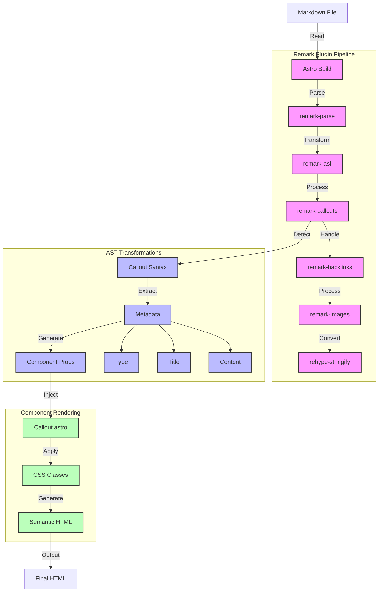

# Context

## Constraints:
It has taken us days and days to get what we have working, so please do not make overzealous changes. Do not destroy or change any file that is not directly related to the callout rendering.  

If we need to recreate any files, that would be better than changing something that is working and accidentally breaking it.  

## Objective:

Use the naming of Callouts to render callout blocks with CSS classes and Astro Components.

## Documentation:
Obsidian has documentation on how the handle [Obsidian flavored callouts](https://help.obsidian.md/callouts). 

Our other documentation links are kept in the:
`content/lost-in-public/rag-input/Read-Relevant-Documentation-before-major-edits.md` file.  
Please assure you always reference:
- Astro Collections
- Unified.js
- Remark.js
- Rehype.js

# Implementation

### Custom Remark Plugins

We already have custom remark plugins, two of which deal with extended markdown syntax.

And one, `remark-asf.ts`, which breaks down Markdown files into JSON data with nodes in case that makes the detection and conversion of specific kinds of syntax more likely.  

`site/src/utils/markdown/remark-backlinks.ts` handles backlinks
`site/src/utils/markdown/remark-images.ts` handles images
`site/src/utils/markdown/remark-asf.ts` changes the datatype of the Markdown. 

## Data Flow Architecture

### Understanding AST vs ASF

1. **AST (Abstract Syntax Tree)**
   - Core representation of markdown structure
   - Used by remark internally
   - Language-agnostic tree format
   - **Libraries:**
     - `unified`: Core processing engine
     - `remark-parse`: MD → AST conversion
     - `mdast`: AST specification
     - `remark-rehype`: AST → HTML AST
   ```typescript
   // Example AST node (mdast format)
   {
     type: 'blockquote',
     children: [
       { type: 'paragraph', 
         children: [{ type: 'text', value: 'content' }] 
       }
     ]
   }
   ```

2. **ASF (Astro Special Format)**
   - Our custom extension for Astro features
   - Handles Astro-specific components and syntax
   - Adds metadata and rendering capabilities
   - **Libraries:**
     - `@nasa-gcn/remark-rehype-astro`: Core Astro component handler
     - `remark-asf.ts`: Our custom implementation
   ```typescript
   // Example ASF transformation (after @nasa-gcn/remark-rehype-astro)
   {
     type: 'component',
     name: 'Callout',
     properties: {
       variant: 'note',
       content: { type: 'html', value: '<p>content</p>' }
     }
   }
   ```

### Processing Pipeline
```typescript
// In remark-asf.ts
const processor = unified()
  .use(remarkParse)           // Convert MD to AST
  .use(remarkRehype)          // Convert AST to HTML AST
  .use(rehypeAstro, {        // Transform to ASF
    markdownFile: options.markdownFile 
  })
  .use(rehypeStringify)       // Final HTML output
```



### Real-World Example

Here's a real callout from our vocabulary collection:

```markdown
> [!LLM Response] [[Organizations/Perplexity AI|Perplexity AI]] explains [[Vocabulary/Agentic RAG|Agentic RAG]]
> Content goes here...
```

**AST Representation (Before Processing)**
```typescript
{
  type: 'blockquote',
  children: [{
    type: 'paragraph',
    children: [
      { type: 'text', value: '[!LLM Response] ' },
      { 
        type: 'link',
        url: '/content/organizations/perplexity-ai',
        title: 'Perplexity AI',
        children: [{ type: 'text', value: 'Perplexity AI' }]
      },
      { type: 'text', value: ' explains ' },
      {
        type: 'link',
        url: '/content/vocabulary/agentic-rag',
        title: 'Agentic RAG',
        children: [{ type: 'text', value: 'Agentic RAG' }]
      }
    ]
  }]
}
```

**ASF Transformation (After Processing)**
```typescript
{
  type: 'component',
  name: 'Callout',
  properties: {
    variant: 'llm-response',
    title: {
      type: 'fragment',
      children: [
        { type: 'link', href: '/content/organizations/perplexity-ai', text: 'Perplexity AI' },
        { type: 'text', value: ' explains ' },
        { type: 'link', href: '/content/vocabulary/agentic-rag', text: 'Agentic RAG' }
      ]
    },
    content: { /* processed content */ }
  }
}
```

This example shows how we need to:
1. Detect the `[!Type]` syntax in blockquotes
2. Parse the title while preserving wiki-links
3. Transform into our Astro component format
4. Maintain all internal links and references

### Data Transformation Examples

1. **Input Markdown**
```markdown
> [!note] Important Reminder
> This is a note about something important.
> It can span multiple lines.
```

2. **AST Representation**
```typescript
{
  type: 'callout',
  data: {
    variant: 'note',
    title: 'Important Reminder',
    content: [
      { type: 'paragraph', 
        children: [
          { type: 'text', value: 'This is a note about something important.' },
          { type: 'text', value: 'It can span multiple lines.' }
        ]
      }
    ]
  }
}
```

3. **Component Props**
```typescript
{
  variant: 'note',
  title: 'Important Reminder',
  content: string, // HTML content
  className: 'callout callout-note'
}
```

4. **Final HTML Output**
```html
<div class="callout callout-note">
  <div class="callout-title">
    <span class="callout-icon">📝</span>
    <span class="callout-title-text">Important Reminder</span>
  </div>
  <div class="callout-content">
    <p>This is a note about something important.</p>
    <p>It can span multiple lines.</p>
  </div>
</div>
```

## Component Structure

### Base Components
Located in `site/src/components/basics/callouts`:
- `ArticleCallout.astro` - Base component using semantic `<article>` element

### Styled Variants
Located in `site/src/components/basics/callouts/styled`:
- `LLMResponse.astro` - Specialized styling for LLM responses

### Implementation Flow

1. **Remark Plugin Detection**:
```typescript
// in remark-callout-handler.ts
function detectCallout(node: Node): CalloutInfo | null {
  // Check for pattern: >[!Type] Title
  const match = node.value.match(/^>\s*\[!([^\]]+)\]\s*(.*)$/);
  if (!match) return null;
  
  return {
    type: match[1],      // e.g., "LLMResponse"
    title: match[2],     // Everything after the type
    content: []          // Will collect subsequent lines
  };
}
```

2. **Component Selection**:
```typescript
// in remark-callout-handler.ts
function getCalloutComponent(type: string): string {
  // Check for styled variant first
  const styledPath = `../components/basics/callouts/styled/${type}.astro`;
  if (existsSync(styledPath)) return styledPath;
  
  // Fall back to base ArticleCallout
  return '../components/basics/callouts/ArticleCallout.astro';
}
```

3. **ASF Transformation**:
```typescript
// Result after processing
{
  type: 'component',
  name: 'LLMResponse',  // or ArticleCallout
  properties: {
    title: 'Response Title',
    content: { /* processed content */ }
  }
}
```

This example shows how we need to:
1. Detect the `[!Type]` syntax in blockquotes
2. Parse the title while preserving wiki-links
3. Transform into our Astro component format
4. Maintain all internal links and references

### Data Transformation Examples

1. **Input Markdown**
```markdown
> [!note] Important Reminder
> This is a note about something important.
> It can span multiple lines.
```

2. **AST Representation**
```typescript
{
  type: 'callout',
  data: {
    variant: 'note',
    title: 'Important Reminder',
    content: [
      { type: 'paragraph', 
        children: [
          { type: 'text', value: 'This is a note about something important.' },
          { type: 'text', value: 'It can span multiple lines.' }
        ]
      }
    ]
  }
}
```

3. **Component Props**
```typescript
{
  variant: 'note',
  title: 'Important Reminder',
  content: string, // HTML content
  className: 'callout callout-note'
}
```

4. **Final HTML Output**
```html
<div class="callout callout-note">
  <div class="callout-title">
    <span class="callout-icon">📝</span>
    <span class="callout-title-text">Important Reminder</span>
  </div>
  <div class="callout-content">
    <p>This is a note about something important.</p>
    <p>It can span multiple lines.</p>
  </div>
</div>
```

## Callout Types System

#### 1. Predefined Types
Common callout types we can support:
```typescript
type CalloutType = 
  // Information Types
  | 'note'          // General notes
  | 'info'          // Detailed information
  | 'tip'           // Helpful tips
  
  // Status Types
  | 'warning'       // Warnings about potential issues
  | 'error'         // Error messages or critical warnings
  | 'success'       // Success messages or confirmations
  
  // Special Types
  | 'llm-response'  // AI/LLM generated content
  | 'example'       // Code or concept examples
  | 'definition'    // Term definitions
  
  // Custom Types
  | `custom-${string}` // Dynamic custom types
```

#### 2. Styling System
Each type can have associated styles:
```css
/* Base callout styles */
.callout {
  border-left: 4px solid var(--callout-border);
  background: var(--callout-bg);
  padding: 1rem;
}

/* Type-specific themes */
.callout[data-type="note"] {
  --callout-border: #4A90E2;
  --callout-bg: #F5F9FF;
}

.callout[data-type="warning"] {
  --callout-border: #F5A623;
  --callout-bg: #FFF9F2;
}

/* Special handling for LLM responses */
.callout[data-type="llm-response"] {
  --callout-border: #6B4FBB;
  --callout-bg: #F9F7FF;
  font-family: var(--font-ai);
}
```

#### 3. Extended Properties
Types can have additional properties:
```typescript
interface CalloutProps {
  type: CalloutType;
  title?: string | ReactNode;
  icon?: string;          // Optional icon
  collapsible?: boolean;  // Can be collapsed
  defaultOpen?: boolean;  // Initial state if collapsible
  metadata?: {           // Additional type-specific data
    source?: string;     // e.g., LLM source
    timestamp?: string;  // When generated
    version?: string;    // Content version
  };
}
```

#### 4. Usage Examples
```markdown
// Basic note
> [!note] Important Point
> This is a simple note

// LLM response with metadata
> [!llm-response] GPT-4 Analysis
> AI generated content here...

// Warning with icon
> [!warning] ⚠️ Caution
> Be careful with this section

// Collapsible example
> [!example]+ Code Sample
> ```typescript
> // Code here
> ```

// Custom type
> [!custom-review] Peer Review
> Review comments here...
```

#### 5. Component Implementation
```typescript
const Callout: React.FC<CalloutProps> = ({ 
  type, 
  title, 
  children,
  ...props 
}) => {
  const theme = useCalloutTheme(type);
  
  return (
    <div 
      className="callout" 
      data-type={type}
      style={theme}
    >
      {title && <div className="callout-title">{title}</div>}
      <div className="callout-content">{children}</div>
    </div>
  );
};
```

This system allows for:
1. **Extensibility**: Easy to add new types
2. **Consistency**: Standard styling and behavior
3. **Flexibility**: Custom types and properties
4. **Metadata**: Additional context when needed
5. **Theming**: Consistent visual language

#### 6. Custom Attributes Syntax
Content teams can specify custom attributes using a JSON-like syntax in the type box:

```markdown
// Height and width
> [!note]{height: 300px, width: 500px} Title
> Content with custom dimensions

// With multiple attributes
> [!llm-response]{
>   height: 400px,
>   width: 80%,
>   scroll: true
> } GPT-4 Long Response
> Very long content...

// Compact single-line
> [!example]{width: 700px} Code Demo
> Code example here...
```

The attributes are parsed from the `{key: value}` syntax and applied as inline styles or data attributes:

```typescript
interface CalloutAttributes {
  height?: string;    // CSS height value
  width?: string;     // CSS width value
  scroll?: boolean;   // Enable scrolling
  [key: string]: any; // Allow other custom attributes
}

// Parser function
function parseCalloutAttributes(typeBox: string): CalloutAttributes {
  const match = typeBox.match(/\{([^}]+)\}/);
  if (!match) return {};
  
  try {
    // Convert "key: value" to {"key": "value"}
    const attrs = match[1]
      .split(',')
      .map(pair => pair.trim())
      .reduce((acc, pair) => {
        const [key, value] = pair.split(':').map(s => s.trim());
        acc[key] = value;
        return acc;
      }, {});
      
    return attrs;
  } catch (e) {
    console.warn('Invalid callout attributes:', typeBox);
    return {};
  }
}

// Updated component
const Callout: React.FC<CalloutProps> = ({ 
  type, 
  title,
  attributes, // New prop for custom attributes
  children,
  ...props 
}) => {
  const theme = useCalloutTheme(type);
  
  // Convert attributes to style object
  const customStyles = {
    height: attributes.height,
    width: attributes.width,
    overflowY: attributes.scroll ? 'auto' : undefined,
    ...theme
  };
  
  return (
    <div 
      className="callout" 
      data-type={type}
      style={customStyles}
    >
      {title && <div className="callout-title">{title}</div>}
      <div className="callout-content">{children}</div>
    </div>
  );
};
```

This allows content teams to:
1. Set custom dimensions directly in markdown
2. Enable scrolling for long content
3. Add any other style-related attributes
4. Keep the syntax clean and readable

Example with multiple features:
```markdown
> [!llm-response]{
>   height: 500px,
>   width: 90%,
>   scroll: true,
>   theme: dark
> } Large Analysis
> Very long AI-generated content that will scroll...
```

## Case Handling

Content teams might use various cases:
```markdown
// All of these should work:
> [!LLM Response] Title
> [!llm-response] Title
> [!LLMResponse] Title
> [!llmResponse] Title
> [!LLMRESPONSE] Title
```

We normalize the type for CSS and component selection:
```typescript
function normalizeCalloutType(type: string): string {
  return type
    // Handle camelCase and PascalCase
    .replace(/([a-z])([A-Z])/g, '$1-$2')
    // Handle spaces
    .replace(/\s+/g, '-')
    // Lowercase everything
    .toLowerCase()
    // Clean up any double hyphens
    .replace(/-+/g, '-');
}

// Examples:
normalizeCalloutType('LLM Response')  // -> 'llm-response'
normalizeCalloutType('LLMResponse')   // -> 'llm-response'
normalizeCalloutType('llmResponse')   // -> 'llm-response'
normalizeCalloutType('LLMRESPONSE')   // -> 'llmresponse'
```

This ensures:
1. Component lookup works regardless of input case
2. CSS classes are consistently kebab-case
3. Content team can use their preferred style

Example usage:
```typescript
function processCallout(node: Node) {
  const type = extractCalloutType(node);
  const normalizedType = normalizeCalloutType(type);
  
  return {
    type: 'component',
    name: getCalloutComponent(normalizedType),
    properties: {
      className: `callout callout-${normalizedType}`,
      // ... other props
    }
  };
}
```

## Graceful Enhancement Philosophy

Our callout system follows a "graceful enhancement" approach:

1. **No Hard Validation**
   - Never reject or fail rendering due to syntax errors
   - Always attempt to display content in some form
   - Treat validation as suggestions, not requirements

2. **Progressive Enhancement**
   ```markdown
   // Even with incorrect syntax, we still render
   > [LLM Response] Title    // Missing !
   > Content here...         // Still works
   
   > [!wrong-type] Title    // Unknown type
   > Falls back to base     // Uses ArticleCallout
   
   > [!LLMResponse] Title   // Incorrect spacing
   >Content here...         // Still captures content
   ```

3. **Fallback Strategy**
   ```typescript
   function enhanceCallout(node: Node) {
     // Try to parse as callout
     const callout = parseCallout(node);
     if (!callout) {
       // If parsing fails, treat as regular blockquote
       return {
         type: 'component',
         name: 'ArticleCallout',
         properties: {
           content: node.content
         }
       };
     }
     
     // Even with partial data, enhance what we can
     return {
       type: 'component',
       name: getCalloutComponent(callout.type || 'default'),
       properties: {
         title: callout.title || '',
         content: callout.content,
         // Any valid attributes are passed through
         ...(callout.attributes || {})
       }
     };
   }
   ```

4. **Content Team Freedom**
   - Allow creative use of syntax
   - Support variations in spacing and formatting
   - Focus on intent over perfect syntax

5. **Error Recovery**
   ```typescript
   // Example: Flexible attribute parsing
   function parseAttributes(input: string): Attributes {
     try {
       // Try parsing as JSON-like
       return parseJSONLike(input);
     } catch {
       try {
         // Try parsing as key-value pairs
         return parseKeyValue(input);
       } catch {
         // If all parsing fails, return empty but valid
         return {};
       }
     }
   }
   ```

The goal is to make the system:
- **Resilient**: Never fails catastrophically
- **Flexible**: Accepts various syntax forms
- **Helpful**: Enhances content when possible
- **Forgiving**: Falls back gracefully when needed

## Render Pipeline

The render pipeline is a series of plugins that transform the Markdown, in particular "extended" markdown syntax into HTML.

The new task, building our success in rendering backlinks and images, is to detect and handle `callout` syntax. 

For this task, we can target rendering a file in the Vocabulary collection:
`content/vocabulary/Agentic RAG.md` as we know it has a special callout box.

This is being rendered from the entry point:
`site/src/pages/more-about/[vocabulary].astro`

For now, we will be using the `OneArticle` layout:
`site/src/layouts/OneArticle.astro`

This is being passed the preferred component, which is:
`site/src/components/OneArticleOnPage.astro`

This remark plugin should be written in:
`site/src/utils/markdown/remark-callout-handler.ts`

## Example syntax. 

You'll notice the syntax is the use of the following opening line:
`>[!<Callout Class>] <Callout Title>`
The callout then extends as long as the NEXT LINE also begins with a `>`. This `>` character is ALWAYS the FIRST character of the line, there are no exceptions, there is no use of a space before the `>`. 

So, when detecting the callout, we need to:
1. Detect the opening line
2. Detect the closing line
3. Render the callout as all the content within the opening and closing lines.  If possible, it should be rendered within its own Astro Component based on the variable callout class.  If not, it should be rendered with an `article` element with block display behavior.  

The title of the callout should be rendered in ONE heading element smaller than the one the callout is contained in.  So, if the callout lands within a `### Heading` then the title should be rendered in a `<h4>` heading.  If the callout lands within a `## Heading`, then the title should be rendered in a `<h3>` heading.  If the callout lands within a `# Heading`, then the title should be rendered in a `<h2>` heading. And so on.  

```markdown

> [!LLM Response] [[Organizations/Perplexity AI|Perplexity AI]] explains [[Vocabulary/Agentic RAG|Agentic RAG]]
> Agentic RAG (Retrieval-Augmented Generation) enhances traditional RAG systems by integrating AI agents capable of reasoning, planning, and executing tasks autonomously. These agents retrieve, validate, and synthesize information from diverse sources, enabling more accurate and context-aware responses.
> 
> ### **Capabilities of Agentic RAG**
> - **Dynamic Query Handling**: Breaks down complex queries into manageable steps and adapts retrieval strategies in real-time[1][5].
> - **Enhanced Retrieval**: Uses advanced algorithms for precision and integrates multimodal data like text and images[1][2].
> - **Tool Integration**: Agents can use APIs, databases, or analytical tools to enrich responses[2][5].
> - **Applications**:
>   - Real-time Q&A
>   - Customer support automation
>   - Data management
>   - Healthcare, legal, and financial research[2][5].
> 
> ### **Technologies for Implementation**
> - **Open Source Frameworks**:
>   - [[LangChain]]
>   - [[LlamaIndex]]
>   - [[Arctic Agentic RAG]] (lightweight and modular)[2][3][7].
> - **Cloud Platforms**:
>   - AWS, Azure, GCP for scalability and deployment[9].
> 
> ### **Relevant Teams**
> - **Customer Support**: For automating FAQs and resolving queries.
> - **R&D Teams**: To accelerate innovation with advanced data retrieval.
> - **IT Departments**: For technical support optimization.
> - **Healthcare & Legal Teams**: For managing complex databases efficiently[4][5].
> 
> Sources
> [1] A Complete Guide to Agentic RAG | Moveworks https://www.moveworks.com/us/en/resources/blog/what-is-agentic-rag
> [2] What is Agentic RAG? | IBM https://www.ibm.com/think/topics/agentic-rag
> [3] Arctic Agentic RAG Ep. 1: Enhancing Query Clarity for Faster AI … https://www.snowflake.com/en/engineering-blog/arctic-agentic-rag-query-clarification/
> [4] Agentic RAG: How It Works, Use Cases, Comparison With RAG https://www.datacamp.com/blog/agentic-rag
> [5] What is Agentic RAG? How to make AI work smarter, not harder https://www.matillion.com/learn/blog/agentic-rag
> [6] Agentic RAG - What is it and how does it work? - GetStream.io https://getstream.io/glossary/agentic-rag/
> [7] Build a multi-agent RAG system with Granite locally - IBM Developer https://developer.ibm.com/tutorials/awb-build-agentic-rag-system-granite/
> [8] RANT: Are we really going with “Agentic RAG” now??? - Reddit https://www.reddit.com/r/Rag/comments/1gqv7ei/rant_are_we_really_going_with_agentic_rag_now/
> [9] Agentic RAG: What it is, its types, applications and implementation https://www.leewayhertz.com/agentic-rag/
```

Right now, the AST JSON object is the following:
```json
{
  "id": "agentic-rag",
  "data": {
    "aliases": [],
    "title": "Agentic Rag",
    "slug": "agentic-rag"
  },
  "body": "##### When [[Agentic AI|AI Agents]] use [[RAG]] techniques, it's called [[Agentic RAG]]\n<iframe \n  style=\"aspect-ratio:16/9;width:100%;height:auto\" \n  src=\"https://www.youtube.com/embed/0z9_MhcYvcY?si=zmvd8q4P5U_RtHSC\" \n  title=\"YouTube video player\" \n  frameborder=\"0\" \n  allow=\"accelerometer; autoplay; clipboard-write; encrypted-media; gyroscope; picture-in-picture; web-share\" \n  referrerpolicy=\"strict-origin-when-cross-origin\" \n  allowfullscreen\n></iframe>\n\n2024, October 28. [What is Agentic RAG?](https://youtu.be/0z9_MhcYvcY?si=zmvd8q4P5U_RtHSC). IBM Technology. [[RAG]]\n\n> [!LLM Response] [[Organizations/Perplexity AI|Perplexity AI]] explains [[Vocabulary/Agentic RAG|Agentic RAG]]\n> Agentic RAG (Retrieval-Augmented Generation) enhances traditional RAG systems by integrating AI agents capable of reasoning, planning, and executing tasks autonomously. These agents retrieve, validate, and synthesize information from diverse sources, enabling more accurate and context-aware responses.\n> \n> ### **Capabilities of Agentic RAG**\n> - **Dynamic Query Handling**: Breaks down complex queries into manageable steps and adapts retrieval strategies in real-time[1][5].\n> - **Enhanced Retrieval**: Uses advanced algorithms for precision and integrates multimodal data like text and images[1][2].\n> - **Tool Integration**: Agents can use APIs, databases, or analytical tools to enrich responses[2][5].\n> - **Applications**:\n>   - Real-time Q&A\n>   - Customer support automation\n>   - Data management\n>   - Healthcare, legal, and financial research[2][5].\n> \n> ### **Technologies for Implementation**\n> - **Open Source Frameworks**:\n>   - [[LangChain]]\n>   - [[LlamaIndex]]\n>   - [[Arctic Agentic RAG]] (lightweight and modular)[2][3][7].\n> - **Cloud Platforms**:\n>   - AWS, Azure, GCP for scalability and deployment[9].\n> \n> ### **Relevant Teams**\n> - **Customer Support**: For automating FAQs and resolving queries.\n> - **R&D Teams**: To accelerate innovation with advanced data retrieval.\n> - **IT Departments**: For technical support optimization.\n> - **Healthcare & Legal Teams**: For managing complex databases efficiently[4][5].\n> \n> Sources\n> [1] A Complete Guide to Agentic RAG | Moveworks https://www.moveworks.com/us/en/resources/blog/what-is-agentic-rag\n> [2] What is Agentic RAG? | IBM https://www.ibm.com/think/topics/agentic-rag\n> [3] Arctic Agentic RAG Ep. 1: Enhancing Query Clarity for Faster AI … https://www.snowflake.com/en/engineering-blog/arctic-agentic-rag-query-clarification/\n> [4] Agentic RAG: How It Works, Use Cases, Comparison With RAG https://www.datacamp.com/blog/agentic-rag\n> [5] What is Agentic RAG? How to make AI work smarter, not harder https://www.matillion.com/learn/blog/agentic-rag\n> [6] Agentic RAG - What is it and how does it work? - GetStream.io https://getstream.io/glossary/agentic-rag/\n> [7] Build a multi-agent RAG system with Granite locally - IBM Developer https://developer.ibm.com/tutorials/awb-build-agentic-rag-system-granite/\n> [8] RANT: Are we really going with “Agentic RAG” now??? - Reddit https://www.reddit.com/r/Rag/comments/1gqv7ei/rant_are_we_really_going_with_agentic_rag_now/\n> [9] Agentic RAG: What it is, its types, applications and implementation https://www.leewayhertz.com/agentic-rag/",
  "filePath": "../content/vocabulary/Agentic RAG.md",
  "digest": "6fd70a9e9c922c37",
  "rendered": {
    "html": "<p>🔗 Remark Plugin Active</p>\n<h5 id=\"when-ai-agents-use-rag-techniques-its-called-agentic-rag\">When <a href=\"/content/agentic-ai\" data-internal-link=\"\">AI Agents</a> use <a href=\"/content/rag\" data-internal-link=\"\">RAG</a> techniques, it’s called <a href=\"/content/agentic-rag\" data-internal-link=\"\">Agentic RAG</a></h5>\n<iframe style=\"aspect-ratio:16/9;width:100%;height:auto\" src=\"https://www.youtube.com/embed/0z9_MhcYvcY?si=zmvd8q4P5U_RtHSC\" title=\"YouTube video player\" frameborder=\"0\" allow=\"accelerometer; autoplay; clipboard-write; encrypted-media; gyroscope; picture-in-picture; web-share\" referrerpolicy=\"strict-origin-when-cross-origin\" allowfullscreen></iframe>\n<p>2024, October 28. <a href=\"https://youtu.be/0z9_MhcYvcY?si=zmvd8q4P5U_RtHSC\">What is Agentic RAG?</a>. IBM Technology. <a href=\"/content/rag\" data-internal-link=\"\">RAG</a></p>\n<blockquote>\n<p>[!LLM Response] <a href=\"/content/organizations/perplexity-ai\" data-internal-link=\"\">Perplexity AI</a> explains <a href=\"/content/vocabulary/agentic-rag\" data-internal-link=\"\">Agentic RAG</a>\nAgentic RAG (Retrieval-Augmented Generation) enhances traditional RAG systems by integrating AI agents capable of reasoning, planning, and executing tasks autonomously. These agents retrieve, validate, and synthesize information from diverse sources, enabling more accurate and context-aware responses.</p>\n<h3 id=\"capabilities-of-agentic-rag\"><strong>Capabilities of Agentic RAG</strong></h3>\n<ul>\n<li><strong>Dynamic Query Handling</strong>: Breaks down complex queries into manageable steps and adapts retrieval strategies in real-time[1][5].</li>\n<li><strong>Enhanced Retrieval</strong>: Uses advanced algorithms for precision and integrates multimodal data like text and images[1][2].</li>\n<li><strong>Tool Integration</strong>: Agents can use APIs, databases, or analytical tools to enrich responses[2][5].</li>\n<li><strong>Applications</strong>:\n<ul>\n<li>Real-time Q&#x26;A</li>\n<li>Customer support automation</li>\n<li>Data management</li>\n<li>Healthcare, legal, and financial research[2][5].</li>\n</ul>\n</li>\n</ul>\n<h3 id=\"technologies-for-implementation\"><strong>Technologies for Implementation</strong></h3>\n<ul>\n<li><strong>Open Source Frameworks</strong>:\n<ul>\n<li><a href=\"/content/langchain\" data-internal-link=\"\">LangChain</a></li>\n<li><a href=\"/content/llamaindex\" data-internal-link=\"\">LlamaIndex</a></li>\n<li><a href=\"/content/arctic-agentic-rag\" data-internal-link=\"\">Arctic Agentic RAG</a> (lightweight and modular)[2][3][7].</li>\n</ul>\n</li>\n<li><strong>Cloud Platforms</strong>:\n<ul>\n<li>AWS, Azure, GCP for scalability and deployment[9].</li>\n</ul>\n</li>\n</ul>\n<h3 id=\"relevant-teams\"><strong>Relevant Teams</strong></h3>\n<ul>\n<li><strong>Customer Support</strong>: For automating FAQs and resolving queries.</li>\n<li><strong>R&#x26;D Teams</strong>: To accelerate innovation with advanced data retrieval.</li>\n<li><strong>IT Departments</strong>: For technical support optimization.</li>\n<li><strong>Healthcare &#x26; Legal Teams</strong>: For managing complex databases efficiently[4][5].</li>\n</ul>\n<p>Sources\n[1] A Complete Guide to Agentic RAG | Moveworks <a href=\"https://www.moveworks.com/us/en/resources/blog/what-is-agentic-rag\">https://www.moveworks.com/us/en/resources/blog/what-is-agentic-rag</a>\n[2] What is Agentic RAG? | IBM <a href=\"https://www.ibm.com/think/topics/agentic-rag\">https://www.ibm.com/think/topics/agentic-rag</a>\n[3] Arctic Agentic RAG Ep. 1: Enhancing Query Clarity for Faster AI … <a href=\"https://www.snowflake.com/en/engineering-blog/arctic-agentic-rag-query-clarification/\">https://www.snowflake.com/en/engineering-blog/arctic-agentic-rag-query-clarification/</a>\n[4] Agentic RAG: How It Works, Use Cases, Comparison With RAG <a href=\"https://www.datacamp.com/blog/agentic-rag\">https://www.datacamp.com/blog/agentic-rag</a>\n[5] What is Agentic RAG? How to make AI work smarter, not harder <a href=\"https://www.matillion.com/learn/blog/agentic-rag\">https://www.matillion.com/learn/blog/agentic-rag</a>\n[6] Agentic RAG - What is it and how does it work? - GetStream.io <a href=\"https://getstream.io/glossary/agentic-rag/\">https://getstream.io/glossary/agentic-rag/</a>\n[7] Build a multi-agent RAG system with Granite locally - IBM Developer <a href=\"https://developer.ibm.com/tutorials/awb-build-agentic-rag-system-granite/\">https://developer.ibm.com/tutorials/awb-build-agentic-rag-system-granite/</a>\n[8] RANT: Are we really going with “Agentic RAG” now??? - Reddit <a href=\"https://www.reddit.com/r/Rag/comments/1gqv7ei/rant_are_we_really_going_with_agentic_rag_now/\">https://www.reddit.com/r/Rag/comments/1gqv7ei/rant_are_we_really_going_with_agentic_rag_now/</a>\n[9] Agentic RAG: What it is, its types, applications and implementation <a href=\"https://www.leewayhertz.com/agentic-rag/\">https://www.leewayhertz.com/agentic-rag/</a></p>\n</blockquote>",
    "metadata": {
      "headings": [
        {
          "depth": 5,
          "slug": "when-ai-agents-use-rag-techniques-its-called-agentic-rag",
          "text": "When AI Agents use RAG techniques, it’s called Agentic RAG"
        },
        {
          "depth": 3,
          "slug": "capabilities-of-agentic-rag",
          "text": "Capabilities of Agentic RAG"
        },
        {
          "depth": 3,
          "slug": "technologies-for-implementation",
          "text": "Technologies for Implementation"
        },
        {
          "depth": 3,
          "slug": "relevant-teams",
          "text": "Relevant Teams"
        }
      ],
      "localImagePaths": [],
      "remoteImagePaths": [],
      "frontmatter": {},
      "imagePaths": []
    }
  },
  "collection": "vocabulary"
}
```