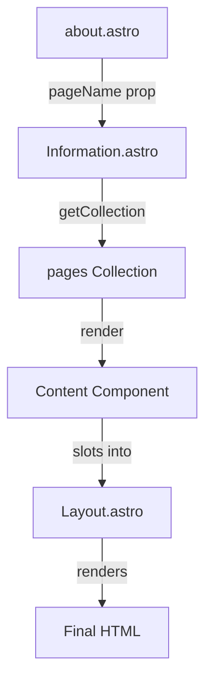

# Dynamic Information Page Rendering in Astro

## Executive Summary

### Problem Statement
Need a flexible system for rendering dynamic information pages that:
1. Separates content from presentation
2. Supports interactive components via MDX
3. Maintains consistent layouts
4. Handles custom components gracefully

### Solution Overview
Implemented a layered architecture using Astro's built-in features:
1. Content Collections for MDX files
2. Dynamic routing through entry points
3. Nested layouts for consistent presentation
4. Component composition for specialized content

## Technical Details

### Component Pipeline



### Entry Point (`about.astro`)
```astro
---
import Information from '../layouts/Information.astro';
---

about.astro (entry)
  → Information.astro (content fetcher)
    → pages collection (content source)
      → Layout.astro (base layout)
        → Final HTML

<Information pageName="test" />
```
- Simple entry point
- Delegates rendering to Information layout
- Specifies which page to render via `pageName`


### Information Layout (`Information.astro`)
```astro
---
import Layout from './Layout.astro';
import { getCollection } from 'astro:content';

const { pageName } = Astro.props;

// Get the page content from the pages collection
const pages = await getCollection('pages');
const pageContent = pages.find(page => page.slug === pageName);

const { Content } = await pageContent.render();
---

<Layout>
  <div class="information-content">
    <Content />
  </div>
</Layout>
```
- Acts as middleware between entry point and content
- Fetches content from collection
- Wraps content in base layout
- Handles content rendering

### Content Collection Configuration
```typescript
// content.config.ts
const pagesCollection = defineCollection({
  type: 'content',
  schema: z.object({
    title: z.string()
  }).catchall(z.any()) // Flexible schema for AI-generated content
});
```
- Minimal schema validation
- Supports MDX files
- Allows any additional frontmatter properties

### Base Layout (`Layout.astro`)
```astro
---
import Header from "@basics/Header.astro";
import Footer from "@basics/Footer.astro";
---

<!doctype html>
<html lang="en">
  <head>
    <!-- Standard meta tags and styles -->
  </head>
  <body>
    <Header />
    <main>
      <slot />
    </main>
    <Footer />
  </body>
</html>
```
- Provides consistent page structure
- Includes common components
- Uses slot system for content insertion

## Implementation Status

### Completed
- [x] Basic routing structure
- [x] Content collection setup
- [x] Layout system
- [x] MDX integration
- [x] Custom component support

### Pending
- [ ] Error boundaries
- [ ] Loading states
- [ ] 404 handling
- [ ] Meta tag management

## Design Decisions

1. **Layered Architecture**
   - Entry points are thin
   - Logic lives in layouts
   - Content separate from presentation

2. **Content Collection Usage**
   - Minimal schema validation
   - Flexible frontmatter
   - MDX support for interactivity

3. **Layout Composition**
   - Base layout for consistency
   - Information layout for specific pages
   - Slot system for flexibility

## Future Considerations

1. **Performance**
   - Page transitions
   - Content preloading
   - Component lazy loading

2. **Content Management**
   - Draft system
   - Content versioning
   - Preview mode

3. **Developer Experience**
   - Page templates
   - Component documentation
   - Testing strategies