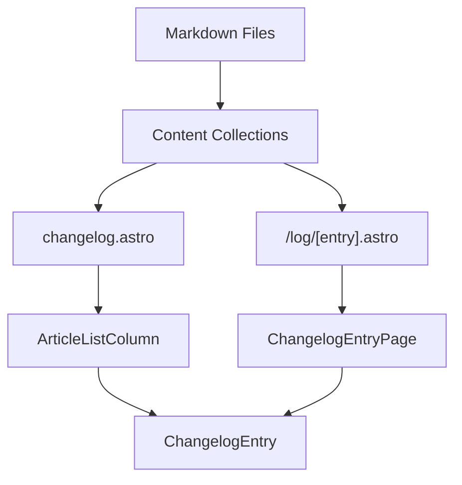

# Data Flow & Component Pipeline

## Entry Points
1. Content Creation: `/content/changelog--{content,code}/*.md`
2. UI Entry: `/site/src/pages/workflow/changelog.astro`
3. Single Entry View: `/site/src/pages/log/[entry].astro`

## Data Structure
```typescript
// Flexible interface - NO strict validation
interface ChangelogEntry {
  // Required by transformation
  tags: any[];
  authors: any[];
  
  // Common but optional
  title?: string;
  date?: string | Date;
  category?: string;
  emphasis?: string;
  
  // Allow any additional fields
  [key: string]: any;
}
```

## Component Flow


# Implementation Details

## Key Components
1. `ArticleListColumn.astro`
   - Purpose: List container for changelog entries
   - Props: `{ entries: ChangelogEntry[] }`
   - Features: Sorting, filtering, pagination

2. `ChangelogEntry.astro`
   - Purpose: Individual entry preview
   - Props: `{ title, date, category, emphasis, slug }`
   - Features: Consistent formatting, link to full view

3. `ChangelogEntryPage.astro`
   - Purpose: Full entry view
   - Props: `{ entry: ChangelogEntry }`
   - Features: Rich markdown rendering, metadata display

## Content Loading
```typescript
// In [entry].astro
const allEntries = await getCollection('changelog--content');
const entry = allEntries.find(e => path.basename(e.id, '.md') === params.entry);
const { Content } = await render(entry);
```

# Important Constraints

1. **NO Strict Validation**
   - Content is AI-generated and may be inconsistent
   - Use flexible interfaces with optional fields
   - Handle missing data gracefully with fallbacks

2. **Progressive Enhancement**
   - Core functionality works without JavaScript
   - Enhanced features (filtering, search) added client-side
   - Maintain accessibility throughout

3. **Performance**
   - Static generation of entry pages
   - Efficient loading of entry lists
   - Optimized image handling

# Example Entry
```markdown
---
emphasis: 'Major Update:'
title: 'New Feature Release'
date: 2025-03-25
authors: 
  - Developer Name
category: Feature
tags:
  - UI
  - Enhancement
---

## Summary
Brief description of changes

## Details
- Bullet points of specific changes
- Technical details if relevant
```

# Testing Checklist
1. Entry Creation
   - [ ] Markdown files properly collected
   - [ ] Frontmatter parsed correctly
   - [ ] Missing fields handled gracefully

2. UI Rendering
   - [ ] List view displays correctly
   - [ ] Single entry view works
   - [ ] Responsive on all devices

3. Navigation
   - [ ] Links work correctly
   - [ ] Back navigation functional
   - [ ] 404 handling for missing entries