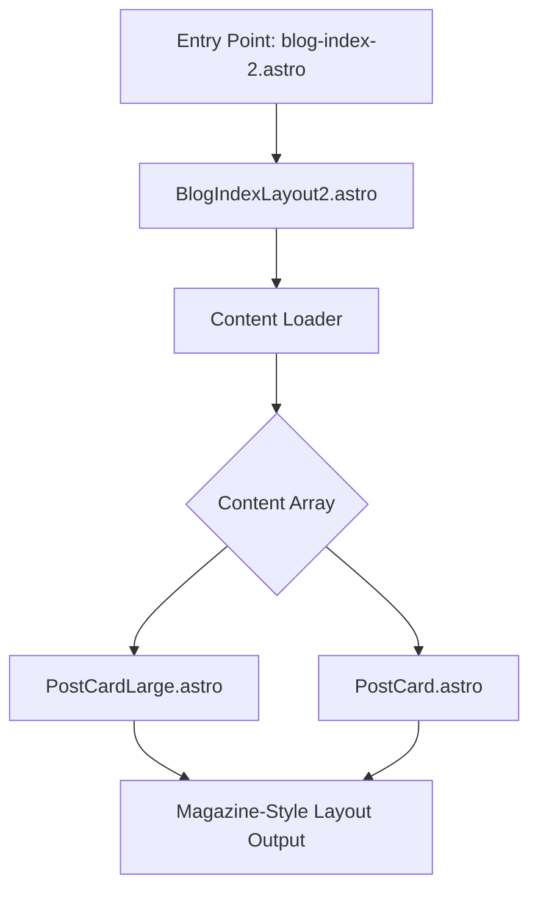

# Inspiration
`http://127.0.0.1:4321/examples/blog-index-2`

Entry point: `packages/galaxy/src/pages/examples/blog-index-2.astro`
Layout: 
`packages/galaxy/src/layouts/BlogIndexLayout2.astro`
Components:
`packages/galaxy/src/components/PostCardLarge.astro
PostCard.astro

# Context

I want a magazine style layout for several different kinds of "content threads" (e.g. blog posts, articles, etc.)

Building on our success with the Changelog page, layout, and render pipeline, we should
1. replicate the "abstraction" of passing the layout any pairing of content and components. 
2. continue the render pipeline, alternating between structural, general components and content or layout specific components.  

## Our Current Structure

### Previous Prompts for inspiration
- [[lost-in-public/prompts/user-interface/Create-a-Reusable-Content-Collections-UI-Structure.md|Create a Reusable Content Collections UI Structure]]
- [[lost-in-public/prompts/render-logic/Conditional-Logic-for-Content.md|Conditional Logic for Content]]
- [[lost-in-public/prompts/user-interface/Create-a-Changelog-UI.md|Create a Changelog UI]]

# Prerequisites

1. Study the inspiration from the "galaxy" package example
2. Study the previous prompts for inspiration
3. Study our implementation of the Changelog page and its renderpipeline. 

# Goal
Design and implement a magazine-style layout that:
- Presents multiple types of content threads (blog posts, articles, etc.) in a visually engaging, modular, and reusable way
- Leverages Astro’s component system and render pipeline abstractions
- Supports flexible pairing of content and UI components for maximum adaptability

# Data Flow & Component Hierarchy
```text
Entry Point: packages/galaxy/src/pages/examples/blog-index-2.astro
  → Layout: packages/galaxy/src/layouts/BlogIndexLayout2.astro
    → Content Loader: fetches array of content items (posts, articles, etc.)
      → Card Components: PostCardLarge.astro, PostCard.astro
        → Final HTML Output (magazine-style grid/list)
```

# Architecture Diagram


# Ideal Data Example

> **Note:** The following example uses JavaScript/TypeScript array syntax for `tags` and `authors` to illustrate how data is passed around in code. **This is not YAML frontmatter syntax!**
> In YAML frontmatter, tags must be a properly indented list (see project rules), e.g.:
> 
> ```yaml
> tags:
>   - User-Interface
>   - Prompt-Engineering
> ```
> 
> Never use JS array syntax in YAML frontmatter.

```js
const contentThreads = [
  {
    id: 'post-1',
    title: 'Astro Magazine Layouts',
    summary: 'How to build flexible layouts in Astro...',
    image: '/images/astro-magazine.jpg',
    authors: ['Jane Doe'],
    tags: ['Astro', 'UI', 'Magazine'], // Correct Train-Case, array syntax for TS only
    date: '2025-04-10',
    url: '/blog/astro-magazine-layouts'
  },
  // ...more items
];
```

# Data Loading, Transformation, and Output
- **Data Source:** Markdown files or a CMS, loaded in the entry point or layout
- **Transformation:** Map raw data to the props expected by card components
- **Output:** Responsive, magazine-style HTML grid/list, with cards linking to full content

# Inspiration & References
- **Galaxy Example:** `/examples/blog-index-2` (see blog-index-2.astro)
- **Layouts:** BlogIndexLayout2.astro for grid structure
- **Components:** PostCardLarge.astro, PostCard.astro for card variations
- **Previous Prompts:**
  - Create-a-Reusable-Content-Collections-UI-Structure
  - Conditional-Logic-for-Content
  - Create-a-Changelog-UI
- **Changelog Page:** Review its render pipeline for abstraction patterns

# Implementation Plan
1. Study the referenced Galaxy example and previous prompts for abstraction ideas
2. Define the ideal data structure and how it is loaded into the entry point/layout
3. Implement the layout using BlogIndexLayout2.astro as a base
4. Pass the content array to card components (PostCardLarge, PostCard)
5. Ensure the render pipeline alternates between structural/layout and content-specific components for modularity
6. Add responsive CSS for a true magazine look (grid, spacing, breakpoints)
  - We may use Tailwind for expediency, but we will later refactor into our CSS.  
7. Annotate code with contextual comments for future maintainers
  - Robust comments are encouraged
8. Test with multiple content types and edge cases (empty, long titles, missing images, etc.)

# Contextual Code Snippet Example
```astro
---
import PostCardContentLayout from '.../PostCardContentLayout.astro';
import PostCardFeature from '.../PostCardFeature.astro';
import PostCard from '.../PostCard.astro';
const contentThreads = /* loaded from data source */;
---
<PostCardContentLayout>
  {contentThreads.map((item, i) =>
    i === 0
      ? <PostCardFeature {...item} />
      : <PostCard {...item} />
  )}
</PostCardContentLayout>
```

# Implementation

### 1. Create PostCard.astro component

```javascript

```

### 2. Create PostCardFeature.astro component

```javascript

```

### 3. Create PostCardContentLayout.astro component

```javascript

```

### 4. Create [thread].astro page

- Must be placed in the correct directory: `site/src/pages/`
- Must be named `thread/[magazine].astro` to match the route
- Must dynamically load a content collection or data source, as defined by the path in `getStaticPath`
- Must pass the content array to the layout component, as well as the page props, which should include the RenderPipeline. 
```javascript

```


```

# Detailed Implementation Plan: Render Pipeline, Props, and Data Flow

## 1. Render Pipeline Overview
- **Entry Point:** `[magazine].astro` (in `site/src/pages/thread/`)
  - Loads the prompt library or other content collection (e.g., from `/content/lost-in-public/prompts/`).
  - Passes `contentThreads` array and any global props to the layout component (`PostCardContentLayout.astro`).
- **Layout Component:** `PostCardContentLayout.astro`
  - Iterates over `contentThreads`:
    - First item: rendered as a feature card (`PostCardFeature.astro`)
    - Remaining items: rendered as standard cards (`PostCard.astro`)
  - Outputs a responsive magazine grid.

## 2. Component Props/Params (TypeScript Style)
- **PostCardContentLayout.astro**
  - `contentThreads: PromptCardData[]` (required)
  - `pipeline?: RenderPipelineStep[]` (optional, for extensibility)
- **PostCardFeature.astro**
  - `id: string`
  - `title: string`
  - `lede: string`
  - `authors: string[]`
  - `tags: string[]`
  - `date_authored_initial_draft: string`
  - `summary?: string`
  - `image?: string`
  - `url: string`
- **PostCard.astro**
  - Same as above (except feature-specific styling/slots)
- **Type Definition Example:**
  ```ts
  export interface PromptCardData {
    id: string;
    title: string;
    lede: string;
    authors: string[];
    tags: string[];
    date_authored_initial_draft: string;
    date_authored_current_draft?: string;
    at_semantic_version?: string;
    status?: string;
    url: string;
    summary?: string;
    image?: string;
  }
  ```

## 3. Dynamic Routing & Content Loading
- Place `[magazine].astro` in `site/src/pages/thread/`
- Use Astro’s `getStaticPaths` to load all available magazine content collections (e.g., from `/content/lost-in-public/prompts/`)
- In the page, import the layout and pass the loaded content:
  ```astro
  ---
  import PostCardContentLayout from '.../PostCardContentLayout.astro';
  import { getPromptLibrary } from '.../utils/getPromptLibrary';
  const { contentThreads } = await getPromptLibrary(); // Loads all prompt metadata
  ---
  <PostCardContentLayout contentThreads={contentThreads} />
  ```

## 4. Render Logic Example (in Layout)
```astro
<div class="magazine-grid">
  {contentThreads.map((item, i) =>
    i === 0
      ? <PostCardFeature {...item} />
      : <PostCard {...item} />
  )}
</div>
```

## 5. Edge Cases & Extensibility
- Handle empty `contentThreads` array: render a fallback message.
- Handle missing images: use a default image or placeholder.
- Support for future pipeline steps (e.g., filtering, sorting, grouping by tag).

## 6. Props/Params Documentation
- Each component must have a JSDoc or TypeScript docblock describing all props, their types, and whether they are required.
- Example:
  ```ts
  /**
   * Props for PostCardFeature.astro
   * @prop {string} id - Unique identifier for the prompt
   * @prop {string} title - Title of the prompt
   * @prop {string} lede - Short description
   * @prop {string[]} authors - List of authors
   * @prop {string[]} tags - List of tags (Train-Case)
   * @prop {string} date_authored_initial_draft - ISO date string
   * @prop {string} url - Route to the prompt detail page
   * @prop {string} [summary] - Optional summary
   * @prop {string} [image] - Optional image path
   */
  ```

---

This expanded section provides all the details a code assistant needs to implement the magazine-style layout, including a clear render pipeline, prop/param contracts, dynamic routing, data loading, and extensibility notes. All syntax and conventions are project-compliant.
