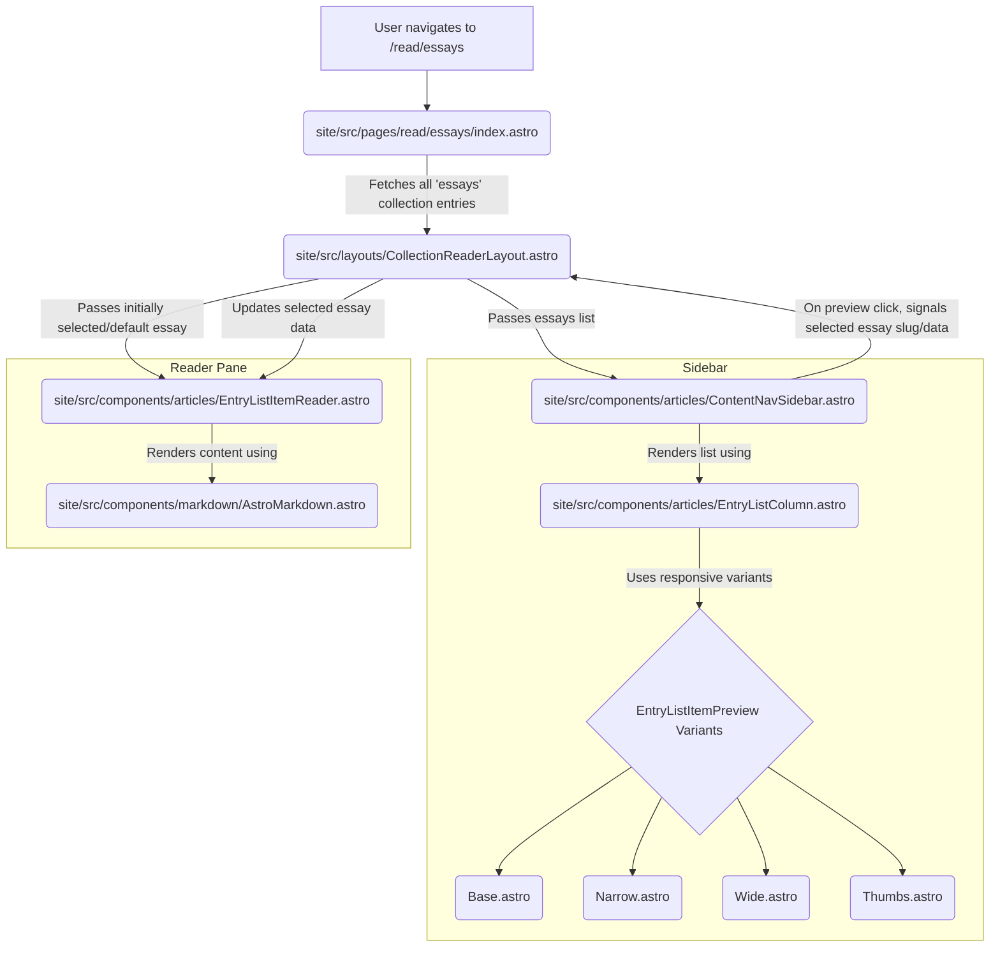

## Objective

Create a new, responsive, documentation-style layout for the existing "essays" content collection. This layout should feature a sidebar for navigating content previews and a main area for reading the selected essay. The implementation should prioritize reusing existing components, logic, and patterns where possible to minimize development time.

## Target Audience

This prompt is intended for a software developer, potentially working with an AI Code Assistant, who may not have full prior context on this specific part of the project. Clarity and explicit instructions are key.

## Background & Context

### Current User Flow & Layout

The "essays" collection currently renders using the following flow:

1.  **List View:**
    ⍗ ⏷ `site/src/pages/read/index.astro` ⏷ ⍗
      ⮑ `site/src/components/articles/ArticleListColumn.astro`
        ⮑ `site/src/components/articles/ArticleListNewsPreview.astro` ➥ _onClick_ ➥
2.  **Reading View:**
    ➥ _routeTo_ ➥ `site/src/pages/read/essays/[...slug].astro`
      ⮑ `site/src/layouts/OneArticle.astro`
        ⮑ `site/src/components/articles/OneArticleOnPage.astro`
          ⮑ `site/src/components/markdown/AstroMarkdown.astro`

***Note:*** *This existing implementation contains working logic for fetching and rendering the collection, which should be referenced and reused.* Refer to the `OneArticle.astro` layout and `OneArticleOnPage.astro` component for patterns related to rendering markdown content via `AstroMarkdown.astro`.

### Other Working Layouts for Reference

*   **Magazine Style (Vibe Coding):**
    *   List: `site/src/pages/thread/[magazine].astro` -> `PostCardContentLayout.astro` -> `PostCardFeature.astro`
    *   Read: `site/src/pages/vibe-with/[collection]/[...slug].astro` -> `OneArticle.astro` -> `OneArticleOnPage.astro` -> `AstroMarkdown.astro`
*   **Grid Style (Concepts/Vocabulary):**
    *   List: `site/src/pages/more-about/index.astro` -> `ReferenceGrid.astro` -> `ReferenceItem.astro`
    *   Read: `site/src/pages/more-about/[...slug].astro` -> `OneArticle.astro` -> `OneArticleOnPage.astro` -> `AstroMarkdown.astro`

### Important Configuration

The markdown rendering pipeline uses specific Remark plugins defined in `site/astro.config.mjs`. Do not alter this configuration. Content rendering within the new layout should follow the established pattern, likely involving `AstroMarkdown.astro`.

### Relevant Project Documentation & Constraints

*   **Astro Nuances:** [[lost-in-public/reminders/Astro-Specifc-Nuances.md|Astro-Specific Nuances]] (Constraint: No JSX/React syntax, keep JS in frontmatter).
*   **Refactoring Log:** Any potential refactor ideas identified during implementation should be logged here: [[lost-in-public/refactors/Ongoing-Log-of-Opportunities-to-Refactor.md|Ongoing Log of Opportunities to Refactor]]
*   **Previous Integration Examples:**
    *   [[lost-in-public/prompts/render-logic/Integrate-Collection-into-Site.md|Integrate Collection into Site]]
    *   [[content/lost-in-public/prompts/user-interface/Use-Magazine-Style-Layout-for-new-Specs-Collection.md|Use Magazine Style Layout for new Specs Collection]]

## Requirements

### Desired Layout & Aesthetic

*   **Overall Structure:** A two-column layout:
    *   **Left Sidebar:** A fixed-width (on desktop/tablet) scrollable column displaying previews of all essays in the collection.
    *   **Right Content Area:** A main area that displays the full content of the essay selected from the sidebar.
*   **Inspiration:** Inspired by documentation websites (e.g., Stripe Docs, Astro Docs) but adapted for richer content previews.
*   **Sidebar Content:** Each item in the sidebar should be a preview/thumbnail representation of an essay, displaying:
    *   Banner Image (`banner_image` or fallback)
    *   Title (`title`)
    *   Lede (`lede`)
    *   Category (`category`)
    *   Font sizes should be relatively small to allow multiple previews to be visible.
*   **Sidebar Interaction:**
    *   Clicking a preview item in the sidebar should load and display the corresponding essay's full content in the right content area **without a full page reload** (client-side navigation preferred if feasible within Astro's capabilities, otherwise standard linking is acceptable).
    *   The currently selected/viewed essay preview in the sidebar should have a distinct visual state (e.g., different background, border).
    *   A tooltip/popover (on hover or focus) for each sidebar preview should reveal additional metadata: Author(s), Date (e.g., `date_last_updated` or `date_created`), and Tags.
*   **Responsiveness (Mobile-First):**
    *   **Mobile (< 768px):** The sidebar should likely collapse or be hidden behind a menu toggle. The main content area takes full width. Previews might use the `EntryListItemPreview--Thumbs.astro` variant.
    *   **Tablet (>= 768px):** The two-column layout should appear. Sidebar previews might use `EntryListItemPreview--Narrow.astro`.
    *   **Desktop (>= 1024px):** Sidebar previews might use `EntryListItemPreview--Base.astro` or `EntryListItemPreview--Wide.astro` depending on available space and final design tuning.

### Data Handling

*   The layout needs to fetch all entries from the `essays` collection.
*   Relevant frontmatter fields for display include: `slug`, `title`, `lede`, `category`, `banner_image` (or other image fallbacks like `portrait_image`), `authors`, `date_created`, `date_last_updated`, `tags`.

### Constraints

*   **Framework:** Must be implemented using Astro. Avoid introducing new frameworks (React, Vue, etc.).
*   **Syntax:** Strictly adhere to Astro component syntax. No JSX. Comments in HTML should use `<!-- -->`.
*   **Code Style:** Follow existing project conventions (TypeScript, commenting, frontmatter JS). Reference `Astro-Specific Nuances.md`.

## Proposed Implementation and Component Breakdown

This involves creating a new dynamic route page, a new layout, and several new components.



### New Files and Components

1.  **Page:** `site/src/pages/read/essays/index.astro`
    *   Purpose: Entry point for this new layout. Fetches collection data.
    *   Renders: `CollectionReaderLayout`.
2.  **Layout:** `site/src/layouts/CollectionReaderLayout.astro`
    *   Props: `essays: CollectionEntry<'essays'>[]` (or similar type for the collection data).
    *   Purpose: Orchestrates the two-column layout. Manages the state of the currently selected essay. Renders the Sidebar and Reader components.
    *   Renders: `ContentNavSidebar`, `EntryListItemReader`.
3.  **Sidebar Container:** `site/src/components/articles/ContentNavSidebar.astro`
    *   Props: `essays: CollectionEntry<'essays'>[]`, `currentSlug: string`.
    *   Purpose: Renders the list of essay previews. Handles signalling the parent layout when a new essay is selected.
    *   Renders: `EntryListColumn`.
4.  **Preview List:** `site/src/components/articles/EntryListColumn.astro`
    *   Props: `essays: CollectionEntry<'essays'>[]`, `currentSlug: string`.
    *   Purpose: Maps over the essays and renders the appropriate preview component for each, passing necessary data.
    *   Renders: One of the `EntryListItemPreview--*.astro` components for each essay.
5.  **Preview Variants:** (New Components)
    *   `site/src/components/articles/EntryListItemPreview--Base.astro`
    *   `site/src/components/articles/EntryListItemPreview--Narrow.astro`
    *   `site/src/components/articles/EntryListItemPreview--Wide.astro`
    *   `site/src/components/articles/EntryListItemPreview--Thumbs.astro`
        *   Props (Example): `entry: CollectionEntry<'essays'>`, `isActive: boolean`.
        *   Purpose: Display a single essay preview tailored to different screen sizes/contexts. Include hover/focus interactions for the tooltip.
6.  **Reader Pane:** `site/src/components/articles/EntryListItemReader.astro`
    *   Props: `entry: CollectionEntry<'essays'>` (the currently selected essay).
    *   Purpose: Displays the full content of the selected essay.
    *   Renders: `AstroMarkdown.astro` component, passing the `entry.body` or processed content.

## Success Criteria

*   A new page exists at `/read/essays` using the `CollectionReaderLayout`.
*   All entries from the `essays` collection are displayed as previews in the left sidebar on desktop/tablet views.
*   Clicking a preview in the sidebar updates the right pane to show the full content of that essay.
*   The currently selected essay is visually highlighted in the sidebar.
*   Tooltips showing Author/Date/Tags appear on hover/focus for sidebar previews.
*   The layout is responsive according to the requirements (sidebar collapses/hides on mobile, preview variants adjust).
*   The implementation reuses existing Astro patterns and adheres to project constraints and code style.
*   No build errors or console errors are present.

## Deliverables

*   New/modified Astro page (`site/src/pages/read/essays/index.astro`).
*   New Astro layout (`site/src/layouts/CollectionReaderLayout.astro`).
*   New Astro components (`ContentNavSidebar.astro`, `EntryListColumn.astro`, `EntryListItemReader.astro`, `EntryListItemPreview--*.astro`).
*   Any necessary CSS/Tailwind updates for styling the new layout and components.
*   (Optional) Log of any identified refactoring opportunities in `Ongoing-Log-of-Opportunities-to-Refactor.md`.

# Implementation Plan

1.  **Identify Current Essay:** In `site/src/layouts/CollectionReaderLayout.astro`, determine the `CollectionEntry` for the essay matching the current `pageSlug`.
2.  **Adopt MDAST Processing:** Integrate the `unified` processor chain (with `remarkParse`, `remarkGfm`, `remarkImages`, `remarkBacklinks`, `remarkCitations`, `remarkTableOfContents`) from `OneArticle.astro` into `CollectionReaderLayout.astro`. Run this processor on the `body` of the current essay entry to generate the `transformedMdast`.
3.  **Separate ToC from Content:** Add logic similar to `OneArticleOnPage.astro` within `CollectionReaderLayout.astro` to:
    *   Find the `tableOfContents` node within the `transformedMdast`.
    *   Create a new root node for the main content containing all children *except* the ToC node.
4.  **Render Main Content:** In the main content area of `CollectionReaderLayout.astro`, render `<AstroMarkdown>` passing the *filtered* main content AST node.
5.  **Render ToC:** In the appropriate sidebar area of `CollectionReaderLayout.astro` (potentially within `ContentNavSidebar.astro` or a new dedicated ToC component if preferred), render `<AstroMarkdown>` passing the extracted `tableOfContents` node and the `{ renderingToC: true }` data flag.
6.  **Add Imports:** Ensure all necessary imports (`unified`, remark plugins, `AstroMarkdown.astro`) are added to `CollectionReaderLayout.astro`.

# Implementation Insights
_To be filled in during/after development, detailing challenges, solutions, or lessons learned._

### Using Dynamic Routes for this Reader Layout

Working through how to render the actual Markdown file content of each Essay from the essayCollection, we need a new dynamic route that renders the new ContentReaderLayout.astro with the ContentNavSidebar with the user-clicked entry on display on the right.  The right should simply, for now, render AstroMarkdown.astro with the Markdown content of the selected essay. Right now, the best render pipeline for markdown is from the `site/src/layouts/OneArticle.astro` layout, which then renders `site/src/components/articles/OneArticleOnPage.astro`, which finally renders `site/src/components/markdown/AstroMarkdown.astro`. The unified library call in OneArticleOnPage.astro is necessary to completely copy.  

We have this working with dynamic routes specifically here:
⍗ ⏷ `site/src/pages/vibe-with/[collection]/[...slug].astro` ⏷ ⍗

### Critical Requirements for AstroMarkdown Integration

When implementing the `CollectionReaderLayout.astro` to properly render markdown content using `AstroMarkdown.astro`, several critical requirements must be met to ensure proper rendering:

1. **Proper Node Structure**:
   - The `AstroMarkdown` component expects a specific node structure with a `type: 'root'` node containing children.
   - You must filter out the `tableOfContents` node from the main content rendering:
   ```javascript
   node={{
     type: 'root',
     children: mdastNode.children ? mdastNode.children.filter(child => child.type !== 'tableOfContents') : [],
     data: mdastNode.data || {}
   }}
   ```
   - The Table of Contents should be rendered separately with the `renderingToC: true` flag.

2. **Required Props**:
   - `node`: The MDAST node (with proper structure as described above)
   - `data`: An object containing at minimum `{ path: entry.id, id: entry.id, ...entry.data }`
   - `compiledContent`: The raw markdown content (typically `entry.body`)

3. **CSS Wrapper Classes**:
   - The `AstroMarkdown` component must be wrapped in an element with the `prose` class:
   ```html
   <article class="prose main-content">
     <AstroMarkdown ... />
   </article>
   ```
   - These classes apply essential styling to the markdown content.

4. **Content Layout Structure**:
   - The content wrapper should use a flexbox layout to properly position the content and TOC:
   ```html
   <div class="content-wrapper">
     <div class="content-inner"><!-- Main content here --></div>
     <!-- TOC sidebar here if available -->
   </div>
   ```

5. **Global Styling**:
   - Include global styling rules for elements rendered by `AstroMarkdown`:
   ```css
   .prose :global(h2) { /* styles */ }
   .prose :global(p), .prose :global(.paragraph) { /* styles */ }
   ```

6. **Markdown Processing Pipeline**:
   - The unified processor chain must include all necessary plugins:
   ```javascript
   const processor = unified()
     .use(remarkParse)
     .use(remarkGfm)
     .use(remarkImages)
     .use(remarkBacklinks)
     .use(remarkCitations)
     .use(remarkTableOfContents);
   ```

Failure to implement any of these requirements will result in improper rendering, missing styles, or complete failure to display content. The most common issues are incorrect node structure (not filtering out TOC) and missing CSS wrapper classes.
