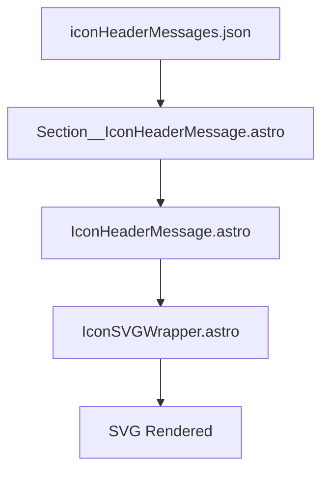

# Goal  

Create and introduce a new component pipeline for rendering simple messages dynamically generated from JSON data. The section that renders this component should draw from messages created by site admins, and be easily modifiable by them.

---

# Flow and Props

- **Entry Point:**
  - `Section__IconHeaderMessage.astro` (renders the message grid section)
- **Data Source:**
  - `iconHeaderMessages.json` (JSON file with message objects, modifiable by admins)
- **Component Flow:**
  - `Section__IconHeaderMessage.astro` → iterates over JSON data → renders multiple `IconHeaderMessage.astro` components
- **SVG Handling:**
  - Each message may include an SVG icon, rendered via `IconSVGWrapper.astro` for proper SVG handling
- **Admin Workflow:**
  - Site admins update `iconHeaderMessages.json` to add/edit messages; changes are reflected in the UI without code changes

## Example Flow (Bulleted)
```text
Section__IconHeaderMessage.astro (entry)
  → Loads iconHeaderMessages.json (content source)
    → Maps each message to IconHeaderMessage.astro (message card)
      → IconSVGWrapper.astro (for SVG icons)
        → Final HTML grid
```

## Architecture Diagram


## Example JSON Data Structure
```json
[
  {
    "title": "Welcome!",
    "subtitle": "Start your journey here.",
    "icon": "welcome.svg",
    "description": "This is a simple message card rendered from JSON.",
    "cta": {
      "label": "Learn More",
      "url": "/learn-more"
    }
  },
  {
    "title": "Get Support",
    "subtitle": "Need help?",
    "icon": "support.svg",
    "description": "Contact our support team for assistance.",
    "cta": {
      "label": "Contact Us",
      "url": "/contact"
    }
  }
]
```
// Each object represents a card; admins can add/edit/remove these objects.

---

## Existing Code

### Component Directory:
`site/src/components/basics/messages`

### Section Component:
Renders a grid of IconHeaderMessage cards.
`site/src/components/basics/messages/Section__IconHeaderMessage.astro`

### Message Component:
`site/src/components/basics/messages/IconHeaderMessage.astro`

### Message Data:
`site/src/content/messages/iconHeaderMessages.json`

### SVG Wrapper:
`site/src/components/basics/render-images/IconSVGWrapper.astro`

(Inspired by `site/src/components/trademarks/TrademarkSVGWrapper.astro`)

---

# Implementation

1. Ensure `iconHeaderMessages.json` is easily editable by non-developers (site admins).
2. The section component should dynamically load and map over the JSON file.
3. Each message card should use the message data and render an SVG icon via the wrapper.
4. All components should be modular and reusable.
5. Document the workflow for future maintainers.

## Issues and Bugs Encountered

- **SVG Rendering:**
  Rendering SVGs directly in cards required a wrapper component for consistent behavior. Solution: use `IconSVGWrapper.astro` (see above).

---

# References & Inspiration
- `packages/galaxy/src/components/Feature/Feature1.astro`
- `site/src/components/trademarks/TrademarkSVGWrapper.astro`
- [Astro Content Collections](https://docs.astro.build/en/guides/content-collections/)
- [Astro Component Basics](https://docs.astro.build/en/core-concepts/components/)

// This prompt was improved using the iterative workflow in 'Improve-on-a-User-Prompt-through-Iteration.md'.
