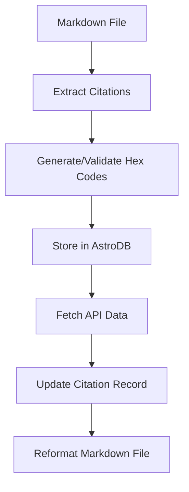

# Context

This Prompt will be "reusable". We will move specifics about this task at hand and its implementation to its own "instance" or "one-off" prompt for our records, and we will re-use this prompt in its general form for other tasks. 

This Prompt is a "workflow" prompt, which means it is used as a starting point in a workflow where a relatively large Specification is "too much" for both AI Code Assistant context windows and the human attention span. So, this prompt focuses the AI Code Assistant on a single task at a time, while the human reviews and implements the code generated by the AI Code Assistant.

## Goal for Task at Hand

Automate the transformation of simple citations and footnotes into a global content registry.

This should give the design and front end team the ability to create dynamic functionality that enables enhancements to our content-rich, research-driven website.

This should bring some "order" to our content, as we will be able to track and build on the most informative sources. 

This will help with "social media" participation as we will be able to "mention" our most valuable sources in ways that flatter them and get their attention.

### Success Criteria

1. Thoroughly discuss and document a versatile but comprehensive data model for citations and sources. Document it in [[specs/Integrate-Backend-Data-Stores-for-Dynamic-Content.md|Integrate Backend Data Stores for Dynamic Content]].
2. Properly set up AstroDB files for this feature (citations, Source Registry)
a. Source "type" behaves as an enum, but is stored as a string.
2. Code can "evaluate" the source type and use the appropriate API to fetch citation information. User settings are clear and discoverable, and the user can "add" or "remove" types and API calls to the system as needed.
2. Successfully set up the Jina AI API calls for this feature
3. Successfully set up the Google Books API calls for this feature
4. Successfully run the script on a single Markdown file. Including "evaluating" the source type and using either the Google Books API or the Jina AI API to fetch citation information.
5. Debug option can be set by the user and the user can get a report, using our reporting conventions, of the response objects coming back from the API calls. (In the past, this has been important for debugging when future work is being done.)
a. Check and verify that data is saved to AstroDB correctly.
6. Successfully run the script on a directory of Markdown files.
a. Check and verify that data is saved to AstroDB correctly.
7. Revise documentation establishing clear procedures and conventions, including code samples and paths to created or updated code files, that a remote, foreign, contract developer paired with an AI Code Assistant can use to implement both this task with very few iterations and future data-persistence tasks with very few iterations.

## Reference Specification for this Prompt:

[[specs/Integrate-Backend-Data-Stores-for-Dynamic-Content.md|Integrate Backend Data Stores for Dynamic Content]]

Please note the section on the "Global Citation Registry." We will be performing a single task working towards the larger goals outlined in the reference specification.

## Reference Prompts used Previously:
- [[lost-in-public/prompts/render-logic/Handle-Citations-Logic-and-Render-Citations-Component.md|Handle Citations Logic and Render Citations Component]]
- [[lost-in-public/prompts/data-integrity/Integrate-Citations-Format-Hex-into-Observer.md|Integrate Citations Format Hex into Observer]]
- [[lost-in-public/prompts/data-integrity/Refactored-Citations-Observer.md|Refactored Citations Observer]]

## Stack or Tools

We will use Astro's built in functionality with AstroDB.  AstroDB is a database that has strong built-in functionality, including Prisma like data modeling and validation.  

AstroDB is a relatively new feature, which means AI Models were likely trained without sample code for AstroDB. Therefore, it's necessary we constantly refer to the [AstroDB documentation](https://docs.astro.build/en/guides/astro-db/)

>[!ALERT]
> DO NOT make assumptions and guess at functionality while generating code. Refer to the AstroDB documentation at all times. Reason carefully, even if it takes more compute or time. 

# Task at Hand

We will write a script, but write it with the goal and intention of iterations towards a component as part of an "admin" panel. We may also turn it into an Obsidian plugin.

Write code that will scan a Markdown file for citations and footnotes, and:



1. Evaluate if the text within the Markdown delimiters is a "hex" value, 
and 
   a. if so, scan the citations registry for a match, and 
      1. if found, write or update the companion footnote line to include the citation information in the current desired format.
      2. if not found, create a new citation in the citations registry and write or update the companion footnote line to include the citation information in the current desired format.
   b. if not, replace the citation value, usually an integer, with a generated hex value, and assure the syntax of the citation is the proper "[^hex]" format. (LLM Generated references only have "[int]" syntax, and we will need to convert them to "[^" + ${hex} + "]" syntax.)

2. Writing a citation record into AstroDB:
   a. The primary key should be a hexCode. This should be the only "required" field. We have streamlined the avoidance of hard validation rules to allow the content team to focus on content generation instead of data integrity. We instead use an "Observer" system to report and sometimes attempt to fix data integrity issues. Thus, no other field is "required". 
   b. The most important field is a unique url. (Some citations won't have a url, but that should be very rare. With a uniqe url, we can use different APIs to fetch compete citation information from the source.)

3. Updating the citation record via async API Calls:
   a. Evaluated the unique url to match it to a target API endpoint. 
      1. Known API Endpoints:
         a. Google Books API
         b. YouTube API
         c. Jina API
         d. BrowserBase API
   b. Use the unique url to fetch citation information from the source. 
   c. Use the response object to update the citation record in AstroDB. 

4. Parsing the response object into fields and writing to the citation record, but also saving the response object. 
   a. The response object should be saved as a JSON string in the citation record. We should discuss and agree on the way to save this JSON object.
   b. The response object should be "parsed" with various parts of the response object being saved into fields in the citation record. 
   c. Some fields may stay empty, as there is no corresponding data. Some response objects may have single string values that need to be further parsed and divided into several fields. 

# Field List for Citation Record

### Simple Field List for first iteration
```yaml
id: ${hexCode}
created_at: ${datetime}
updated_at: ${datetime}
unique_source_url: ${url}
source_type: ${type}
completion_api_url: ${string}
raw_response_object: ${object} // could be string or object, need to think about querying for error response objects.
children_source_ids: ${array}
parent_source_ids: ${array}
```

### Comprehensive Ideas for Field List
```yaml
id: ${hexCode}
site_uuid: ${uuid} // for disambiguation in case we have tons of citations and run out of hexCodes (won't happen soon, but it's a good idea to have this field)
created_at: ${datetime}
updated_at: ${datetime}
unique_source_url: ${url} // the unique url of the citation source
source_type: ${type} // the type of source (book, media, website, etc.)
referenced_in_instances: ${array} // an array of markdown files that reference this citation.
completion_api_url: ${string} // the API endpoint that will be used to complete this citation. (e.g. Google Books API, YouTube API, Jina API, BrowserBase API)
parent_source_ids: ${array} // an array of hexCodes of parent sources, if any.
children_source_ids: ${array} // an array of hexCodes of child sources, if any.
classifiers: ${id} or ${default_name} // the hexCode of the classifier, if any.
```

At first, we will implement this functionality in a script to be run from the command line and targeting a single Markdown file. We should code in the ability to recurse through a target directory at the same time, but we will first test it with a single file.

# Reference Code for Discussion

[[tidyverse/observers/templates/citations.ts|Citations Observer Template]]
[[tidyverse/observers/services/citationService.ts|Citation Service]]
[[tidyverse/observers/scripts/test-citation-hex.ts|Test Citation Hex Script]]

# Discussion before implementation: 
1. Should we call this a "source" registry and include parent/child relationships between sources? (e.g. a book and its chapters, an author and their books, a youtube channel and its videos, a website and its pages, etc.)
2. Should we think through having different tables for different types of sources with cross-references? (e.g. a book and its author, a media and its creator, a website and its publisher, etc.) Or is it better to have one table?  (We don't need to consider performance, as there will only be thousands or tens of thousands of records and there will be a limited number of valuable readers but not a large number of concurrent pageviews.)
3. Should we skip local DB and just fast forward to Turso remote DB? Given we want this to be "global" and a single source of truth, it would prevent different developers from ending up with different data in their local DBs and then needing to merge it. 

## Discussion on Architecture and Setup

### Single Table vs. Multiple Tables

**Single Table Approach:**
- **Pros:**
  - Simpler implementation for Phase 1
  - Easier querying for basic use cases
  - More flexible for handling diverse source types
  - Lower overhead for a relatively small dataset (thousands of records)
  - Faster development cycle
- **Cons:**
  - Less normalized data structure
  - Potential for sparse data (many null fields)
  - May become unwieldy as source types proliferate
  - Schema evolution becomes more complex

**Multiple Tables Approach:**
- **Pros:**
  - More normalized data structure
  - Type-specific fields can be properly constrained
  - Better data integrity
  - Cleaner separation of concerns
  - More scalable for future growth
- **Cons:**
  - More complex implementation
  - Requires joins for many queries
  - More tables to maintain
  - Potentially slower development for Phase 1

### Source Hierarchy and Relationships

**Flat Structure:**
- **Pros:**
  - Simpler implementation
  - Easier to query for basic use cases
  - Sufficient for initial citation tracking
- **Cons:**
  - Loses valuable relationship context
  - Duplicate information across related sources
  - Limited ability to navigate between related sources

**Hierarchical Structure:**
- **Pros:**
  - Rich relationship modeling
  - Better navigation between related content
  - More powerful querying capabilities
  - Future-proof for advanced features
- **Cons:**
  - More complex schema design
  - Requires careful handling of circular references
  - More complex queries for basic operations

### Local vs. Remote Database

**Local AstroDB:**
- **Pros:**
  - Easier development setup
  - No network latency during development
  - No dependency on external services
  - Built-in Astro integration
- **Cons:**
  - Data synchronization challenges across developers
  - Not truly "global" as a source of truth
  - Potential for divergent data

**Remote Turso DB:**
- **Pros:**
  - True single source of truth
  - Consistent data across all developers
  - Better matches the "global registry" concept
  - Simplified synchronization
- **Cons:**
  - Network dependency during development
  - Additional configuration required
  - Potential costs for hosted service
  - Need for authentication/authorization

### Recommended Approach for Phase 1

Based on the project's stated priorities and Phase 1 goals:

1. **Start with a single table approach** - This provides the fastest path to a working implementation while still capturing all necessary data. The data model can evolve in later phases.

2. **Include basic parent/child relationships** - Implement the `parent_source_id` and `children_source_ids` fields, but keep the implementation simple. This gives you relationship capabilities without over-engineering.

3. **Begin with local AstroDB for development** - This simplifies initial development, but plan for migration to Turso in Phase 2 as explicitly mentioned in your phased approach.

4. **Focus on the minimal field list first** - The simple field list (`id`, `unique_url`, `source_type`, `completed_with_api`, `raw_response_object`) provides a solid foundation while allowing for future expansion.

## Implementation Plan with AstroDB

Based on our discussion and analysis, here's the implementation plan for the citation registry using AstroDB:

### 1. Database Schema Configuration

```typescript
// db/config.ts
import { defineDb, defineTable, column } from 'astro:db';

// Define the Citation table with our simple field list
const CitedSources = defineTable({
  columns: {
    // Primary key using the hexCode as ID
    id: column.text({ primaryKey: true }),
    
    // Timestamps
    created_at: column.date({ default: () => new Date() }),
    updated_at: column.date({ default: () => new Date() }),
    
    // Basic citation metadata
    unique_source_url: column.text(),
    source_type: column.text(),

    // Designated API endpoint for completion
    completion_api_url: column.text(),
    
    // Store the raw API response as JSON
    raw_response_object: column.json(),
    
    // Relationships (stored as JSON arrays)
    children_source_ids: column.json({ default: () => [] }),
    parent_source_ids: column.json({ default: () => [] }),
  }
});

// Export the database configuration
export default defineDb({
  tables: { CitedSources },
});
```

### 2. Citation Registry Utility Module

```typescript
// site/src/utils/citations/citationRegistry.ts
import { db } from 'astro:db';
import type { CitedSources } from 'astro:db';

/**
 * Add a new citation to the registry
 * @param citation - CitedSources object without timestamps
 * @returns The newly created citation
 */
export async function addCitation(citation: Omit<CitedSources, 'created_at' | 'updated_at'>) {
  return await db.insert('CitedSources').values({
    ...citation,
    // created_at and updated_at will use the default values
  }).returning();
}

/**
 * Get a citation by its ID
 * @param id - The hexCode ID of the citation
 * @returns The citation or undefined if not found
 */
export async function getCitation(id: string) {
  return await db.select().from('CitedSources').where({ id }).get();
}

/**
 * Update an existing citation
 * @param id - The hexCode ID of the citation
 * @param data - Partial citation data to update
 * @returns The updated citation
 */
export async function updateCitation(id: string, data: Partial<Omit<CitedSources, 'id' | 'created_at'>>) {
  return await db.update('CitedSources').set({
    ...data,
    updated_at: new Date(),
  }).where({ id }).returning();
}

/**
 * Get all citations in the registry
 * @returns Array of all citations
 */
export async function getAllCitations() {
  return await db.select().from('CitedSources');
}

/**
 * Check if a citation exists by URL
 * @param url - The URL to check
 * @returns The citation if found, undefined otherwise
 */
export async function getCitationByUrl(url: string) {
  return await db.select().from('CitedSources').where({ unique_source_url: url }).get();
}

/**
 * Load the citation registry
 * @returns The number of citations loaded
 */
export async function loadCitationRegistry() {
  const citations = await getAllCitations();
  console.log(`Loaded ${citations.length} citations from registry`);
  return citations.length;
}
```

### 3. Citation Processing Script

```typescript
// scripts/process-citations.ts
import fs from 'fs';
import path from 'path';
import { unified } from 'unified';
import remarkParse from 'remark-parse';
import remarkStringify from 'remark-stringify';
import { visit } from 'unist-util-visit';
import { addCitation, getCitation, updateCitation, getCitationByUrl, loadCitationRegistry } from '../site/src/utils/citations/citationRegistry';

// Import debugging utilities
import { MarkdownDebugger } from '../site/src/utils/markdown/markdownDebugger';
const mdDebugger = new MarkdownDebugger();

// Set up environment variables for debugging
process.env.DEBUG_CITATIONS = process.env.DEBUG_CITATIONS || 'false';
process.env.DEBUG_CITATIONS_VERBOSE = process.env.DEBUG_CITATIONS_VERBOSE || 'false';

/**
 * Process citations in a markdown file
 * @param filePath - Path to the markdown file
 * @returns Object with counts of processed citations
 */
async function processCitations(filePath: string) {
  // Load the citation registry first
  await loadCitationRegistry();
  
  const stats = {
    total: 0,
    new: 0,
    updated: 0,
    unchanged: 0,
  };
  
  // Read the markdown file
  const content = fs.readFileSync(filePath, 'utf-8');
  
  // Parse the markdown
  const processor = unified()
    .use(remarkParse)
    .use(() => (tree) => {
      // Find all footnote references
      visit(tree, 'footnoteReference', (node) => {
        stats.total++;
        
        // Check if this is a hex citation (e.g., [^a1b2c3])
        const hexCode = node.identifier;
        const isHexCitation = /^[0-9a-f]{6}$/.test(hexCode);
        
        if (isHexCitation) {
          // Process hex citation
          processCitation(hexCode, filePath);
        }
      });
      
      return tree;
    });
  
  // Process the markdown
  await processor.process(content);
  
  return stats;
}

/**
 * Process a single citation
 * @param hexCode - The citation hex code
 * @param filePath - The file containing the citation
 */
async function processCitation(hexCode: string, filePath: string) {
  try {
    // Check if citation exists
    const existingCitation = await getCitation(hexCode);
    
    if (existingCitation) {
      // Update the citation with the new file reference
      const referencedIn = existingCitation.referenced_in_instances || [];
      
      // Add the file if it's not already in the list
      if (!referencedIn.includes(filePath)) {
        referencedIn.push(filePath);
        await updateCitation(hexCode, { referenced_in_instances: referencedIn });
        
        if (mdDebugger.isEnabled) {
          console.log(`Updated citation ${hexCode} with new reference: ${filePath}`);
        }
      }
    } else {
      // Create a new citation
      await addCitation({
        id: hexCode,
        unique_source_url: '', // Will be populated later by API
        source_type: 'unknown', // Will be determined later
        completion_api_url: '',
        raw_response_object: {},
        children_source_ids: [],
        parent_source_ids: [],
        referenced_in_instances: [filePath],
      });
      
      if (mdDebugger.isEnabled) {
        console.log(`Added new citation ${hexCode} from file: ${filePath}`);
      }
    }
  } catch (error) {
    console.error(`Error processing citation ${hexCode}:`, error);
  }
}

/**
 * Process all markdown files in a directory
 * @param dirPath - Path to the directory
 * @returns Object with counts of processed citations
 */
async function processDirectory(dirPath: string) {
  const stats = {
    files: 0,
    citations: {
      total: 0,
      new: 0,
      updated: 0,
      unchanged: 0,
    },
  };
  
  // Read all files in the directory
  const files = fs.readdirSync(dirPath);
  
  for (const file of files) {
    const fullPath = path.join(dirPath, file);
    const stat = fs.statSync(fullPath);
    
    if (stat.isDirectory()) {
      // Recursively process subdirectories
      const subStats = await processDirectory(fullPath);
      stats.files += subStats.files;
      stats.citations.total += subStats.citations.total;
      stats.citations.new += subStats.citations.new;
      stats.citations.updated += subStats.citations.updated;
      stats.citations.unchanged += subStats.citations.unchanged;
    } else if (file.endsWith('.md')) {
      // Process markdown files
      stats.files++;
      const fileStats = await processCitations(fullPath);
      stats.citations.total += fileStats.total;
      stats.citations.new += fileStats.new;
      stats.citations.updated += fileStats.updated;
      stats.citations.unchanged += fileStats.unchanged;
    }
  }
  
  return stats;
}

/**
 * Main function to process citations
 * @param target - File or directory to process
 */
async function main(target: string) {
  console.log(`Processing citations in ${target}`);
  
  try {
    const stat = fs.statSync(target);
    
    if (stat.isDirectory()) {
      const stats = await processDirectory(target);
      console.log(`Processed ${stats.files} files with ${stats.citations.total} citations`);
      console.log(`- New: ${stats.citations.new}`);
      console.log(`- Updated: ${stats.citations.updated}`);
      console.log(`- Unchanged: ${stats.citations.unchanged}`);
    } else if (target.endsWith('.md')) {
      const stats = await processCitations(target);
      console.log(`Processed file with ${stats.total} citations`);
      console.log(`- New: ${stats.new}`);
      console.log(`- Updated: ${stats.updated}`);
      console.log(`- Unchanged: ${stats.unchanged}`);
    } else {
      console.error('Target must be a markdown file or directory');
      process.exit(1);
    }
  } catch (error) {
    console.error('Error processing citations:', error);
    process.exit(1);
  }
}

// Check if target is provided
const target = process.argv[2];

if (!target) {
  console.error('Please provide a target file or directory');
  process.exit(1);
}

// Run the script
main(target);
```

### 4. Usage Instructions

To use the citation processing script:

```bash
# Process a single file
node scripts/process-citations.js path/to/file.md

# Process a directory
node scripts/process-citations.js path/to/directory
```

This implementation follows the DRY principles by centralizing citation operations in a utility file and provides a clean API for the citation processing script to use. It also aligns with the project's existing code style with comprehensive commenting and clear function names.
