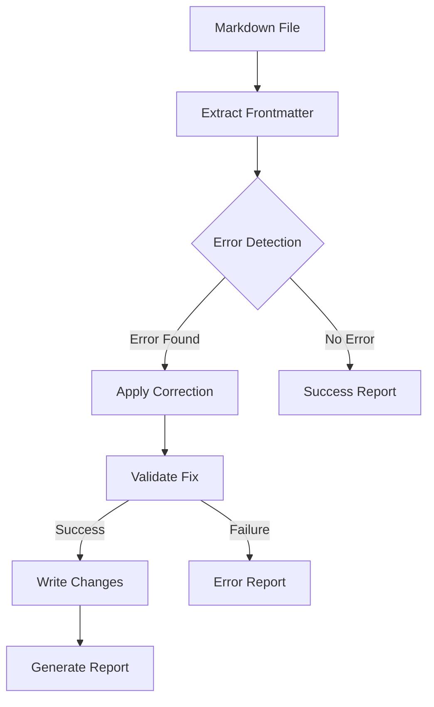

# Constraints
Do not be destructive, if there is content already there the user will decide on edits. 
Summaries and bullets are good, but meaningless fluff is not good. Don't be vague.  
When using Markdown syntax to introduce a break or section break, do not use "---". Given that is the YAML delimiter, it will cause issues. Instead, use "***".

# Flow and Props, Flow and Props
The most important aspect of iterating on a prompt is to explain the sequence of components, and how data is passed through the system. 

Even though we don't want to use detailed validation through TypeScript, so we don't want the full data model in the `content.config.ts`, it's helpful to detail what an IDEAL example of the data that is being passed around is.  

How does the data get loaded? From what file?  What is the user entry point? 
How is data transformed? Where is the output and what is the purpose?  

# Audience
The audience is your future self!  Imagine you are being asked to recreate the solution to the prompt all over again, and you don't want to tax the Anthropic API, cause Windsurf to crash, or become anxious with reckless attempts that don't work.  

You want to calmly work through the prompt and end up at more or less the same result.  

# Examples

## Example of helpful bullets:
```text
about.astro (entry)
  → Information.astro (content fetcher)
    → pages collection (content source)
      → Layout.astro (base layout)
        → Final HTML
```

## Example of helpful Mermaid diagrams:

#### Architecture Overview



## Example of code snippets with contextual comments:
## Configuration
```javascript
/**
 * User-configurable options for commit generation
 * @type {DirectoryConfig}
 */
const USER_OPTIONS = {
    // Target directory name within content
    TARGET_DIR: 'tooling',
    
    // Full path constructed from TARGET_DIR
    // DO NOT MODIFY - this is automatically generated
    TARGET_PATH: `site/src/content/${TARGET_DIR}`,
    
    // Date format for changelog entries
    DATE_FORMAT: 'YYYY-MM-DD',
    
    // Process subdirectories recursively
    ALL_FILES_RECURSIVELY: true
};

/**
 * Template for generating commit messages
 * @type {CommitMessage}
 */
const COMMIT_TEMPLATE = {
    type: 'content-updates, mundane:',
    title: '',
    body: {
        summary: [
         
        ],
        files: []
    }
};
```