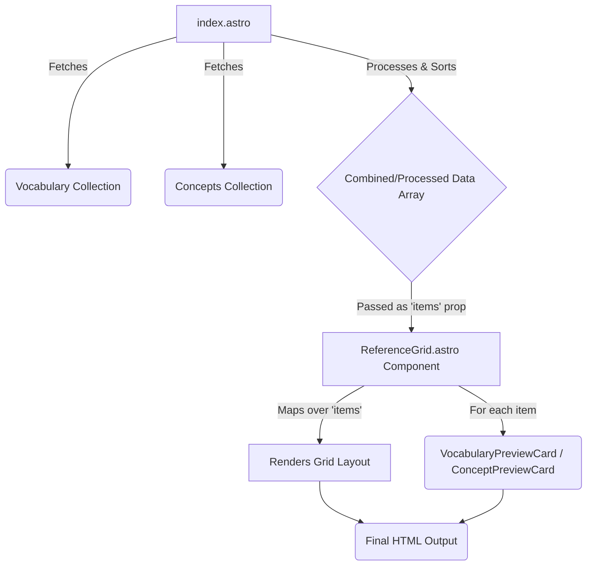

# Goal

Refactor the existing reference item listing logic and styling from `site/src/pages/more-about/index.astro` into a reusable Astro component located at `site/src/components/reference/ReferenceGrid.astro`. The new component must use the project's established CSS framework (`@/styles`) and CSS variables, completely replacing the current Tailwind CSS implementation for the grid.

# Starting Point Files

*   **Source Logic & Styling:** `site/src/pages/more-about/index.astro`
*   **Target Component:** `site/src/components/reference/ReferenceGrid.astro` (currently empty)

# Current Implementation (`index.astro`)

1.  **Data Fetching:** Uses `getCollection('vocabulary')` and `getCollection('concepts')` to fetch markdown entries.
2.  **Data Processing:** Iterates through entries to generate titles from filenames if missing, then sorts entries alphabetically by title.
3.  **Rendering:** Maps over the `vocabularyEntries` and `conceptsEntries` arrays separately.
4.  **Grid Structure:** Uses Tailwind CSS classes (`grid grid-cols-1 md:grid-cols-2 lg:grid-cols-3 gap-4`) for layout.
5.  **Item Rendering:** Renders each item using dedicated preview card components (`VocabularyPreviewCard.astro` and `ConceptPreviewCard.astro`).

```astro
// site/src/pages/more-about/index.astro (Relevant Snippet)
// ... data fetching and processing ...

<div class="grid grid-cols-1 md:grid-cols-2 lg:grid-cols-3 gap-4">
  {vocabularyEntries.map(entry => (
    <VocabularyPreviewCard entry={entry} />
  ))}
</div>

// ... separator ...

<div class="grid grid-cols-1 md:grid-cols-2 lg:grid-cols-3 gap-4">
  {conceptsEntries.map(entry => (
    <ConceptPreviewCard entry={entry} />
  ))}
</div>
```

# Target Component (`ReferenceGrid.astro`)

## 1. Props Interface

The component should accept a single prop, `items`, which is an array of objects. Each object should contain the necessary data to render a preview card.

```typescript
// Define within ReferenceGrid.astro script
interface ReferenceItem {
  // Data required by the preview cards
  // Example fields - adjust based on actual card needs
  slug: string;
  collection: 'vocabulary' | 'concepts'; // To determine URL path
  data: {
    title: string;
    // Add other fields used by preview cards (e.g., description, image?)
  };
}

interface Props {
  items: ReferenceItem[];
}

const { items } = Astro.props;
```

## 2. Rendering Logic

*   The component should map over the `items` prop.
*   Inside the loop, it should render the appropriate preview card (`VocabularyPreviewCard` or `ConceptPreviewCard`) based on the item's collection or some other distinguishing factor if needed. Alternatively, the grid could be made more generic and the parent page passes the specific card component as a prop if necessary, but using the existing cards directly is preferred if possible.
*   The grid layout itself should be implemented within this component.

## 3. Styling (CSS)

*   **No Tailwind:** Remove all Tailwind classes.
*   **Use Project Styles:** Implement the grid layout using standard CSS within a `<style>` tag in `ReferenceGrid.astro`.
*   **CSS Variables:** Leverage variables from `@/styles` for consistency (e.g., `var(--spacing-4)`, `var(--breakpoint-md)`).
*   **Grid Layout:** Aim for a responsive grid:
    *   1 column on small screens.
    *   2 columns on medium screens (`--breakpoint-md`).
    *   3 columns on large screens (`--breakpoint-lg`).
*   **Class Naming:** Use a consistent naming convention (e.g., BEM like `reference-grid`, `reference-grid__item`).

### Target HTML Structure (Example)

```html
<div class="reference-grid">
  <!-- Loop over items -->
  <div class="reference-grid__item">
    <!-- Render VocabularyPreviewCard or ConceptPreviewCard here -->
    <!-- Example: <VocabularyPreviewCard entry={item} /> -->
  </div>
  <!-- ... more items ... -->
</div>
```

### Example CSS Snippet

```css
/* site/src/components/reference/ReferenceGrid.astro */
.reference-grid {
  display: grid;
  grid-template-columns: 1fr; /* Default 1 column */
  gap: var(--spacing-4); /* Example variable */
}

@media (min-width: var(--breakpoint-md)) { /* Example variable */
  .reference-grid {
    grid-template-columns: repeat(2, 1fr);
  }
}

@media (min-width: var(--breakpoint-lg)) { /* Example variable */
  .reference-grid {
    grid-template-columns: repeat(3, 1fr);
  }
}

/* No styling needed for reference-grid__item unless specifically required */
```

# Data Flow



# Refactored Usage Example (`index.astro`)

```astro
// site/src/pages/more-about/index.astro (After Refactor)
---
import { getCollection } from 'astro:content';
import Layout from '@layouts/Layout.astro';
import ThinGradientBleedSeparator from '@components/basics/separators/ThinGradientBleedSeparator.astro';
import ReferenceGrid from '@components/reference/ReferenceGrid.astro'; // Import the new component

// ... data fetching and processing logic remains largely the same ...

// Combine or prepare data as needed for the ReferenceItem interface
// Example: prepare items for the grid component
const vocabularyItems = vocabularyEntries.map(entry => ({
  slug: entry.slug,
  collection: entry.collection,
  data: entry.data
}));

const conceptItems = conceptsEntries.map(entry => ({
  slug: entry.slug,
  collection: entry.collection,
  data: entry.data
}));
---
<Layout title="Reference - Vocabulary & Concepts">
  <div class="container mx-auto py-8 px-4">  <!-- Keep container styling -->
    <h1 class="text-3xl font-bold mb-6">Reference Library</h1> <!-- Keep heading styling -->
    <p class="text-lg mb-8">Browse our collection of vocabulary terms and conceptual frameworks.</p> <!-- Keep text styling -->

    <!-- Navigation tabs -->
    <!-- ... keep tabs ... -->

    <!-- Vocabulary Section -->
    <section class="mb-12">
      <h2 class="text-2xl font-bold mb-4">Vocabulary</h2> <!-- Keep section heading -->
      <p class="mb-6">Terms and definitions used throughout our work.</p> <!-- Keep section text -->
      <ReferenceGrid items={vocabularyItems} />  <!-- Use the new component -->
    </section>

    <ThinGradientBleedSeparator height="2px" marginTop="2rem" marginBottom="2rem" />

    <!-- Concepts Section -->
    <section>
      <h2 class="text-2xl font-bold mb-4">Concepts</h2> <!-- Keep section heading -->
      <p class="mb-6">Important ideas and frameworks we use in our work.</p> <!-- Keep section text -->
      <ReferenceGrid items={conceptItems} /> <!-- Use the new component -->
    </section>
  </div>
</Layout>
```

# Key Considerations

*   Ensure the `ReferenceGrid` component correctly uses the `VocabularyPreviewCard` and `ConceptPreviewCard` to render items. The logic within `ReferenceGrid.astro` might need to check the `item.collection` property to decide which card to use.
*   The existing preview card components (`VocabularyPreviewCard`, `ConceptPreviewCard`) might need minor adjustments if their props change or if they rely on Tailwind context that is no longer present.
*   Focus on refactoring the *grid layout* and the *looping mechanism* into the new component. The styling of the *individual cards* should ideally remain within their respective components, but ensure they render correctly without Tailwind grid context.