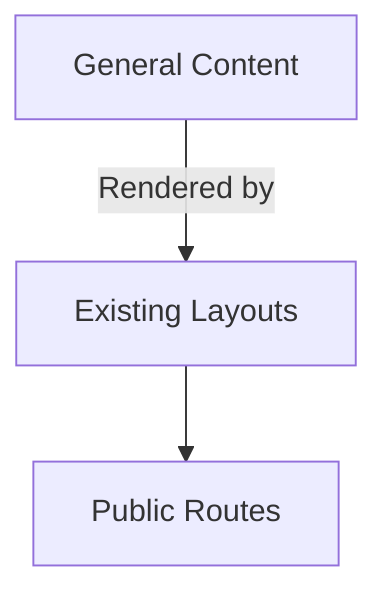

# Client-Specific Content Routing Implementation

## 📋 Objective
Implement a routing system that allows serving client-specific content while maintaining the existing general content structure. Client-specific content should be accessible under `/:client/*` routes and should be able to reference general content, but not vice versa.

Begin to implement a separation of concerns in regard to content config TypeScript. We have bundled all content configuration in a single content.config.ts file and we should use this opportunity to create the client-specific collections in their own config files.

## 🏗️ System Architecture

### Current Structure


### Target Structure
```mermaid
graph TD
    A[General Content] -->|Rendered by| B[Existing Layouts]
    B --> C[Public Routes]
    
    D[Client Content] -->|Extends| A
    D -->|Rendered by| E[Client Layouts]
    E --> F[/:client/* Routes]
```

## 🎯 Requirements

### 1. Content Organization
- Client-specific content lives in `content/client-content/{client-name}/`
- Example test case: `content/client-content/Laerdal/Recommendations`

### 2. Routing
Implement the following dynamic routes:
- `/:client` - Client landing page
- `/:client/:collection` - Collection view (using `CollectionReaderLayout`)
- `/:client/:collection/:slug` - Content item view (using `ContentItemReaderLayout`)

### 3. Technical Implementation
- Use Astro's file-based routing system
- Extend existing layout components for client-specific variations
- Maintain separation between general and client-specific content
- Ensure client routes don't conflict with existing routes

## 🔍 Reference Implementations

### Similar Patterns
- `site/src/pages/learn-with/*` - Example of content collection
- `site/src/pages/more-about/*` - Another content collection example

### Existing Render Pipeline for re-use:
- `site/src/layouts/CollectionReaderLayout.astro` - Base layout to extend
   - `site/src/components/articles/ContentNavSidebar.astro`
      - `site/src/components/articles/EntryListColumn.astro`
   - `site/src/components/articles/EntryListItemPreview--Base.astro` - Item layout to extend

## 🛠️ Development Tasks

1. **Setup Client Content Structure**
   - Create base directory: `content/client-content`
   - Add test client: `content/client-content/Laerdal/Recommendations`
   - Add sample markdown files for testing

2. **Implement Dynamic Routes**
   - Create `site/src/pages/[...client].astro` for client routes
   - Implement route parameter handling
   - Add 404 handling for invalid clients

4. **Testing**
   - Verify all routes work as expected
   - Test one client-specific content collection in isolation
   - Verify general content remains accessible

## 📚 Additional Context

### Monorepo Structure
- Main repo: [lossless-monorepo](https://github.com/lossless-group/lossless-monorepo)
- Site code: [lossless-site](https://github.com/lossless-group/lossless-site)
- Content: [lossless-content](https://github.com/lossless-group/lossless-content)

### Future Considerations
- Authentication for client-specific content
- Client-specific theming
- Content sharing between clients

## ✅ Success Criteria
- [ ] Client routes are accessible and functional
- [ ] General content remains completely unchanged
- [ ] Client-specific content is properly isolated in its own routes
- [ ] Links from client content to general content work correctly
- [ ] Few modifications needed to existing layouts or components, preference for changes only making "hard-coded" collections and routes to variable collections.
- [ ] Reused as much as possible from existing code
- [ ] Code follows project patterns and style
- [ ] Documentation is updated

## 📝 Notes
- Use MDX for client content to enable interactive components
- Consider using Astro content collections for better type safety
- Implement proper error boundaries and loading states

## 🔗 Related Resources
- [Astro Dynamic Routes](https://docs.astro.build/en/guides/routing/)
- [Content Collections](https://docs.astro.build/en/guides/content-collections/)
- [Layout Components](https://docs.astro.build/en/basics/layouts/)

