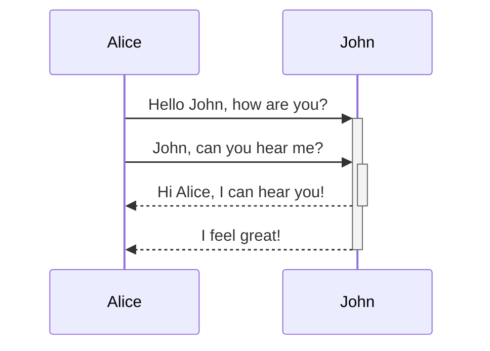
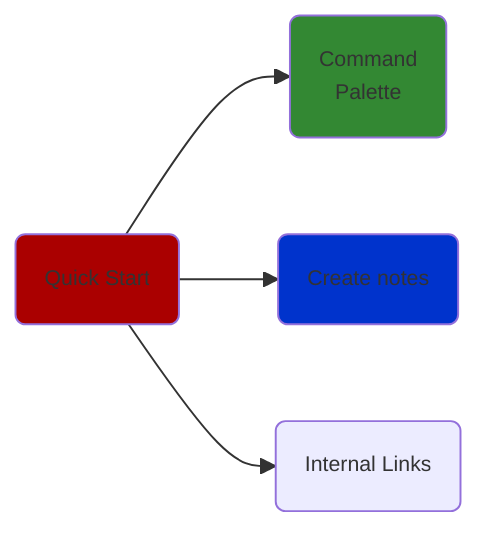
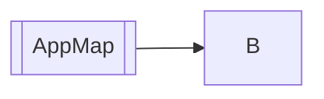
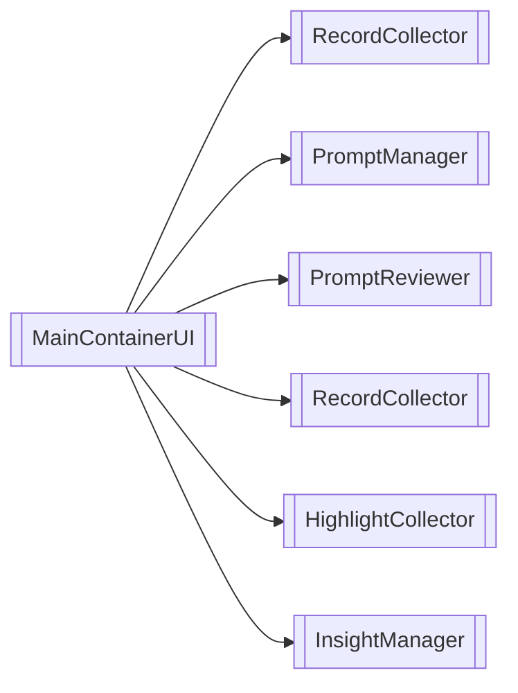
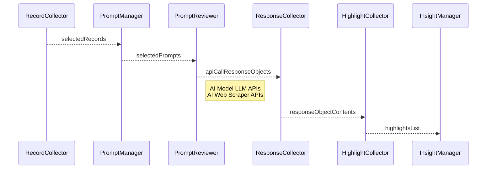

https://publish-01.obsidian.md/access/b7cd1a6b2888949f91e39ffa6ef09088/
https://github.com/sailKiteV/Obsidian-Snippets-and-Demos/blob/main/ChassisCallouts/chassis_callouts.css
[[Tooling/Productivity/Advanced Documents/Obsidian]]


``` HTML
<!DOCTYPE html>
<html lang="en">
<head>
    <meta charset="UTF-8">
    <meta name="viewport" content="width=device-width, initial-scale=1.0">
    <title>Image Grid Example</title>
    <link rel="stylesheet" href="./obsidian/snippets/image-grids.css">
</head>
<body>
    <div class="img-grid">
        <div class="image-embed is-loaded">
            
        </div>
        <div class="image-embed is-loaded">
            
        </div>
        <div class="image-embed is-loaded">
            
        </div>
    </div>

    <div class="markdown-preview-section">
        <div>
            <p class="img-grid">
                
                
            </p>
        </div>
    </div>

    <div class="img-grid-ratio">
        <div class="image-embed is-loaded">
            
        </div>
        <div class="image-embed is-loaded">
            
        </div>
    </div>
</body>
</html>
```

``` html
<iframe style="aspect-ratio:16/9;width:100%;height:auto" src="https://www.youtube.com/embed/0LZpt0pKWsQ?si=EAnc9fega4Lf4mEo&amp;controls=0" title="YouTube video player" frameborder="0" allow="accelerometer; autoplay; clipboard-write; encrypted-media; gyroscope; picture-in-picture; web-share" referrerpolicy="strict-origin-when-cross-origin" allowfullscreen></iframe>
```

2023, November 8. [Obsidian Link Preview (Obsidian Run + CustomJS + Nifty Link)](https://www.youtube.com/watch?v=IkjZyZ-Q7sM). Yomaru Hananoshika.

https://youtu.be/diZ4AFh-ZNI?si=9EswqdGtPPDWB9J7

<iframe style="aspect-ratio:16/9;width:100%;height:auto" src="https://www.youtube.com/embed/zAOcN0ZENLU?si=vg17HAApz5fC&amp;controls=0" title="YouTube video player" frameborder="0" allow="accelerometer; autoplay; clipboard-write; encrypted-media; gyroscope; picture-in-picture; web-share" referrerpolicy="strict-origin-when-cross-origin" allowfullscreen></iframe>

> [!column]
>> [!info] Column 1
>> - Use another callout for columns
>
>> [!note] Column 2
>> Need that singular blockquote `>` as separation between columns


> [!column|flex 3]
>> [!info|no] 
>> Column 1
>
>> [!important]+ Current Topics
>> Column 2
>
>> [!important]+ Current Topics
>>Column 2


> [!timeline|t-l] **Title** _Subtitle_
> Left aligned timeline piece

> [!timeline|t-r t-4] **Title** *Subtitle*
> Right aligned timeline piece

> [!timeline|t-r t-10] **Title** *Subtitle*
> Spaced timeline piece

### Notes from being frustrated with Obsidian
None of these render. 
``` markdown


```


https://publish-01.obsidian.md/access/b7cd1a6b2888949f91e39ffa6ef09088/


https://www.dropbox.com/scl/fi/6p7j5tkd1pa1pajk4qlvs/Screenshot-2025-02-24-at-10.37.22-PM_Discord.png?rlkey=i8rh67n08fmrgit31vj19ngn1&st=3ki6gmyy&dl=0

https://publish-01.obsidian.md/access/b7cd1a6b2888949f91e39ffa6ef09088/Visuals/20250211_alphabet_google_what_companies_it_owns_chart.png


/Users/mpstaton/content-md/lossless/Visuals/20250211_alphabet_google_what_companies_it_owns_chart

Visuals/20250211_alphabet_google_what_companies_it_owns_chart


obsidian://open?vault=lossless&file=Visuals%2F20250220_Affinity--Release-Notes%201.jpeg




``` mermaid
%%{init: { "securityLevel": "loose", "flowchart": { "htmlLabels": true } } }%%
flowchart LR;
    A(  )--> B & C & D;
    B--> A & E;
    C--> A & E;
    D--> A & E;
    E--> B & C & D;
    F[" "]--> A

	F@{ img: "https://publish-01.obsidian.md/access/b7cd1a6b2888949f91e39ffa6ef09088/Visuals/jon-laerdal-just-headshot.png", h: 44, w: 60, pos: "t"}
```









