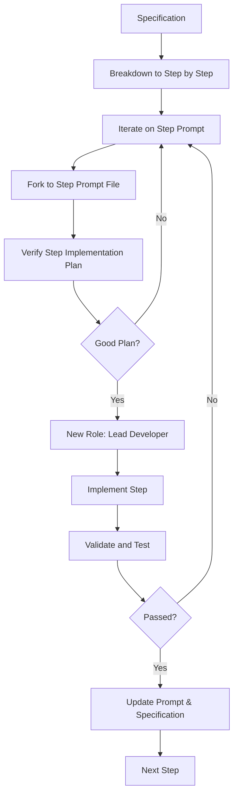

This Mermaid diagram represents a workflow that starts with a specification. It then breaks down into steps, each of which is prompted and planned for verification. Depending on whether a role change is necessary, the process may either execute the step directly or gather more information. After execution, the step is validated and tested. If successful, the specification is updated based on this implementation. If not, the process goes back to identify issues and rectify them.

Detailed specifications can significantly aid in the process of using Language Learning Models (LLMs) for coding tasks for several reasons:

1. **Clarity of Intent**: Detailed specs clearly outline what needs to be achieved, reducing ambiguity. LLMs, despite their advanced capabilities, still lack human-like understanding and contextual intuition. Clear specifications help guide them towards the correct implementation.

2. **Handling Complexity**: Modern software often involves complex logic, data structures, APIs, and interactions with external systems. Detailed specifications break down these complexities into manageable tasks or functions that LLMs can more easily interpret and execute.

3. **Validation and Verification**: Specifications serve as a blueprint for validation. They allow developers to verify if the generated code meets the intended requirements. This is crucial when working with LLMs, as they may not always produce optimal or error-free code.

4. **Consistency**: Detailed specifications ensure consistency across different parts of the project and over time, which can be particularly valuable when multiple people (or models) are contributing to a codebase.

5. **Learning and Training**: The more detailed the specs, the better LLMs can learn from them. By providing extensive examples and clear guidelines, developers can train the model to produce higher-quality code over time.

6. **Error Detection**: Detailed specifications also facilitate easier error detection. If something goes wrong or the output doesn't meet expectations, having thorough specs helps in identifying where things went awry.

7. **Documentation**: Specifications act as a form of documentation. They describe what each part of the system should do, which can be invaluable for maintaining and evolving the codebase.

In essence, while LLMs are powerful tools that can generate code based on textual prompts, they still benefit greatly from human-level clarity, organization, and precision—all of which detailed specifications provide. They help bridge the gap between human intention and machine execution, leading to more accurate, reliable, and maintainable outcomes.

