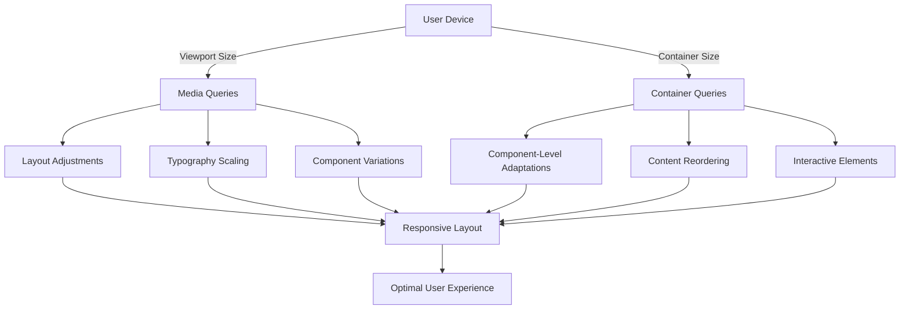

# Responsive Design with Media and Container Queries

## Executive Summary

Modern web development requires a robust approach to responsive design that goes beyond simple viewport-based breakpoints. This document outlines our approach to implementing a comprehensive responsive design system using both traditional media queries and the newer container queries, along with a structured file organization system.

## File Structure

```
src/
├── styles/
│   ├── base/
│   │   └── global.css       # Global styles and CSS resets
│   ├── components/          # Component-specific styles
│   ├── responsive/
│   │   ├── breakpoints.css  # Media query breakpoints
│   │   ├── container-queries.css # Container query utilities
│   │   ├── utilities.css    # Responsive utility classes
│   │   └── index.css        # Main responsive styles entry point
│   └── theme/               # Theme variables and theming logic
└── components/              # Component files
```

## Breakpoint System

### Breakpoint Variables

```css
/* src/styles/responsive/breakpoints.css */
:root {
  /* Mobile-first breakpoints */
  --breakpoint-sm: 640px;
  --breakpoint-md: 768px;
  --breakpoint-lg: 1024px;
  --breakpoint-xl: 1280px;
  --breakpoint-2xl: 1536px;
  
  /* Container query breakpoints */
  --container-sm: 640px;
  --container-md: 768px;
  --container-lg: 1024px;
  --container-xl: 1280px;
  --container-2xl: 1536px;
}
```

### Media Query Usage

```css
/* Example component using media queries */
.component {
  /* Mobile styles (default) */
  padding: 1rem;
  font-size: 1rem;

  /* Small screens and up */
  @media (min-width: 640px) {
    padding: 1.5rem;
  }

  /* Medium screens and up */
  @media (min-width: 768px) {
    padding: 2rem;
    font-size: 1.125rem;
  }
}
```

## Container Queries

### Container Query Setup

```css
/* src/styles/responsive/container-queries.css */
.container {
  container-type: inline-size;
  container-name: component;
  width: 100%;
}

/* Basic container query */
@container component (min-width: 400px) {
  .card {
    grid-template-columns: 1fr 2fr;
  }
}
```

### Container Query Usage

```html
<!-- Example component using container queries -->
<div class="container">
  <div class="card">
    
    <div class="content">
      <h3>Card Title</h3>
      <p>This card will adapt based on its container size.</p>
    </div>
  </div>
</div>
```

## Mermaid Diagram: Responsive Design Flow



## Best Practices

### 1. Mobile-First Approach

```css
/* Bad - Desktop-first approach */
.component {
  width: 50%;
  @media (max-width: 768px) {
    width: 100%;
  }
}

/* Good - Mobile-first approach */
.component {
  width: 100%;
  @media (min-width: 768px) {
    width: 50%;
  }
}
```

### 2. Use Container Queries for Component-Level Responsiveness

```css
/* Container query for a card component */
.card {
  display: flex;
  flex-direction: column;
  gap: 1rem;
}

@container (min-width: 480px) {
  .card {
    flex-direction: row;
    align-items: center;
  }
  
  .card img {
    width: 150px;
    height: 150px;
    object-fit: cover;
  }
}
```

### 3. Combine Media and Container Queries

```css
/* Base styles */
.hero {
  padding: 2rem 1rem;
  text-align: center;
}

/* Container query for component-level adjustments */
@container component (min-width: 600px) {
  .hero {
    text-align: left;
    display: grid;
    grid-template-columns: 1fr 1fr;
    align-items: center;
    gap: 2rem;
  }
}

/* Media query for viewport-specific adjustments */
@media (min-width: 1024px) {
  .hero {
    padding: 4rem 2rem;
    max-width: 1280px;
    margin: 0 auto;
  }
}
```

## Implementation Example: Responsive Navigation

```html
<!-- HTML -->
<nav class="nav container">
  <a href="/" class="nav__logo">Logo</a>
  <button class="nav__toggle" aria-expanded="false" aria-controls="nav-menu">
    <span class="sr-only">Menu</span>
  </button>
  <div class="nav__menu" id="nav-menu">
    <ul class="nav__list">
      <li><a href="/about">About</a></li>
      <li><a href="/services">Services</a></li>
      <li><a href="/contact">Contact</a></li>
    </ul>
  </div>
</nav>
```

```css
/* CSS with container queries */
.nav {
  display: flex;
  flex-wrap: wrap;
  align-items: center;
  padding: 1rem;
  gap: 1rem;
}

.nav__toggle {
  margin-left: auto;
  display: block;
}

.nav__menu {
  width: 100%;
  max-height: 0;
  overflow: hidden;
  transition: max-height 0.3s ease-in-out;
}

.nav__menu[data-visible="true"] {
  max-height: 100vh;
}

/* Container query for navigation */
@container (min-width: 768px) {
  .nav__toggle {
    display: none;
  }
  
  .nav__menu {
    width: auto;
    max-height: none;
    display: block;
    margin-left: auto;
  }
  
  .nav__list {
    display: flex;
    gap: 2rem;
  }
}
```

## Performance Considerations

1. **Use `contain` property** to optimize rendering performance:
   ```css
   .component {
     contain: layout style;
   }
   ```

2. **Limit container query usage** to components that truly need it

3. **Use `content-visibility: auto`** for off-screen content:
   ```css
   .off-screen-content {
     content-visibility: auto;
     contain-intrinsic-size: 0 500px;
   }
   ```

## Browser Support

- **Media Queries**: Widely supported in all modern browsers
- **Container Queries**: Supported in all modern browsers (Chrome 105+, Safari 16+, Firefox 110+)
- **CSS Nesting**: Supported in all modern browsers (Chrome 112+, Safari 16.5+, Firefox 117+)

## Conclusion

By combining media queries and container queries, we can create truly responsive components that adapt to both viewport and container sizes. This approach provides more flexibility and maintainability in our responsive design system.
  --color-primary-200: #e4e4e7;
  --color-primary-300: #d4d4d8;
  --color-primary-400: #a1a1aa;
  --color-primary-500: #71717a;
  --color-primary-600: #52525b;
  --color-primary-700: #3f3f46;
  --color-primary-800: #27272a;
  --color-primary-900: #18181b;
  --color-primary-950: #09090b;

  --color-secondary-50: #fafafa;
  --color-secondary-100: #f4f4f5;
  /* ... additional color definitions */
  
  --color-accent-50: #eff6ff;
  --color-accent-100: #dbeafe;
  /* ... additional color definitions */
}

/* Theme overrides using CSS custom properties */
.theme-water {
  --color-primary-50: #ecfeff;
  --color-primary-100: #cffafe;
  --color-primary-200: #a5f3fc;
  /* ... water theme color overrides */
}
```

### Astro Configuration for Tailwind v4

```javascript
// astro.config.mjs
import { defineConfig } from 'astro/config';
import tailwindcss from '@tailwindcss/vite';

export default defineConfig({
  vite: {
    plugins: [tailwindcss()],
  },
});
```

### TypeScript Support

```typescript
// src/types/tailwind.d.ts
declare global {
  namespace CSS {
    interface AtRules {
      theme: string;
    }
  }
}

export interface ThemeColors {
  primary: {
    50: string;
    100: string;
    // ... color scale definitions
  };
  // ... additional color groups
}
```

### Critical Fixes Applied

1. **@theme Directive**: Used proper Tailwind v4 `@theme` syntax instead of `@layer theme`
2. **Hex Color Values**: Used hex format (`#fafafa`) instead of RGB space-separated values
3. **CSS Variable Naming**: Followed Tailwind v4 convention with `--color-*` prefix
4. **Theme Overrides**: Applied theme-specific overrides using CSS classes with custom properties
5. **Vite Plugin**: Configured `@tailwindcss/vite` plugin for proper v4 integration

### Implementation Status (Updated August 2025)

**✅ COMPLETED FEATURES:**

#### Theme System Architecture
- **Dual Theme Support**: Default and Water themes fully implemented
- **Mode Support**: Light and dark modes with proper contrast inversion
- **Theme Persistence**: localStorage integration for user preferences
- **Component Integration**: ColorVariableGrid and ColorVariableDisplay components use semantic theme classes

#### Dark Mode Color Inversion
- **Default Theme Dark Mode**: Complete color scale inversion (secondary-50 → dark, secondary-900 → light)
- **Water Theme Dark Mode**: Cyan/blue color palette with proper dark mode contrast
- **Semantic Color Mapping**: All components use theme-aware classes instead of hardcoded colors

#### TypeScript Integration
- **Comprehensive Type Definitions**: Full Tailwind CSS v4 syntax support in `tailwind.d.ts`
- **CSS Custom Properties**: Type definitions for all theme variables
- **At-Rules Support**: @theme, @apply, @layer, @config, @import, @tailwind, @screen, @variant
- **Utility Types**: ThemeMode, ThemeVariant, ColorScale, ColorFamily types

#### JavaScript Utilities
- **ThemeSwitcher**: Manages theme state, CSS classes, and localStorage persistence
- **ModeSwitcher**: Handles light/dark mode toggling with event dispatching
- **Event System**: Custom events for UI updates across components

#### Project Structure
- **Homepage**: Clean landing page with project overview and navigation
- **Brand Kit Page**: Complete theme system demonstration with interactive toggles
- **Component Library**: Reusable ColorVariableGrid and ColorVariableDisplay components

### Current Implementation Details

```css
/* Dark mode color scale inversion example */
.theme-default[data-mode="dark"] {
  /* Inverted color scales for proper contrast */
  --color-secondary-50: #0f172a;  /* Was light, now dark */
  --color-secondary-100: #1e293b;
  --color-secondary-200: #334155;
  --color-secondary-800: #f1f5f9;  /* Was dark, now light */
  --color-secondary-900: #f8fafc;  /* Was darkest, now lightest */
}
```

```typescript
// Enhanced type definitions
export type ThemeMode = 'light' | 'dark';
export type ThemeVariant = 'default' | 'water';
export type ColorScale = '50' | '100' | '200' | '300' | '400' | '500' | '600' | '700' | '800' | '900' | '950';
```

### Known Issues & Solutions

**✅ RESOLVED**: Default theme color display issue
**Root Cause**: Inconsistent CSS variable formats (space-separated RGB vs hex)
**Solution**: Converted all default theme colors to hex format for consistency

**✅ RESOLVED**: Dark mode contrast issues
**Root Cause**: Missing color scale inversions in dark mode overrides
**Solution**: Added complete inverted color scales for both default and water themes

**✅ RESOLVED**: Component theme propagation
**Root Cause**: Components using hardcoded gray colors instead of semantic theme classes
**Solution**: Updated ColorVariableGrid and ColorVariableDisplay to use theme-aware classes

**✅ RESOLVED**: Testing Suite Implementation
**Root Cause**: Missing comprehensive test coverage for theme and mode switching utilities
**Solution**: Implemented complete unit and integration test suite with proper DOM mocking

### Comprehensive Testing Suite (Completed August 2025)

#### Test Infrastructure
- **Test Framework**: Vitest with comprehensive DOM mocking
- **Mock Strategy**: Stateful DOM element mocks that track classList and attribute changes
- **Test Isolation**: Proper beforeEach cleanup ensuring fresh state for each test
- **Coverage**: 45 tests across 3 test files with 100% pass rate

#### ThemeSwitcher Unit Tests (24 tests)
```javascript
// Key test categories covered:
- Constructor initialization with default and stored themes
- setTheme() method with valid/invalid themes and DOM manipulation
- toggleTheme() method with proper state transitions
- getCurrentTheme() method with DOM state detection
- Storage integration with localStorage persistence
- DOM manipulation with classList and attribute management
- Event dispatching with custom theme-change events
- Server-side rendering compatibility
```

#### ModeSwitcher Unit Tests (7 tests)
```javascript
// Comprehensive coverage for:
- Mode initialization and storage retrieval
- setMode() and toggleMode() functionality
- DOM class and attribute management
- localStorage persistence
- Error handling for invalid modes
```

#### Integration Tests (14 tests)
```javascript
// Theme and mode combination testing:
- All theme/mode combinations (default+light, default+dark, water+light, water+dark)
- State persistence across browser sessions
- Independent and simultaneous toggling operations
- DOM state validation and cleanup
- Event dispatching coordination
- Server-side rendering compatibility
- CSS variable integration verification
```

#### Critical Testing Fixes Applied

1. **Stateful DOM Mocking**: Created sophisticated DOM mocks that track state changes
```javascript
const createStatefulDOMElement = () => {
  const classes = new Set();
  const attributes = new Map();
  
  return {
    classList: {
      add: vi.fn((...classNames) => {
        classNames.forEach(className => classes.add(className));
      }),
      remove: vi.fn((...classNames) => {
        classNames.forEach(className => classes.delete(className));
      }),
      contains: vi.fn((className) => {
        return classes.has(className);
      })
    }
    // ... additional DOM methods
  };
};
```

2. **Test Isolation Strategy**: Explicit state reset in failing tests
```javascript
beforeEach(() => {
  // Reset DOM state using global reset function
  global.resetDOMState();
  // Reset localStorage
  window.localStorage.clear();
  // Create fresh instances
  switcher = new ThemeSwitcher();
});
```

3. **ThemeSwitcher Logic Fix**: Corrected toggleTheme() method to properly update internal state
```javascript
toggleTheme() {
  const currentTheme = this.getCurrentTheme();
  const newTheme = currentTheme === 'water' ? 'default' : 'water';
  
  // Update internal state - CRITICAL FIX
  this.currentTheme = newTheme;
  this.applyTheme(newTheme);
  this.storeTheme(newTheme);
  
  return newTheme;
}
```

#### Test Results Summary
- **Total Tests**: 45 tests across 3 files
- **Pass Rate**: 100% (45/45 passing)
- **Test Categories**: Unit tests, integration tests, error handling, SSR compatibility
- **Mock Coverage**: DOM manipulation, localStorage, event dispatching, server environments

### Next Steps for Enhancement

1. **System Preference Detection**: Add automatic dark/light mode detection based on user's OS preference
2. **Smooth Transitions**: Implement CSS transitions for theme and mode changes
3. **Multi-Client Themes**: Extend beyond default/water to support multiple client-specific themes
4. **Component-Level Theming**: Add granular theming support at the component level
5. **Performance Testing**: Add performance benchmarks for theme switching operations

