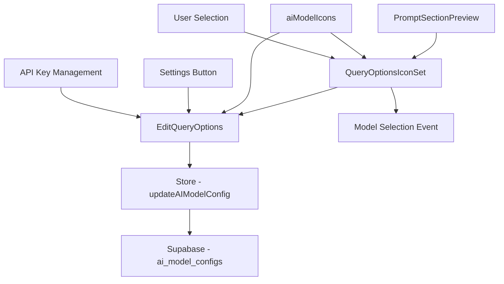
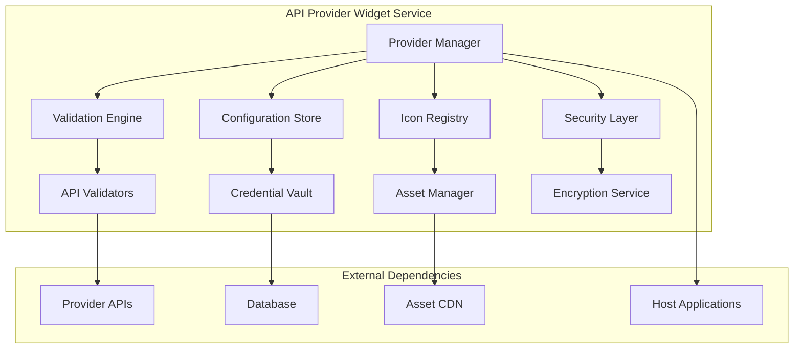
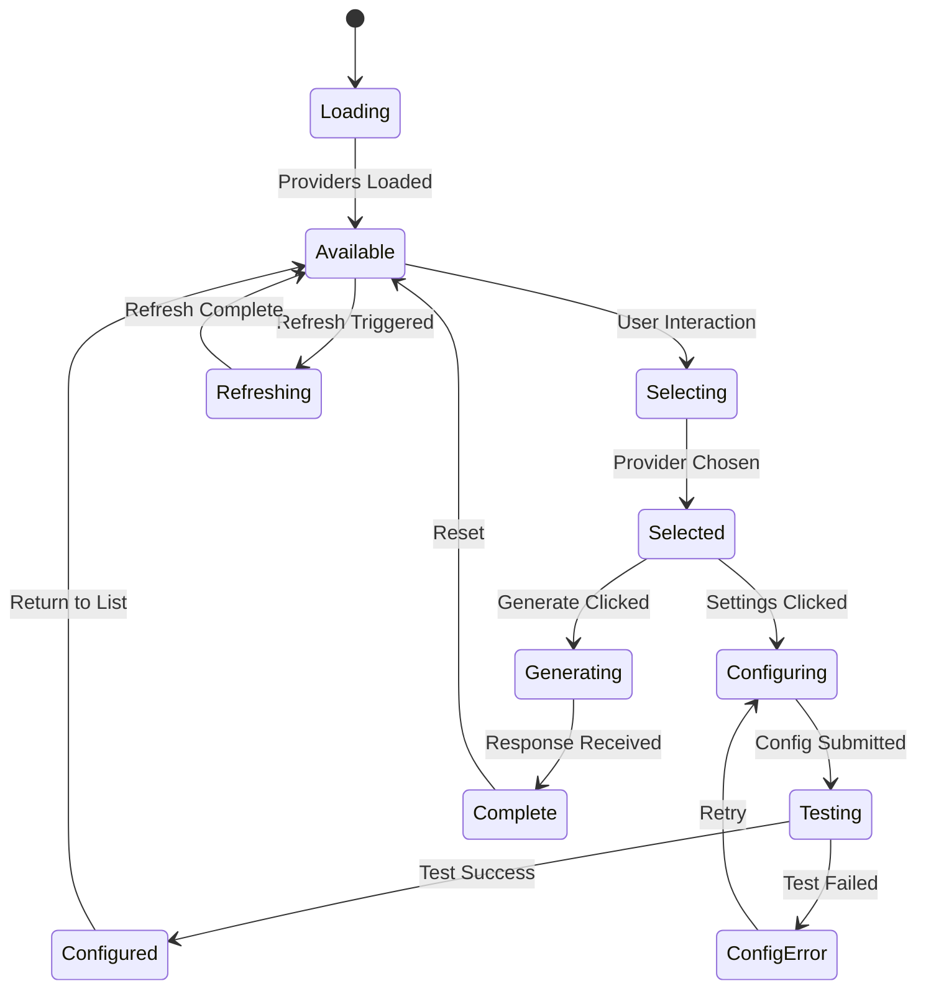

# API Provider Widget Analysis and Specification

## Current Architecture Analysis

### Component Hierarchy and Data Flow



### Purpose and Business Logic

The API Provider Widget system serves as a centralized AI model management interface:

1. **Multi-Provider Support**: Originally designed for Perplexity's "deep research" capabilities, now supports multiple AI providers
2. **Configuration Management**: Centralized API key storage and management for third-party services
3. **Visual Model Selection**: Icon-based interface for quick model selection
4. **Reusable Widget**: Designed to be embedded across different UI contexts
5. **Data Augmentation Workflow**: Core component in the prompt-to-response pipeline

### Core Components Analysis

#### 1. QueryOptionsIconSet Component (`src/components/QueryOptionsIconSet.tsx:10-86`)

**Functionality:**
- Primary widget interface for model selection
- Displays available AI models as clickable icons
- Provides settings button for configuration access
- Handles fallback icons when images fail to load
- Includes placeholder for adding custom models

**Key Functions:**
```typescript
// Fallback icon system based on model type
const getFallbackIcon = (modelId: string) => {
  switch (modelId) {
    case 'perplexity':
      return <Brain className="w-5 h-5" />;
    case 'claude':
      return <Sparkles className="w-5 h-5" />;
    case 'gpt4':
      return <MessageSquare className="w-5 h-5" />;
    default:
      return <Bot className="w-5 h-5" />;
  }
};

// Model selection handler
const onSelectModel = (modelId: string) => {
  // Propagates selection to parent component
};

// Settings modal trigger
const setIsEditOpen = (true) => {
  // Opens configuration modal
};
```

**Visual Design:**
- Compact horizontal layout with border styling
- Settings button positioned absolutely (-top-2, -left-2)
- Hover effects and transition animations
- Icon opacity changes on interaction
- Plus button for future custom model addition

#### 2. EditQueryOptions Component (`src/components/EditQueryOptions.tsx:11-139`)

**Functionality:**
- Modal interface for API key configuration
- Per-model API key management
- Edit/save state management
- Success feedback system
- Secure password input fields

**Key Functions:**
```typescript
// Initialize form with existing configurations
React.useEffect(() => {
  const initialConfigs = Object.fromEntries(
    Object.values(aiModelIcons).map(model => [
      model.id,
      aiModelConfigs.find(c => c.modelId === model.id)?.apiKey || ''
    ])
  );
  setConfigs(initialConfigs);
  
  // Auto-enable editing for models without API keys
  const initialEditStates = Object.fromEntries(
    Object.values(aiModelIcons).map(model => [
      model.id,
      !aiModelConfigs.find(c => c.modelId === model.id)?.apiKey
    ])
  );
  setEditStates(initialEditStates);
}, [aiModelConfigs]);

// API key save handler
const handleSave = async (modelId: string, apiKey: string) => {
  try {
    await updateAIModelConfig({ modelId, apiKey });
    setConfigs(prev => ({ ...prev, [modelId]: apiKey }));
    setEditStates(prev => ({ ...prev, [modelId]: false }));
    setSuccessStates(prev => ({ ...prev, [modelId]: true }));
  } catch (error) {
    console.error('Error saving API key:', error);
    alert('Failed to save API key. Please try again.');
  }
};

// Edit state management
const handleEdit = (modelId: string) => {
  setEditStates(prev => ({ ...prev, [modelId]: true }));
  setSuccessStates(prev => ({ ...prev, [modelId]: false }));
};
```

**State Management:**
- `configs`: Current API key values
- `editStates`: Per-model editing mode flags
- `successStates`: Success feedback indicators

#### 3. PromptSectionPreview Integration (`src/components/PromptSectionPreview.tsx:158`)

**Functionality:**
- Embeds QueryOptionsIconSet as action toolbar component
- Handles model selection for AI response generation
- Integrates with prompt interpolation system

**Key Integration:**
```typescript
// Model selection handler
const handleModelSelect = (modelId: string) => {
  setSelectedModelId(modelId);
};

// AI response generation with selected model
const handleGenerate = async () => {
  if (!selectedModelId) {
    alert('Please select an AI model first');
    return;
  }

  const interpolatedContent = interpolateContent(
    selectedTemplate?.mdxContent || section.content
  );

  await generateAIResponse(section.id, selectedModelId, interpolatedContent, section.title);
};

// Widget embedding in toolbar
<QueryOptionsIconSet onSelectModel={handleModelSelect} />
```

### Data Model Analysis

#### AIModelIcon Interface (`src/assets/icons/ai-models/index.ts:1-19`)
```typescript
interface AIModelIcon {
  id: string;          // Unique model identifier
  name: string;        // Display name
  url: string;         // Icon/favicon URL
}

// Current supported models
const aiModelIcons: Record<string, AIModelIcon> = {
  perplexity: {
    id: 'perplexity',
    name: 'Perplexity AI',
    url: 'https://www.perplexity.ai/favicon.ico'
  },
  claude: {
    id: 'claude',
    name: 'Claude',
    url: 'https://claude.ai/favicon.ico'
  },
  gpt4: {
    id: 'gpt4',
    name: 'GPT-4',
    url: 'https://upload.wikimedia.org/wikipedia/commons/0/04/ChatGPT_logo.svg'
  }
};
```

#### AIModelConfig Interface (Store)
```typescript
interface AIModelConfig {
  modelId: string;     // Matches AIModelIcon.id
  apiKey: string;      // Encrypted API key
}

// Store operations
updateAIModelConfig: async (config: AIModelConfig) => {
  // Upsert operation - update if exists, insert if new
  const { data: existingConfig } = await supabase
    .from('ai_model_configs')
    .select('*')
    .eq('user_id', user.id)
    .eq('model_id', config.modelId)
    .maybeSingle();

  if (existingConfig) {
    // Update existing
    await supabase
      .from('ai_model_configs')
      .update({
        api_key: config.apiKey,
        updated_at: new Date().toISOString()
      })
      .eq('user_id', user.id)
      .eq('model_id', config.modelId);
  } else {
    // Insert new
    await supabase
      .from('ai_model_configs')
      .insert({
        user_id: user.id,
        model_id: config.modelId,
        api_key: config.apiKey
      });
  }
};
```

## API Provider Widget Microservice Specification

### Service Architecture



### Core Functionality Requirements

#### 1. Provider Registration System
```typescript
interface ProviderManager {
  // Provider lifecycle management
  registerProvider(provider: ProviderDefinition): Promise<string>;
  updateProvider(id: string, updates: Partial<ProviderDefinition>): Promise<void>;
  deactivateProvider(id: string): Promise<void>;
  getActiveProviders(): Promise<ProviderDefinition[]>;
  
  // Provider validation
  validateProvider(provider: ProviderDefinition): Promise<ValidationResult>;
  testProviderConnection(providerId: string, apiKey: string): Promise<ConnectionTest>;
  
  // Provider capabilities
  getProviderCapabilities(providerId: string): Promise<ProviderCapabilities>;
  getProvidersWithCapability(capability: string): Promise<ProviderDefinition[]>;
}

interface ProviderDefinition {
  id: string;
  name: string;
  displayName: string;
  description: string;
  iconUrl: string;
  fallbackIcon: IconType;
  apiEndpoint: string;
  authType: AuthenticationType;
  capabilities: ProviderCapabilities;
  rateLimits: RateLimitConfig;
  pricingModel: PricingModel;
  status: ProviderStatus;
  metadata: ProviderMetadata;
}

interface ProviderCapabilities {
  chatCompletion: boolean;
  streaming: boolean;
  functionCalling: boolean;
  imageGeneration: boolean;
  imageAnalysis: boolean;
  webSearch: boolean;         // "Deep research" capability
  documentAnalysis: boolean;
  codeGeneration: boolean;
  realTimeData: boolean;
  customInstructions: boolean;
}

enum AuthenticationType {
  API_KEY = 'api_key',
  OAUTH = 'oauth',
  BEARER_TOKEN = 'bearer_token',
  CUSTOM = 'custom'
}

enum ProviderStatus {
  ACTIVE = 'active',
  DEPRECATED = 'deprecated',
  BETA = 'beta',
  MAINTENANCE = 'maintenance'
}
```

#### 2. Configuration Management System
```typescript
interface ConfigurationManager {
  // User configuration
  getUserConfig(userId: string, providerId: string): Promise<UserProviderConfig>;
  setUserConfig(userId: string, config: UserProviderConfig): Promise<void>;
  deleteUserConfig(userId: string, providerId: string): Promise<void>;
  
  // Bulk operations
  getUserConfigs(userId: string): Promise<UserProviderConfig[]>;
  importConfigs(userId: string, configs: UserProviderConfig[]): Promise<ImportResult>;
  exportConfigs(userId: string): Promise<ConfigExport>;
  
  // Configuration validation
  validateApiKey(providerId: string, apiKey: string): Promise<ValidationResult>;
  testConfiguration(config: UserProviderConfig): Promise<ConfigTest>;
  
  // Security operations
  rotateApiKey(userId: string, providerId: string): Promise<RotationResult>;
  auditConfigAccess(userId: string): Promise<AccessAudit[]>;
}

interface UserProviderConfig {
  userId: string;
  providerId: string;
  apiKey: string;              // Encrypted
  customEndpoint?: string;
  rateLimitOverride?: number;
  preferences: ProviderPreferences;
  isActive: boolean;
  createdAt: string;
  updatedAt: string;
  lastUsed?: string;
}

interface ProviderPreferences {
  defaultModel?: string;
  temperature?: number;
  maxTokens?: number;
  timeout?: number;
  retryAttempts?: number;
  customHeaders?: Record<string, string>;
}
```

#### 3. Widget Rendering System
```typescript
interface WidgetRenderer {
  // Widget generation
  generateWidget(context: WidgetContext): Promise<WidgetDefinition>;
  renderIconSet(providers: ProviderDefinition[], config: RenderConfig): Promise<IconSetHTML>;
  renderConfigModal(providers: ProviderDefinition[], userConfigs: UserProviderConfig[]): Promise<ModalHTML>;
  
  // Customization
  applyTheme(theme: WidgetTheme): Promise<void>;
  setLayout(layout: WidgetLayout): Promise<void>;
  addCustomActions(actions: CustomAction[]): Promise<void>;
  
  // Event handling
  onProviderSelect(callback: ProviderSelectCallback): void;
  onConfigChange(callback: ConfigChangeCallback): void;
  onError(callback: ErrorCallback): void;
}

interface WidgetContext {
  containerId: string;
  hostApplication: string;
  userId: string;
  permissions: WidgetPermissions;
  constraints: WidgetConstraints;
  initialSelection?: string;
}

interface WidgetTheme {
  primaryColor: string;
  secondaryColor: string;
  borderRadius: number;
  spacing: SpacingConfig;
  typography: TypographyConfig;
  animations: AnimationConfig;
}

enum WidgetLayout {
  HORIZONTAL = 'horizontal',
  VERTICAL = 'vertical',
  GRID = 'grid',
  DROPDOWN = 'dropdown',
  COMPACT = 'compact'
}
```

#### 4. Security and Encryption Layer
```typescript
interface SecurityManager {
  // Credential encryption
  encryptApiKey(apiKey: string, userId: string): Promise<string>;
  decryptApiKey(encryptedKey: string, userId: string): Promise<string>;
  rotateEncryptionKey(userId: string): Promise<void>;
  
  // Access control
  validateAccess(userId: string, providerId: string, action: string): Promise<boolean>;
  auditAccess(userId: string, providerId: string, action: string): Promise<void>;
  
  // Secure transmission
  createSecureSession(userId: string): Promise<SecureSession>;
  validateSecureSession(sessionId: string): Promise<boolean>;
  
  // Compliance
  ensureCompliance(region: string): Promise<ComplianceStatus>;
  exportUserData(userId: string): Promise<UserDataExport>;
  deleteUserData(userId: string): Promise<DeletionResult>;
}

interface SecureSession {
  sessionId: string;
  userId: string;
  expiresAt: string;
  permissions: string[];
  encryptionKey: string;
}
```

### Integration Patterns

#### 1. Host Application Integration
```typescript
// React Hook Pattern
interface useAPIProviderWidget {
  (config: WidgetConfig): {
    selectedProvider: ProviderDefinition | null;
    isConfiguring: boolean;
    availableProviders: ProviderDefinition[];
    selectProvider: (providerId: string) => void;
    openConfiguration: () => void;
    testConnection: (providerId: string) => Promise<boolean>;
  }
}

// Web Component Pattern
class APIProviderWidget extends HTMLElement {
  static observedAttributes = ['providers', 'selected', 'theme'];
  
  connectedCallback() {
    this.render();
    this.attachEventListeners();
  }
  
  attributeChangedCallback(name: string, oldValue: string, newValue: string) {
    this.handleAttributeChange(name, oldValue, newValue);
  }
  
  selectProvider(providerId: string) {
    this.dispatchEvent(new CustomEvent('provider-selected', {
      detail: { providerId }
    }));
  }
}

// Framework-Agnostic API
interface WidgetAPI {
  init(containerId: string, config: WidgetConfig): Promise<WidgetInstance>;
  destroy(instanceId: string): Promise<void>;
  updateConfig(instanceId: string, config: Partial<WidgetConfig>): Promise<void>;
  getState(instanceId: string): Promise<WidgetState>;
}
```

#### 2. Event System
```typescript
interface WidgetEventSystem {
  // Provider selection events
  'provider.selected': (event: ProviderSelectedEvent) => void;
  'provider.deselected': (event: ProviderDeselectedEvent) => void;
  
  // Configuration events
  'config.opened': (event: ConfigOpenedEvent) => void;
  'config.saved': (event: ConfigSavedEvent) => void;
  'config.cancelled': (event: ConfigCancelledEvent) => void;
  
  // Error events
  'error.connection': (event: ConnectionErrorEvent) => void;
  'error.authentication': (event: AuthErrorEvent) => void;
  'error.validation': (event: ValidationErrorEvent) => void;
  
  // Lifecycle events
  'widget.mounted': (event: WidgetMountedEvent) => void;
  'widget.unmounted': (event: WidgetUnmountedEvent) => void;
}

interface ProviderSelectedEvent {
  providerId: string;
  providerName: string;
  capabilities: ProviderCapabilities;
  hasValidConfig: boolean;
  timestamp: string;
}
```

### API Endpoints Design

```typescript
interface APIProviderWidgetAPI {
  // Provider management
  'GET /providers': (filters?: ProviderFilters) => ProviderDefinition[];
  'POST /providers': (provider: CreateProviderRequest) => ProviderDefinition;
  'PUT /providers/:id': (id: string, updates: UpdateProviderRequest) => ProviderDefinition;
  'DELETE /providers/:id': (id: string) => void;
  
  // User configuration
  'GET /users/:userId/configs': (userId: string) => UserProviderConfig[];
  'POST /users/:userId/configs': (userId: string, config: CreateConfigRequest) => UserProviderConfig;
  'PUT /users/:userId/configs/:providerId': (userId: string, providerId: string, updates: UpdateConfigRequest) => UserProviderConfig;
  'DELETE /users/:userId/configs/:providerId': (userId: string, providerId: string) => void;
  
  // Validation and testing
  'POST /providers/:id/test': (id: string, testConfig: TestConfigRequest) => ConnectionTest;
  'POST /configs/validate': (config: ValidateConfigRequest) => ValidationResult;
  
  // Widget rendering
  'GET /widget/render': (context: WidgetContext) => WidgetDefinition;
  'GET /widget/icons': (providers: string[]) => IconSetData;
  
  // Security operations
  'POST /security/encrypt': (data: EncryptRequest) => EncryptResult;
  'POST /security/rotate': (userId: string, providerId: string) => RotationResult;
  
  // Analytics and monitoring
  'GET /analytics/usage': (filters: UsageFilters) => UsageAnalytics;
  'GET /analytics/errors': (filters: ErrorFilters) => ErrorAnalytics;
}
```

### State Management Pattern



### Migration Strategy

1. **Phase 1**: Extract widget components into standalone service
2. **Phase 2**: Implement provider registration and configuration APIs  
3. **Phase 3**: Add security layer and credential management
4. **Phase 4**: Create framework-agnostic widget SDK
5. **Phase 5**: Deploy as shared microservice with global provider registry

### Advanced Features for Future Development

#### 1. AI-Powered Provider Recommendations
```typescript
interface ProviderRecommendationEngine {
  // Capability-based recommendations
  recommendForTask(task: TaskDefinition): Promise<ProviderRecommendation[]>;
  
  // Usage-based optimization
  optimizeProviderSelection(userId: string, context: UsageContext): Promise<OptimizationSuggestion[]>;
  
  // Cost optimization
  recommendCostEffective(requirements: CostRequirements): Promise<CostOptimizedSelection>;
}
```

#### 2. Provider Marketplace
```typescript
interface ProviderMarketplace {
  // Community providers
  submitProvider(provider: CommunityProviderDefinition): Promise<SubmissionResult>;
  reviewProvider(providerId: string, review: ProviderReview): Promise<void>;
  
  // Provider analytics
  getProviderMetrics(providerId: string): Promise<ProviderMetrics>;
  compareProviders(providerIds: string[]): Promise<ProviderComparison>;
}
```

#### 3. Advanced Configuration Management
```typescript
interface AdvancedConfigManager {
  // Environment-specific configs
  createEnvironmentConfig(environment: string, config: EnvironmentConfig): Promise<void>;
  
  // Configuration templates
  createConfigTemplate(template: ConfigTemplate): Promise<string>;
  applyConfigTemplate(templateId: string, userId: string): Promise<void>;
  
  // Automated configuration
  autoConfigureFromUsage(userId: string): Promise<AutoConfigResult>;
}
```

This analysis provides a comprehensive specification for transforming the current API provider widget into a sophisticated, reusable microservice that can serve as the central hub for AI model management across the entire application ecosystem. The service would provide both embedded widget functionality and comprehensive provider management capabilities while maintaining security, scalability, and extensibility.