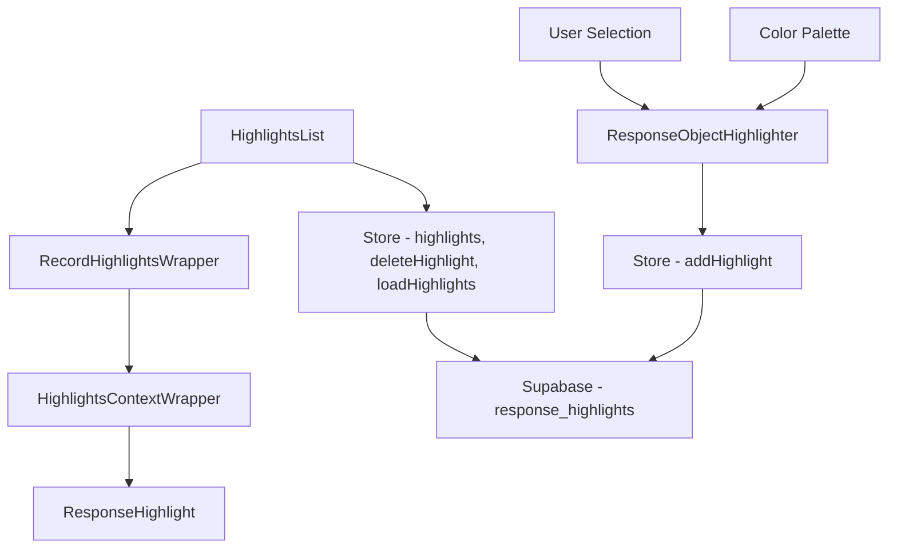
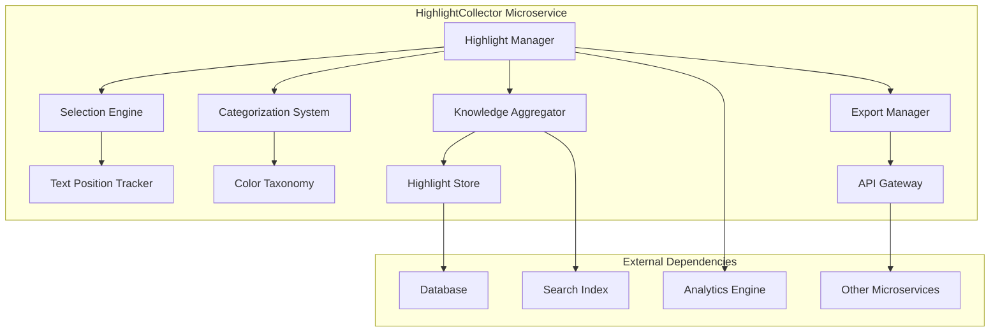
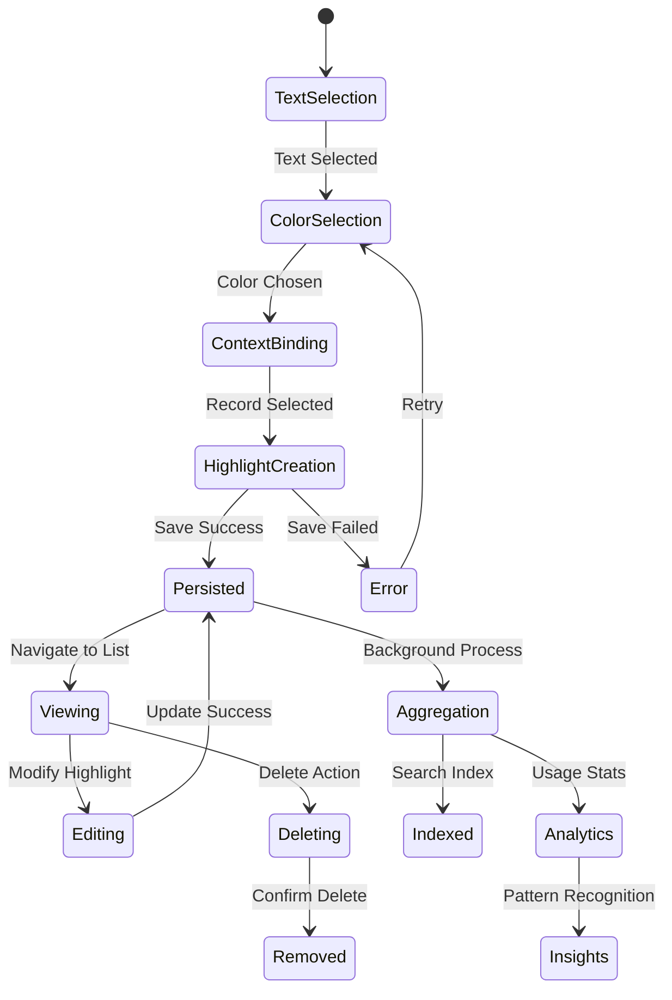

# HighlightCollector Module Analysis and Specification

## Current Architecture Analysis

### Component Hierarchy and Data Flow



### Purpose and Business Logic

The HighlightCollector system serves a critical function in knowledge extraction from LLM responses:

1. **Problem Statement**: LLMs generate verbose responses with significant "fluff" content
2. **User Expertise**: Domain experts can identify valuable vs. redundant information
3. **Value Extraction**: Users highlight only useful or net-new information
4. **Knowledge Aggregation**: Collected highlights become a curated knowledge base
5. **API Availability**: Highlights accessible to other microservices and components

### Core Components Analysis

#### 1. HighlightsList Component (`src/components/HighlightsList.tsx:24-78`)

**Functionality:**
- Main container for all user highlights
- Groups highlights by record for organization
- Handles loading and refresh of highlights data
- Provides empty state when no highlights exist

**Key Functions:**
```typescript
// Highlight grouping by record
const groupedHighlights = React.useMemo(() => {
  return highlights.reduce((acc, highlight) => {
    if (!acc[highlight.record_id]) {
      acc[highlight.record_id] = {
        recordName: highlight.record_name,
        highlights: []
      };
    }
    acc[highlight.record_id].highlights.push(highlight);
    return acc;
  }, {} as GroupedHighlights);
}, [highlights]);

// Auto-load highlights on mount
React.useEffect(() => {
  loadHighlights();
}, [loadHighlights]);
```

#### 2. RecordHighlightsWrapper Component (`src/components/RecordHighlightsWrapper.tsx:30-89`)

**Functionality:**
- Organizes highlights by record (data entity)
- Provides collapsible interface for each record
- Further groups highlights by section title within each record
- Shows count of prompt sections per record

**Key Functions:**
```typescript
// Group highlights by section title within record
const groupedHighlights = React.useMemo(() => {
  return highlights.reduce((acc, highlight) => {
    const sectionTitle = highlight.section_title || 'Uncategorized';
    if (!acc[sectionTitle]) {
      acc[sectionTitle] = [];
    }
    acc[sectionTitle].push(highlight);
    return acc;
  }, {} as GroupedHighlights);
}, [highlights]);

// Collapsible state management
const [isExpanded, setIsExpanded] = React.useState(true);
```

#### 3. HighlightsContextWrapper Component (`src/components/HighlightsContextWrapper.tsx:28-229`)

**Functionality:**
- Context container for highlights within a specific section
- Displays metadata (user, model, timestamp, record)
- Provides navigation back to original response
- Handles individual and batch deletion with confirmation
- Renders highlight excerpts with color coding

**Key Functions:**
```typescript
// Navigation to original section
const handleSectionClick = () => {
  if (highlights[0]?.section_id) {
    const sectionElement = document.getElementById(`section-${highlights[0].section_id}`);
    if (sectionElement) {
      sectionElement.scrollIntoView({ behavior: 'smooth' });
      sectionElement.classList.add('bg-blue-50');
      setTimeout(() => {
        sectionElement.classList.remove('bg-blue-50');
      }, 1000);
    }
  }
};

// Deletion with confirmation
const handleDeleteClick = (highlightId: string) => {
  setHighlightToDelete(highlightId);
  setIsConfirmDeleteOpen(true);
};

const handleConfirmDelete = async () => {
  if (highlightToDelete) {
    await onDeleteHighlight(highlightToDelete);
    setIsConfirmDeleteOpen(false);
    setHighlightToDelete(null);
  }
};
```

#### 4. ResponseObjectHighlighter Component (`src/components/ResponseObjectHighlighter.tsx:26-244`)

**Functionality:**
- CodeMirror-based text selection interface
- Multi-color highlighting system (5 colors: Yellow, Green, Blue, Red, Purple)
- Real-time highlight application and persistence
- Requires record selection for context binding

**Key Functions:**
```typescript
// Color palette system
const colors = [
  '#FFEB3B', // Yellow
  '#81C784', // Green
  '#64B5F6', // Blue
  '#E57373', // Red
  '#BA68C8'  // Purple
];

// Highlight creation and persistence
const handleHighlight = async () => {
  const newHighlight = {
    start: selection.start,
    end: selection.end,
    color: selectedColor
  };

  const highlightData = {
    id: crypto.randomUUID(),
    response_id: responseId,
    content: content,
    highlights: newHighlights,
    section_id: sectionId,
    section_title: sectionTitle,
    model_id: modelId,
    created_at: new Date().toISOString(),
    record_id: selectedRecord.id,
    record_name: selectedRecord.name
  };

  await addHighlight(highlightData);
};

// CodeMirror state management for visual highlights
const highlightField = StateField.define<DecorationSet>({
  create() {
    return Decoration.none;
  },
  update(highlights, tr) {
    highlights = highlights.map(tr.changes);
    for (let e of tr.effects) {
      if (e.is(addHighlightEffect)) {
        highlights = highlights.update({
          add: [highlightMark(e.value.class).range(e.value.from, e.value.to)]
        });
      }
    }
    return highlights;
  },
  provide: f => EditorView.decorations.from(f)
});
```

#### 5. ResponseHighlight Component (`src/components/ResponseHighlight.tsx:14-42`)

**Functionality:**
- Simple display component for individual highlights
- Shows extracted text with color-coded background
- Includes metadata (model, timestamp)

**Key Functions:**
```typescript
// Text extraction from highlight positions
const highlightedText = content.slice(highlight.start, highlight.end);

// Color-coded display
<div 
  className="p-4 rounded-lg"
  style={{ backgroundColor: `${highlight.color}20` }}
>
  <blockquote className="text-gray-800 italic">
    "{highlightedText}"
  </blockquote>
</div>
```

### Data Model Analysis

#### Highlight Interface (`src/store/index.ts:8-19`)
```typescript
interface Highlight {
  id: string;
  response_id: string;       // Links to original AI response
  content: string;           // Full response content
  highlights: Array<{        // Multiple highlights per response
    start: number;           // Character position start
    end: number;             // Character position end
    color: string;           // Color category
  }>;
  section_title?: string;    // Prompt section name
  section_id?: string;       // Prompt section ID
  model_id: string;          // AI model used
  created_at: string;        // Timestamp
  record_id: string;         // Associated data record
  record_name: string;       // Human-readable record name
}
```

### Store Operations Analysis (`src/store/index.ts:310-546`)

#### Core Highlight Operations:
```typescript
// Load all user highlights
loadHighlights: async () => {
  const { data, error } = await supabase
    .from('response_highlights')
    .select('*')
    .eq('user_id', user.id)
    .order('created_at', { ascending: false });
};

// Create new highlight
addHighlight: async (highlight) => {
  const { error } = await supabase
    .from('response_highlights')
    .insert([highlight]);
  
  set(state => ({
    highlights: [highlight, ...state.highlights]
  }));
};

// Delete individual highlight
deleteHighlight: async (highlightId) => {
  const { error } = await supabase
    .from('response_highlights')
    .delete()
    .eq('id', highlightId);
};

// Delete all highlights for a record/section combination
deleteHighlightGroup: async (recordId, sectionTitle) => {
  const { error } = await supabase
    .from('response_highlights')
    .delete()
    .eq('record_id', recordId)
    .eq('section_title', sectionTitle);
};
```

## HighlightCollector Microservice Specification

### Service Architecture



### Core Functionality Requirements

#### 1. Highlight Collection System
```typescript
interface HighlightManager {
  // Core highlight operations
  createHighlight(highlight: CreateHighlightRequest): Promise<string>;
  getHighlights(filters: HighlightFilters): Promise<HighlightData[]>;
  updateHighlight(id: string, updates: Partial<HighlightData>): Promise<void>;
  deleteHighlight(id: string): Promise<void>;
  
  // Batch operations
  createBulkHighlights(highlights: CreateHighlightRequest[]): Promise<string[]>;
  deleteHighlightsByContext(context: HighlightContext): Promise<void>;
  
  // Aggregation and analysis
  getHighlightsByRecord(recordId: string): Promise<HighlightCollection>;
  getHighlightsByModel(modelId: string): Promise<HighlightCollection>;
  getHighlightsByTimeRange(start: Date, end: Date): Promise<HighlightCollection>;
}

interface CreateHighlightRequest {
  responseId: string;
  content: string;
  selections: TextSelection[];
  context: HighlightContext;
  userId: string;
}

interface TextSelection {
  startPosition: number;
  endPosition: number;
  color: ColorCategory;
  selectedText: string;
}

enum ColorCategory {
  CRITICAL = '#E57373',     // Red - Critical information
  ACTIONABLE = '#FFEB3B',   // Yellow - Actionable insights
  VALUABLE = '#81C784',     // Green - Valuable content
  REFERENCE = '#64B5F6',    // Blue - Reference material
  INNOVATIVE = '#BA68C8'    // Purple - Innovative ideas
}
```

#### 2. Knowledge Aggregation Engine
```typescript
interface KnowledgeAggregator {
  // Content analysis
  analyzeHighlightPatterns(userId: string): Promise<HighlightAnalytics>;
  extractCommonThemes(highlights: HighlightData[]): Promise<ThemeAnalysis>;
  identifyKeyInsights(recordId: string): Promise<InsightSummary>;
  
  // Semantic processing
  semanticSearch(query: string, context?: SearchContext): Promise<HighlightData[]>;
  findSimilarHighlights(highlightId: string): Promise<HighlightData[]>;
  categorizeBySentiment(highlights: HighlightData[]): Promise<SentimentCategories>;
  
  // Knowledge graph
  buildKnowledgeGraph(highlights: HighlightData[]): Promise<KnowledgeGraph>;
  linkRelatedConcepts(concepts: string[]): Promise<ConceptLinks>;
}

interface HighlightAnalytics {
  totalHighlights: number;
  colorDistribution: Record<ColorCategory, number>;
  mostHighlightedModels: ModelUsageStats[];
  timeSeriesData: TimeSeriesPoint[];
  topRecords: RecordStats[];
}
```

#### 3. Export and Integration System
```typescript
interface ExportManager {
  // Export formats
  exportHighlightsAsJSON(filters: HighlightFilters): Promise<Blob>;
  exportHighlightsAsMarkdown(filters: HighlightFilters): Promise<Blob>;
  exportHighlightsAsCSV(filters: HighlightFilters): Promise<Blob>;
  exportKnowledgeBase(recordId: string): Promise<Blob>;
  
  // API endpoints for other services
  getHighlightsForService(serviceId: string, filters: ServiceFilters): Promise<HighlightData[]>;
  subscribeToHighlights(serviceId: string, webhook: WebhookConfig): Promise<void>;
  
  // Real-time streaming
  streamHighlights(filters: StreamFilters): AsyncIterable<HighlightData>;
  createHighlightFeed(userId: string): Promise<HighlightFeed>;
}
```

#### 4. Selection and Annotation Interface
```typescript
interface SelectionEngine {
  // Text selection management
  createSelection(contentId: string, range: TextRange): Promise<Selection>;
  validateSelection(selection: Selection): ValidationResult;
  optimizeSelection(selection: Selection): Selection;
  
  // Annotation capabilities
  addAnnotation(selectionId: string, annotation: Annotation): Promise<void>;
  getAnnotations(selectionId: string): Promise<Annotation[]>;
  
  // Context preservation
  preserveContext(selection: Selection): Promise<SelectionContext>;
  restoreContext(selectionId: string): Promise<SelectionContext>;
}

interface TextRange {
  startOffset: number;
  endOffset: number;
  startContainer: string;
  endContainer: string;
}

interface Annotation {
  type: AnnotationType;
  content: string;
  metadata: Record<string, any>;
  timestamp: string;
}

enum AnnotationType {
  NOTE = 'note',
  CATEGORY = 'category',
  RELATIONSHIP = 'relationship',
  PRIORITY = 'priority'
}
```

### State Management and Workflow



### API Endpoints Design

```typescript
interface HighlightCollectorAPI {
  // Highlight CRUD operations
  'POST /highlights': (highlight: CreateHighlightRequest) => HighlightData;
  'GET /highlights': (filters: HighlightFilters) => HighlightData[];
  'GET /highlights/:id': (id: string) => HighlightData;
  'PUT /highlights/:id': (id: string, updates: UpdateHighlightRequest) => HighlightData;
  'DELETE /highlights/:id': (id: string) => void;
  
  // Bulk operations
  'POST /highlights/bulk': (highlights: CreateHighlightRequest[]) => BulkCreateResult;
  'DELETE /highlights/bulk': (filters: BulkDeleteRequest) => BulkDeleteResult;
  
  // Aggregation endpoints
  'GET /highlights/by-record/:recordId': (recordId: string) => HighlightCollection;
  'GET /highlights/by-model/:modelId': (modelId: string) => HighlightCollection;
  'GET /highlights/analytics': (filters: AnalyticsFilters) => HighlightAnalytics;
  
  // Export endpoints
  'GET /highlights/export': (format: ExportFormat, filters: ExportFilters) => Blob;
  'GET /highlights/knowledge-base/:recordId': (recordId: string) => KnowledgeBase;
  
  // Search and discovery
  'GET /highlights/search': (query: string, context?: SearchContext) => SearchResults;
  'GET /highlights/similar/:id': (id: string) => HighlightData[];
  
  // Integration endpoints
  'POST /highlights/webhook': (config: WebhookConfig) => WebhookRegistration;
  'GET /highlights/stream': (filters: StreamFilters) => EventStream;
  
  // Knowledge graph
  'GET /highlights/graph/:recordId': (recordId: string) => KnowledgeGraph;
  'GET /highlights/themes': (filters: ThemeFilters) => ThemeAnalysis;
}
```

### Color Taxonomy and Categorization System

The current system uses 5 colors with semantic meaning that should be formalized:

```typescript
enum HighlightCategory {
  CRITICAL = 'critical',      // Red - Critical/urgent information
  ACTIONABLE = 'actionable',  // Yellow - Actionable insights
  VALUABLE = 'valuable',      // Green - Generally valuable content
  REFERENCE = 'reference',    // Blue - Reference/documentation
  INNOVATIVE = 'innovative'   // Purple - Novel/innovative ideas
}

interface CategoryRules {
  color: string;
  semantic: HighlightCategory;
  description: string;
  autoSuggest: boolean;
  priority: number;
}

const CATEGORY_SYSTEM: Record<HighlightCategory, CategoryRules> = {
  [HighlightCategory.CRITICAL]: {
    color: '#E57373',
    semantic: HighlightCategory.CRITICAL,
    description: 'Critical information requiring immediate attention',
    autoSuggest: true,
    priority: 1
  },
  [HighlightCategory.ACTIONABLE]: {
    color: '#FFEB3B',
    semantic: HighlightCategory.ACTIONABLE,
    description: 'Actionable insights and recommendations',
    autoSuggest: true,
    priority: 2
  },
  // ... etc
};
```

### Integration Strategy with Other Services

#### 1. Real-time Event Streaming
```typescript
// Publish highlight events to other services
interface HighlightEventPublisher {
  publishHighlightCreated(highlight: HighlightData): Promise<void>;
  publishHighlightUpdated(highlight: HighlightData): Promise<void>;
  publishHighlightDeleted(highlightId: string): Promise<void>;
  publishBulkHighlights(highlights: HighlightData[]): Promise<void>;
}

// Event payload structure
interface HighlightEvent {
  type: 'highlight.created' | 'highlight.updated' | 'highlight.deleted';
  timestamp: string;
  userId: string;
  data: HighlightData | { id: string };
  metadata: {
    recordId: string;
    modelId: string;
    sectionTitle?: string;
  };
}
```

#### 2. Global API Access
```typescript
// Service-to-service API for highlight consumption
interface GlobalHighlightAPI {
  // For analytics services
  getHighlightMetrics(timeRange: TimeRange): Promise<HighlightMetrics>;
  
  // For recommendation engines
  getUserHighlightPatterns(userId: string): Promise<HighlightPatterns>;
  
  // For content services
  getHighlightedContent(filters: ContentFilters): Promise<HighlightedContent[]>;
  
  // For search services
  indexHighlights(highlights: HighlightData[]): Promise<void>;
}
```

### Migration Strategy

1. **Phase 1**: Extract highlight components into standalone service
2. **Phase 2**: Implement microservice APIs and event streaming
3. **Phase 3**: Add advanced analytics and knowledge aggregation
4. **Phase 4**: Implement semantic search and AI-powered categorization
5. **Phase 5**: Deploy as independent microservice with global API access

### Performance and Scalability Considerations

```typescript
interface PerformanceOptimizations {
  // Caching strategy
  cacheFrequentlyAccessedHighlights: boolean;
  cacheTTL: number;
  
  // Indexing strategy
  searchIndexing: {
    fullTextSearch: boolean;
    semanticEmbeddings: boolean;
    realTimeUpdates: boolean;
  };
  
  // Batch processing
  bulkOperations: {
    maxBatchSize: number;
    asyncProcessing: boolean;
    queueSystem: string;
  };
  
  // Data retention
  retentionPolicy: {
    maxAge: string;
    archiveOldHighlights: boolean;
    compressionEnabled: boolean;
  };
}
```

This analysis provides a complete specification for transforming the current highlight collection system into a dedicated HighlightCollector microservice that can serve as a centralized knowledge extraction and curation platform for the entire application ecosystem.