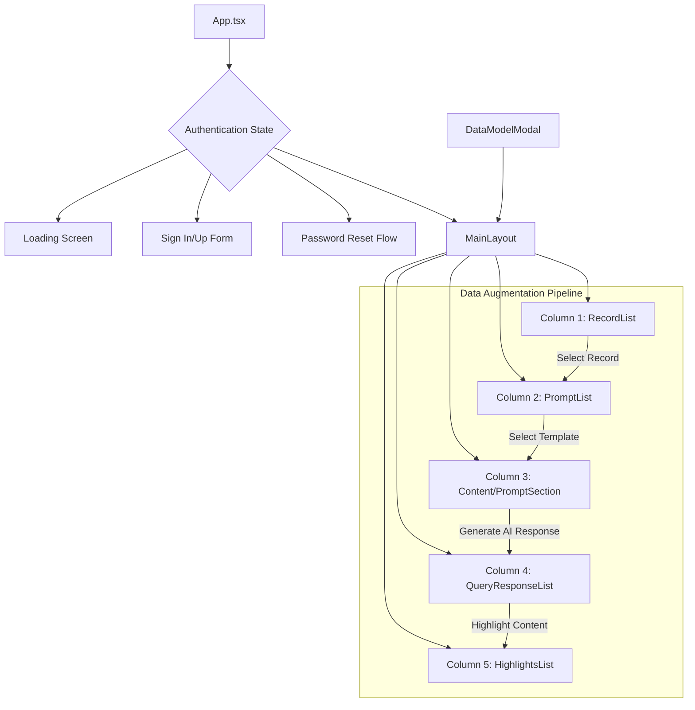
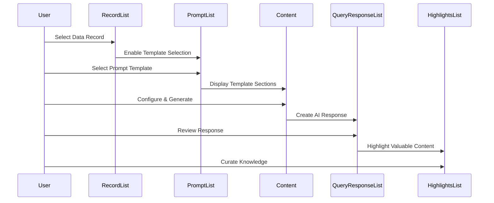
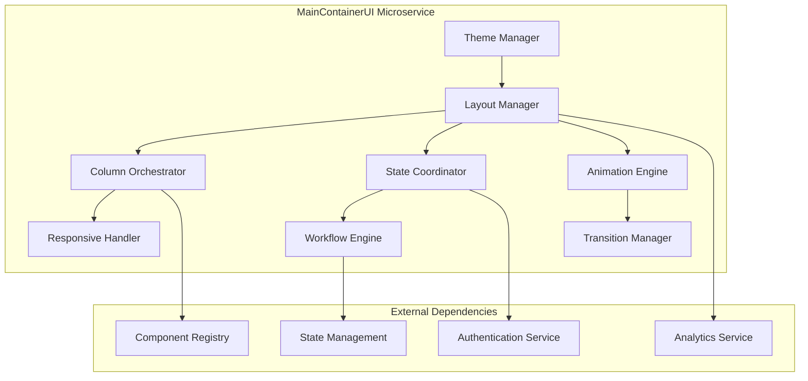

# MainContainerUI Analysis and Specification

## Current Architecture Analysis

### Application Flow and Layout Structure



### Purpose and Business Logic

The MainContainerUI serves as the orchestration layer for the data augmentation pipeline:

1. **Authentication Gate**: Controls access to the main application workflow
2. **Progressive Column Layout**: Five-column interface that guides users through the data augmentation process
3. **Interactive Expansion System**: Columns expand on hover to provide focus while maintaining context
4. **Sequential Loading**: Columns load progressively for visual appeal and performance
5. **State-Driven Content**: Central content area adapts based on user selections

### Core Components Analysis

#### 1. App.tsx - Application Shell (`src/App.tsx:9-191`)

**Functionality:**
- Root application component with authentication routing
- Handles multiple UI states: loading, authentication, password flows, main app
- Manages modal state for data model configuration
- Supabase Auth integration with session management

**Key Functions:**
```typescript
// Authentication state initialization
useEffect(() => {
  const isResetPasswordRoute = window.location.pathname === '/reset-password';
  setIsPasswordUpdate(isResetPasswordRoute);

  const initializeAuth = async () => {
    try {
      const { data: { session } } = await supabase.auth.getSession();
      if (session?.user) {
        await loadInitialData();
      }
    } catch (error) {
      console.error('Error initializing auth:', error);
    } finally {
      setIsLoading(false);
    }
  };

  // Auth state change listener
  const { data: { subscription } } = supabase.auth.onAuthStateChange(async (event, session) => {
    if (event === 'SIGNED_IN' && session?.user) {
      await loadInitialData();
    }
  });

  initializeAuth();
  return () => subscription.unsubscribe();
}, [loadInitialData]);

// Form submission handler
const handleSubmit = async (e: React.FormEvent) => {
  e.preventDefault();
  setError('');
  
  try {
    if (isSignUp) {
      await signUp(email, password);
    } else {
      await signIn(email, password);
    }
  } catch (err) {
    setError(err instanceof Error ? err.message : 'An error occurred');
  }
};
```

**UI States:**
- **Loading**: Spinner during auth initialization
- **Password Update**: Full-screen password reset form
- **Authentication**: Sign in/up forms with password reset option
- **Main Application**: MainLayout with DataModelModal overlay

#### 2. MainLayout.tsx - Core Workflow Container (`src/components/MainLayout.tsx:13-109`)

**Functionality:**
- Five-column layout orchestrating the data augmentation pipeline
- Dynamic column width management with hover-based expansion
- Sequential column loading with visual transitions
- State-dependent content rendering

**Key Functions:**
```typescript
// Column configuration defining the workflow pipeline
const columns = [
  { id: 'records', component: <RecordList onOpenDataModel={onOpenDataModel} /> },
  { id: 'prompts', component: <PromptList /> },
  { id: 'content', component: (
    <div className="h-full overflow-y-auto">
      {selectedRecord && selectedTemplate ? (
        <div className="p-6">
          <div className="mb-6">
            <h2 className="text-2xl font-bold">{selectedTemplate.title}</h2>
            <p className="text-gray-600">{selectedTemplate.description}</p>
          </div>
          <div className="space-y-6">
            {selectedTemplate.sections.map((section) => (
              <PromptSection
                key={section.id}
                section={section}
                templateId={selectedTemplate.id}
              />
            ))}
          </div>
        </div>
      ) : (
        <div className="h-full flex items-center justify-center text-gray-500">
          <p>Select a record and prompt template to get started</p>
        </div>
      )}
    </div>
  ) },
  { id: 'responses', component: <QueryResponseList /> },
  { id: 'highlights', component: <HighlightsList /> }
];

// Progressive column loading with visual effect
useEffect(() => {
  const loadColumns = async () => {
    for (const column of columns) {
      await new Promise(resolve => setTimeout(resolve, 100)); // Small delay for visual effect
      setLoadedColumns(prev => [...prev, column.id]);
    }
  };
  loadColumns();
}, []);

// Dynamic width calculation based on hover state
const getColumnWidth = (columnId: string) => {
  const baseStyles = 'transition-all duration-300 ease-in-out';
  const minWidth = 'min-w-[6%]';
  const maxWidth = hoveredColumn === columnId ? 'w-[60%]' : '';
  const collapsedWidth = hoveredColumn && hoveredColumn !== columnId ? 'w-[6%]' : 'w-[20%]';
  const contentColumn = columnId === 'content' ? 'flex-1' : '';

  return `${baseStyles} ${minWidth} ${maxWidth} ${collapsedWidth} ${contentColumn}`.trim();
};

// Combined styling with loading transitions
const getColumnStyles = (columnId: string) => {
  const isLoaded = loadedColumns.includes(columnId);
  const baseStyles = `
    h-screen
    overflow-hidden
    border-l
    shadow-[-1px_0_3px_rgba(0,0,0,0.1)]
    bg-white
    relative
    ${getColumnWidth(columnId)}
  `.trim();

  const transitionStyles = isLoaded
    ? 'opacity-100 transform translate-x-0'
    : 'opacity-0 transform -translate-x-full';

  return `${baseStyles} ${transitionStyles}`;
};
```

**State Management:**
- `hoveredColumn`: Tracks which column is being hovered for expansion
- `loadedColumns`: Manages progressive loading animation sequence

### Styling System Analysis

#### 1. Base Styling (`src/index.css:1-4`)
```css
@tailwind base;
@tailwind components;
@tailwind utilities;
```

**Analysis:**
- Pure Tailwind CSS approach with no custom CSS
- Relies entirely on utility classes for styling
- Minimal setup focusing on Tailwind's design system

#### 2. Column Expansion System

**Width Management Logic:**
```typescript
// Default state: Each column gets 20% width
'w-[20%]'

// Hovered state: Focused column expands to 60%
hoveredColumn === columnId ? 'w-[60%]' : ''

// Collapsed state: Non-hovered columns shrink to 6%
hoveredColumn && hoveredColumn !== columnId ? 'w-[6%]' : 'w-[20%]'

// Content column: Always flexible with flex-1
columnId === 'content' ? 'flex-1' : ''

// Minimum width constraint: Ensures usability
'min-w-[6%]'

// Smooth transitions: 300ms ease-in-out
'transition-all duration-300 ease-in-out'
```

**Visual Hierarchy:**
- **Normal State**: 5 columns at 20% each (visual balance)
- **Focus State**: Hovered column at 60%, others at 6% (deep focus)
- **Content Column**: Always flexible to accommodate variable content
- **Minimum Width**: 6% ensures columns remain clickable/accessible

#### 3. Loading Animation System

**Progressive Loading:**
```typescript
// Sequential delay for visual appeal
await new Promise(resolve => setTimeout(resolve, 100));

// Slide-in transition from left
isLoaded 
  ? 'opacity-100 transform translate-x-0'    // Loaded state
  : 'opacity-0 transform -translate-x-full'  // Loading state
```

**Visual Effects:**
- **Left-to-right revelation**: Columns slide in from the left
- **Staggered timing**: 100ms delay between each column
- **Smooth transitions**: Opacity and transform animations
- **Professional loading**: Creates anticipation and visual interest

### Data Augmentation Pipeline Flow

#### 1. Workflow Sequence


#### 2. State Dependencies
```typescript
// Content column dependency
{selectedRecord && selectedTemplate ? (
  // Show template sections with AI generation capabilities
) : (
  // Show "Select record and template" message
)}

// This creates a guided workflow where:
// 1. User must select a record first
// 2. Then select a prompt template
// 3. Only then can they generate AI responses
// 4. Responses can be highlighted for knowledge curation
```

### Responsive Design Considerations

#### 1. Current Limitations
- **Fixed Column Count**: Always shows 5 columns regardless of screen size
- **Minimum Width Constraints**: 6% minimum may be too small on mobile
- **No Breakpoint Handling**: No responsive behavior for different screen sizes

#### 2. Potential Improvements
```typescript
// Responsive column management
const getResponsiveColumns = (screenWidth: number) => {
  if (screenWidth < 768) return ['records', 'content']; // Mobile: 2 columns
  if (screenWidth < 1024) return ['records', 'prompts', 'content']; // Tablet: 3 columns
  return columns; // Desktop: All 5 columns
};
```

## MainContainerUI Microservice Specification

### Service Architecture



### Core Functionality Requirements

#### 1. Layout Management System
```typescript
interface LayoutManager {
  // Layout configuration
  createLayout(config: LayoutConfig): Promise<LayoutDefinition>;
  updateLayout(layoutId: string, updates: Partial<LayoutConfig>): Promise<LayoutDefinition>;
  getLayout(layoutId: string): Promise<LayoutDefinition>;
  
  // Column management
  addColumn(layoutId: string, column: ColumnDefinition): Promise<void>;
  removeColumn(layoutId: string, columnId: string): Promise<void>;
  reorderColumns(layoutId: string, order: string[]): Promise<void>;
  
  // Responsive behavior
  setBreakpoints(layoutId: string, breakpoints: ResponsiveBreakpoints): Promise<void>;
  getResponsiveLayout(layoutId: string, screenSize: ScreenSize): Promise<LayoutDefinition>;
}

interface LayoutConfig {
  id: string;
  name: string;
  description: string;
  columns: ColumnDefinition[];
  defaultColumnWidth: string;
  expandedColumnWidth: string;
  collapsedColumnWidth: string;
  transitionDuration: number;
  loadingDelay: number;
  responsive: ResponsiveConfig;
}

interface ColumnDefinition {
  id: string;
  name: string;
  component: string;
  minWidth: string;
  maxWidth: string;
  defaultWidth: string;
  isFlexible: boolean;
  loadPriority: number;
  dependencies: string[];
  permissions: string[];
}

interface ResponsiveConfig {
  breakpoints: ResponsiveBreakpoints;
  columnBehavior: ColumnResponsiveBehavior;
  collapseBehavior: CollapseBehavior;
}

enum CollapseBehavior {
  HIDE = 'hide',
  STACK = 'stack',
  DRAWER = 'drawer',
  TABS = 'tabs'
}
```

#### 2. Workflow Orchestration System
```typescript
interface WorkflowEngine {
  // Workflow definition
  createWorkflow(workflow: WorkflowDefinition): Promise<string>;
  executeWorkflow(workflowId: string, context: WorkflowContext): Promise<WorkflowExecution>;
  getWorkflowState(executionId: string): Promise<WorkflowState>;
  
  // Step management
  advanceWorkflow(executionId: string, stepId: string, data: any): Promise<WorkflowState>;
  validateStep(executionId: string, stepId: string): Promise<ValidationResult>;
  rollbackStep(executionId: string, stepId: string): Promise<WorkflowState>;
  
  // Flow control
  conditionalNavigation(executionId: string, condition: WorkflowCondition): Promise<string>;
  parallelExecution(executionId: string, stepIds: string[]): Promise<WorkflowState>;
}

interface WorkflowDefinition {
  id: string;
  name: string;
  description: string;
  steps: WorkflowStep[];
  transitions: WorkflowTransition[];
  validations: WorkflowValidation[];
  permissions: WorkflowPermissions;
}

interface WorkflowStep {
  id: string;
  name: string;
  component: string;
  columnId: string;
  required: boolean;
  dependencies: string[];
  validations: StepValidation[];
  actions: StepAction[];
}

interface DataAugmentationWorkflow extends WorkflowDefinition {
  steps: [
    { id: 'record-selection', name: 'Select Data Record', component: 'RecordList' },
    { id: 'template-selection', name: 'Choose Template', component: 'PromptList' },
    { id: 'content-generation', name: 'Generate Content', component: 'PromptSection' },
    { id: 'response-review', name: 'Review Responses', component: 'QueryResponseList' },
    { id: 'knowledge-curation', name: 'Curate Knowledge', component: 'HighlightsList' }
  ];
}
```

#### 3. Animation and Transition System
```typescript
interface AnimationEngine {
  // Animation configuration
  createAnimation(animation: AnimationDefinition): Promise<string>;
  executeAnimation(animationId: string, target: string, options?: AnimationOptions): Promise<void>;
  
  // Transition management
  createTransition(from: string, to: string, transition: TransitionDefinition): Promise<void>;
  executeTransition(transitionId: string): Promise<void>;
  
  // Loading animations
  createLoadingSequence(sequence: LoadingSequence): Promise<string>;
  executeLoadingSequence(sequenceId: string): Promise<void>;
  
  // Hover effects
  registerHoverEffects(target: string, effects: HoverEffects): Promise<void>;
  triggerHoverState(target: string, state: 'enter' | 'leave'): Promise<void>;
}

interface AnimationDefinition {
  id: string;
  name: string;
  type: AnimationType;
  duration: number;
  easing: EasingFunction;
  properties: AnimationProperty[];
  keyframes?: Keyframe[];
}

interface TransitionDefinition {
  duration: number;
  easing: EasingFunction;
  properties: string[];
  stagger?: number;
  delay?: number;
}

interface LoadingSequence {
  id: string;
  steps: LoadingStep[];
  totalDuration: number;
  staggerDelay: number;
}

interface HoverEffects {
  onEnter: AnimationDefinition;
  onLeave: AnimationDefinition;
  onFocus: AnimationDefinition;
}

enum AnimationType {
  SLIDE = 'slide',
  FADE = 'fade',
  SCALE = 'scale',
  ROTATE = 'rotate',
  MORPH = 'morph'
}
```

#### 4. State Coordination System
```typescript
interface StateCoordinator {
  // Global state management
  getGlobalState(): Promise<GlobalState>;
  updateGlobalState(updates: Partial<GlobalState>): Promise<void>;
  subscribeToStateChanges(callback: StateChangeCallback): Promise<string>;
  
  // Inter-component communication
  broadcastEvent(event: ComponentEvent): Promise<void>;
  registerEventHandler(componentId: string, handler: EventHandler): Promise<void>;
  
  // State synchronization
  syncComponentStates(componentIds: string[]): Promise<void>;
  validateStateConsistency(): Promise<ConsistencyReport>;
  
  // Workflow state
  getWorkflowState(workflowId: string): Promise<WorkflowState>;
  updateWorkflowState(workflowId: string, updates: Partial<WorkflowState>): Promise<void>;
}

interface GlobalState {
  user: UserState;
  layout: LayoutState;
  workflow: WorkflowState;
  components: ComponentStates;
  ui: UIState;
}

interface ComponentEvent {
  type: string;
  source: string;
  target?: string;
  data: any;
  timestamp: string;
}

interface StateChangeCallback {
  (oldState: GlobalState, newState: GlobalState, changes: StateChange[]): void;
}
```

### API Endpoints Design

```typescript
interface MainContainerUIAPI {
  // Layout management
  'GET /layouts': (filters?: LayoutFilters) => LayoutDefinition[];
  'POST /layouts': (layout: CreateLayoutRequest) => LayoutDefinition;
  'PUT /layouts/:id': (id: string, updates: UpdateLayoutRequest) => LayoutDefinition;
  'DELETE /layouts/:id': (id: string) => void;
  
  // Column management
  'GET /layouts/:id/columns': (layoutId: string) => ColumnDefinition[];
  'POST /layouts/:id/columns': (layoutId: string, column: CreateColumnRequest) => ColumnDefinition;
  'PUT /layouts/:id/columns/:columnId': (layoutId: string, columnId: string, updates: UpdateColumnRequest) => ColumnDefinition;
  'DELETE /layouts/:id/columns/:columnId': (layoutId: string, columnId: string) => void;
  
  // Workflow management
  'GET /workflows': (filters?: WorkflowFilters) => WorkflowDefinition[];
  'POST /workflows': (workflow: CreateWorkflowRequest) => WorkflowDefinition;
  'POST /workflows/:id/execute': (workflowId: string, context: WorkflowContext) => WorkflowExecution;
  'GET /workflows/executions/:id': (executionId: string) => WorkflowState;
  
  // State management
  'GET /state/global': () => GlobalState;
  'PUT /state/global': (updates: Partial<GlobalState>) => GlobalState;
  'POST /state/sync': (componentIds: string[]) => SyncResult;
  
  // Animation and transitions
  'POST /animations/execute': (animationId: string, target: string, options?: AnimationOptions) => void;
  'POST /transitions/execute': (transitionId: string) => void;
  'POST /loading/execute': (sequenceId: string) => void;
  
  // Analytics and monitoring
  'GET /analytics/layout-usage': (layoutId: string, timeRange: TimeRange) => LayoutAnalytics;
  'GET /analytics/workflow-performance': (workflowId: string, timeRange: TimeRange) => WorkflowAnalytics;
}
```

### Integration Patterns

#### 1. Framework-Agnostic Widget System
```typescript
// React Integration
const useMainLayout = (config: LayoutConfig) => {
  const [layout, setLayout] = useState<LayoutDefinition | null>(null);
  const [workflowState, setWorkflowState] = useState<WorkflowState | null>(null);
  
  return {
    layout,
    workflowState,
    advanceWorkflow: (stepId: string, data: any) => Promise<void>,
    updateLayout: (updates: Partial<LayoutConfig>) => Promise<void>
  };
};

// Web Components
class MainLayoutContainer extends HTMLElement {
  static observedAttributes = ['layout-config', 'workflow-id'];
  
  connectedCallback() {
    this.initializeLayout();
    this.attachEventListeners();
  }
  
  attributeChangedCallback(name: string, oldValue: string, newValue: string) {
    this.handleConfigChange(name, oldValue, newValue);
  }
}

// Vanilla JavaScript API
const MainLayoutAPI = {
  create: (containerId: string, config: LayoutConfig) => Promise<LayoutInstance>,
  destroy: (instanceId: string) => Promise<void>,
  updateConfig: (instanceId: string, config: Partial<LayoutConfig>) => Promise<void>
};
```

#### 2. Plugin Architecture
```typescript
interface LayoutPlugin {
  id: string;
  name: string;
  version: string;
  
  // Lifecycle hooks
  onLayoutCreated?: (layout: LayoutDefinition) => void;
  onColumnAdded?: (column: ColumnDefinition) => void;
  onWorkflowAdvanced?: (step: WorkflowStep, data: any) => void;
  
  // Custom components
  components?: Record<string, ComponentDefinition>;
  
  // Custom animations
  animations?: Record<string, AnimationDefinition>;
  
  // Configuration extensions
  configExtensions?: ConfigExtension[];
}

interface ComponentDefinition {
  component: React.ComponentType<any>;
  props?: Record<string, any>;
  permissions?: string[];
}
```

### Performance and Scalability Considerations

#### 1. Optimization Strategies
```typescript
interface PerformanceOptimizations {
  // Virtual scrolling for large datasets
  virtualScrolling: {
    enabled: boolean;
    itemHeight: number;
    overscan: number;
  };
  
  // Lazy loading for components
  lazyLoading: {
    enabled: boolean;
    threshold: number;
    placeholder: string;
  };
  
  // Animation optimization
  animationOptimization: {
    useGPU: boolean;
    reducedMotion: boolean;
    frameRate: number;
  };
  
  // State management optimization
  stateOptimization: {
    debounceUpdates: number;
    batchUpdates: boolean;
    memoization: boolean;
  };
}
```

#### 2. Monitoring and Analytics
```typescript
interface LayoutAnalytics {
  // Usage metrics
  columnInteractions: ColumnInteractionMetrics[];
  workflowCompletion: WorkflowCompletionMetrics;
  userEngagement: EngagementMetrics;
  
  // Performance metrics
  loadTimes: LoadTimeMetrics;
  animationPerformance: AnimationPerformanceMetrics;
  stateUpdateFrequency: StateUpdateMetrics;
  
  // Error tracking
  errorRates: ErrorMetrics[];
  crashReports: CrashReport[];
}
```

### Migration Strategy

1. **Phase 1**: Extract MainLayout into standalone service with current functionality
2. **Phase 2**: Implement responsive design and mobile optimization
3. **Phase 3**: Add workflow orchestration and state coordination
4. **Phase 4**: Implement plugin architecture and advanced animations
5. **Phase 5**: Deploy as framework-agnostic layout management platform

### Advanced Features for Future Development

#### 1. AI-Powered Layout Optimization
```typescript
interface LayoutOptimizationAI {
  // Usage pattern analysis
  analyzeUserBehavior(userId: string): Promise<BehaviorAnalysis>;
  
  // Layout recommendations
  recommendLayoutOptimizations(layoutId: string): Promise<OptimizationSuggestion[]>;
  
  // Personalized layouts
  generatePersonalizedLayout(userId: string, workflowType: string): Promise<LayoutDefinition>;
}
```

#### 2. Collaborative Layout Design
```typescript
interface CollaborativeDesign {
  // Real-time collaboration
  shareLayoutDesign(layoutId: string, collaborators: string[]): Promise<CollaborationSession>;
  
  // Version control
  createLayoutVersion(layoutId: string, changes: LayoutChange[]): Promise<LayoutVersion>;
  
  // Design system integration
  syncWithDesignSystem(layoutId: string, designSystemId: string): Promise<void>;
}
```

This analysis provides a comprehensive specification for transforming the current MainLayout into a sophisticated, reusable microservice that can serve as the foundation for complex workflow-based applications while maintaining the elegant column expansion system and progressive loading animations.