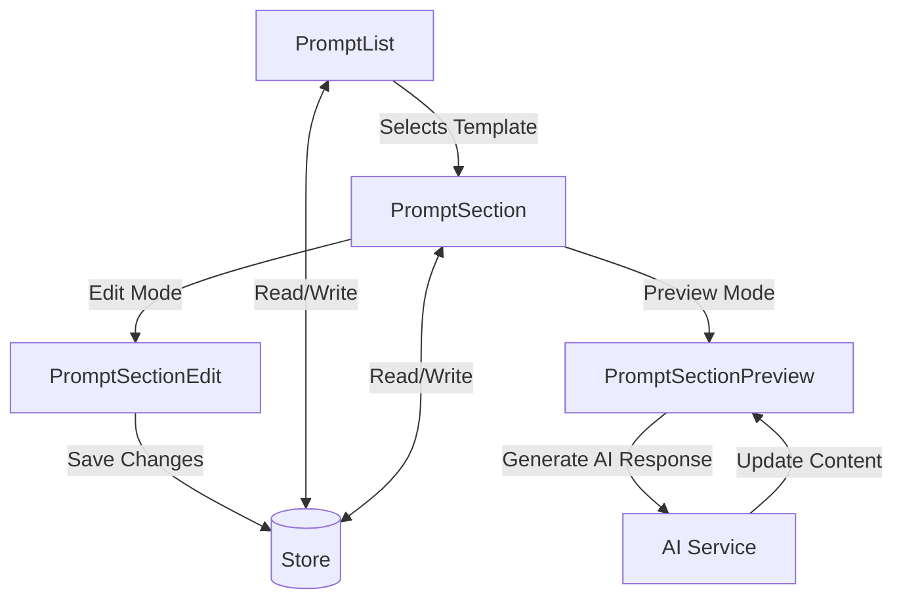

# Prompt Section Feature Analysis

## Overview
This document provides a comprehensive analysis of the Prompt Section feature set in the application. The feature is composed of several React components that work together to provide a rich text editing and preview experience for prompt templates.

## Component Architecture

### 1. PromptSection (Main Component)
The central component that manages the edit/preview state of a prompt section.

```typescript
interface PromptSectionProps {
  section: PromptSectionType;
  templateId: string;
}
```

### 2. PromptList
Manages the list of prompt templates with CRUD operations.

Key Features:
- Displays list of prompt templates
- Create/Edit/Delete templates
- Search and filter functionality
- Template selection

### 3. PromptSectionEdit
Handles the editing of a prompt section using MDXEditor.

```typescript
interface PromptSectionEditProps {
  section: PromptSectionType;
  templateId: string;
  onCancel: () => void;
  onSave: () => void;
}
```

### 4. PromptSectionPreview
Displays a read-only view of the prompt section with generation capabilities.

```typescript
interface PromptSectionPreviewProps {
  section: PromptSectionType;
  templateId: string;
  onEdit: () => void;
}
```

## Data Flow



## UI Components and Layout

### PromptList Component
- **Sidebar Layout**: Fixed width (w-72) with scrollable content
- **Template Cards**: Each template shows title and description
- **Action Buttons**: 
  - Create new template (+)
  - Edit template (pencil icon)
  - Delete template (trash icon)

### PromptSection Component
- **State Management**: Toggles between edit and preview modes
- **Props**:
  - `section`: Current section data
  - `templateId`: ID of the parent template

### PromptSectionEdit Component
- **MDX Editor**: Rich text editing capabilities
- **Action Buttons**:
  - Save: Persists changes to the store
  - Cancel: Discards changes and exits edit mode

### PromptSectionPreview Component
- **Content Rendering**:
  - Markdown support
  - Syntax highlighting
  - Responsive layout
- **Action Buttons**:
  - Edit: Switches to edit mode
  - Generate: Creates AI content
  - Model Selection: Dropdown for different AI models

## Key Functions

### 1. Template Management (PromptList)
```typescript
// Add new template
const handleSaveTemplate = async (mdxContent: string) => {
  const templateData: PromptTemplate = {
    id: editingTemplate?.id || crypto.randomUUID(),
    title: title.trim(),
    description: description.trim(),
    mdxContent: mdxContent.trim(),
    sections: [
      {
        id: editingTemplate?.sections[0]?.id || crypto.randomUUID(),
        title: 'Main Content',
        content: mdxContent.trim(),
      }
    ]
  };
  
  if (editingTemplate) {
    await updatePromptTemplate(templateData);
  } else {
    await addPromptTemplate(templateData);
  }
};
```

### 2. Content Interpolation (PromptSectionPreview)
```typescript
const interpolateContent = (content: string) => {
  if (!selectedRecord) return content;
  
  let interpolated = content;
  const regex = /\{\{([\w.]+)\}\}/g;
  const matches = [...content.matchAll(regex)];
  
  matches.sort((a, b) => b[0].length - a[0].length);
  
  for (const match of matches) {
    const [fullMatch, path] = match;
    if (path.startsWith('record.')) {
      const property = path.replace('record.', '');
      const value = selectedRecord[property];
      if (value !== undefined) {
        const replaceRegex = new RegExp(fullMatch.replace(/[.*+?^${}()|[\]\\]/g, '\\$&'), 'g');
        interpolated = interpolated.replace(replaceRegex, String(value));
      }
    }
  }
  
  return interpolated;
};
```

### 3. AI Content Generation (PromptSectionPreview)
```typescript
const handleGenerate = async () => {
  if (!selectedModelId) {
    alert('Please select an AI model first');
    return;
  }

  const interpolatedContent = interpolateContent(
    selectedTemplate?.mdxContent || section.content
  );

  await generateAIResponse(
    section.id, 
    selectedModelId, 
    interpolatedContent, 
    section.title
  );
};
```

## State Management
The application uses a centralized store (likely using Zustand based on the `useStore` hook pattern) to manage:
- List of prompt templates
- Currently selected template
- AI model selection
- Editing state

## Error Handling
- Form validation for required fields
- Error boundaries around critical operations
- User feedback for async operations

## Performance Considerations
- Virtualized list for large template collections
- Memoization of expensive computations
- Lazy loading of editor components

## Future Enhancements
1. Template versioning
2. Collaborative editing
3. More AI model integrations
4. Template sharing and export/import
5. Advanced content validation

## Dependencies
- React 18+
- MDXEditor for rich text editing
- Lucide React for icons
- Zustand for state management
- Tailwind CSS for styling