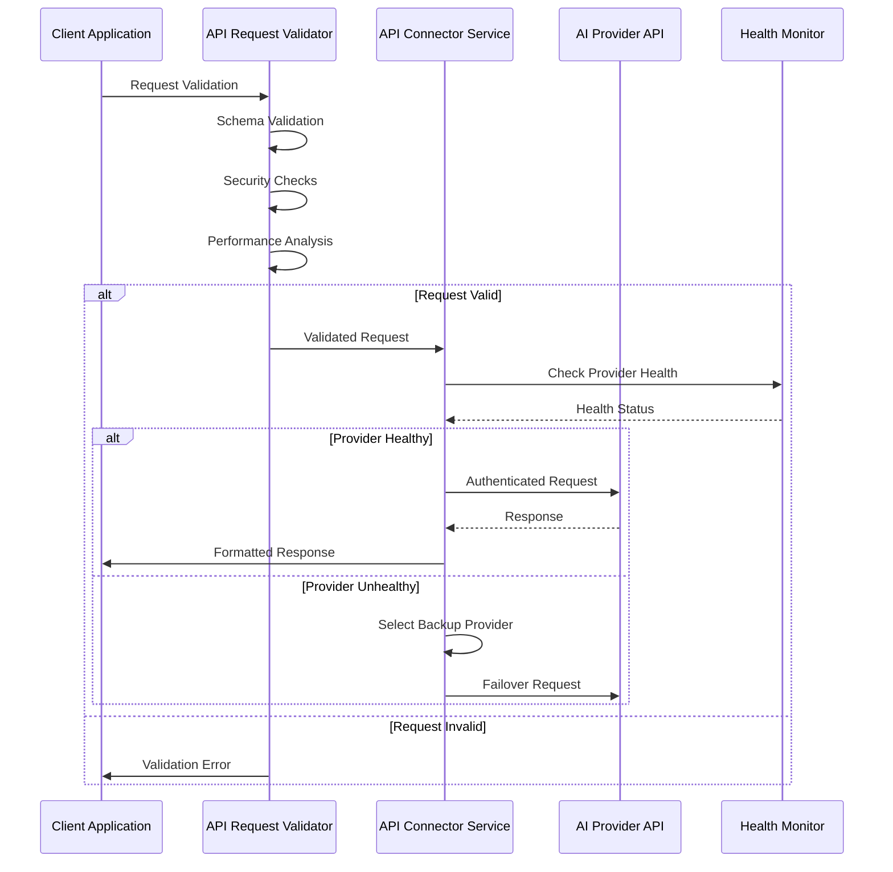
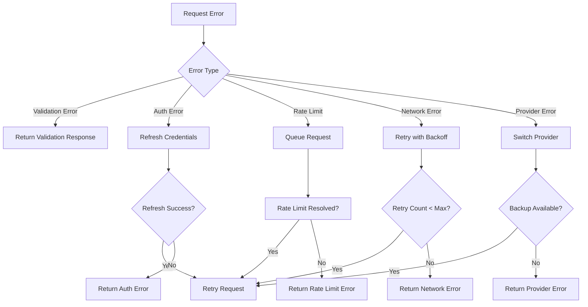
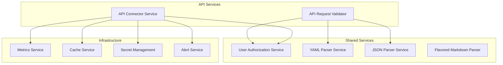
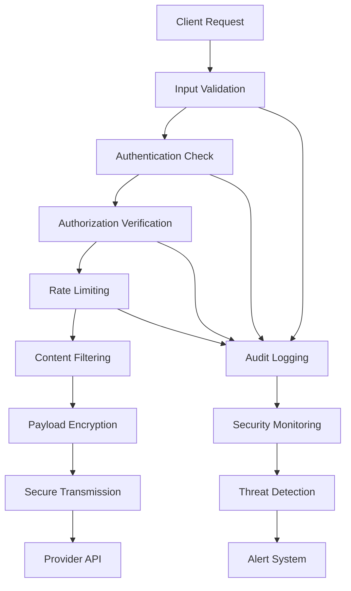

# Container Meta Specification

## Executive Summary

The API Related Services architecture encompasses the complete ecosystem of services responsible for managing external API interactions within the Augment-It platform. This meta-specification provides a unified view of how the API Connector Service, API Request Validator, and supporting services work together to deliver secure, reliable, and performant AI model integrations. The architecture emphasizes security-first design, intelligent routing, comprehensive validation, and enterprise-grade monitoring to support the platform's AI-powered features.

## Service Architecture Overview

### API Categories and Data Flow

The Augment-It platform integrates with four distinct categories of APIs, each requiring specialized handling:

1. **AI Model APIs**: OpenAI, Anthropic, Groq, etc. - for content augmentation and processing
2. **Data Store APIs**: NocoDB, Airtable, Databricks, etc. - for record ingestion and updates
3. **Integration APIs**: Webhooks, notification services, external tools - for workflow automation
4. **AI Powered Web Crawlers**: Intelligent web scraping, content extraction, and data harvesting - for automated web data collection and analysis

### Complete Data Lifecycle Architecture

```mermaid
graph TB
    subgraph "Data Sources"
        DS1[NocoDB]
        DS2[Airtable]
        DS3[Databricks]
        DS4[PostgreSQL]
        DS5[MongoDB]
    end
    
    subgraph "Client Layer"
        A1[Prompt Template Manager]
        A2[Insight Assembler]
        A3[Request Reviewer]
        A4[Record Collector]
        A5[Remote Record Updater]
    end
    
    subgraph "API Gateway Layer"
        B1[API Request Validator]
        B2[API Connector Service]
        B3[Data Store Connector]
        B4[Record Integrity Manager]
        B5[Rate Limiter]
        B6[Authentication Manager]
    end
    
    subgraph "Shared Services"
        C1[User Authorization Service]
        C2[YAML Parser Service]
        C3[JSON Parser Service]
        C4[Flavored Markdown Parser]
        C5[Record Mapping Service]
    end
    
    subgraph "AI Model APIs"
        D1[OpenAI GPT Models]
        D2[Anthropic Claude]
        D3[Groq Inference]
        D4[Other AI Providers]
    end
    
    subgraph "AI Powered Web Crawlers"
        F1[Intelligent Web Scraper]
        F2[Content Extractor]
        F3[Data Harvester]
        F4[Web Analytics Crawler]
    end
    
    subgraph "Infrastructure"
        E1[Metrics & Monitoring]
        E2[Cache Layer]
        E3[Credential Store]
        E4[Alert System]
        E5[Backup & Recovery]
    end
    
    %% Data Ingestion Flow
    DS1 --> A4
    DS2 --> A4
    DS3 --> A4
    DS4 --> A4
    DS5 --> A4
    
    %% Processing Flow
    A1 --> B1
    A2 --> B1
    A3 --> B1
    A4 --> B3
    A5 --> B4
    
    %% Validation and Connection
    B1 --> B2
    B3 --> B1
    B4 --> B3
    
    %% AI Model Integration
    B2 --> D1
    B2 --> D2
    B2 --> D3
    B2 --> D4
    
    %% AI Powered Web Crawlers Integration
    B2 --> F1
    B2 --> F2
    B2 --> F3
    B2 --> F4
    
    %% Web Crawler Data Flow
    F1 --> A4
    F2 --> A4
    F3 --> A4
    F4 --> A4
    
    %% Data Store Updates
    A5 --> DS1
    A5 --> DS2
    A5 --> DS3
    A5 --> DS4
    A5 --> DS5
    
    %% Supporting Services
    B1 --> C1
    B1 --> C2
    B1 --> C3
    B3 --> C5
    
    %% Infrastructure
    B2 --> E1
    B3 --> E2
    B4 --> E5
    B6 --> E3
    E1 --> E4
```



## Core Service Components

### 1. API Request Validator Service

**Purpose**: First-line validation and security for all outbound API requests

**Key Responsibilities**:
- Schema validation against AI provider specifications
- Security threat detection and input sanitization
- Performance optimization and request sizing
- Provider-specific rule enforcement
- Rate limiting and quota management

**Integration Points**:
- **Upstream**: All client applications and services
- **Downstream**: API Connector Service, User Authorization Service
- **Lateral**: Parser services for content validation

**Key Features**:
```typescript
interface ValidationCapabilities {
  schemaValidation: {
    jsonSchema: boolean;
    typeChecking: boolean;
    formatValidation: boolean;
    customRules: boolean;
  };
  security: {
    injectionPrevention: boolean;
    inputSanitization: boolean;
    threatDetection: boolean;
    contentFiltering: boolean;
  };
  performance: {
    rateLimiting: boolean;
    payloadOptimization: boolean;
    compressionAnalysis: boolean;
    costOptimization: boolean;
  };
}
```

### 2. API Connector Service

**Purpose**: Centralized, secure gateway for AI model API interactions

**Key Responsibilities**:
- Connection management and health monitoring
- Authentication and credential management
- Intelligent routing and load balancing
- Error handling and retry logic
- Circuit breaking and failover

**Integration Points**:
- **Upstream**: API Request Validator Service
- **Downstream**: External AI provider APIs
- **Lateral**: User Authorization Service, Metrics Service

**Key Features**:
```typescript
interface ConnectionCapabilities {
  connectionManagement: {
    httpPooling: boolean;
    sslValidation: boolean;
    healthChecking: boolean;
    lifecycle: boolean;
  };
  routing: {
    loadBalancing: boolean;
    failover: boolean;
    providerSelection: boolean;
    performanceOptimization: boolean;
  };
  security: {
    credentialManagement: boolean;
    tokenRefresh: boolean;
    auditLogging: boolean;
    compliance: boolean;
  };
}
```

### 3. Supporting Infrastructure Services

#### Authentication Manager
- **Purpose**: Unified authentication across all API providers
- **Capabilities**: API keys, OAuth 2.0, Bearer tokens, credential rotation
- **Integration**: Works with both Validator and Connector services

#### Rate Limiter
- **Purpose**: Enforce rate limits across providers and users
- **Capabilities**: Token bucket, sliding window, user quotas
- **Integration**: Embedded in Validator service logic

#### Connection Monitor
- **Purpose**: Real-time health monitoring of API endpoints
- **Capabilities**: Health checks, performance metrics, alerting
- **Integration**: Core component of Connector service

## Service Interaction Patterns

### 1. Request Processing Flow



### 2. Error Handling & Recovery



### 3. Configuration Management

```typescript
interface ApiServicesConfiguration {
  validation: {
    enableSchemaValidation: boolean;
    enableSecurityChecks: boolean;
    enablePerformanceOptimization: boolean;
    customValidationRules: ValidationRule[];
  };
  
  connectivity: {
    providers: ProviderConfiguration[];
    connectionPooling: ConnectionPoolConfig;
    healthCheckInterval: number;
    retryConfiguration: RetryConfig;
  };
  
  security: {
    credentialStore: CredentialStoreConfig;
    authenticationMethods: AuthMethod[];
    auditLogging: boolean;
    complianceMode: boolean;
  };
  
  monitoring: {
    metricsEnabled: boolean;
    alertingConfiguration: AlertConfig;
    performanceTracking: boolean;
    costTracking: boolean;
  };
}
```

## Integration Patterns

### 1. Client Integration Pattern

All client services follow a consistent pattern:

```typescript
class ClientServiceIntegration {
  constructor(
    private apiValidator: ApiRequestValidator,
    private apiConnector: ApiConnectorService
  ) {}

  async makeAiRequest<T>(request: AiModelRequest): Promise<AiResponse<T>> {
    // 1. Convert to standard validation format
    const validationRequest = this.toValidationRequest(request);
    
    // 2. Validate request
    const validation = await this.apiValidator.validateRequest(validationRequest);
    if (!validation.isValid) {
      return this.formatValidationError(validation);
    }
    
    // 3. Apply optimizations
    const optimizedRequest = this.applyOptimizations(request, validation.suggestions);
    
    // 4. Execute via connector
    return this.apiConnector.makeRequest<T>(optimizedRequest);
  }
}
```

### 2. Provider Integration Pattern

Each AI provider follows a standardized integration pattern:

```typescript
interface ProviderIntegration {
  name: string;
  baseUrl: string;
  authenticationMethod: AuthMethod;
  capabilities: ModelCapabilities;
  validationRules: ProviderValidationRules;
  healthCheckEndpoint: string;
}

class ProviderManager {
  private providers: Map<string, ProviderIntegration> = new Map();
  
  registerProvider(config: ProviderIntegration): void {
    this.providers.set(config.name, config);
    this.updateValidationRules(config);
    this.configureHealthChecks(config);
  }
}
```

### 3. Error Propagation Pattern

Consistent error handling across all services:

```typescript
interface ServiceError {
  code: string;
  message: string;
  service: string;
  severity: 'low' | 'medium' | 'high' | 'critical';
  retryable: boolean;
  context: Record<string, any>;
  timestamp: Date;
}

interface ServiceResponse<T> {
  success: boolean;
  data?: T;
  error?: ServiceError;
  metadata: {
    requestId: string;
    processingTime: number;
    service: string;
  };
}
```

## Service Dependencies

### Internal Dependencies



### External Dependencies

- **AI Provider APIs**: OpenAI, Anthropic, Groq, Cohere, etc.
- **AI Powered Web Crawlers**: Intelligent scraping services, content extraction APIs, web analytics platforms
- **Authentication Services**: OAuth providers, API key services
- **Infrastructure Services**: Redis (caching), AWS Secrets Manager, monitoring platforms
- **Development Libraries**: HTTP clients, validation libraries, schema validators, web scraping frameworks

## Security Architecture

### 1. Defense in Depth



### 2. Credential Management

```typescript
interface CredentialManagement {
  storage: {
    encrypted: boolean;
    rotationEnabled: boolean;
    auditTrail: boolean;
    multiRegion: boolean;
  };
  
  access: {
    roleBasedAccess: boolean;
    temporaryCredentials: boolean;
    scopedPermissions: boolean;
    auditLogging: boolean;
  };
  
  compliance: {
    gdprCompliant: boolean;
    soc2Compliant: boolean;
    hipaaCompliant: boolean;
    customCompliance: boolean;
  };
}
```

## Performance & Scalability

### 1. Performance Metrics

```typescript
interface PerformanceMetrics {
  latency: {
    validationTime: number;
    connectionTime: number;
    requestProcessingTime: number;
    totalRoundTripTime: number;
  };
  
  throughput: {
    requestsPerSecond: number;
    concurrentConnections: number;
    batchProcessingRate: number;
  };
  
  reliability: {
    uptime: number;
    errorRate: number;
    successRate: number;
    failoverTime: number;
  };
  
  efficiency: {
    cacheHitRate: number;
    connectionReuseRate: number;
    compressionRatio: number;
    costOptimization: number;
  };
}
```

### 2. Scaling Strategies

- **Horizontal Scaling**: Multiple service instances with load balancing
- **Connection Pooling**: Shared connection pools across service instances
- **Caching**: Multi-layer caching for validation results and responses
- **Provider Load Balancing**: Distribute requests across multiple AI providers
- **Circuit Breaking**: Prevent cascade failures during provider outages

## Monitoring & Observability

### 1. Key Metrics

```typescript
interface ObservabilityMetrics {
  business: {
    totalRequests: number;
    successfulRequests: number;
    failedRequests: number;
    costPerRequest: number;
    userSatisfaction: number;
  };
  
  technical: {
    responseTime: number;
    errorRate: number;
    throughput: number;
    resourceUtilization: number;
    cacheEfficiency: number;
  };
  
  security: {
    threatsDetected: number;
    blockedRequests: number;
    authenticationFailures: number;
    suspiciousActivity: number;
  };
}
```

### 2. Alerting Strategy

```typescript
interface AlertingConfiguration {
  thresholds: {
    errorRateThreshold: number;      // 5%
    responseTimeThreshold: number;   // 2000ms
    healthCheckFailures: number;     // 3 consecutive
    rateLimitViolations: number;     // 100 per hour
  };
  
  channels: {
    email: boolean;
    slack: boolean;
    webhook: boolean;
    sms: boolean;
  };
  
  escalation: {
    levels: EscalationLevel[];
    timeouts: number[];
    contacts: ContactGroup[];
  };
}
```

## Development & Testing Strategy

### 1. Testing Approach

```typescript
interface TestingStrategy {
  unitTesting: {
    coverage: number; // 90%+
    frameworks: string[]; // Jest, Mocha
    mockingStrategy: string; // Provider APIs
  };
  
  integrationTesting: {
    apiTesting: boolean;
    serviceToServiceTesting: boolean;
    endToEndTesting: boolean;
    contractTesting: boolean;
  };
  
  performanceTesting: {
    loadTesting: boolean;
    stressTesting: boolean;
    volumeTesting: boolean;
    enduranceTesting: boolean;
  };
  
  securityTesting: {
    vulnerabilityScanning: boolean;
    penetrationTesting: boolean;
    complianceTesting: boolean;
    threatModeling: boolean;
  };
}
```

### 2. Development Workflow

1. **Service-First Design**: Define service contracts before implementation
2. **API-First Development**: OpenAPI specifications drive implementation
3. **Contract Testing**: Ensure service compatibility across versions
4. **Continuous Integration**: Automated testing and validation
5. **Gradual Rollout**: Feature flags and canary deployments

## Implementation Roadmap

### Phase 1: Foundation Services (Weeks 1-4)
1. **API Request Validator** (Weeks 1-2)
   - Core validation engine
   - Security checks implementation
   - Basic provider rules

2. **API Connector Service** (Weeks 3-4)
   - Connection management
   - Authentication framework
   - Basic health monitoring

### Phase 2: Advanced Features (Weeks 5-8)
1. **Enhanced Validation** (Weeks 5-6)
   - Custom validation rules
   - Performance optimization
   - Advanced security features

2. **Intelligent Routing** (Weeks 7-8)
   - Load balancing algorithms
   - Failover mechanisms
   - Circuit breaker implementation

### Phase 3: Production Readiness (Weeks 9-12)
1. **Monitoring & Analytics** (Weeks 9-10)
   - Comprehensive metrics
   - Alerting system
   - Performance dashboards

2. **Optimization & Polish** (Weeks 11-12)
   - Performance tuning
   - Security hardening
   - Documentation completion

## Service Specifications Reference

### Detailed Specifications
- **[API Connector Service](./shared-services/apiConnectorService.md)**: Complete specification for AI model API connectivity, health monitoring, and intelligent routing
- **[API Request Validator](./shared-services/apiRequestValidator.md)**: Comprehensive validation service for security, performance, and compliance
- **[User Authorization Service](./shared-services/userAuthorizationService.md)**: Authentication and authorization framework
- **[YAML Parser Service](./shared-services/yamlParser.md)**: Specialized YAML processing for configuration and data
- **[JSON Parser Service](./shared-services/jsonParser.md)**: High-performance JSON processing and validation
- **[Flavored Markdown Parser](./shared-services/flavoredMarkdownParser.md)**: Extended markdown processing with AI-specific features

### Application Integrations
- **[Prompt Template Manager](projects/Augment-It/Specs/apps-microfrontends/PromptTemplateManager.md)**: Template-driven AI interactions
- **[Insight Assembler](projects/Augment-It/Specs/apps-microfrontends/InsightAssembler.md)**: Multi-source data aggregation and analysis
- **[Request Reviewer](projects/Augment-It/Specs/apps-microfrontends/RequestReviewer.md)**: AI request analysis and optimization
- **[Record Collector](projects/Augment-It/Specs/apps-microfrontends/RecordCollector.md)**: Automated data collection and processing

## Conclusion

The API Related Services architecture provides a robust, secure, and scalable foundation for AI model integrations within the Augment-It platform. The separation of concerns between validation, connectivity, and supporting services enables independent development, testing, and scaling while maintaining consistent security and performance standards.

The architecture emphasizes:
- **Security First**: Multi-layer validation and threat detection
- **Performance**: Intelligent routing and optimization
- **Reliability**: Health monitoring and failover mechanisms
- **Scalability**: Horizontal scaling and load distribution
- **Observability**: Comprehensive monitoring and alerting

This meta-specification serves as the architectural blueprint for implementing and maintaining the complete API services ecosystem, ensuring consistent patterns, reliable integrations, and enterprise-grade capabilities across the platform.

---

**Revision History**:
- v0.1.0 (2025-08-12): Initial comprehensive meta-specification covering all API-related services and integration patterns
