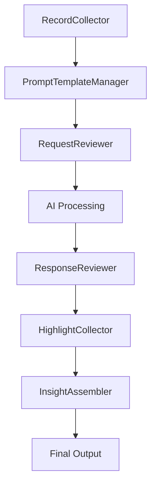

:::slides-astro
- [[slides/augment-it-slides.astro]]
:::
## 1. Executive Summary

This specification defines a data augmentation workflow implemented through a [[Vocabulary/Microfrontend Architecture|Microfrontend Architecture]] using [[Vocabulary/Module Federation|Module Federation]]. 

The system enables distributed processing of content through specialized applications that collect, process, review, and enhance data using AI assistance. The modular approach allows for independent development, deployment, and scaling of individual workflow components while maintaining seamless integrations.

<iframe title="vimeo-player" src="https://player.vimeo.com/video/1120782277" width="100%" height="360" frameborder="0" referrerpolicy="strict-origin-when-cross-origin" allow="autoplay; fullscreen; picture-in-picture; clipboard-write; encrypted-media; web-share"   allowfullscreen></iframe>

## 2. Background & Motivation

- **Problem**: Traditional monolithic data processing workflows are difficult to scale, maintain, and extend with new processing capabilities
- **Current Limitations**: Tight coupling between processing stages, difficulty in independent deployment, and challenges in team collaboration on different workflow components
- **Why Now**: The need for flexible, AI-assisted content processing that can adapt to different data types and processing requirements while enabling distributed development

## 3. Goals & Non-Goals

### Goals
- Create a modular, scalable data augmentation workflow using microfrontends
- Enable independent development and deployment of workflow components
	- Have smaller codebases to navigate, and less for [[concepts/Explainers for AI/Code Generators|Code Generators]] to overwrite or destroy. 
- Provide seamless integration between processing stages
- Support AI-assisted content enhancement and review processes, as detailed in [[projects/ACE-It/Philosophy/Context-Vigilance|Context-Vigilance]].
- Maintain data consistency and traceability throughout the workflow

### Non-Goals
- Real-time streaming data processing (batch processing focus)
- Complex data transformation beyond augmentation and enhancement
- Direct database management (relies on existing data layer)

## 4. Technical Design

### High-Level Architecture

The workflow consists of seven specialized microfrontend applications:

1. **[[projects/Augment-It/Specs/apps-microfrontends/RecordCollector|RecordCollector]]** - Initial data collection and ingestion
2. **[[projects/Augment-It/Specs/apps-microfrontends/PromptTemplateManager|PromptTemplateManager]]** - Template management for AI prompts
3. **[[projects/Augment-It/Specs/apps-microfrontends/RequestReviewer|RequestReviewer]]** - Review and validation of processing requests
4. **[[projects/Augment-It/Specs/apps-microfrontends/ResponseReviewer|ResponseReviewer]]** - Quality assurance for AI-generated responses
5. **[[projects/Augment-It/Specs/apps-microfrontends/HighlightCollector|HighlightCollector]]** - Extraction and collection of key insights
6. **[[projects/Augment-It/Specs/apps-microfrontends/InsightAssembler|InsightAssembler]]** - Final assembly and synthesis of processed data
7. **{{Additional Component}}** - {{To be defined}}

### Detailed Design

#### Module Federation Architecture
- Each application is independently deployable
- Shared dependencies managed through module federation
- Common UI components and utilities shared across applications
- Event-driven communication between microfrontends

#### Docker & Monorepo Integration
- **Containerized Development**: Docker provides consistent development environments across all microfrontends
- **Monorepo Structure**: The entire lossless-monorepo is containerized with proper submodule management
- **Unified Build Process**: Single Dockerfile handles content and site submodules with pnpm workspace configuration
- **Environment Isolation**: Each microfrontend can be developed and tested in isolated Docker containers
- **Deployment Consistency**: Docker ensures identical runtime environments from development to production

#### Data Flow

#### API Specifications
- RESTful APIs for inter-service communication
- GraphQL endpoints for complex data queries
- WebSocket connections for real-time status updates
- Standardized data schemas across all components

### Error Handling
- Graceful degradation when individual microfrontends are unavailable
- Retry mechanisms for failed processing stages
- Comprehensive logging and error tracking
- Rollback capabilities for failed augmentation attempts

## 5. Implementation Plan

### Phase 1: Core Infrastructure
- Set up Docker development environment with monorepo support
- Configure module federation framework
- Implement base microfrontend shell with containerized builds
- Create shared component library accessible across Docker containers
- Establish communication protocols between containerized services

### Phase 2: Individual Applications
- Develop and deploy each microfrontend application
- Implement data processing logic
- Create user interfaces for each component
- Establish testing frameworks

### Phase 3: Integration & Optimization
- End-to-end workflow testing
- Performance optimization
- User experience refinement
- Documentation and training materials

### Dependencies
- Module federation framework (Webpack 5+)
- Shared UI component library
- Common data schemas and validation
- AI processing services integration
- Docker containerization platform
- pnpm workspace configuration for monorepo management
- Git submodule support for content and site repositories

### Testing Strategy
- Unit tests for individual microfrontend logic
- Integration tests for inter-service communication
- End-to-end workflow testing
- Performance and load testing

## 6. Alternatives Considered

### Monolithic Architecture
- **Pros**: Simpler deployment, easier debugging
- **Cons**: Difficult to scale, tight coupling, single point of failure
- **Decision**: Rejected due to scalability and maintainability concerns

### Microservices with Traditional Frontend
- **Pros**: Backend scalability, clear service boundaries
- **Cons**: Frontend remains monolithic, limited UI modularity
- **Decision**: Rejected in favor of full microfrontend approach

## 7. Open Questions

- Specific AI service integration patterns and APIs
- Data persistence strategy across microfrontends
- User authentication and authorization across applications
- Performance monitoring and analytics implementation
- Deployment orchestration and CI/CD pipeline design
- Docker registry strategy for microfrontend container distribution
- Container orchestration approach (Docker Compose vs Kubernetes)

## 8. Appendix

### Glossary
- **Microfrontend**: Independently deployable frontend application that focuses on a specific business capability
- **Module Federation**: Webpack feature that allows sharing of code and dependencies between separate builds
- **Data Augmentation**: Process of enhancing existing data with additional information or AI-generated content

### References
- [Micro Frontends Architecture](https://micro-frontends.org/)
- [Webpack Module Federation Documentation](https://webpack.js.org/concepts/module-federation/)
- Individual application specifications (linked above)

### Revision History
- v0.0.0.1 (2025-07-24): Initial draft with basic application list
- v0.0.0.1 (2025-08-09): Applied specification template structure