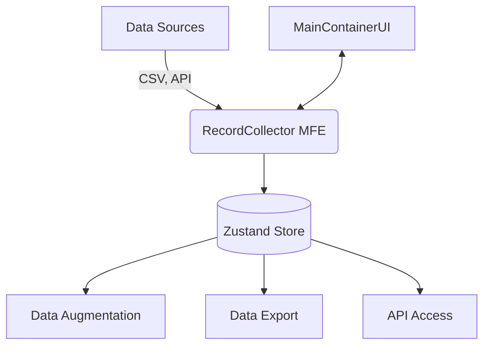

# Executive Summary
The RecordCollector is a microfrontend application that serves as the data ingestion and management layer for the Augment-It platform. It enables users to import customer data from various sources, transform and prepare the data, and make it available for AI-powered augmentation. The application provides an intuitive interface for non-technical users to work with data while offering powerful features for data manipulation and integration.

# Purpose


## 2. Background & Motivation
### Problem Statement
Organizations need to efficiently prepare and manage customer data for AI augmentation, but existing tools often require technical expertise or lack integration with AI workflows.

### Current Limitations
- Disconnected data import and augmentation processes
- Steep learning curve for non-technical users
- Limited support for data transformation before augmentation
- Lack of standardized API access to prepared data

## 3. Goals & Non-Goals
### Goals
1. Provide a user-friendly interface for importing and managing customer data
2. Support multiple data sources including CSV files and API connections
3. Enable basic data transformations and field manipulations
4. Offer API access to prepared data records
5. Generate documentation for data consumers
6. Maintain data integrity and security

### Non-Goals
1. Complex ETL (Extract, Transform, Load) operations
2. Direct database connections (v1)
3. Advanced data visualization
4. Real-time collaboration features

## 4. Technical Design
### High-Level Architecture


### Component Structure
1. **Core Components**
   - `RecordList`: Displays and manages the list of records
   - `RecordDetail`: Shows detailed view of a single record
   - `DataSourceToolbar`: Contains import/export and connection controls
   - `SearchFilter`: Enables searching and filtering of records

2. **Data Import Components**
   - `CSVImporter`: Handles CSV file uploads and parsing
   - `APIConnector`: Manages API-based data connections
   - `DataPreview`: Shows preview of data before import

3. **Utility Components**
   - `DataTransformer`: Provides data transformation tools
   - `FieldMapper`: Maps and renames data fields
   - `DocumentationGenerator`: Creates API documentation

### Data Flow
1. Data is imported via CSV or API connection
2. Records are validated and normalized
3. Data is stored in the Zustand store
4. UI components react to store changes
5. Data is made available for augmentation and export

### State Management
```typescript
interface RecordCollectorState {
  records: Record[];
  selectedRecord: Record | null;
  searchQuery: string;
  isLoading: boolean;
  error: string | null;
  
  // Actions
  addRecords: (records: Record[]) => void;
  deleteRecord: (id: string) => void;
  deleteAllRecords: () => void;
  setSelectedRecord: (record: Record | null) => void;
  updateRecord: (id: string, updates: Partial<Record>) => void;
}
```

## 5. Implementation Plan
### Phase 1: Core Functionality (Completed)
- [x] CSV import with validation
- [x] Basic record management (CRUD operations)
- [x] Search and filter capabilities
- [x] Responsive UI with mobile support

### Phase 2: Advanced Features (In Progress)
- [ ] API-based data source connections
- [ ] Field mapping and transformation
- [ ] Synthetic property creation
- [ ] API documentation generation

### Phase 3: Integration & Polish
- [ ] Deep linking for shared records
- [ ] PDF export of API documentation
- [ ] Performance optimizations
- [ ] Comprehensive test coverage

## 6. API Specifications
### Endpoints
- `GET /api/records` - List all records
- `GET /api/records/:id` - Get a single record
- `POST /api/import/csv` - Import records from CSV
- `POST /api/import/api` - Import records from external API
- `GET /api/docs` - Get API documentation

### Example Request
```javascript
// Get all records
fetch('/api/records')
  .then(response => response.json())
  .then(data => console.log(data));
```

## 7. Error Handling
### Expected Error Cases
1. **Import Errors**
   - Invalid file format
   - Missing required fields
   - Data type mismatches

2. **API Errors**
   - Connection timeouts
   - Authentication failures
   - Rate limiting

3. **Data Validation**
   - Duplicate records
   - Malformed data
   - Required field validation

## 8. Security Considerations
1. **Data Protection**
   - Client-side data validation
   - Input sanitization
   - Secure API communication (HTTPS)

2. **Access Control**
   - Authentication requirements
   - Role-based access control (future)
   - API key management

## 9. Performance Considerations
1. **Client-Side**
   - Virtualized lists for large datasets
   - Debounced search inputs
   - Memoized components

2. **Server-Side**
   - Pagination for large result sets
   - Caching strategies
   - Efficient data serialization

## 10. Appendix
### Glossary
- **Microfrontend**: A self-contained section of a frontend application
- **Zustand**: Lightweight state management solution
- **CSV**: Comma-Separated Values file format

### Dependencies
- React 18+
- Next.js 14
- TypeScript 5+
- Tailwind CSS
- Zustand

### Revision History
- 1.0.0 (2025-08-11): Initial specification
- 0.5.0 (2025-07-15): Core functionality implemented
- 0.1.0 (2025-02-22): Initial draft and first implementation

## Integration with Other Rmotes

The RecordCollector

- Communicates with the parent component through the `onOpenDataModel` prop
- Interacts with the global state to update selected records
- Works in conjunction with other components like DataModelModal

This component serves as the primary interface for managing customer data in the application, providing a robust set of features for data manipulation while maintaining a clean and intuitive user experience.

