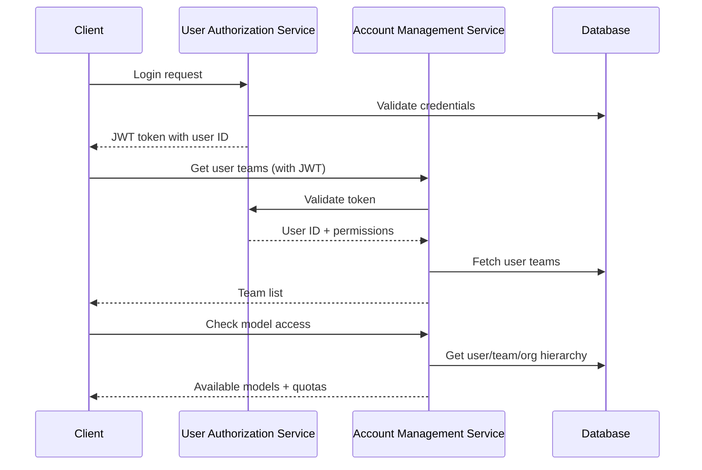
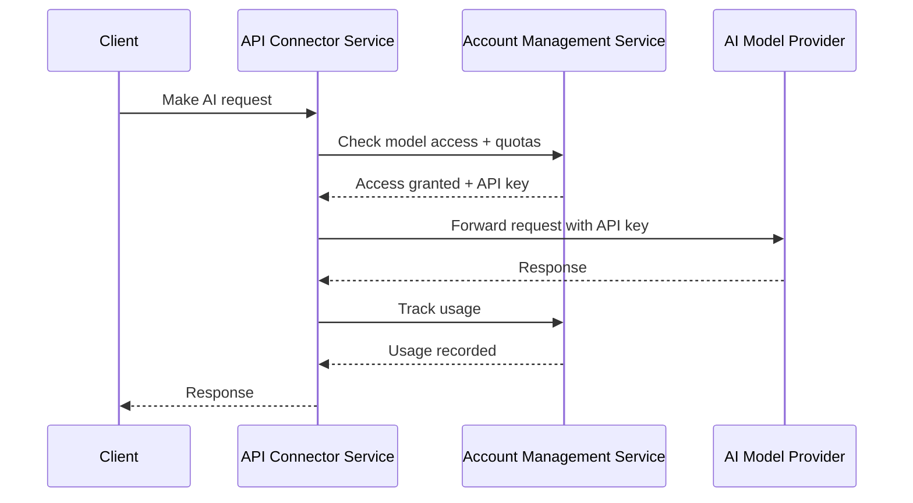
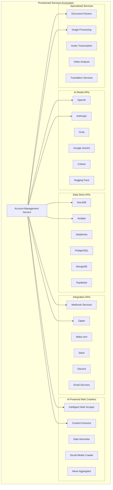
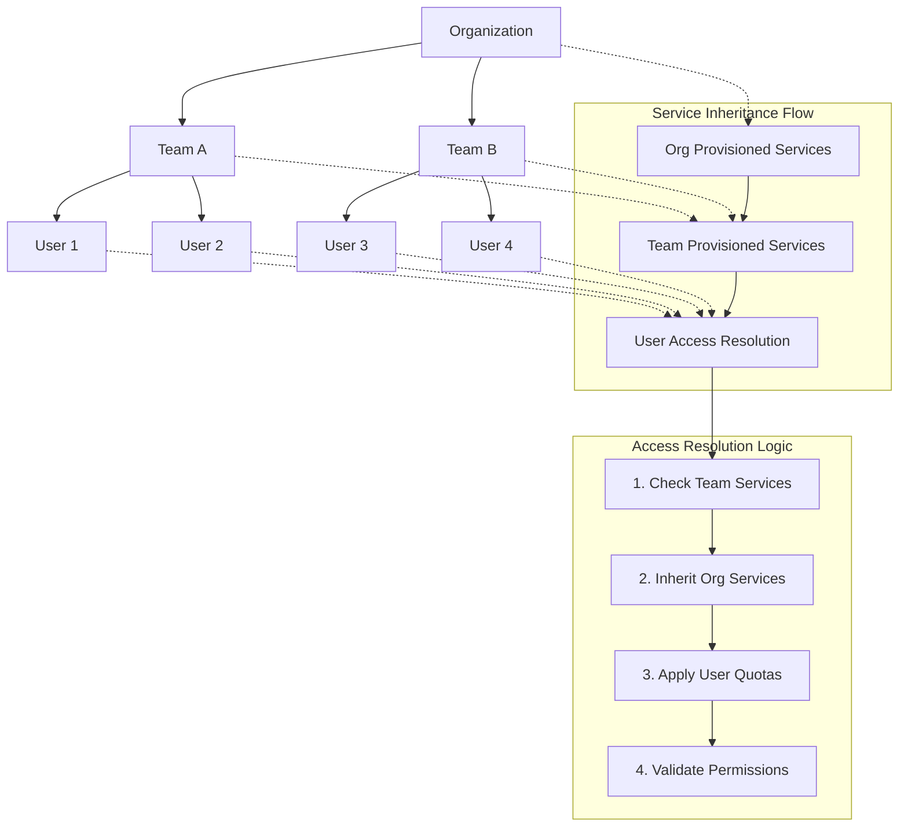
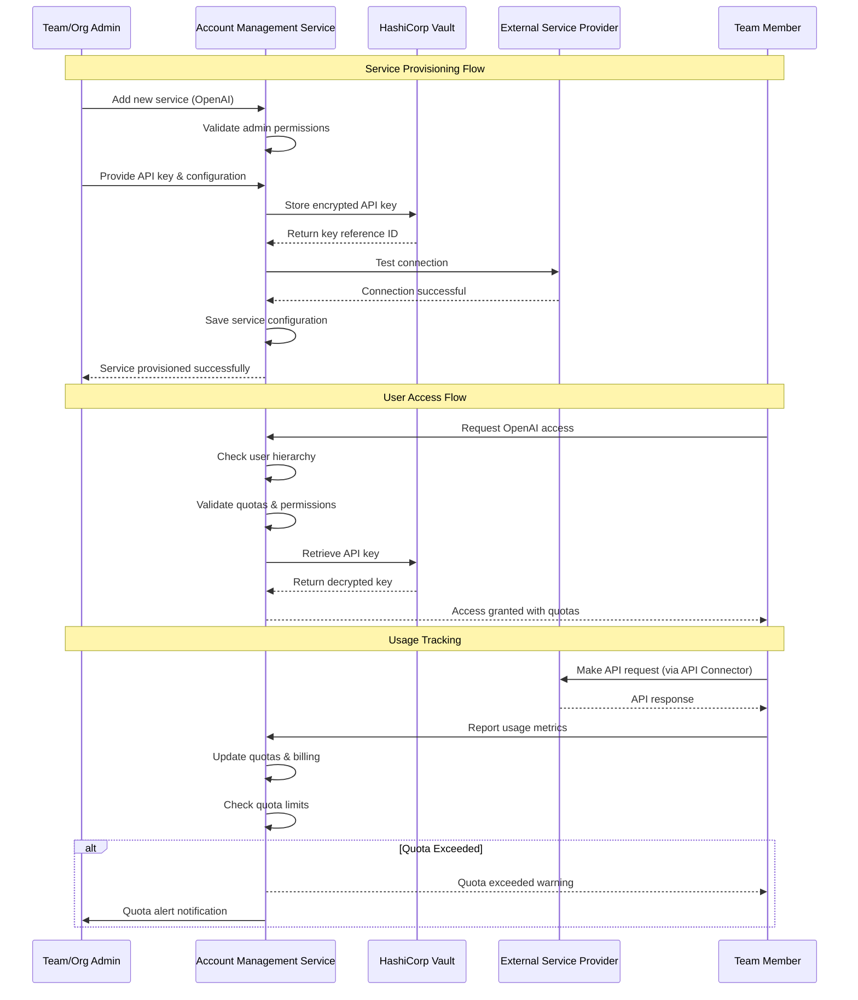

# Account Management Service

## Executive Summary

The Account Management Service is a centralized platform for managing the complete account hierarchy in the Augment-It ecosystem. It handles user profiles, team creation and membership, organization management, billing and payment processing, resource quotas, and access control for AI models and external services. Built as a consolidation of user accounts, team accounts, organization accounts, privilege gates, payment orchestration, and supported models services, it provides a unified interface for all account-related operations while maintaining clear separation from authentication concerns.

## Background & Motivation

### Problem Statement

The Augment-It platform requires a complex multi-tenant architecture where individual users can belong to teams, teams can belong to organizations, and billing/resource access flows through this hierarchy. The original design proposed multiple separate services:

- **userAccountService**: User profile management
- **teamAccountService**: Team creation and membership
- **orgAccountService**: Organization management
- **privilageGatesService**: Resource access control
- **paymentOrchestratorService**: Billing and payment processing
- **teamSupportedModelsService**: Team-level AI model access
- **orgSupportedModelsService**: Organization-level AI model access

This creates several architectural problems:

- **Service Proliferation**: Too many microservices for closely related functionality
- **Data Consistency Issues**: Distributed transactions across multiple services for simple operations
- **Complex Inter-Service Communication**: Basic operations requiring multiple service calls
- **Maintenance Overhead**: Managing and deploying 7+ services for related concerns
- **Performance Issues**: Network latency for authorization decisions requiring multiple lookups
- **Development Complexity**: Coordinating changes across multiple service boundaries

### Why This Solution

- **Single Domain Boundary**: User, team, org, billing, and resource access are all part of the same business domain
- **Data Consistency**: Single database and transaction boundary for related operations
- **Performance**: Fast authorization decisions with single service calls
- **Simplified Architecture**: Easier to understand, test, and maintain
- **Clear Integration**: Well-defined interface with User Authorization Service
- **Scalable Design**: Can be split later if genuine scaling needs arise

## Goals & Non-Goals

### Goals

1. **Unified Account Hierarchy**: Manage users, teams, and organizations in a single cohesive model
2. **Integrated Billing**: Handle payment methods, billing, and usage tracking within the account context
3. **Resource Access Control**: Determine what AI models and services users can access based on their account hierarchy
4. **Team Collaboration**: Enable team creation, invitations, and membership management
5. **Organization Management**: Support enterprise customers with multi-team organizations
6. **Quota Management**: Track and enforce usage limits across the account hierarchy
7. **Payment Processing**: Handle credit cards, billing cycles, and payment orchestration
8. **Usage Analytics**: Provide detailed usage reporting for billing and optimization

### Non-Goals

1. **Authentication**: Handled by User Authorization Service
2. **Session Management**: Not this service's responsibility
3. **AI Model Execution**: Only manages access, not execution
4. **Data Processing**: Business logic handled by individual services
5. **User Interface**: Backend service only

## Technical Design

### High-Level Architecture

```mermaid
graph TD
    A[Microfrontends] --> B[Account Management Service]
    C[User Authorization Service] --> B
    D[API Connector Service] --> B
    
    B --> E[Account Manager]
    B --> F[Team Manager]
    B --> G[Organization Manager]
    B --> H[Billing Manager]
    B --> I[Resource Manager]
    B --> J[Quota Manager]
    
    E --> K[Profile Service]
    E --> L[Preferences Service]
    
    F --> M[Team Repository]
    F --> N[Invitation Service]
    F --> O[Membership Manager]
    
    G --> P[Org Repository]
    G --> Q[Hierarchy Manager]
    
    H --> R[Payment Processor]
    H --> S[Invoice Manager]
    H --> T[Subscription Manager]
    
    I --> U[Model Access Manager]
    I --> V[Service Access Manager]
    I --> W[API Key Manager]
    
    J --> X[Usage Tracker]
    J --> Y[Quota Enforcer]
    J --> Z[Analytics Engine]
    
    subgraph "Data Layer"
        AA[PostgreSQL - Accounts]
        BB[Redis - Cache]
        CC[Vault - API Keys]
    end
    
    subgraph "External Services"
        DD[Stripe/Payment Gateway]
        EE[Email Service]
        FF[AI Model Providers]
    end
    
    M --> AA
    P --> AA
    K --> AA
    R --> DD
    N --> EE
    U --> CC
    
    B --> BB
    
    subgraph "Integration Points"
        GG[User Auth Service]
        HH[API Connector Service]
        II[Parser Services]
        JJ[Shell App]
    end
    
    GG --> |"User validation"| B
    B --> |"Resource access"| HH
    B --> |"Quota checks"| II
    B --> |"Account data"| JJ
```



### Service Relationships

#### With User Authorization Service
- **Clear Boundary**: Auth service handles authentication/authorization, Account service handles account data
- **User Validation**: Account service validates user existence with Auth service
- **Permission Context**: Account service provides team/org context for authorization decisions



#### With API Connector Service
- **Resource Validation**: Account service determines which AI models/APIs user can access
- **API Key Management**: Account service provides appropriate API keys for requests
- **Usage Tracking**: Account service tracks API usage for billing



### Core Components

#### 1. Account Manager
**Responsibility**: User profile and account lifecycle management
**Features**:
- User profile creation and updates
- Account preferences and settings
- Profile picture and metadata management
- Account linking across teams and organizations

#### 2. Team Manager
**Responsibility**: Team creation, membership, and collaboration
**Features**:
- Team creation and configuration
- Member invitation and management
- Role assignment within teams
- Team-level resource allocation

#### 3. Organization Manager
**Responsibility**: Enterprise organization management
**Features**:
- Organization creation and hierarchy
- Multi-team organization structure
- Organization-level policies and settings
- Enterprise billing and compliance

#### 4. Billing Manager
**Responsibility**: Payment processing and billing orchestration
**Features**:
- Payment method management
- Subscription and billing cycle handling
- Invoice generation and delivery
- Usage-based billing calculations

#### 5. Resource Manager
**Responsibility**: AI model and service access control
**Features**:
- Model access configuration per team/org
- API key management and rotation
- Service endpoint provisioning
- Access policy enforcement

#### 6. Quota Manager
**Responsibility**: Usage tracking and quota enforcement
**Features**:
- Real-time usage monitoring
- Quota enforcement and overage handling
- Usage analytics and reporting
- Cost optimization recommendations

#### 7. Provisioned Services Manager
**Responsibility**: Manage all external service integrations across the account hierarchy
**Features**:
- Multi-category service provisioning (AI, Data, Integration, Web Crawlers)
- API key and credential management per service type
- Service-specific quota and cost controls
- Hierarchical service inheritance (User → Team → Organization)
- Service health monitoring and failover configuration

### Provisioned Services Architecture

The Account Management Service handles comprehensive service provisioning across the entire Augment-It ecosystem. Instead of just "supported models", the system manages **Provisioned Services** - all external APIs and services that users, teams, and organizations need access to for their data augmentation workflows.

#### Service Categories



#### Hierarchical Service Inheritance

Services are provisioned and inherited through the account hierarchy:



#### Service Provisioning Workflow



#### Service Configuration Data Model

```typescript
interface ProvisionedService {
  id: string;
  accountId: string; // Team or Organization ID
  accountType: 'team' | 'organization';
  category: ServiceCategory;
  provider: ServiceProvider;
  name: string;
  description?: string;
  configuration: ServiceConfiguration;
  credentials: ServiceCredentials;
  quotas: ServiceQuotas;
  costLimits: CostLimits;
  enabled: boolean;
  healthStatus: ServiceHealthStatus;
  createdAt: Date;
  updatedAt: Date;
  createdBy: string;
}

type ServiceCategory = 
  | 'ai_models'
  | 'data_stores' 
  | 'integrations'
  | 'web_crawlers'
  | 'specialized';

type ServiceProvider = 
  // AI Models
  | 'openai' | 'anthropic' | 'groq' | 'google' | 'cohere' | 'huggingface'
  // Data Stores
  | 'nocodb' | 'airtable' | 'databricks' | 'postgresql' | 'mongodb' | 'supabase'
  // Integrations
  | 'zapier' | 'make' | 'slack' | 'discord' | 'sendgrid' | 'twilio'
  // Web Crawlers
  | 'scrapfly' | 'brightdata' | 'proxycrawl' | 'scraperapi'
  // Specialized
  | 'aws_textract' | 'google_vision' | 'azure_cognitive' | 'deepgram';

interface ServiceConfiguration {
  baseUrl?: string;
  region?: string;
  version?: string;
  features: ServiceFeature[];
  parameters: Record<string, any>;
  retryPolicy: RetryPolicy;
  timeoutMs: number;
}

interface ServiceFeature {
  name: string;
  enabled: boolean;
  config?: Record<string, any>;
  quotas?: FeatureQuotas;
}

interface ServiceCredentials {
  keyId: string; // Reference to encrypted key in Vault
  keyType: 'api_key' | 'oauth2' | 'jwt' | 'basic_auth' | 'custom';
  additionalSecrets?: Record<string, string>; // Additional encrypted values
  rotationPolicy?: KeyRotationPolicy;
}

interface ServiceQuotas {
  requestsPerMinute?: number;
  requestsPerHour?: number;
  requestsPerDay?: number;
  requestsPerMonth?: number;
  dataPerDay?: number; // in MB
  concurrentRequests?: number;
  customQuotas?: Record<string, number>;
}

interface CostLimits {
  dailyLimit?: number;
  monthlyLimit?: number;
  perRequestLimit?: number;
  currency: string;
  alertThresholds: AlertThreshold[];
}

interface AlertThreshold {
  percentage: number; // e.g., 80 for 80% of limit
  recipients: string[]; // email addresses
  actions: AlertAction[];
}

type AlertAction = 'email' | 'slack' | 'webhook' | 'disable_service';

interface ServiceHealthStatus {
  isHealthy: boolean;
  lastChecked: Date;
  responseTime: number;
  uptime: number; // percentage
  errorRate: number; // percentage
  lastError?: string;
}
```

#### Service Access Resolution Engine

```typescript
class ServiceAccessManager {
  constructor(
    private accountRepo: AccountRepository,
    private vaultService: VaultService,
    private quotaManager: QuotaManager
  ) {}

  public async getUserAvailableServices(userId: string): Promise<AvailableServices> {
    const hierarchy = await this.getAccountHierarchy(userId);
    const allServices: ProvisionedService[] = [];
    
    // Collect services from all levels in hierarchy
    for (const level of hierarchy) {
      const services = await this.getAccountServices(level.id, level.type);
      allServices.push(...services);
    }
    
    // Deduplicate and resolve conflicts (team overrides org, etc.)
    const resolvedServices = this.resolveServiceConflicts(allServices);
    
    // Apply user-specific quotas and permissions
    const availableServices: AvailableServices = {
      aiModels: [],
      dataStores: [],
      integrations: [],
      webCrawlers: [],
      specialized: []
    };
    
    for (const service of resolvedServices) {
      if (service.enabled) {
        const userAccess = await this.calculateUserAccess(userId, service);
        const serviceInfo: ServiceInfo = {
          id: service.id,
          provider: service.provider,
          name: service.name,
          features: service.configuration.features,
          quotas: userAccess.quotas,
          costLimits: userAccess.costLimits,
          healthStatus: service.healthStatus
        };
        
        // Categorize service
        switch (service.category) {
          case 'ai_models':
            availableServices.aiModels.push(serviceInfo);
            break;
          case 'data_stores':
            availableServices.dataStores.push(serviceInfo);
            break;
          case 'integrations':
            availableServices.integrations.push(serviceInfo);
            break;
          case 'web_crawlers':
            availableServices.webCrawlers.push(serviceInfo);
            break;
          case 'specialized':
            availableServices.specialized.push(serviceInfo);
            break;
        }
      }
    }
    
    return availableServices;
  }
  
  public async checkServiceAccess(
    userId: string, 
    provider: ServiceProvider, 
    feature?: string
  ): Promise<ServiceAccessResult> {
    
    const hierarchy = await this.getAccountHierarchy(userId);
    
    // Find service in hierarchy (team services override org services)
    for (const level of hierarchy) {
      const service = await this.findServiceInAccount(level.id, level.type, provider);
      if (service && service.enabled) {
        
        // Check feature access if specified
        if (feature) {
          const featureConfig = service.configuration.features.find(f => f.name === feature);
          if (!featureConfig || !featureConfig.enabled) {
            continue; // Try next level in hierarchy
          }
        }
        
        // Check quotas
        const quotaStatus = await this.quotaManager.checkServiceQuota(
          userId, 
          service.id, 
          feature
        );
        
        if (!quotaStatus.withinLimits && quotaStatus.hardLimit) {
          return {
            hasAccess: false,
            reason: 'Quota exceeded',
            quotaStatus
          };
        }
        
        return {
          hasAccess: true,
          serviceId: service.id,
          accountLevel: level.type,
          quotaStatus,
          costLimits: service.costLimits
        };
      }
    }
    
    return {
      hasAccess: false,
      reason: `No access configured for ${provider}${feature ? ` feature: ${feature}` : ''}`
    };
  }
  
  public async getServiceCredentials(
    userId: string, 
    provider: ServiceProvider
  ): Promise<ServiceCredentials> {
    
    const accessResult = await this.checkServiceAccess(userId, provider);
    if (!accessResult.hasAccess) {
      throw new Error(`Access denied for ${provider}`);
    }
    
    const service = await this.accountRepo.getProvisionedService(accessResult.serviceId);
    
    // Decrypt credentials from vault
    const apiKey = await this.vaultService.getSecret(service.credentials.keyId);
    const additionalSecrets: Record<string, string> = {};
    
    if (service.credentials.additionalSecrets) {
      for (const [key, secretId] of Object.entries(service.credentials.additionalSecrets)) {
        additionalSecrets[key] = await this.vaultService.getSecret(secretId);
      }
    }
    
    return {
      apiKey,
      keyType: service.credentials.keyType,
      additionalSecrets,
      serviceConfig: service.configuration
    };
  }
  
  private resolveServiceConflicts(services: ProvisionedService[]): ProvisionedService[] {
    const serviceMap = new Map<string, ProvisionedService>();
    
    // Sort by precedence: team services override org services
    const sortedServices = services.sort((a, b) => {
      if (a.provider !== b.provider) return 0;
      
      // Team level takes precedence over org level
      if (a.accountType === 'team' && b.accountType === 'organization') return -1;
      if (a.accountType === 'organization' && b.accountType === 'team') return 1;
      
      // More recent services take precedence
      return b.updatedAt.getTime() - a.updatedAt.getTime();
    });
    
    for (const service of sortedServices) {
      const key = `${service.provider}`;
      if (!serviceMap.has(key)) {
        serviceMap.set(key, service);
      }
    }
    
    return Array.from(serviceMap.values());
  }
  
  private async calculateUserAccess(
    userId: string, 
    service: ProvisionedService
  ): Promise<UserServiceAccess> {
    
    // Get user's role in the account that provides this service
    const userRole = await this.getUserRoleInAccount(
      userId, 
      service.accountId, 
      service.accountType
    );
    
    // Apply role-based quota multipliers
    const quotaMultiplier = this.getQuotaMultiplier(userRole);
    const adjustedQuotas = this.applyQuotaMultiplier(service.quotas, quotaMultiplier);
    
    return {
      quotas: adjustedQuotas,
      costLimits: service.costLimits,
      permissions: this.getRolePermissions(userRole)
    };
  }
  
  private getQuotaMultiplier(role: TeamRole): number {
    const multipliers: Record<TeamRole, number> = {
      'owner': 1.0,
      'admin': 1.0,
      'member': 0.8,
      'viewer': 0.5
    };
    return multipliers[role] || 0.5;
  }
}

interface AvailableServices {
  aiModels: ServiceInfo[];
  dataStores: ServiceInfo[];
  integrations: ServiceInfo[];
  webCrawlers: ServiceInfo[];
  specialized: ServiceInfo[];
}

interface ServiceInfo {
  id: string;
  provider: ServiceProvider;
  name: string;
  features: ServiceFeature[];
  quotas: ServiceQuotas;
  costLimits: CostLimits;
  healthStatus: ServiceHealthStatus;
}

interface ServiceAccessResult {
  hasAccess: boolean;
  serviceId?: string;
  accountLevel?: 'team' | 'organization';
  quotaStatus?: QuotaStatus;
  costLimits?: CostLimits;
  reason?: string;
}

interface UserServiceAccess {
  quotas: ServiceQuotas;
  costLimits: CostLimits;
  permissions: string[];
}
```

#### Service Management Interface

```typescript
interface ProvisionedServicesAPI {
  // Service Provisioning
  provisionService(
    accountId: string, 
    accountType: 'team' | 'organization',
    serviceData: CreateProvisionedServiceRequest
  ): Promise<ProvisionedService>;
  
  updateProvisionedService(
    serviceId: string, 
    updates: Partial<ProvisionedService>
  ): Promise<ProvisionedService>;
  
  removeProvisionedService(serviceId: string): Promise<void>;
  
  // Service Discovery
  getAvailableServices(userId: string): Promise<AvailableServices>;
  getProvisionedServices(
    accountId: string, 
    accountType: 'team' | 'organization'
  ): Promise<ProvisionedService[]>;
  
  // Access Control
  checkServiceAccess(
    userId: string, 
    provider: ServiceProvider, 
    feature?: string
  ): Promise<ServiceAccessResult>;
  
  getServiceCredentials(
    userId: string, 
    provider: ServiceProvider
  ): Promise<ServiceCredentials>;
  
  // Service Health
  checkServiceHealth(serviceId: string): Promise<ServiceHealthStatus>;
  getServiceHealthHistory(
    serviceId: string, 
    period: DateRange
  ): Promise<ServiceHealthMetric[]>;
  
  // Usage and Quotas
  trackServiceUsage(
    userId: string, 
    serviceId: string, 
    usage: ServiceUsageData
  ): Promise<void>;
  
  getServiceUsage(
    accountId: string, 
    accountType: 'team' | 'organization',
    period: DateRange
  ): Promise<ServiceUsageMetrics>;
  
  updateServiceQuotas(
    serviceId: string, 
    quotas: ServiceQuotas
  ): Promise<void>;
  
  // Cost Management
  getServiceCosts(
    accountId: string, 
    accountType: 'team' | 'organization',
    period: DateRange
  ): Promise<ServiceCostBreakdown>;
  
  // Credential Management
  rotateServiceCredentials(serviceId: string): Promise<void>;
  testServiceConnection(serviceId: string): Promise<ServiceConnectionTest>;
}
```

### API Specifications

#### Core Data Models

```typescript
interface User {
  id: string;
  email: string;
  profile: UserProfile;
  preferences: UserPreferences;
  teamMemberships: TeamMembership[];
  createdAt: Date;
  updatedAt: Date;
}

interface UserProfile {
  firstName?: string;
  lastName?: string;
  displayName?: string;
  avatar?: string;
  bio?: string;
  timezone?: string;
  locale?: string;
  phoneNumber?: string;
  company?: string;
  jobTitle?: string;
}

interface UserPreferences {
  notifications: NotificationSettings;
  privacy: PrivacySettings;
  ui: UIPreferences;
  integrations: IntegrationSettings;
}

interface Team {
  id: string;
  name: string;
  description?: string;
  organizationId?: string;
  avatar?: string;
  settings: TeamSettings;
  members: TeamMembership[];
  modelAccess: ModelAccess[];
  billingInfo: BillingInfo;
  quotas: QuotaSettings;
  createdAt: Date;
  updatedAt: Date;
}

interface Organization {
  id: string;
  name: string;
  description?: string;
  domain?: string; // for email-based auto-joining
  avatar?: string;
  settings: OrganizationSettings;
  teams: Team[];
  paymentMethods: PaymentMethod[];
  billingInfo: BillingInfo;
  modelAccess: ModelAccess[];
  quotas: QuotaSettings;
  compliance: ComplianceSettings;
  createdAt: Date;
  updatedAt: Date;
}

interface TeamMembership {
  id: string;
  userId: string;
  teamId: string;
  role: TeamRole;
  permissions: TeamPermission[];
  joinedAt: Date;
  invitedBy?: string;
}

type TeamRole = 'owner' | 'admin' | 'member' | 'viewer';

interface TeamPermission {
  resource: string;
  actions: string[];
  conditions?: PolicyCondition[];
}

interface ModelAccess {
  provider: AIProvider;
  models: ModelConfiguration[];
  apiKeyId: string; // Reference to encrypted key in Vault
  enabled: boolean;
  quotas: ModelQuotas;
  costLimits: CostLimits;
  createdAt: Date;
}

type AIProvider = 'openai' | 'anthropic' | 'groq' | 'google' | 'cohere' | 'huggingface';

interface ModelConfiguration {
  name: string;
  enabled: boolean;
  parameters?: ModelParameters;
  costPerToken?: number;
  quotas?: ModelQuotas;
}

interface ModelQuotas {
  requestsPerMinute?: number;
  requestsPerDay?: number;
  tokensPerMinute?: number;
  tokensPerDay?: number;
  maxCostPerDay?: number;
}

interface BillingInfo {
  customerId: string; // Stripe customer ID
  subscriptionId?: string;
  planType: PlanType;
  billingCycle: BillingCycle;
  currentUsage: UsageMetrics;
  invoices: Invoice[];
  paymentHistory: PaymentRecord[];
}

type PlanType = 'free' | 'starter' | 'professional' | 'enterprise';
type BillingCycle = 'monthly' | 'yearly';

interface PaymentMethod {
  id: string;
  type: 'card' | 'bank' | 'paypal';
  details: PaymentMethodDetails;
  isDefault: boolean;
  createdAt: Date;
}

interface UsageMetrics {
  period: {
    start: Date;
    end: Date;
  };
  aiModelUsage: ModelUsage[];
  totalCost: number;
  requestCount: number;
  tokenCount: number;
}

interface ModelUsage {
  provider: AIProvider;
  model: string;
  requestCount: number;
  tokenCount: number;
  cost: number;
}
```

#### Main Service Interface

```typescript
interface AccountManagementService {
  // User Account Management
  createUserAccount(userData: CreateUserRequest): Promise<User>;
  updateUserProfile(userId: string, profile: Partial<UserProfile>): Promise<User>;
  updateUserPreferences(userId: string, preferences: Partial<UserPreferences>): Promise<User>;
  getUserAccount(userId: string): Promise<User>;
  deleteUserAccount(userId: string): Promise<void>;
  
  // Team Management
  createTeam(creatorId: string, teamData: CreateTeamRequest): Promise<Team>;
  updateTeam(teamId: string, updates: Partial<Team>): Promise<Team>;
  deleteTeam(teamId: string): Promise<void>;
  getTeam(teamId: string): Promise<Team>;
  getUserTeams(userId: string): Promise<Team[]>;
  
  // Team Membership
  inviteUserToTeam(teamId: string, email: string, role: TeamRole, invitedBy: string): Promise<TeamInvitation>;
  acceptTeamInvitation(invitationToken: string): Promise<TeamMembership>;
  rejectTeamInvitation(invitationToken: string): Promise<void>;
  updateTeamMembership(membershipId: string, updates: Partial<TeamMembership>): Promise<TeamMembership>;
  removeTeamMember(teamId: string, userId: string): Promise<void>;
  leaveTeam(teamId: string, userId: string): Promise<void>;
  
  // Organization Management
  createOrganization(creatorId: string, orgData: CreateOrganizationRequest): Promise<Organization>;
  updateOrganization(orgId: string, updates: Partial<Organization>): Promise<Organization>;
  deleteOrganization(orgId: string): Promise<void>;
  getOrganization(orgId: string): Promise<Organization>;
  addTeamToOrganization(orgId: string, teamId: string): Promise<void>;
  removeTeamFromOrganization(orgId: string, teamId: string): Promise<void>;
  
  // Resource Access Management
  addModelAccess(accountId: string, accountType: 'team' | 'org', modelAccess: ModelAccess): Promise<void>;
  updateModelAccess(accessId: string, updates: Partial<ModelAccess>): Promise<ModelAccess>;
  removeModelAccess(accessId: string): Promise<void>;
  getUserAvailableModels(userId: string): Promise<AvailableModels>;
  checkModelAccess(userId: string, provider: AIProvider, model: string): Promise<ModelAccessResult>;
  
  // API Key Management
  addAPIKey(accountId: string, accountType: 'team' | 'org', provider: AIProvider, apiKey: string): Promise<string>;
  rotateAPIKey(keyId: string, newKey: string): Promise<void>;
  removeAPIKey(keyId: string): Promise<void>;
  getAPIKeyForUser(userId: string, provider: AIProvider): Promise<string>;
  
  // Billing and Payment
  addPaymentMethod(accountId: string, accountType: 'team' | 'org', paymentMethod: PaymentMethodData): Promise<PaymentMethod>;
  updatePaymentMethod(paymentMethodId: string, updates: Partial<PaymentMethodData>): Promise<PaymentMethod>;
  removePaymentMethod(paymentMethodId: string): Promise<void>;
  setDefaultPaymentMethod(paymentMethodId: string): Promise<void>;
  getPaymentMethods(accountId: string, accountType: 'team' | 'org'): Promise<PaymentMethod[]>;
  
  // Subscription Management
  createSubscription(accountId: string, accountType: 'team' | 'org', planType: PlanType): Promise<Subscription>;
  updateSubscription(subscriptionId: string, changes: SubscriptionUpdate): Promise<Subscription>;
  cancelSubscription(subscriptionId: string): Promise<void>;
  
  // Usage Tracking and Quotas
  trackModelUsage(userId: string, provider: AIProvider, model: string, usage: UsageData): Promise<void>;
  getUserUsage(userId: string, period: DateRange): Promise<UsageMetrics>;
  getTeamUsage(teamId: string, period: DateRange): Promise<UsageMetrics>;
  getOrganizationUsage(orgId: string, period: DateRange): Promise<UsageMetrics>;
  checkQuota(userId: string, provider: AIProvider, model: string): Promise<QuotaStatus>;
  updateQuotas(accountId: string, accountType: 'team' | 'org', quotas: QuotaSettings): Promise<void>;
  
  // Billing and Invoicing
  generateInvoice(accountId: string, accountType: 'team' | 'org', period: DateRange): Promise<Invoice>;
  getInvoices(accountId: string, accountType: 'team' | 'org'): Promise<Invoice[]>;
  payInvoice(invoiceId: string): Promise<PaymentResult>;
  
  // Analytics and Reporting
  getUsageAnalytics(accountId: string, accountType: 'team' | 'org', period: DateRange): Promise<UsageAnalytics>;
  getCostAnalytics(accountId: string, accountType: 'team' | 'org', period: DateRange): Promise<CostAnalytics>;
  getPerformanceMetrics(accountId: string, accountType: 'team' | 'org'): Promise<PerformanceMetrics>;
  
  // Administrative
  getAccountHierarchy(userId: string): Promise<AccountHierarchy>;
  transferTeamOwnership(teamId: string, newOwnerId: string): Promise<void>;
  transferOrganizationOwnership(orgId: string, newOwnerId: string): Promise<void>;
  suspendAccount(accountId: string, accountType: 'user' | 'team' | 'org', reason: string): Promise<void>;
  reactivateAccount(accountId: string, accountType: 'user' | 'team' | 'org'): Promise<void>;
}
```

#### Team Invitation Implementation

```typescript
class TeamInvitationManager {
  constructor(
    private emailService: EmailService,
    private teamRepository: TeamRepository,
    private userRepository: UserRepository
  ) {}

  public async inviteUserToTeam(
    teamId: string, 
    email: string, 
    role: TeamRole, 
    invitedBy: string
  ): Promise<TeamInvitation> {
    
    // Validate team exists and inviter has permission
    const team = await this.teamRepository.findById(teamId);
    if (!team) {
      throw new Error('Team not found');
    }

    const inviterMembership = team.members.find(m => m.userId === invitedBy);
    if (!inviterMembership || !this.canInviteMembers(inviterMembership.role)) {
      throw new Error('Insufficient permissions to invite members');
    }

    // Check if user already exists
    const existingUser = await this.userRepository.findByEmail(email);
    
    // Generate invitation token
    const invitationToken = this.generateInvitationToken();
    const expiresAt = new Date(Date.now() + 7 * 24 * 60 * 60 * 1000); // 7 days

    const invitation: TeamInvitation = {
      id: uuidv4(),
      teamId,
      email,
      role,
      invitedBy,
      token: invitationToken,
      status: 'pending',
      expiresAt,
      createdAt: new Date()
    };

    // Store invitation
    await this.teamRepository.saveInvitation(invitation);

    // Send invitation email
    await this.sendInvitationEmail(invitation, team, existingUser);

    return invitation;
  }

  public async acceptInvitation(token: string): Promise<TeamMembership> {
    const invitation = await this.teamRepository.findInvitationByToken(token);
    if (!invitation || invitation.status !== 'pending') {
      throw new Error('Invalid or expired invitation');
    }

    if (invitation.expiresAt < new Date()) {
      throw new Error('Invitation has expired');
    }

    // Get or create user
    let user = await this.userRepository.findByEmail(invitation.email);
    if (!user) {
      // Create minimal user record - they'll complete registration later
      user = await this.userRepository.create({
        email: invitation.email,
        profile: { displayName: invitation.email.split('@')[0] },
        status: 'pending_verification'
      });
    }

    // Create team membership
    const membership: TeamMembership = {
      id: uuidv4(),
      userId: user.id,
      teamId: invitation.teamId,
      role: invitation.role,
      permissions: this.getDefaultPermissions(invitation.role),
      joinedAt: new Date(),
      invitedBy: invitation.invitedBy
    };

    await this.teamRepository.addMember(membership);
    
    // Update invitation status
    await this.teamRepository.updateInvitation(invitation.id, { 
      status: 'accepted',
      acceptedAt: new Date()
    });

    return membership;
  }

  private async sendInvitationEmail(
    invitation: TeamInvitation, 
    team: Team, 
    existingUser?: User
  ): Promise<void> {
    const inviterUser = await this.userRepository.findById(invitation.invitedBy);
    const acceptUrl = `${process.env.APP_URL}/invite/${invitation.token}`;

    await this.emailService.sendTemplate(invitation.email, 'team-invitation', {
      teamName: team.name,
      inviterName: inviterUser?.profile.displayName || inviterUser?.email,
      role: invitation.role,
      acceptUrl,
      isExistingUser: !!existingUser,
      expiresAt: invitation.expiresAt
    });
  }

  private canInviteMembers(role: TeamRole): boolean {
    return ['owner', 'admin'].includes(role);
  }

  private generateInvitationToken(): string {
    return crypto.randomBytes(32).toString('hex');
  }

  private getDefaultPermissions(role: TeamRole): TeamPermission[] {
    const basePermissions: Record<TeamRole, TeamPermission[]> = {
      owner: [
        { resource: '*', actions: ['*'] }
      ],
      admin: [
        { resource: 'team', actions: ['read', 'update'] },
        { resource: 'members', actions: ['read', 'invite', 'remove'] },
        { resource: 'models', actions: ['read', 'use'] },
        { resource: 'billing', actions: ['read'] }
      ],
      member: [
        { resource: 'team', actions: ['read'] },
        { resource: 'members', actions: ['read'] },
        { resource: 'models', actions: ['read', 'use'] }
      ],
      viewer: [
        { resource: 'team', actions: ['read'] },
        { resource: 'models', actions: ['read'] }
      ]
    };

    return basePermissions[role] || [];
  }
}
```

#### Resource Access Control Implementation

```typescript
class ResourceAccessManager {
  constructor(
    private accountRepo: AccountRepository,
    private vaultService: VaultService
  ) {}

  public async checkModelAccess(
    userId: string, 
    provider: AIProvider, 
    model: string
  ): Promise<ModelAccessResult> {
    
    // Get user's account hierarchy
    const hierarchy = await this.getAccountHierarchy(userId);
    
    // Check access at each level (user -> team -> org)
    for (const level of hierarchy) {
      const access = await this.checkLevelAccess(level, provider, model);
      if (access.hasAccess) {
        // Check quotas
        const quotaStatus = await this.checkQuotas(userId, level, provider, model);
        
        return {
          hasAccess: true,
          level: level.type,
          accountId: level.id,
          apiKeyId: access.apiKeyId,
          quotas: access.quotas,
          quotaStatus,
          costLimits: access.costLimits
        };
      }
    }

    return {
      hasAccess: false,
      reason: 'No access configured for this model'
    };
  }

  public async getAPIKeyForUser(userId: string, provider: AIProvider): Promise<string> {
    const hierarchy = await this.getAccountHierarchy(userId);
    
    for (const level of hierarchy) {
      const modelAccess = await this.getLevelModelAccess(level.id, level.type, provider);
      if (modelAccess && modelAccess.enabled && modelAccess.apiKeyId) {
        // Decrypt API key from vault
        return await this.vaultService.getSecret(modelAccess.apiKeyId);
      }
    }

    throw new Error(`No API key configured for ${provider}`);
  }

  public async trackUsage(
    userId: string, 
    provider: AIProvider, 
    model: string, 
    usage: UsageData
  ): Promise<void> {
    
    const hierarchy = await this.getAccountHierarchy(userId);
    const accessResult = await this.checkModelAccess(userId, provider, model);
    
    if (!accessResult.hasAccess) {
      throw new Error('Access denied for usage tracking');
    }

    // Track usage at the account level that provides access
    const usageRecord: UsageRecord = {
      id: uuidv4(),
      userId,
      accountId: accessResult.accountId,
      accountType: accessResult.level,
      provider,
      model,
      requestCount: usage.requestCount,
      tokenCount: usage.tokenCount,
      cost: usage.cost,
      metadata: usage.metadata,
      timestamp: new Date()
    };

    await this.accountRepo.saveUsageRecord(usageRecord);
    
    // Update real-time usage counters
    await this.updateUsageCounters(accessResult.accountId, accessResult.level, usage);
    
    // Check if usage exceeds any limits
    await this.checkAndEnforceQuotas(userId, accessResult.accountId, accessResult.level, provider, model);
  }

  private async getAccountHierarchy(userId: string): Promise<AccountLevel[]> {
    const user = await this.accountRepo.getUserWithHierarchy(userId);
    const hierarchy: AccountLevel[] = [];

    // Start with user's teams
    for (const membership of user.teamMemberships) {
      const team = await this.accountRepo.getTeam(membership.teamId);
      hierarchy.push({
        type: 'team',
        id: team.id,
        name: team.name,
        permissions: membership.permissions
      });

      // Add organization if team belongs to one
      if (team.organizationId) {
        const org = await this.accountRepo.getOrganization(team.organizationId);
        hierarchy.push({
          type: 'organization',
          id: org.id,
          name: org.name,
          permissions: [] // Org permissions inherited through team
        });
      }
    }

    // Remove duplicates and sort by precedence (org -> team -> user)
    return this.deduplicateAndSort(hierarchy);
  }

  private async checkLevelAccess(
    level: AccountLevel, 
    provider: AIProvider, 
    model: string
  ): Promise<LevelAccessResult> {
    
    const modelAccess = await this.getLevelModelAccess(level.id, level.type, provider);
    
    if (!modelAccess || !modelAccess.enabled) {
      return { hasAccess: false };
    }

    // Check if specific model is enabled
    const modelConfig = modelAccess.models.find(m => m.name === model);
    if (!modelConfig || !modelConfig.enabled) {
      return { hasAccess: false };
    }

    return {
      hasAccess: true,
      apiKeyId: modelAccess.apiKeyId,
      quotas: modelConfig.quotas || modelAccess.quotas,
      costLimits: modelAccess.costLimits
    };
  }

  private async checkQuotas(
    userId: string, 
    level: AccountLevel, 
    provider: AIProvider, 
    model: string
  ): Promise<QuotaStatus> {
    
    const currentUsage = await this.getCurrentUsage(level.id, level.type, provider, model);
    const quotas = await this.getQuotas(level.id, level.type, provider, model);

    const status: QuotaStatus = {
      withinLimits: true,
      usage: currentUsage,
      limits: quotas,
      warnings: []
    };

    // Check various quota limits
    if (quotas.requestsPerMinute && currentUsage.requestsPerMinute >= quotas.requestsPerMinute) {
      status.withinLimits = false;
      status.warnings.push('Requests per minute limit exceeded');
    }

    if (quotas.requestsPerDay && currentUsage.requestsPerDay >= quotas.requestsPerDay) {
      status.withinLimits = false;
      status.warnings.push('Daily request limit exceeded');
    }

    if (quotas.maxCostPerDay && currentUsage.costPerDay >= quotas.maxCostPerDay) {
      status.withinLimits = false;
      status.warnings.push('Daily cost limit exceeded');
    }

    return status;
  }
}

interface ModelAccessResult {
  hasAccess: boolean;
  level?: 'team' | 'organization';
  accountId?: string;
  apiKeyId?: string;
  quotas?: ModelQuotas;
  quotaStatus?: QuotaStatus;
  costLimits?: CostLimits;
  reason?: string;
}

interface AccountLevel {
  type: 'team' | 'organization';
  id: string;
  name: string;
  permissions: TeamPermission[];
}

interface QuotaStatus {
  withinLimits: boolean;
  usage: CurrentUsage;
  limits: ModelQuotas;
  warnings: string[];
}
```

#### Billing and Payment Integration

```typescript
class BillingManager {
  constructor(
    private stripeService: StripeService,
    private accountRepo: AccountRepository,
    private emailService: EmailService
  ) {}

  public async addPaymentMethod(
    accountId: string, 
    accountType: 'team' | 'org', 
    paymentMethodData: PaymentMethodData
  ): Promise<PaymentMethod> {
    
    // Get or create Stripe customer
    const account = await this.getAccount(accountId, accountType);
    let customerId = account.billingInfo?.customerId;
    
    if (!customerId) {
      const customer = await this.stripeService.customers.create({
        email: account.billingEmail,
        name: account.name,
        metadata: {
          accountId,
          accountType
        }
      });
      customerId = customer.id;
      
      // Update account with customer ID
      await this.updateBillingInfo(accountId, accountType, { customerId });
    }

    // Create payment method in Stripe
    const stripePaymentMethod = await this.stripeService.paymentMethods.create({
      type: paymentMethodData.type,
      ...paymentMethodData.details
    });

    // Attach to customer
    await this.stripeService.paymentMethods.attach(stripePaymentMethod.id, {
      customer: customerId
    });

    const paymentMethod: PaymentMethod = {
      id: uuidv4(),
      stripePaymentMethodId: stripePaymentMethod.id,
      type: paymentMethodData.type,
      details: this.extractPaymentMethodDetails(stripePaymentMethod),
      isDefault: false,
      createdAt: new Date()
    };

    await this.accountRepo.savePaymentMethod(accountId, accountType, paymentMethod);
    
    return paymentMethod;
  }

  public async processUsageBilling(
    accountId: string, 
    accountType: 'team' | 'org', 
    period: DateRange
  ): Promise<Invoice> {
    
    const usage = await this.calculateUsageForPeriod(accountId, accountType, period);
    const account = await this.getAccount(accountId, accountType);
    
    if (usage.totalCost === 0) {
      // No usage, no invoice needed
      return null;
    }

    // Create invoice items in Stripe
    const invoiceItems = await Promise.all(
      usage.aiModelUsage.map(modelUsage => 
        this.stripeService.invoiceItems.create({
          customer: account.billingInfo.customerId,
          amount: Math.round(modelUsage.cost * 100), // Convert to cents
          currency: 'usd',
          description: `${modelUsage.provider} ${modelUsage.model} - ${modelUsage.requestCount} requests, ${modelUsage.tokenCount} tokens`,
          period: {
            start: Math.floor(period.start.getTime() / 1000),
            end: Math.floor(period.end.getTime() / 1000)
          }
        })
      )
    );

    // Create invoice
    const stripeInvoice = await this.stripeService.invoices.create({
      customer: account.billingInfo.customerId,
      collection_method: 'charge_automatically',
      auto_advance: true
    });

    // Finalize and pay invoice
    const finalizedInvoice = await this.stripeService.invoices.finalizeInvoice(stripeInvoice.id);
    
    const invoice: Invoice = {
      id: uuidv4(),
      stripeInvoiceId: finalizedInvoice.id,
      accountId,
      accountType,
      period,
      items: usage.aiModelUsage.map(modelUsage => ({
        description: `${modelUsage.provider} ${modelUsage.model}`,
        quantity: modelUsage.requestCount,
        unitPrice: modelUsage.cost / modelUsage.requestCount,
        totalPrice: modelUsage.cost
      })),
      subtotal: usage.totalCost,
      tax: finalizedInvoice.tax || 0,
      total: finalizedInvoice.total / 100,
      status: finalizedInvoice.status as InvoiceStatus,
      paidAt: finalizedInvoice.status_transitions?.paid_at ? new Date(finalizedInvoice.status_transitions.paid_at * 1000) : null,
      createdAt: new Date()
    };

    await this.accountRepo.saveInvoice(invoice);
    
    // Send invoice email
    await this.sendInvoiceEmail(account, invoice);
    
    return invoice;
  }

  public async handleWebhook(event: Stripe.Event): Promise<void> {
    switch (event.type) {
      case 'invoice.payment_succeeded':
        await this.handleInvoicePaymentSuccess(event.data.object as Stripe.Invoice);
        break;
      case 'invoice.payment_failed':
        await this.handleInvoicePaymentFailure(event.data.object as Stripe.Invoice);
        break;
      case 'customer.subscription.updated':
        await this.handleSubscriptionUpdate(event.data.object as Stripe.Subscription);
        break;
      default:
        console.log(`Unhandled webhook event type: ${event.type}`);
    }
  }

  private async handleInvoicePaymentSuccess(invoice: Stripe.Invoice): Promise<void> {
    const ourInvoice = await this.accountRepo.findInvoiceByStripeId(invoice.id);
    if (ourInvoice) {
      await this.accountRepo.updateInvoice(ourInvoice.id, {
        status: 'paid',
        paidAt: new Date()
      });
      
      // Send payment confirmation email
      const account = await this.getAccount(ourInvoice.accountId, ourInvoice.accountType);
      await this.emailService.sendTemplate(account.billingEmail, 'payment-confirmation', {
        invoiceId: ourInvoice.id,
        amount: ourInvoice.total,
        paidAt: new Date()
      });
    }
  }

  private async calculateUsageForPeriod(
    accountId: string, 
    accountType: 'team' | 'org', 
    period: DateRange
  ): Promise<UsageMetrics> {
    
    const usageRecords = await this.accountRepo.getUsageRecords(accountId, accountType, period);
    
    const modelUsageMap = new Map<string, ModelUsage>();
    let totalCost = 0;
    let totalRequests = 0;
    let totalTokens = 0;

    for (const record of usageRecords) {
      const key = `${record.provider}-${record.model}`;
      const existing = modelUsageMap.get(key) || {
        provider: record.provider,
        model: record.model,
        requestCount: 0,
        tokenCount: 0,
        cost: 0
      };

      existing.requestCount += record.requestCount;
      existing.tokenCount += record.tokenCount;
      existing.cost += record.cost;

      modelUsageMap.set(key, existing);
      
      totalCost += record.cost;
      totalRequests += record.requestCount;
      totalTokens += record.tokenCount;
    }

    return {
      period,
      aiModelUsage: Array.from(modelUsageMap.values()),
      totalCost,
      requestCount: totalRequests,
      tokenCount: totalTokens
    };
  }
}
```

### Security Considerations

1. **API Key Security**
   - Store encrypted API keys in HashiCorp Vault or AWS Secrets Manager
   - Implement key rotation policies
   - Audit all key access and usage
   - Never log API keys in plain text

2. **Payment Security**
   - PCI compliance through Stripe integration
   - Encrypt sensitive billing information
   - Implement fraud detection
   - Secure webhook validation

3. **Access Control**
   - Validate user permissions for all operations
   - Implement role-based access at team/org levels
   - Audit all access control changes
   - Rate limiting on sensitive operations

4. **Data Protection**
   - Encrypt sensitive data at rest
   - Implement data retention policies
   - Support GDPR data deletion
   - Secure inter-service communication

### Performance Optimization

1. **Caching Strategy**
   - Cache user hierarchies and permissions in Redis
   - Cache quota status for fast checks
   - Implement cache warming for hot paths
   - Use cache tags for efficient invalidation

2. **Database Optimization**
   - Proper indexing on lookup fields
   - Connection pooling
   - Read replicas for analytics queries
   - Partitioning for usage data

3. **Quota Checking**
   - Use Redis counters for real-time quota tracking
   - Implement sliding window algorithms
   - Cache quota configurations
   - Batch usage updates

4. **Billing Performance**
   - Asynchronous invoice generation
   - Batch payment processing
   - Efficient usage aggregation queries
   - Background job processing

## Implementation Plan

### Phase 1: Core Account Management (Weeks 1-3)
1. **User Profile Management**
   - User account creation and updates
   - Profile management and preferences
   - Basic team creation and membership

2. **Database Schema**
   - User, team, organization tables
   - Membership and invitation tables
   - Basic audit logging

### Phase 2: Team and Organization Management (Weeks 4-5)
1. **Team Features**
   - Team invitation system
   - Role-based permissions
   - Team settings and configuration

2. **Organization Features**
   - Organization creation
   - Multi-team hierarchies
   - Organization-level settings

### Phase 3: Resource Access Control (Weeks 6-7)
1. **Model Access Management**
   - AI model access configuration
   - API key management and encryption
   - Resource access validation

2. **Quota System**
   - Usage tracking and quotas
   - Real-time quota enforcement
   - Usage analytics

### Phase 4: Billing and Payment (Weeks 8-9)
1. **Payment Integration**
   - Stripe integration
   - Payment method management
   - Subscription handling

2. **Usage-Based Billing**
   - Usage calculation and invoicing
   - Automated billing cycles
   - Payment webhooks

### Phase 5: Advanced Features (Week 10)
1. **Analytics and Reporting**
   - Usage dashboards
   - Cost optimization recommendations
   - Performance metrics

2. **Administration**
   - Account suspension/reactivation
   - Ownership transfers
   - Compliance features

### Dependencies

- **Internal**: User Authorization Service, API Connector Service, Email Service
- **External**: Stripe/Payment Gateway, HashiCorp Vault, SMS Service
- **Development**: TypeScript 5+, PostgreSQL, Redis, Jest for testing

### Testing Strategy

1. **Unit Tests**
   - Account management logic
   - Resource access control
   - Quota calculations
   - Billing computations

2. **Integration Tests**
   - Payment processing flows
   - Team invitation workflows
   - API key management
   - Usage tracking accuracy

3. **End-to-End Tests**
   - Complete user onboarding
   - Team collaboration scenarios
   - Billing cycle testing
   - Resource access validation

## Alternatives Considered

### Multiple Specialized Services
- **Approach**: Separate services for users, teams, orgs, billing, quotas
  - **Pros**: Clear service boundaries, technology flexibility
  - **Cons**: Complex coordination, data consistency issues, performance overhead
  - **Decision**: Single service provides better consistency and performance

### Embedded Account Logic
- **Approach**: Include account logic in each consuming service
  - **Pros**: No network calls, simpler deployment
  - **Cons**: Code duplication, inconsistent implementations, hard to maintain
  - **Decision**: Centralized service ensures consistency

### Third-Party Account Management
- **Approach**: Use services like Auth0 Organizations or AWS Organizations
  - **Pros**: Managed solution, proven scalability
  - **Cons**: Limited customization, vendor lock-in, cost scaling
  - **Decision**: Custom solution provides better integration with AI model management

## Open Questions

1. **Billing Granularity**: Should we bill at request level or batch usage daily/hourly?
2. **Quota Enforcement**: How strict should quota enforcement be - hard stops or warnings?
3. **API Key Sharing**: Should teams be able to share API keys across multiple services?
4. **Organization Hierarchy**: Do we need support for nested organizations (enterprise feature)?
5. **Data Retention**: How long should we retain detailed usage data for analytics?
6. **Multi-Currency**: Should we support billing in multiple currencies for global customers?

## Appendix

### Glossary

- **Account Hierarchy**: The user → team → organization structure for access control and billing
- **Model Access**: Configuration defining which AI models a user/team/org can use
- **Quota**: Usage limits applied at various levels to control costs and usage
- **Resource Access Control**: System for determining what services a user can access
- **Usage-Based Billing**: Billing model based on actual AI model usage rather than fixed subscriptions
- **Team Invitation**: Process for adding users to teams via email invitation
- **API Key Management**: Secure storage and rotation of third-party service API keys
- **Billing Orchestration**: Coordination of payment processing, invoicing, and subscription management

### References

- [User Authorization Service Specification](./userAuthorizationService.md)
- [API Connector Service Specification](./apiConnectorService.md)
- [Module Federation with Docker Architecture](../Module-Federation-with-Docker.md)
- [Stripe API Documentation](https://stripe.com/docs/api)
- [HashiCorp Vault API](https://www.vaultproject.io/api-docs)

### Revision History

- v0.1.0 (2025-08-12): Complete comprehensive specification consolidating account management, billing, and resource access control
