# API Connector Service

## Executive Summary

The API Connector Service is a centralized, secure gateway for managing connections to AI model APIs, data store APIs, integration APIs, and AI-powered web crawlers across the Augment-It platform. It provides unified authentication, intelligent request routing, connection health monitoring, retry logic, and performance optimization for interactions with various providers including OpenAI, Anthropic, Groq, NocoDB, Airtable, intelligent web scrapers, and other external services. Built with enterprise-grade security and scalability in mind, it serves as the foundation for all API-powered features within the ecosystem.

## Background & Motivation

### Problem Statement
The Augment-It platform integrates with multiple external services across four distinct API categories: AI model providers (OpenAI, Anthropic, Groq), data store APIs (NocoDB, Airtable, Databricks), integration APIs (webhooks, notification services), and AI-powered web crawlers (intelligent scraping services). Each category has different authentication mechanisms, rate limits, error handling patterns, and API specifications. Without a centralized connector service, individual components must implement their own API handling logic, leading to:

- **Duplicated Authentication Logic**: Each service reimplements OAuth, API key management, and token refresh
- **Inconsistent Error Handling**: Different approaches to retry logic, timeout handling, and error recovery
- **Security Vulnerabilities**: API keys scattered across services without centralized management
- **Monitoring Gaps**: No unified visibility into API performance, usage, and costs
- **Rate Limit Issues**: Uncoordinated requests leading to API throttling and service degradation

### Why This Solution
- **Centralized Security**: Single point of authentication and credential management across all API types
- **Unified Interface**: Consistent API for all external service interactions (AI models, data stores, web crawlers, integrations)
- **Intelligent Routing**: Load balancing, failover, and provider selection optimization across diverse API categories
- **Performance Monitoring**: Real-time metrics, usage tracking, and cost management for all connected services
- **Enterprise Features**: Rate limiting, caching, audit logging, and compliance support for comprehensive API governance

## Goals & Non-Goals

### Goals
1. **Secure API Management**: Centralized authentication and credential handling
2. **Connection Monitoring**: Real-time health checks and performance tracking
3. **Intelligent Routing**: Provider selection based on availability and performance
4. **Error Recovery**: Robust retry logic and failover mechanisms
5. **Performance Optimization**: Caching, compression, and connection pooling
6. **Usage Analytics**: Detailed metrics for cost optimization and planning
7. **Developer Experience**: Simple, consistent API for service integration

### Non-Goals
1. **Model Training**: Focus on inference APIs, not training workflows
2. **Complex AI Logic**: Pure connector service, not AI processing logic
3. **UI Components**: Backend service only, no user interface elements
4. **Data Processing**: Request/response transformation handled by calling services

## Technical Design

### High-Level Architecture

```mermaid
graph TD
    A[Client Services] --> B[API Connector Service]
    B --> C[Request Validator]
    B --> D[Authentication Manager]
    B --> E[Connection Monitor]
    B --> F[Load Balancer]
    
    C --> G[Schema Validation]
    C --> H[Rate Limit Check]
    
    D --> I[Credential Store]
    D --> J[Token Manager]
    
    E --> K[Health Checker]
    E --> L[Metrics Collector]
    
    F --> M[Provider Router]
    F --> N[Failover Handler]
    
    subgraph "AI Model APIs"
        O[OpenAI API]
        P[Anthropic API]
        Q[Groq API]
        R[Other AI Providers]
    end
    
    subgraph "Data Store APIs"
        U[NocoDB API]
        V[Airtable API]
        W[Databricks API]
        X[PostgreSQL API]
    end
    
    subgraph "Integration APIs"
        Y[Webhook Services]
        Z[Notification APIs]
        AA[External Tools]
    end
    
    subgraph "AI Powered Web Crawlers"
        BB[Intelligent Web Scraper]
        CC[Content Extractor]
        DD[Data Harvester]
        EE[Web Analytics Crawler]
    end
    
    M --> O
    M --> P
    M --> Q
    M --> R
    M --> U
    M --> V
    M --> W
    M --> X
    M --> Y
    M --> Z
    M --> AA
    M --> BB
    M --> CC
    M --> DD
    M --> EE
    
    L --> S[Analytics Store]
    K --> T[Alert System]
```



### Core Components

#### 1. Connection Manager
**Responsibility**: Manage HTTP connections and connection pooling
**Features**:
- HTTP/2 connection pooling with keep-alive
- Configurable connection limits per provider
- Automatic connection cleanup and lifecycle management
- SSL/TLS certificate validation and pinning

#### 2. Authentication Manager
**Responsibility**: Handle all authentication mechanisms across providers
**Features**:
- API key management with rotation support
- OAuth 2.0 flow handling for supported providers
- Bearer token caching and refresh logic
- Secure credential storage integration

#### 3. Connection Monitor
**Responsibility**: Monitor API endpoint health and performance
**Features**:
- Continuous health checks with configurable intervals
- Response time and error rate tracking
- Provider availability scoring
- Real-time alerting for service degradation

#### 4. Request Router
**Responsibility**: Intelligent routing of requests to optimal providers
**Features**:
- Load balancing across multiple provider instances
- Automatic failover to backup providers
- Performance-based routing decisions
- Provider capability matching

#### 5. Error Handler
**Responsibility**: Manage errors, retries, and circuit breaking
**Features**:
- Exponential backoff retry logic
- Circuit breaker pattern implementation
- Error categorization and handling strategies
- Dead letter queue for failed requests

### API Specifications

#### Primary Interfaces

```typescript
interface ApiConnectorConfig {
  providers: ProviderConfig[];
  authentication: AuthConfig;
  monitoring: MonitoringConfig;
  retry: RetryConfig;
  caching: CacheConfig;
}

interface ProviderConfig {
  name: string;
  baseUrl: string;
  apiKey?: string;
  authType: 'api_key' | 'oauth2' | 'bearer' | 'custom';
  rateLimit: {
    requestsPerMinute: number;
    requestsPerHour: number;
    tokensPerMinute?: number;
  };
  timeout: number;
  priority: number; // Higher = preferred
  capabilities: ModelCapability[];
}

interface AuthConfig {
  credentialStore: 'env' | 'vault' | 'aws_secrets' | 'azure_keyvault';
  tokenCache: boolean;
  refreshInterval: number; // minutes
}

interface MonitoringConfig {
  healthCheckInterval: number; // seconds
  metricsEnabled: boolean;
  alerting: {
    errorRateThreshold: number;
    responseTimeThreshold: number;
    webhookUrl?: string;
  };
}

interface ConnectionHealthStatus {
  provider: string;
  isHealthy: boolean;
  responseTime: number;
  errorRate: number;
  lastChecked: Date;
  consecutiveFailures: number;
}

interface ApiRequest {
  provider?: string; // Optional: let router decide
  endpoint: string;
  method: 'GET' | 'POST' | 'PUT' | 'DELETE';
  headers?: Record<string, string>;
  body?: any;
  timeout?: number;
  retries?: number;
  priority?: 'low' | 'normal' | 'high';
  cacheKey?: string;
  cacheTTL?: number;
}

interface ApiResponse<T = any> {
  success: boolean;
  data?: T;
  error?: {
    code: string;
    message: string;
    provider: string;
    retryable: boolean;
    details?: any;
  };
  metadata: {
    provider: string;
    responseTime: number;
    cached: boolean;
    requestId: string;
    tokensUsed?: number;
    cost?: number;
  };
}

// Main service interface
interface ApiConnectorService {
  // Connection management
  initializeConnections(config: ApiConnectorConfig): Promise<void>;
  checkConnectionHealth(provider?: string): Promise<ConnectionHealthStatus[]>;
  refreshConnections(): Promise<void>;
  
  // Request handling
  makeRequest<T>(request: ApiRequest): Promise<ApiResponse<T>>;
  makeStreamingRequest(request: ApiRequest): AsyncIterableIterator<ApiResponse>;
  
  // Provider management
  addProvider(config: ProviderConfig): Promise<void>;
  removeProvider(name: string): Promise<void>;
  listProviders(): ProviderInfo[];
  
  // Monitoring and analytics
  getMetrics(timeRange?: TimeRange): Promise<ApiMetrics>;
  getUsageStats(provider?: string): Promise<UsageStats>;
  
  // Cache management
  clearCache(pattern?: string): Promise<void>;
  getCacheStats(): Promise<CacheStats>;
}
```

#### Connection Checker Implementation

```typescript
class ConnectionChecker {
  private healthCache: Map<string, ConnectionHealthStatus> = new Map();
  private checkInterval: NodeJS.Timer;

  constructor(private config: MonitoringConfig) {
    this.startContinuousChecking();
  }

  public async checkConnection(provider: string): Promise<ConnectionHealthStatus> {
    const startTime = Date.now();
    
    try {
      // Perform actual health check request
      const response = await this.performHealthCheck(provider);
      const responseTime = Date.now() - startTime;
      
      const status: ConnectionHealthStatus = {
        provider,
        isHealthy: response.ok,
        responseTime,
        errorRate: this.calculateErrorRate(provider),
        lastChecked: new Date(),
        consecutiveFailures: response.ok ? 0 : this.incrementFailureCount(provider)
      };

      this.healthCache.set(provider, status);
      
      // Trigger alerts if needed
      if (!status.isHealthy) {
        await this.triggerAlert(status);
      }

      return status;
    } catch (error) {
      const status: ConnectionHealthStatus = {
        provider,
        isHealthy: false,
        responseTime: Date.now() - startTime,
        errorRate: 1.0,
        lastChecked: new Date(),
        consecutiveFailures: this.incrementFailureCount(provider)
      };

      this.healthCache.set(provider, status);
      await this.triggerAlert(status);
      
      return status;
    }
  }

  private async performHealthCheck(provider: string): Promise<Response> {
    const providerConfig = this.getProviderConfig(provider);
    
    // Simple health check - ping endpoint or lightweight request
    const healthEndpoint = providerConfig.healthCheckEndpoint || 
      `${providerConfig.baseUrl}/health`;
    
    return fetch(healthEndpoint, {
      method: 'GET',
      timeout: this.config.healthCheckTimeout || 5000,
      headers: {
        'User-Agent': 'Augment-It-Health-Check/1.0',
        ...(providerConfig.healthCheckHeaders || {})
      }
    });
  }

  private startContinuousChecking(): void {
    this.checkInterval = setInterval(async () => {
      const providers = this.getConfiguredProviders();
      
      const checks = providers.map(provider => 
        this.checkConnection(provider.name)
      );
      
      await Promise.allSettled(checks);
    }, this.config.healthCheckInterval * 1000);
  }

  public getConnectionStatus(provider?: string): ConnectionHealthStatus[] {
    if (provider) {
      const status = this.healthCache.get(provider);
      return status ? [status] : [];
    }
    
    return Array.from(this.healthCache.values());
  }

  public async triggerAlert(status: ConnectionHealthStatus): Promise<void> {
    if (status.consecutiveFailures >= this.config.alerting.failureThreshold) {
      const alert = {
        type: 'CONNECTION_FAILURE',
        provider: status.provider,
        consecutiveFailures: status.consecutiveFailures,
        errorRate: status.errorRate,
        timestamp: new Date().toISOString()
      };

      // Send to webhook if configured
      if (this.config.alerting.webhookUrl) {
        await this.sendWebhookAlert(alert);
      }

      // Log critical alert
      console.error(`CRITICAL: Provider ${status.provider} has failed ${status.consecutiveFailures} consecutive health checks`);
    }
  }

  private async sendWebhookAlert(alert: any): Promise<void> {
    try {
      await fetch(this.config.alerting.webhookUrl, {
        method: 'POST',
        headers: { 'Content-Type': 'application/json' },
        body: JSON.stringify(alert)
      });
    } catch (error) {
      console.error('Failed to send webhook alert:', error);
    }
  }
}
```

### Integration with Request Validator

The API Connector Service works closely with the API Request Validator:

```typescript
// Integration pattern
class ApiConnectorService {
  constructor(
    private config: ApiConnectorConfig,
    private requestValidator: ApiRequestValidator
  ) {
    // ... initialization
  }

  async makeRequest<T>(request: ApiRequest): Promise<ApiResponse<T>> {
    // Validate request before processing
    const validationResult = await this.requestValidator.validateRequest(request);
    if (!validationResult.isValid) {
      return {
        success: false,
        error: {
          code: 'VALIDATION_ERROR',
          message: validationResult.errors.join(', '),
          provider: 'validator',
          retryable: false,
          details: validationResult.errors
        },
        metadata: {
          provider: 'validator',
          responseTime: 0,
          cached: false,
          requestId: this.generateRequestId()
        }
      };
    }

    // Proceed with validated request
    return this.executeRequest(request);
  }
}
```

### Error Handling & Recovery

#### Expected Error Scenarios
1. **Network Connectivity Issues**
   - Connection timeouts
   - DNS resolution failures
   - SSL certificate errors
   - Network partitions

2. **Authentication Failures**
   - Invalid API keys
   - Expired tokens
   - Rate limit exceeded
   - Insufficient permissions

3. **Provider-Specific Errors**
   - Service unavailable (503)
   - Rate limiting (429) 
   - Invalid request format
   - Model capacity limits

4. **Circuit Breaker Activation**
   - Consecutive failure threshold reached
   - Provider marked as unhealthy
   - Automatic failover triggered

#### Recovery Strategies
- **Exponential Backoff**: Progressive delay increases for retries
- **Circuit Breaker Pattern**: Fail fast when provider is degraded
- **Automatic Failover**: Route to backup providers when primary fails
- **Graceful Degradation**: Return cached responses when possible
- **Dead Letter Queue**: Persist failed requests for manual review

### Security Considerations

1. **Credential Management**
   - Never log API keys or sensitive tokens
   - Use secure credential stores (AWS Secrets Manager, Azure Key Vault)
   - Implement automatic key rotation where supported
   - Encrypt credentials at rest

2. **Transport Security**
   - Enforce TLS 1.3 for all API connections
   - Certificate pinning for critical providers
   - Validate SSL certificates and chains
   - Use connection pooling with security controls

3. **Request Sanitization**
   - Validate and sanitize all input parameters
   - Prevent injection attacks through request manipulation
   - Implement request size limits
   - Log security events for monitoring

4. **Audit and Compliance**
   - Log all API requests with sanitized payloads
   - Track usage for compliance reporting
   - Implement data residency controls
   - Support GDPR and other privacy regulations

### Performance Optimization

1. **Connection Pooling**
   - Reuse HTTP connections across requests
   - Configure optimal pool sizes per provider
   - Implement connection lifecycle management
   - Support HTTP/2 multiplexing

2. **Intelligent Caching**
   - Cache responses based on request patterns
   - Implement cache invalidation strategies
   - Support distributed caching for scalability
   - Optimize cache keys for hit rates

3. **Compression and Optimization**
   - Enable gzip compression for large payloads
   - Optimize JSON serialization/deserialization
   - Implement request deduplication
   - Use streaming for large responses

4. **Load Balancing**
   - Distribute requests across provider instances
   - Implement weighted routing based on performance
   - Support geographic routing for latency optimization
   - Monitor and adjust load distribution dynamically

## Implementation Plan

### Phase 1: Core Infrastructure (Week 1-2)
1. **Basic Connection Management**
   - HTTP client with connection pooling
   - Provider configuration and registration
   - Basic authentication mechanisms

2. **Health Monitoring Foundation**
   - Simple health check implementation
   - Basic metrics collection
   - Error logging and alerting

### Phase 2: Advanced Features (Week 3-4)
1. **Intelligent Routing**
   - Provider selection algorithms
   - Load balancing and failover
   - Circuit breaker implementation

2. **Enhanced Authentication**
   - OAuth 2.0 flow support
   - Token caching and refresh
   - Secure credential management

### Phase 3: Production Features (Week 5)
1. **Performance Optimization**
   - Caching layer implementation
   - Request deduplication
   - Compression and optimization

2. **Monitoring and Analytics**
   - Comprehensive metrics dashboard
   - Usage analytics and reporting
   - Cost tracking and optimization

### Dependencies
- **Internal**: API Request Validator, Authentication Service, Metrics Service
- **External**: HTTP client libraries, caching systems, credential stores
- **Development**: TypeScript 5+, Jest for testing, performance profiling tools

### Testing Strategy
1. **Unit Tests**
   - Connection management logic
   - Authentication mechanisms
   - Error handling scenarios
   - Circuit breaker behavior

2. **Integration Tests**
   - End-to-end API workflows
   - Provider failover scenarios
   - Performance under load
   - Security and authentication

3. **Load Testing**
   - Concurrent request handling
   - Provider capacity limits
   - Cache performance
   - Resource utilization

## Alternatives Considered

### Direct Provider Integration
- **Approach**: Each service integrates directly with AI providers
  - **Pros**: Simple implementation, no additional infrastructure
  - **Cons**: Code duplication, inconsistent error handling, security risks
  - **Decision**: Centralized approach provides better security and maintainability

### Third-Party API Gateway
- **Approach**: Use external services like Kong, Ambassador, or AWS API Gateway
  - **Pros**: Proven solutions, extensive features, managed infrastructure
  - **Cons**: Vendor lock-in, additional costs, limited customization
  - **Decision**: Custom solution provides better control and AI-specific optimizations

### Microservice vs Shared Library
- **Approach**: Implement as shared library instead of service
  - **Pros**: Lower latency, simpler deployment, direct integration
  - **Cons**: Harder to update, less visibility, resource sharing issues
  - **Decision**: Service approach enables better monitoring and centralized management

## Open Questions

1. **Provider Expansion**: How should we handle new AI providers with unique authentication methods?
2. **Cost Optimization**: Should we implement automatic cost-based provider selection?
3. **Geographic Distribution**: How do we handle region-specific provider deployments?
4. **Streaming Performance**: What optimizations are needed for real-time streaming responses?
5. **Compliance**: How do we ensure compliance with various data protection regulations?
6. **Scalability**: What are the horizontal scaling requirements for high-volume scenarios?

## Appendix

### Glossary
- **Circuit Breaker**: Design pattern that prevents cascade failures by failing fast when a service is unavailable
- **Connection Pooling**: Technique to reuse HTTP connections for multiple requests to improve performance
- **Provider**: External service across any API category (AI models, data stores, integrations, web crawlers) that processes requests
- **Health Check**: Automated test to determine if a provider is responding correctly across all API types
- **Rate Limiting**: Mechanism to control the frequency of requests to prevent abuse and stay within provider quotas
- **AI Model APIs**: External AI service providers (OpenAI, Anthropic, Groq) that offer inference capabilities
- **Data Store APIs**: External database and storage services (NocoDB, Airtable, Databricks) for data persistence
- **Integration APIs**: External webhook services, notification systems, and third-party tools for workflow automation
- **AI Powered Web Crawlers**: Intelligent web scraping services that extract, analyze, and process web content
- **Intelligent Routing**: Algorithm that selects optimal providers based on performance, availability, and capability matching
- **Failover**: Automatic switching to backup providers when primary providers become unavailable

### References
- [Existing Recraft Image Service Implementation](../../../image-gin/src/services/recraftImageService.ts)
- [User Authorization Service Spec](./userAuthorizationService.md)
- [HTTP Client Best Practices](https://developer.mozilla.org/en-US/docs/Web/HTTP/Connection_management)
- [Circuit Breaker Pattern](https://martinfowler.com/bliki/CircuitBreaker.html)

### Revision History
- v0.1.0 (2025-08-12): Complete specification with connection monitoring and authentication
- v0.0.0.1 (2025-07-24): Initial file creation
