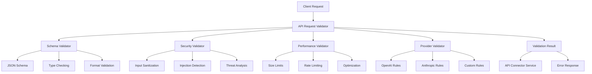

# API Request Validator Service

## Executive Summary

The API Request Validator Service is a critical component of the Augment-It platform that ensures all AI model API requests are properly validated, secure, and optimized before being processed. It provides comprehensive schema validation, security checks, rate limiting, payload sanitization, and performance optimization. Working in tandem with the API Connector Service, it acts as the first line of defense against malformed requests, security threats, and performance issues in AI model interactions.

## Background & Motivation

### Problem Statement
AI model APIs have diverse requirements, formats, and constraints that vary significantly between providers. Without proper validation, the platform faces:

- **Malformed Requests**: Invalid payloads causing API failures and wasted resources
- **Security Vulnerabilities**: Unvalidated input leading to injection attacks and data breaches
- **Performance Issues**: Oversized requests causing timeouts and resource exhaustion
- **Cost Overruns**: Invalid parameters leading to unnecessary API charges
- **Provider Inconsistencies**: Different validation requirements across AI providers
- **Error Cascades**: Invalid requests propagating through the system causing widespread failures

### Why This Solution
- **Early Validation**: Catch errors before expensive API calls
- **Security First**: Comprehensive input sanitization and threat detection
- **Provider Agnostic**: Unified validation interface for all AI providers
- **Performance Optimization**: Request optimization and caching strategies
- **Developer Experience**: Clear error messages and validation feedback
- **Compliance**: Ensure requests meet regulatory and provider requirements

## Goals & Non-Goals

### Goals
1. **Comprehensive Validation**: Schema, syntax, and semantic validation of API requests
2. **Security Hardening**: Input sanitization, injection prevention, and threat detection
3. **Performance Optimization**: Request size limits, compression, and optimization
4. **Provider Compatibility**: Support for multiple AI provider validation requirements
5. **Error Clarity**: Detailed, actionable error messages for developers
6. **Rate Limiting**: Request throttling and quota management
7. **Compliance**: Validation for data protection and regulatory requirements

### Non-Goals
1. **Request Execution**: Only validates, does not execute API requests
2. **Response Validation**: Focuses on outbound requests, not response validation
3. **Business Logic**: Pure technical validation, no domain-specific logic
4. **Authentication**: Validation only, credential management handled elsewhere

## Technical Design

### High-Level Architecture



### Core Components

#### 1. Schema Validator
**Responsibility**: Validate request structure and data types
**Features**:
- JSON Schema validation against provider specifications
- Type checking and format validation
- Required field validation
- Custom validation rules for AI-specific parameters

#### 2. Security Validator
**Responsibility**: Ensure request security and prevent attacks
**Features**:
- Input sanitization and encoding validation
- SQL injection and XSS prevention
- Malicious payload detection
- Content filtering and safety checks

#### 3. Performance Validator
**Responsibility**: Optimize requests for performance and cost
**Features**:
- Payload size limits and compression
- Rate limiting and quota enforcement
- Request deduplication
- Performance optimization suggestions

#### 4. Provider Validator
**Responsibility**: Apply provider-specific validation rules
**Features**:
- Provider-specific parameter validation
- Model capability checking
- API version compatibility
- Custom validation logic per provider

#### 5. Error Reporter
**Responsibility**: Generate detailed, actionable error messages
**Features**:
- Structured error reporting
- Validation path tracking
- Suggestion generation
- Localized error messages

### API Specifications

#### Primary Interfaces

```typescript
interface ValidationConfig {
  schemas: Record<string, SchemaDefinition>;
  security: SecurityConfig;
  performance: PerformanceConfig;
  providers: Record<string, ProviderValidationConfig>;
}

interface SchemaDefinition {
  jsonSchema: JSONSchema7;
  customValidators?: CustomValidator[];
  strictMode?: boolean;
}

interface SecurityConfig {
  sanitization: {
    enabled: boolean;
    allowedTags?: string[];
    stripTags?: boolean;
  };
  injectionPrevention: {
    sqlInjection: boolean;
    xssProtection: boolean;
    commandInjection: boolean;
  };
  contentFiltering: {
    enabled: boolean;
    blockedPatterns?: RegExp[];
    maxContentLength?: number;
  };
}

interface PerformanceConfig {
  limits: {
    maxPayloadSize: number; // bytes
    maxRequestsPerMinute: number;
    maxRequestsPerHour: number;
  };
  optimization: {
    compressionEnabled: boolean;
    deduplicationEnabled: boolean;
    cachingEnabled: boolean;
  };
}

interface ProviderValidationConfig {
  name: string;
  modelLimits: Record<string, ModelLimits>;
  customRules: ValidationRule[];
  apiVersion: string;
}

interface ModelLimits {
  maxTokens: number;
  supportedFormats: string[];
  maxImages?: number;
  maxFileSize?: number;
}

interface ValidationRequest {
  provider: string;
  endpoint: string;
  method: string;
  headers?: Record<string, string>;
  body?: any;
  metadata?: {
    userId?: string;
    sessionId?: string;
    priority?: 'low' | 'normal' | 'high';
  };
}

interface ValidationResult {
  isValid: boolean;
  errors: ValidationError[];
  warnings: ValidationWarning[];
  suggestions?: OptimizationSuggestion[];
  metadata: {
    validationTime: number;
    rulesApplied: string[];
    provider: string;
    requestId: string;
  };
}

interface ValidationError {
  code: string;
  message: string;
  path: string;
  severity: 'error' | 'critical';
  details?: any;
  suggestions?: string[];
}

interface ValidationWarning {
  code: string;
  message: string;
  path: string;
  impact: 'performance' | 'cost' | 'compatibility';
  suggestion?: string;
}

interface OptimizationSuggestion {
  type: 'compression' | 'parameter_optimization' | 'model_selection';
  description: string;
  potentialSavings?: {
    cost?: number;
    time?: number;
    tokens?: number;
  };
}

// Main service interface
interface ApiRequestValidator {
  // Core validation
  validateRequest(request: ValidationRequest): Promise<ValidationResult>;
  validateBatch(requests: ValidationRequest[]): Promise<ValidationResult[]>;
  
  // Schema management
  registerSchema(provider: string, schema: SchemaDefinition): Promise<void>;
  updateSchema(provider: string, schema: SchemaDefinition): Promise<void>;
  getSchema(provider: string): Promise<SchemaDefinition | null>;
  
  // Rule management
  addCustomRule(provider: string, rule: ValidationRule): Promise<void>;
  removeCustomRule(provider: string, ruleId: string): Promise<void>;
  listRules(provider?: string): Promise<ValidationRule[]>;
  
  // Performance and metrics
  getValidationStats(timeRange?: TimeRange): Promise<ValidationStats>;
  clearCache(): Promise<void>;
  
  // Configuration
  updateConfig(config: Partial<ValidationConfig>): Promise<void>;
  getConfig(): Promise<ValidationConfig>;
}
```

### Integration with API Connector Service

The services work together seamlessly:

```typescript
// API Connector Service integration
class ApiConnectorService {
  constructor(
    private config: ApiConnectorConfig,
    private requestValidator: ApiRequestValidator
  ) {}

  async makeRequest<T>(request: ApiRequest): Promise<ApiResponse<T>> {
    // Convert to validation request format
    const validationRequest: ValidationRequest = {
      provider: request.provider || 'auto',
      endpoint: request.endpoint,
      method: request.method,
      headers: request.headers,
      body: request.body,
      metadata: {
        priority: request.priority
      }
    };

    // Validate before processing
    const validation = await this.requestValidator.validateRequest(validationRequest);
    
    if (!validation.isValid) {
      return {
        success: false,
        error: {
          code: 'VALIDATION_FAILED',
          message: validation.errors.map(e => e.message).join(', '),
          provider: 'validator',
          retryable: false,
          details: validation.errors
        },
        metadata: {
          provider: 'validator',
          responseTime: validation.metadata.validationTime,
          cached: false,
          requestId: validation.metadata.requestId
        }
      };
    }

    // Apply optimization suggestions
    const optimizedRequest = this.applyOptimizations(request, validation.suggestions);
    
    // Proceed with validated and optimized request
    return this.executeRequest(optimizedRequest);
  }
}
```

### Error Handling & Security

#### Validation Error Categories
1. **Schema Errors**
   - Missing required fields
   - Invalid data types
   - Format violations
   - Constraint violations

2. **Security Errors**
   - Injection attempts
   - Malicious payloads
   - Blocked content patterns
   - Unsafe input detection

3. **Performance Errors**
   - Rate limit exceeded
   - Payload size exceeded
   - Resource constraints
   - Optimization failures

4. **Provider Errors**
   - Unsupported model parameters
   - API version mismatches
   - Provider-specific violations
   - Capability mismatches

#### Security Implementation

```typescript
class SecurityValidator {
  private sanitizer: DOMPurify;
  private sqlInjectionPatterns: RegExp[];
  private xssPatterns: RegExp[];

  async validate(request: ValidationRequest): Promise<SecurityValidationResult> {
    const errors: ValidationError[] = [];
    const warnings: ValidationWarning[] = [];
    const rulesApplied: string[] = ['security_validation'];

    // Check headers for security issues
    if (request.headers) {
      this.validateHeaders(request.headers, errors, warnings);
    }

    // Check body for security issues
    if (request.body) {
      await this.validatePayload(request.body, errors, warnings);
    }

    return { errors, warnings, rulesApplied };
  }

  private containsSqlInjection(input: string): boolean {
    const sqlPatterns = [
      /(\bunion\b.*\bselect\b)|(\bselect\b.*\bunion\b)/i,
      /(\bdrop\b.*\btable\b)|(\btable\b.*\bdrop\b)/i,
      /(\binsert\b.*\binto\b)|(\binto\b.*\binsert\b)/i,
      /(\bdelete\b.*\bfrom\b)|(\bfrom\b.*\bdelete\b)/i,
      /(\bupdate\b.*\bset\b)|(\bset\b.*\bupdate\b)/i,
      /('|(\\')|(;)|(--)|\||\*)/i
    ];
    
    return sqlPatterns.some(pattern => pattern.test(input.toLowerCase()));
  }

  private containsXss(input: string): boolean {
    const xssPatterns = [
      /<script[^>]*>.*?<\/script>/i,
      /javascript:/i,
      /on\w+\s*=/i,
      /<iframe[^>]*>/i,
      /<object[^>]*>/i,
      /<embed[^>]*>/i
    ];
    
    return xssPatterns.some(pattern => pattern.test(input.toLowerCase()));
  }
}
```

### Performance Considerations

1. **Validation Caching**
   - Cache validation results for identical requests
   - Implement cache invalidation strategies
   - Use Redis or similar for distributed caching

2. **Parallel Processing**
   - Validate multiple requests concurrently
   - Use worker threads for CPU-intensive validation
   - Implement request queuing for high loads

3. **Schema Optimization**
   - Pre-compile JSON schemas for faster validation
   - Use efficient validation libraries
   - Implement schema versioning and caching

4. **Memory Management**
   - Limit memory usage for large payloads
   - Implement streaming validation for large requests
   - Clean up validation state regularly

## Implementation Plan

### Phase 1: Core Validation (Week 1-2)
1. **Schema Validation**
   - JSON Schema integration
   - Basic type checking
   - Required field validation
   - Error reporting system

2. **Security Foundation**
   - Input sanitization
   - Basic injection detection
   - Content filtering
   - Security error handling

### Phase 2: Advanced Features (Week 3-4)
1. **Performance Validation**
   - Rate limiting implementation
   - Payload size controls
   - Optimization suggestions
   - Caching layer

2. **Provider Integration**
   - Provider-specific rules
   - Model capability validation
   - Custom validation logic
   - API version handling

### Phase 3: Production Features (Week 5)
1. **Optimization & Monitoring**
   - Performance monitoring
   - Validation analytics
   - Cache optimization
   - Error trend analysis

2. **Integration & Testing**
   - API Connector integration
   - End-to-end testing
   - Load testing
   - Security testing

### Dependencies
- **Internal**: API Connector Service, Metrics Service, Caching Service
- **External**: AJV (JSON Schema), DOMPurify, validation libraries
- **Development**: TypeScript 5+, Jest for testing, performance tools

### Testing Strategy
1. **Unit Tests**
   - Schema validation accuracy
   - Security detection effectiveness
   - Performance limit enforcement
   - Error handling completeness

2. **Integration Tests**
   - End-to-end validation flows
   - API Connector integration
   - Provider-specific validation
   - Performance under load

3. **Security Tests**
   - Injection attack prevention
   - Malicious payload detection
   - Input sanitization verification
   - Security bypass attempts

## Alternatives Considered

### Client-Side Validation
- **Approach**: Validate requests in client applications
  - **Pros**: Faster feedback, reduced server load
  - **Cons**: Security risks, inconsistent implementation, bypass potential
  - **Decision**: Server-side validation provides better security and consistency

### Third-Party Validation Services
- **Approach**: Use external validation services
  - **Pros**: Proven solutions, reduced development time
  - **Cons**: Vendor dependency, data privacy concerns, cost
  - **Decision**: Custom solution provides better control and integration

### Middleware vs Service
- **Approach**: Implement as HTTP middleware
  - **Pros**: Automatic integration, transparent to clients
  - **Cons**: Less flexibility, harder to customize per provider
  - **Decision**: Service approach allows better customization and reusability

## Open Questions

1. **Custom Validation Rules**: How should we support user-defined validation rules?
2. **Performance Scaling**: What are the performance requirements for high-volume validation?
3. **Error Localization**: Should error messages be localized for different regions?
4. **Validation Versioning**: How do we handle schema evolution and backward compatibility?
5. **Real-time Updates**: Should validation rules be updatable at runtime?
6. **Compliance Integration**: How do we integrate with compliance monitoring systems?

## Appendix

### Glossary
- **JSON Schema**: Standard for describing JSON document structure and constraints
- **Input Sanitization**: Process of cleaning and validating user input
- **Rate Limiting**: Technique to control the frequency of requests
- **XSS**: Cross-Site Scripting attack vector
- **SQL Injection**: Database attack through malicious SQL code
- **Schema Validation**: Process of verifying data against a predefined structure

### References
- [JSON Schema Specification](https://json-schema.org/)
- [OWASP Input Validation](https://owasp.org/www-project-cheat-sheets/cheatsheets/Input_Validation_Cheat_Sheet.html)
- [API Security Best Practices](https://owasp.org/www-project-api-security/)
- [AJV JSON Schema Validator](https://ajv.js.org/)
- [API Connector Service Specification](./apiConnectorService.md)

### Revision History
- v0.1.0 (2025-08-12): Comprehensive specification with security and performance validation
- v0.0.0.1 (2025-08-09): Initial file creation
