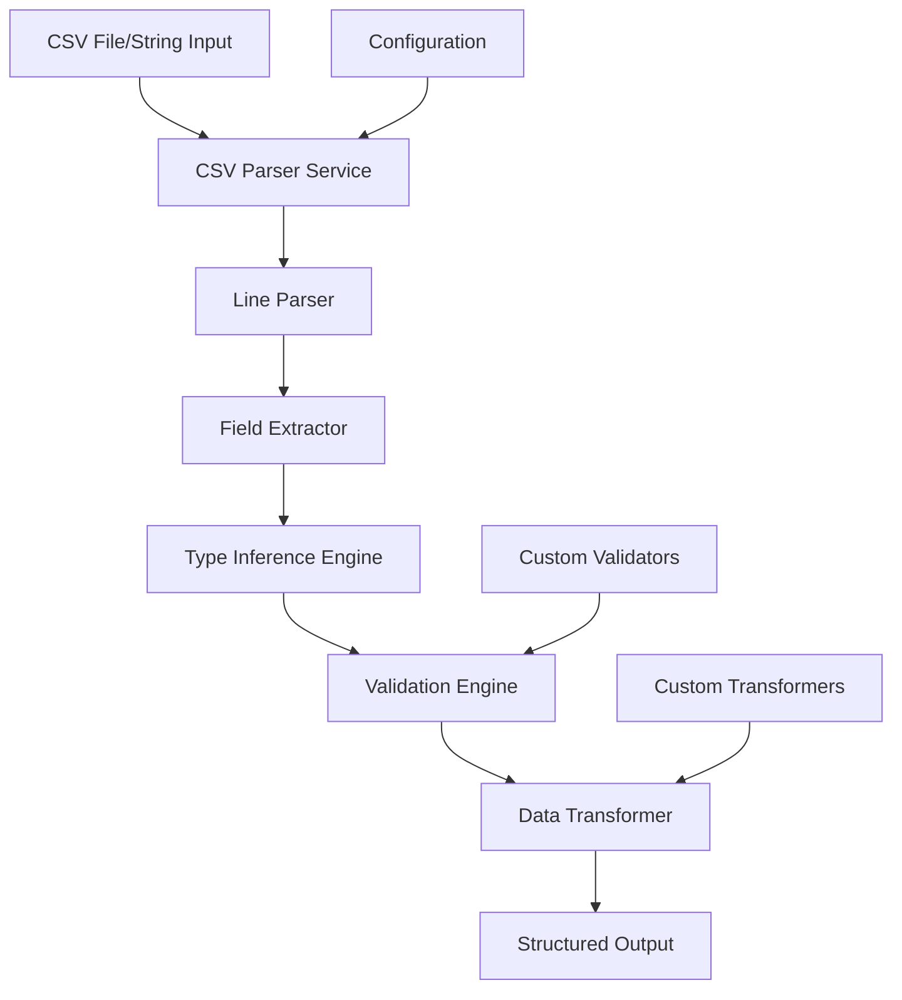

# CSV Parser Service

## 1. Executive Summary
The CSV Parser Service is a shared utility service that provides robust, standards-compliant CSV parsing capabilities for the Augment-It platform. It handles complex CSV scenarios including quoted fields with embedded commas and newlines, automatic data type inference, validation, and transformation. The service is designed to be consumed by multiple microfrontends, particularly the RecordCollector application, ensuring consistent data processing across the platform.

## 2. Background & Motivation
### Problem Statement
CSV parsing requirements vary across different components in the Augment-It platform, leading to duplicate code and inconsistent behavior when processing customer data imports.

### Current Limitations
- Inline CSV parsing logic embedded in components
- Inconsistent handling of edge cases (quoted fields, embedded commas)
- No centralized validation or error handling
- Limited support for data type inference and transformation
- Difficulty in extending parsing capabilities

### Why This Solution
- Centralized, reusable CSV parsing logic
- Consistent error handling and validation across all applications
- Support for complex CSV scenarios required by enterprise data
- Extensible architecture for future enhancements

## 3. Goals & Non-Goals
### Goals
1. **RFC 4180 Compliance**: Full support for CSV standard including quoted fields
2. **Type Inference**: Automatically detect and convert data types (string, number, boolean, date)
3. **Validation**: Configurable validation rules for required fields and data integrity
4. **Error Handling**: Comprehensive error reporting with line-level details
5. **Performance**: Handle large CSV files efficiently with streaming support
6. **Extensibility**: Plugin architecture for custom validators and transformers

### Non-Goals
1. **Excel/XLSX Support**: Focus only on CSV format (Excel support is separate service)
2. **Real-time Processing**: Designed for batch import operations
3. **Database Integration**: Parser only handles data transformation, not persistence
4. **UI Components**: Service-only implementation, no visual components

## 4. Technical Design
### High-Level Architecture


### Core Components

#### 1. CSV Line Parser
- **Responsibility**: Parse individual CSV lines respecting quote boundaries
- **Features**: 
  - Handle escaped quotes (`""` sequences)
  - Support multi-line quoted fields
  - Configurable delimiter support (comma, semicolon, tab)

#### 2. Type Inference Engine
- **Responsibility**: Automatically detect and convert data types
- **Supported Types**:
  - String (default fallback)
  - Number (integer/float detection)
  - Boolean (true/false, yes/no, 1/0)
  - Date (ISO 8601, common formats)
  - Email (basic validation pattern)
  - URL (HTTP/HTTPS validation)

#### 3. Validation Engine
- **Responsibility**: Apply validation rules to parsed data
- **Built-in Validators**:
  - Required field validation
  - Data type validation
  - Length constraints
  - Pattern matching (regex)
  - Custom validation functions

### API Specifications

#### Primary Interface
```typescript
interface CSVParserOptions {
  delimiter?: string; // Default: ','
  hasHeader?: boolean; // Default: true
  requiredColumns?: string[];
  typeInference?: boolean; // Default: true
  skipEmptyRows?: boolean; // Default: true
  maxRows?: number; // For large file protection
  encoding?: string; // Default: 'utf-8'
  customValidators?: Record<string, ValidatorFunction>;
  customTransformers?: Record<string, TransformerFunction>;
}

interface ParseResult<T = Record<string, any>> {
  data: T[];
  headers: string[];
  errors: ParseError[];
  warnings: ParseWarning[];
  metadata: {
    totalRows: number;
    processedRows: number;
    skippedRows: number;
    processingTime: number;
  };
}

interface ParseError {
  row: number;
  column?: string;
  field?: string;
  message: string;
  code: ErrorCode;
  severity: 'error' | 'warning';
}

// Main parsing function
function parseCSV(input: string | File, options?: CSVParserOptions): Promise<ParseResult>;

// Stream-based parsing for large files
function parseCSVStream(input: ReadableStream, options?: CSVParserOptions): AsyncIterable<ParseResult>;

// Validation-only function
function validateCSV(input: string | File, schema: ValidationSchema): Promise<ValidationResult>;
```

#### Core Implementation
```typescript
// Based on existing implementation from RecordList.tsx
class CSVParser {
  private parseCSVLine(line: string, delimiter: string = ','): string[] {
    const result: string[] = [];
    let current = '';
    let inQuotes = false;
    
    for (let i = 0; i < line.length; i++) {
      const char = line[i];
      
      if (char === '"') {
        if (inQuotes && line[i + 1] === '"') {
          // Handle escaped quotes
          current += '"';
          i++;
        } else {
          // Toggle quote mode
          inQuotes = !inQuotes;
        }
      } else if (char === delimiter && !inQuotes) {
        // End of field
        result.push(current.trim());
        current = '';
      } else {
        current += char;
      }
    }
    
    result.push(current.trim());
    return result;
  }

  private inferType(value: string): { type: string; convertedValue: any } {
    if (value === '' || value === null || value === undefined) {
      return { type: 'string', convertedValue: value };
    }

    // Number detection
    const numberValue = Number(value);
    if (!isNaN(numberValue) && value !== '') {
      return { 
        type: Number.isInteger(numberValue) ? 'integer' : 'float', 
        convertedValue: numberValue 
      };
    }

    // Boolean detection
    const lowerValue = value.toLowerCase();
    if (['true', 'false', 'yes', 'no', '1', '0'].includes(lowerValue)) {
      return { 
        type: 'boolean', 
        convertedValue: ['true', 'yes', '1'].includes(lowerValue) 
      };
    }

    // Date detection (basic ISO 8601 pattern)
    if (/^\d{4}-\d{2}-\d{2}T?/.test(value) && !isNaN(Date.parse(value))) {
      return { type: 'date', convertedValue: new Date(value) };
    }

    // Email detection
    if (/^[^\s@]+@[^\s@]+\.[^\s@]+$/.test(value)) {
      return { type: 'email', convertedValue: value };
    }

    // URL detection
    if (/^https?:\/\//.test(value)) {
      try {
        new URL(value);
        return { type: 'url', convertedValue: value };
      } catch {
        // Invalid URL, treat as string
      }
    }

    return { type: 'string', convertedValue: value };
  }

  public async parse(input: string, options: CSVParserOptions = {}): Promise<ParseResult> {
    const startTime = Date.now();
    const errors: ParseError[] = [];
    const warnings: ParseWarning[] = [];
    
    try {
      // Split lines while handling quoted newlines
      const lines = input.split(/\r?\n/).filter(line => 
        options.skipEmptyRows ? line.trim() : true
      );
      
      if (lines.length === 0) {
        throw new Error('Empty CSV file');
      }

      // Parse header
      const headers = this.parseCSVLine(lines[0], options.delimiter);
      
      // Validate required columns
      if (options.requiredColumns) {
        const missingColumns = options.requiredColumns.filter(col => 
          !headers.includes(col)
        );
        if (missingColumns.length > 0) {
          errors.push({
            row: 0,
            message: `Missing required columns: ${missingColumns.join(', ')}`,
            code: 'MISSING_REQUIRED_COLUMNS',
            severity: 'error'
          });
        }
      }

      // Parse data rows
      const data: Record<string, any>[] = [];
      const maxRows = options.maxRows || lines.length;
      
      for (let i = 1; i < Math.min(lines.length, maxRows + 1); i++) {
        const line = lines[i];
        if (!line.trim() && options.skipEmptyRows) continue;

        try {
          const values = this.parseCSVLine(line, options.delimiter);
          const record: Record<string, any> = {
            id: crypto.randomUUID() // Generate unique ID for each record
          };

          headers.forEach((header, index) => {
            const rawValue = values[index] || '';
            
            if (options.typeInference) {
              const { convertedValue } = this.inferType(rawValue);
              record[header] = convertedValue;
            } else {
              record[header] = rawValue;
            }
          });

          data.push(record);
        } catch (error) {
          errors.push({
            row: i,
            message: `Failed to parse row: ${error instanceof Error ? error.message : 'Unknown error'}`,
            code: 'PARSE_ERROR',
            severity: 'error'
          });
        }
      }

      const processingTime = Date.now() - startTime;
      
      return {
        data,
        headers,
        errors,
        warnings,
        metadata: {
          totalRows: lines.length - 1, // Exclude header
          processedRows: data.length,
          skippedRows: (lines.length - 1) - data.length,
          processingTime
        }
      };
    } catch (error) {
      errors.push({
        row: -1,
        message: `Fatal parsing error: ${error instanceof Error ? error.message : 'Unknown error'}`,
        code: 'FATAL_ERROR',
        severity: 'error'
      });
      
      return {
        data: [],
        headers: [],
        errors,
        warnings,
        metadata: {
          totalRows: 0,
          processedRows: 0,
          skippedRows: 0,
          processingTime: Date.now() - startTime
        }
      };
    }
  }
}
```

### Error Handling
#### Expected Error Cases
1. **File Format Errors**
   - Invalid file encoding
   - Malformed CSV structure
   - Inconsistent column counts

2. **Data Validation Errors**
   - Missing required fields
   - Type conversion failures
   - Invalid data formats

3. **System Errors**
   - File read errors
   - Memory limitations
   - Network timeouts (for URL-based inputs)

#### Error Recovery Strategies
- **Partial Success**: Continue processing valid rows, report errors for invalid ones
- **Graceful Degradation**: Fall back to string type if type inference fails
- **Detailed Reporting**: Provide row and column-level error information

### Security Considerations
1. **Input Validation**
   - File size limits to prevent DoS attacks
   - Content-type validation
   - Malicious CSV injection prevention

2. **Memory Management**
   - Streaming support for large files
   - Configurable memory limits
   - Garbage collection optimization

## 5. Implementation Plan
### Phase 1: Core Functionality
1. **Basic CSV Parser** (Week 1)
   - Line parsing with quote handling
   - Header extraction
   - Basic error reporting

2. **Type Inference Engine** (Week 1)
   - Number, boolean, date detection
   - Configurable type inference options
   - Fallback to string type

3. **Integration with RecordCollector** (Week 2)
   - Replace inline parsing logic
   - Maintain backward compatibility
   - Add comprehensive error handling

### Phase 2: Advanced Features
1. **Validation Engine** (Week 3)
   - Required field validation
   - Custom validator support
   - Pattern matching validation

2. **Performance Optimizations** (Week 3)
   - Streaming support for large files
   - Memory usage optimization
   - Background processing for large datasets

3. **Extended Type Support** (Week 4)
   - Email and URL validation
   - Currency and percentage formats
   - Custom data type plugins

### Phase 3: Integration & Polish
1. **Service Integration** (Week 5)
   - Module federation setup
   - API documentation generation
   - Comprehensive test coverage

2. **Monitoring & Analytics** (Week 5)
   - Performance metrics collection
   - Error tracking and reporting
   - Usage analytics

### Dependencies
- **Internal**: Module federation framework, shared error handling service
- **External**: Web File API, Crypto API for UUID generation
- **Development**: TypeScript 5+, Jest for testing, ESLint for code quality

### Testing Strategy
1. **Unit Tests**
   - CSV parsing logic with various edge cases
   - Type inference accuracy
   - Validation rule enforcement

2. **Integration Tests**
   - End-to-end parsing with RecordCollector
   - Large file handling
   - Error scenarios and recovery

3. **Performance Tests**
   - Parsing speed benchmarks
   - Memory usage profiling
   - Concurrent parsing scenarios

## 6. Alternatives Considered
### Third-Party Libraries
- **Papa Parse**: Popular CSV parsing library
  - **Pros**: Well-tested, comprehensive features
  - **Cons**: Large bundle size, external dependency
  - **Decision**: Rejected in favor of custom implementation for better control

### Browser-Native CSV API
- **Pros**: No external dependencies, potentially faster
- **Cons**: Limited browser support, less control over parsing logic
- **Decision**: Rejected due to compatibility requirements

### Server-Side Processing
- **Pros**: Better performance for large files, reduced client load
- **Cons**: Network latency, requires backend infrastructure
- **Decision**: Deferred to Phase 4 as optional enhancement

## 7. Open Questions
1. **Large File Handling**: What's the practical size limit for client-side processing?
2. **Internationalization**: How should we handle different locale-specific number/date formats?
3. **Custom Delimiters**: Should we support tab-separated values (TSV) and other delimiters?
4. **Data Preview**: Should the parser provide a preview mode for large files?
5. **Encoding Detection**: Should we automatically detect file encoding or require explicit specification?

## 8. Appendix
### Glossary
- **RFC 4180**: The standard specification for CSV file format
- **Type Inference**: Automatic detection and conversion of data types from string values
- **Streaming**: Processing data in chunks rather than loading everything into memory
- **Module Federation**: Webpack feature allowing sharing of code between separate builds

### References
- [RFC 4180 - Common Format and MIME Type for CSV Files](https://tools.ietf.org/html/rfc4180)
- [Existing CSV Parser Implementation in RecordList.tsx](../apps/RecordCollector.md)
- [Web File API Documentation](https://developer.mozilla.org/en-US/docs/Web/API/File)

### Revision History
- v0.1.0 (2025-08-12): Initial specification based on existing implementation
- v0.0.0.1 (2025-08-09): Initial file creation
