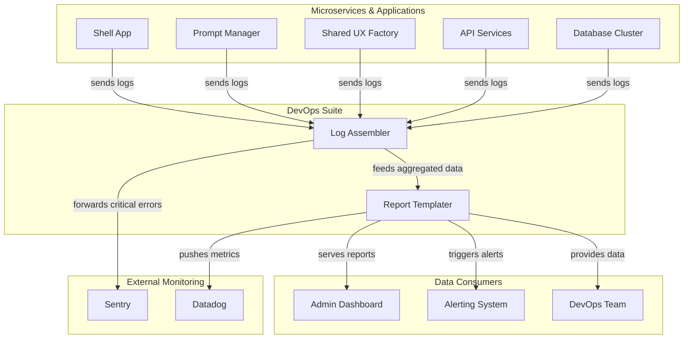

# DevOps Suite

## 1. Executive Summary

The DevOps Suite is a centralized container of shared services responsible for platform-wide observability, monitoring, and reporting. It provides the core infrastructure necessary to aggregate logs, generate system health reports, and create actionable insights from operational data.

This suite is designed to be the single source of truth for all DevOps-related intelligence, ensuring that developers and operators have a consistent, reliable view of the platform's health and performance.

## 2. Service Overview

The DevOps Suite container houses two primary services:

1.  **Log Assembler**: Aggregates and standardizes logs from all microservices and applications across the platform.
2.  **Report Templater**: Generates system reports, dashboards, and visualizations from the data collected by the Log Assembler.

Together, these services provide a comprehensive solution for monitoring, debugging, and understanding the behavior of our distributed systems.

## 3. High-Level Architecture

## 4. Contained Services

### 4.1. Log Assembler

**Responsibility**: To act as the central aggregation point for all logs generated by the platform's microservices, applications, and infrastructure.

**Features**:

*   **Unified Log Format**: Standardizes logs from different sources into a single, queryable format.
*   **Real-time Processing**: Ingests and processes logs with low latency.
*   **Log Enrichment**: Adds contextual information (e.g., service name, request ID, user context) to each log entry.
*   **Scalable Ingestion**: Built to handle high volumes of log data without performance degradation.
*   **Error Correlation**: Groups related error logs and traces for easier debugging.
*   **Secure Forwarding**: Securely forwards logs to third-party monitoring services like Sentry or Datadog.

### 4.2. Report Templater

**Responsibility**: To generate reports, dashboards, and visualizations from the aggregated log data, providing actionable insights into the platform's health and performance.

**Features**:

*   **Customizable Templates**: A library of predefined report templates for common use cases (e.g., daily health checks, performance analysis, error summaries).
*   **Scheduled Reporting**: Automatically generates and distributes reports on a schedule (e.g., daily, weekly, monthly).
*   **Ad-Hoc Querying**: An interface for running custom queries against the aggregated log data.
*   **Visualization Engine**: Renders data in various formats, including charts, graphs, and tables.
*   **Alerting Integration**: Triggers alerts in external systems (e.g., PagerDuty, Slack) based on predefined thresholds.
*   **Dashboard API**: Exposes an API for embedding report widgets in other applications, such as the Admin Dashboard.

## 5. Core Responsibilities of the Suite

*   **Centralized Observability**: Provide a single pane of glass for monitoring the entire platform.
*   **Data Standardization**: Ensure that all operational data is consistent, reliable, and easy to query.
*   **Actionable Intelligence**: Transform raw log data into meaningful insights that drive operational improvements.
*   **Developer Enablement**: Empower developers to self-serve their monitoring and debugging needs.
*   **Operational Excellence**: Support the SRE and DevOps teams with the tools they need to maintain platform stability and performance.
*   **Cost Optimization**: Analyze resource utilization and provide data to help optimize infrastructure costs.

This DevOps Suite provides the foundational observability and reporting capabilities required to operate a complex, distributed system effectively, ensuring that we can proactively monitor, rapidly debug, and continuously improve our platform.
