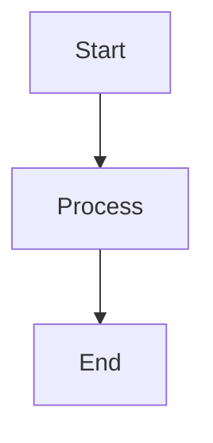
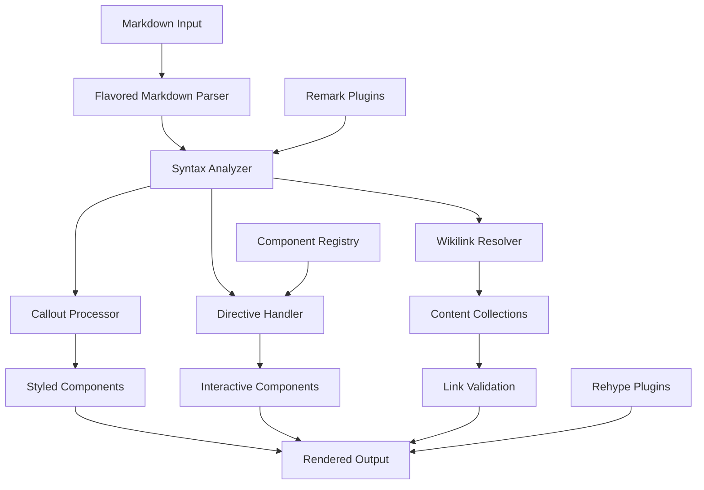

# Flavored Markdown Parser Service

## User-Defined Extended Markdown Syntax

### Core Extended Syntax Elements

The Flavored Markdown Parser supports several categories of extended markdown syntax that enhance content creation and cross-referencing capabilities:

#### 1. Wikilinks/Backlinks
**Basic Syntax**: `[[path/to/file]]`  
**With Display Text**: `[[path/to/file|Display Text]]`  
**Examples**:
```markdown
[[tooling/Software Development/Frameworks/Next.js]]
[[concepts/Data Augmentation Workflow|Data Workflows]]
[[organizations/Meta|Meta Platforms]]
```

**Features**:
- Automatic file resolution across content collections
- Support for nested directory structures
- Display text override capability
- Automatic URL generation from frontmatter
- Integration with content management systems

#### 2. Custom Callouts
**Basic Syntax**: 
```markdown
> [!<Class-Definition>] <Heading in Callout>
> 
> <content>
```

**Supported Classes**:
- `[!info]` - Information callouts with blue styling
- `[!warning]` - Warning callouts with yellow/orange styling
- `[!error]` - Error callouts with red styling
- `[!success]` - Success callouts with green styling
- `[!note]` - General note callouts with neutral styling
- `[!tip]` - Tip callouts with helpful styling

**Examples**:
```markdown
> [!info] Integration Notice
> 
> This component integrates with the shared authentication service.

> [!warning] Breaking Changes
> 
> Version 2.0 introduces breaking changes to the API interface.

> [!tip] Performance Optimization
> 
> Use the `--no-cache` flag for development builds.
```

#### 3. Content Directives
**Leaf Directive Syntax**: `::directive-name{attribute="value"}`  
**Container Directive Syntax**:
```markdown
:::directive-name
content
:::
```

**Supported Directives**:
- `::figma-embed{src="url"}` - Embed Figma objects
- `:::tool-showcase` - Display tool galleries
- `:::slides` - Embed slide presentations
- `::mermaid` - Render Mermaid diagrams
- `::youtube{id="video-id"}` - Embed YouTube videos

#### 4. Content Collections Integration
**Tag References**: `tag: [[concept/Tag-Name]]`  
**Organization Links**: `[[organizations/Company-Name]]`  
**Tool References**: `[[tooling/Category/Tool-Name]]`  

#### 5. Specialized Code Blocks
**Tool Gallery Syntax**:
```markdown
```toolingGallery small
- tag: [[AI-Toolkit]]
- [[tooling/AI-Toolkit/OpenAI]]
- [[tooling/AI-Toolkit/Anthropic]]
```
```

**Mermaid Diagrams**:
```markdown

```

## 1. Executive Summary
The Flavored Markdown Parser Service is a comprehensive content processing system designed specifically for the Augment-It platform's rich content ecosystem. It extends standard markdown with powerful features including bidirectional linking (wikilinks), styled callouts, interactive directives, and content collection integration. Built on the robust remark/rehype ecosystem, it provides semantic parsing, content validation, link resolution, and component rendering capabilities that enable a sophisticated knowledge management and content creation workflow.

## 2. Background & Motivation
### Problem Statement
The Augment-It platform requires advanced markdown processing capabilities that go beyond standard markdown to support knowledge management, content cross-referencing, and interactive component embedding across thousands of interconnected documents.

### Current Limitations
- **Standard Markdown Constraints**: Basic markdown lacks semantic linking and content organization features
- **Manual Cross-Referencing**: No automated way to link related content across collections
- **Static Content**: Limited ability to embed dynamic or interactive components
- **Inconsistent Styling**: No standardized way to create styled content blocks
- **Content Isolation**: Documents exist in isolation without semantic relationships

### Why This Solution
- **Knowledge Graph Integration**: Enables bidirectional linking and content discovery
- **Component Ecosystem**: Supports rich, interactive content through directives
- **Content Collections**: Seamless integration with organized content taxonomies
- **Extensible Architecture**: Plugin-based system for custom syntax extensions
- **Performance Optimized**: Efficient processing of large content repositories

## 3. Goals & Non-Goals
### Goals
1. **Extended Syntax Support**: Comprehensive parsing of wikilinks, callouts, and directives
2. **Link Resolution**: Automatic resolution and validation of internal content links
3. **Component Integration**: Seamless embedding of interactive components via directives
4. **Content Collections**: Deep integration with taxonomized content organization
5. **Performance**: Efficient processing of large content repositories
6. **Extensibility**: Plugin architecture for custom syntax extensions
7. **Error Handling**: Graceful handling of malformed syntax and missing references

### Non-Goals
1. **WYSIWYG Editing**: Focus on parsing, not visual editing interfaces
2. **Real-time Collaboration**: Batch processing focus, not collaborative editing
3. **Version Control**: Markdown processing only, not content versioning
4. **Content Management**: Parsing service, not full CMS functionality

## 4. Technical Design
### High-Level Architecture


### Core Components

#### 1. Extended Syntax Parser
- **Responsibility**: Parse extended markdown syntax elements
- **Features**:
  - Wikilink pattern recognition and parsing
  - Custom callout block processing
  - Directive syntax analysis
  - Content collection reference resolution

#### 2. Link Resolution Engine
- **Responsibility**: Resolve and validate internal content links
- **Features**:
  - Cross-collection link resolution
  - Automatic URL generation from frontmatter
  - Broken link detection and reporting
  - Display text override handling

#### 3. Directive Processing System
- **Responsibility**: Transform directives into renderable components
- **Features**:
  - Component registry lookup
  - Attribute parsing and validation
  - Authentication handling for external services
  - Error fallback rendering

#### 4. Callout Styling Engine
- **Responsibility**: Process custom callout blocks with styling
- **Features**:
  - Multiple callout types (info, warning, error, etc.)
  - Custom icon and color schemes
  - Nested content support
  - Responsive design integration

### API Specifications

#### Primary Interfaces
```typescript
interface FlavoredMarkdownOptions {
  enableWikilinks?: boolean; // Default: true
  enableCallouts?: boolean; // Default: true
  enableDirectives?: boolean; // Default: true
  strictLinkValidation?: boolean; // Default: false
  baseUrl?: string; // For absolute URL generation
  contentCollections?: string[]; // Available collections
  componentRegistry?: ComponentRegistry;
  customSyntax?: CustomSyntaxPlugin[];
}

interface ParseResult {
  success: boolean;
  ast?: any; // Markdown AST
  html?: string; // Rendered HTML
  metadata: {
    wikilinks: WikilinkInfo[];
    callouts: CalloutInfo[];
    directives: DirectiveInfo[];
    errors: ParseError[];
    warnings: ParseWarning[];
    processingTime: number;
  };
}

interface WikilinkInfo {
  originalText: string;
  filePath: string;
  displayText?: string;
  resolved: boolean;
  resolvedUrl?: string;
  collection?: string;
  line: number;
  column: number;
}

interface CalloutInfo {
  type: 'info' | 'warning' | 'error' | 'success' | 'note' | 'tip';
  title?: string;
  content: string;
  line: number;
}

interface DirectiveInfo {
  type: 'leaf' | 'container';
  name: string;
  attributes: Record<string, any>;
  content?: string;
  component?: string;
  resolved: boolean;
  line: number;
}

// Main parsing functions
function parseFlavoredMarkdown(content: string, options?: FlavoredMarkdownOptions): Promise<ParseResult>;
function resolveWikilinks(content: string, collections: ContentCollection[]): Promise<WikilinkInfo[]>;
function validateLinks(content: string, options?: FlavoredMarkdownOptions): Promise<LinkValidationResult>;
function extractDirectives(content: string): DirectiveInfo[];
function renderToHtml(content: string, options?: FlavoredMarkdownOptions): Promise<string>;
```

#### Core Implementation
```typescript
// Based on existing implementations from AstroMarkdown.astro and remark plugins
class FlavoredMarkdownParser {
  private options: Required<FlavoredMarkdownOptions>;
  private remarkProcessor: any;
  private rehypeProcessor: any;
  private componentRegistry: ComponentRegistry;
  private contentCollections: Map<string, any[]>;
  
  constructor(options: FlavoredMarkdownOptions = {}) {
    this.options = {
      enableWikilinks: true,
      enableCallouts: true,
      enableDirectives: true,
      strictLinkValidation: false,
      baseUrl: '',
      contentCollections: [],
      componentRegistry: new ComponentRegistry(),
      customSyntax: [],
      ...options
    };
    
    this.initializeProcessors();
  }

  private initializeProcessors() {
    // Initialize remark processor with plugins
    this.remarkProcessor = remark()
      .use(remarkGfm) // GitHub Flavored Markdown
      .use(remarkFrontmatter) // YAML frontmatter
      .use(remarkDirective) // Directive support
      .use(this.remarkWikilinks.bind(this)) // Custom wikilink plugin
      .use(this.remarkCallouts.bind(this)) // Custom callout plugin
      .use(this.remarkDirectiveToComponent.bind(this)); // Custom directive plugin
    
    // Initialize rehype processor
    this.rehypeProcessor = rehype()
      .use(rehypeRaw) // Allow raw HTML
      .use(rehypeStringify); // Convert to HTML
  }

  // Wikilink processing plugin
  private remarkWikilinks() {
    return (tree: any) => {
      visit(tree, 'text', (node: any, index: number, parent: any) => {
        if (!this.options.enableWikilinks) return;
        
        const wikilinkRegex = /\[\[([^\]|]+)(?:\|([^\]]+))?\]\]/g;
        let match;
        const replacements = [];
        
        while ((match = wikilinkRegex.exec(node.value)) !== null) {
          const [fullMatch, filePath, displayText] = match;
          const resolvedLink = this.resolveWikilink(filePath, displayText);
          
          replacements.push({
            start: match.index,
            end: match.index + fullMatch.length,
            replacement: resolvedLink
          });
        }
        
        if (replacements.length > 0) {
          this.applyTextReplacements(node, parent, index, replacements);
        }
      });
    };
  }

  // Callout processing plugin
  private remarkCallouts() {
    return (tree: any) => {
      visit(tree, 'blockquote', (node: any) => {
        if (!this.options.enableCallouts) return;
        
        // Check if this is a callout blockquote
        const firstChild = node.children[0];
        if (firstChild && firstChild.type === 'paragraph') {
          const firstText = this.getTextContent(firstChild);
          const calloutMatch = firstText.match(/^\[!([^\]]+)\]\s*(.*)/);
          
          if (calloutMatch) {
            const [, type, title] = calloutMatch;
            this.transformToCallout(node, type.toLowerCase(), title);
          }
        }
      });
    };
  }

  // Directive processing plugin
  private remarkDirectiveToComponent() {
    return (tree: any) => {
      visit(tree, ['leafDirective', 'containerDirective'], (node: any) => {
        if (!this.options.enableDirectives) return;
        
        const directiveName = node.name;
        const component = this.componentRegistry.getComponent(directiveName);
        
        if (component) {
          // Transform directive to component call
          node.type = 'html';
          node.value = this.renderDirectiveAsHtml(node, component);
        } else {
          // Log warning for unknown directive
          console.warn(`Unknown directive: ${directiveName}`);
        }
      });
    };
  }

  // Wikilink resolution
  private resolveWikilink(filePath: string, displayText?: string): any {
    // Clean up the file path
    const cleanPath = filePath.trim();
    const linkText = displayText || cleanPath.split('/').pop() || cleanPath;
    
    // Try to resolve against content collections
    const resolvedUrl = this.findInContentCollections(cleanPath);
    
    if (resolvedUrl) {
      return {
        type: 'link',
        url: resolvedUrl,
        children: [{ type: 'text', value: linkText }]
      };
    } else {
      // Return broken link with warning styling
      return {
        type: 'html',
        value: `<span class="broken-link" title="Link not found: ${cleanPath}">${linkText}</span>`
      };
    }
  }

  // Content collection search
  private findInContentCollections(filePath: string): string | null {
    for (const [collectionName, items] of this.contentCollections.entries()) {
      for (const item of items) {
        if (item.id === filePath || item.slug === filePath) {
          return this.generateUrl(collectionName, item);
        }
      }
    }
    return null;
  }

  // Callout transformation
  private transformToCallout(node: any, type: string, title: string) {
    // Extract content after the title
    const content = this.extractCalloutContent(node);
    
    // Transform to custom callout HTML
    node.type = 'html';
    node.value = `
      <div class="callout callout-${type}">
        ${title ? `<div class="callout-title">
          <span class="callout-icon">${this.getCalloutIcon(type)}</span>
          <span class="callout-title-text">${title}</span>
        </div>` : ''}
        <div class="callout-content">
          ${content}
        </div>
      </div>
    `;
  }

  // Directive rendering
  private renderDirectiveAsHtml(node: any, component: ComponentInfo): string {
    const attributes = this.parseDirectiveAttributes(node.attributes || {});
    
    // Handle different directive types
    if (node.type === 'leafDirective') {
      return `<${component.tagName} ${this.attributesToString(attributes)} />`;
    } else if (node.type === 'containerDirective') {
      const content = this.getTextContent(node);
      return `<${component.tagName} ${this.attributesToString(attributes)}>${content}</${component.tagName}>`;
    }
    
    return '';
  }

  // Main parsing method
  public async parse(content: string): Promise<ParseResult> {
    const startTime = Date.now();
    const metadata = {
      wikilinks: [],
      callouts: [],
      directives: [],
      errors: [],
      warnings: [],
      processingTime: 0
    };
    
    try {
      // Process through remark pipeline
      const remarkResult = await this.remarkProcessor.process(content);
      
      // Extract metadata during processing
      this.extractMetadata(remarkResult, metadata);
      
      // Convert to HTML if needed
      const rehypeResult = await this.rehypeProcessor.process(remarkResult);
      
      metadata.processingTime = Date.now() - startTime;
      
      return {
        success: true,
        ast: remarkResult,
        html: String(rehypeResult),
        metadata
      };
    } catch (error) {
      metadata.errors.push({
        message: error instanceof Error ? error.message : 'Unknown parsing error',
        line: -1,
        column: -1,
        code: 'PARSE_ERROR',
        severity: 'error'
      });
      
      return {
        success: false,
        metadata
      };
    }
  }

  // Content collection integration
  public loadContentCollections(collections: Record<string, any[]>) {
    this.contentCollections = new Map(Object.entries(collections));
  }

  // Custom syntax plugin registration
  public registerCustomSyntax(plugin: CustomSyntaxPlugin) {
    this.options.customSyntax.push(plugin);
    this.reinitializeProcessors();
  }
}

// Supporting interfaces and classes
class ComponentRegistry {
  private components = new Map<string, ComponentInfo>();
  
  register(name: string, component: ComponentInfo) {
    this.components.set(name, component);
  }
  
  getComponent(name: string): ComponentInfo | null {
    return this.components.get(name) || null;
  }
}

interface ComponentInfo {
  tagName: string;
  attributes: Record<string, any>;
  requiredAuth?: boolean;
}

interface CustomSyntaxPlugin {
  name: string;
  type: 'remark' | 'rehype';
  plugin: any;
  options?: any;
}
```

### Integration Points

#### 1. Content Management System
- **Content Collections**: Integration with taxonomized content organization
- **Link Resolution**: Automatic resolution of internal content references
- **Metadata Extraction**: Extract and index linked content for discovery

#### 2. Component System
- **Directive Registry**: Register and manage available directives
- **Authentication Integration**: Handle service authentication for external embeds
- **Fallback Rendering**: Graceful degradation for missing components

#### 3. Development Tools
- **Syntax Highlighting**: Enhanced highlighting for extended syntax
- **Link Validation**: Real-time validation of internal links
- **Error Reporting**: Detailed error messages with line/column information

### Error Handling
#### Expected Error Cases
1. **Link Resolution Errors**
   - Broken internal links
   - Missing content collections
   - Invalid file paths
   - Circular reference detection

2. **Directive Processing Errors**
   - Unknown directive names
   - Missing required attributes
   - Authentication failures
   - Component rendering errors

3. **Syntax Parsing Errors**
   - Malformed wikilink syntax
   - Invalid callout formatting
   - Nested directive conflicts
   - Unsupported markdown combinations

#### Error Recovery Strategies
- **Graceful Degradation**: Render fallback content for failed components
- **Link Preservation**: Maintain original link text when resolution fails
- **Warning Generation**: Provide detailed warnings without breaking parsing
- **Partial Success**: Continue processing valid content despite errors

### Performance Considerations
1. **Lazy Loading**: Load content collections and components on-demand
2. **Caching**: Cache resolved links and parsed content
3. **Streaming**: Process large documents in chunks
4. **Parallel Processing**: Resolve links and directives concurrently
5. **Memory Management**: Efficient AST processing and cleanup

### Security Considerations
1. **Link Validation**: Prevent malicious internal link exploitation
2. **Component Sandboxing**: Secure rendering of external content
3. **Authentication**: Secure handling of service credentials
4. **Input Sanitization**: Prevent XSS through malformed syntax

## 5. Implementation Plan
### Phase 1: Core Parsing Infrastructure (Week 1-2)
1. **Basic Parser Setup**
   - Remark/Rehype pipeline configuration
   - Extended syntax detection and parsing
   - AST manipulation utilities

2. **Wikilink Processing**
   - Pattern recognition and parsing
   - Basic link resolution
   - Content collection integration

### Phase 2: Advanced Features (Week 3-4)
1. **Callout System**
   - Multiple callout types with styling
   - Nested content support
   - Icon and theme integration

2. **Directive Processing**
   - Component registry system
   - Authentication handling
   - Error fallback rendering

### Phase 3: Integration & Optimization (Week 5)
1. **Performance Optimization**
   - Caching strategies
   - Parallel processing
   - Memory optimization

2. **Developer Experience**
   - Error reporting improvements
   - Debugging tools
   - Documentation generation

### Dependencies
- **Internal**: Content collections, component registry, authentication services
- **External**: Remark/Rehype ecosystem, content processing libraries
- **Development**: TypeScript 5+, Jest for testing, performance profiling

### Testing Strategy
1. **Unit Tests**
   - Syntax parsing accuracy
   - Link resolution correctness
   - Component rendering validation
   - Error handling scenarios

2. **Integration Tests**
   - End-to-end content processing
   - Content collection integration
   - Component system integration
   - Performance benchmarks

3. **Content Tests**
   - Real-world markdown processing
   - Large repository handling
   - Cross-reference validation

## 6. Alternatives Considered
### MDX Processing
- **MDX**: JSX in markdown with component support
  - **Pros**: Rich component integration, React ecosystem
  - **Cons**: Complex build process, JSX syntax learning curve
  - **Decision**: Directive-based approach provides similar benefits with simpler syntax

### Wiki-style Systems
- **MediaWiki Syntax**: Established wiki linking patterns
  - **Pros**: Proven syntax, extensive features
  - **Cons**: Complex syntax, not markdown-compatible
  - **Decision**: Simplified wikilink syntax maintains markdown compatibility

### Notion-style Blocks
- **Block-based Editing**: Structured content blocks
  - **Pros**: Rich editing experience, structured data
  - **Cons**: Complex implementation, not text-based
  - **Decision**: Markdown-first approach with directive enhancements

## 7. Open Questions
1. **Syntax Evolution**: How should we handle syntax changes across existing content?
2. **Performance Scaling**: What are the limits for real-time processing of large repositories?
3. **Plugin Ecosystem**: Should we support third-party syntax extensions?
4. **Caching Strategy**: How should we cache parsed content and resolved links?
5. **Collaboration**: How should multiple users handle conflicting link updates?
6. **Mobile Optimization**: Should we provide mobile-specific rendering optimizations?

## 8. Appendix
### Glossary
- **Wikilink**: Double-bracketed link syntax for internal content references
- **Directive**: Special syntax for embedding components or interactive content
- **Callout**: Styled content block for highlighting information
- **Content Collection**: Organized group of related content (tools, concepts, etc.)
- **AST**: Abstract Syntax Tree representing parsed markdown structure

### References
- [Remark Plugin Ecosystem](https://github.com/remarkjs/remark/blob/main/doc/plugins.md)
- [Existing AstroMarkdown Implementation](../../site/src/components/markdown/AstroMarkdown.astro)
- [Directive Processing Blueprint](../../lost-in-public/blueprints/Maintain-Directives-in-Extended-Markdown-Render-Pipeline.md)
- [Wikilink Processing Service](../../obsidian-plugin-starter/src/services/backlinkUrlService.ts)
- [CommonMark Specification](https://commonmark.org/)

### Revision History
- v0.1.0 (2025-08-12): Initial comprehensive specification with user-defined syntax
- v0.0.0.1 (2025-08-09): Initial file creation
