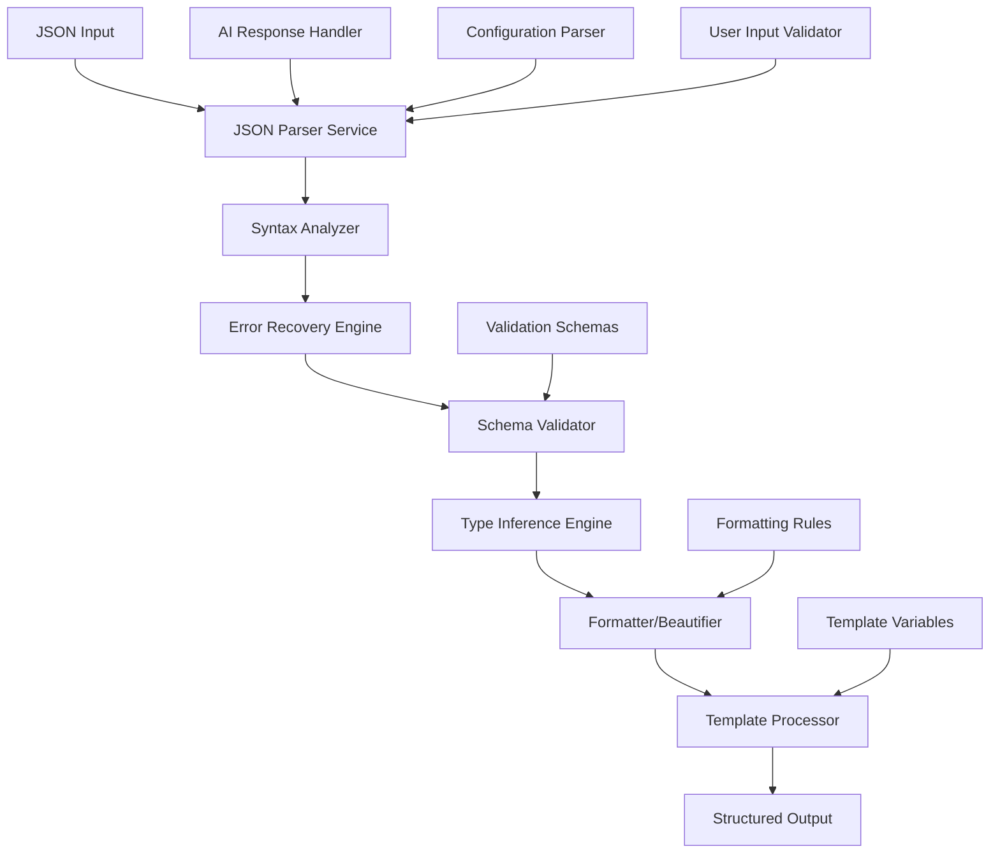

# JSON Parser Service

## 1. Executive Summary
The JSON Parser Service is a central utility service that provides comprehensive JSON processing capabilities for the Augment-It platform. It handles parsing, validation, formatting, schema validation, and transformation of JSON data from multiple sources including AI model responses, configuration files, API requests/responses, and user-generated content. The service ensures consistent JSON handling across all microfrontends while providing advanced features like error recovery, partial parsing, and intelligent type inference.

## 2. Background & Motivation
### Problem Statement
JSON processing is scattered throughout the Augment-It platform with inconsistent error handling, validation, and formatting approaches, leading to fragile data processing and poor user experience when dealing with malformed JSON.

### Current Limitations
- **Inconsistent Error Handling**: Different components handle JSON parsing failures differently
- **No Graceful Degradation**: Failed parsing often results in complete component failures
- **Limited Validation**: Basic `JSON.parse()` calls without schema validation or content verification
- **Poor User Feedback**: Generic error messages don't help users fix JSON syntax issues
- **Code Duplication**: Similar JSON processing logic repeated across multiple components
- **AI Response Challenges**: AI-generated JSON often contains formatting issues or embedded content

### Why This Solution
- **Centralized Processing**: Single source of truth for JSON handling logic
- **Intelligent Parsing**: Handle common JSON formatting issues automatically
- **Rich Validation**: Schema-based validation with detailed error reporting
- **AI Response Optimization**: Specialized handling for AI-generated content
- **Developer Experience**: Comprehensive tooling for JSON editing and validation

## 3. Goals & Non-Goals
### Goals
1. **Robust Parsing**: Handle malformed JSON with intelligent error recovery
2. **Schema Validation**: Validate JSON against predefined schemas with detailed error reporting
3. **AI Response Handling**: Specialized processing for AI model outputs (GPT, Claude, Perplexity)
4. **Pretty Formatting**: Consistent JSON formatting and syntax highlighting support
5. **Template Processing**: Handle JSON templates with variable substitution
6. **Performance**: Efficient processing of large JSON objects and arrays
7. **Developer Tools**: Integration with code editors and validation UIs

### Non-Goals
1. **YAML/XML Support**: Focus only on JSON format (other parsers handle different formats)
2. **Database Integration**: Pure parsing service without persistence logic
3. **Real-time Collaboration**: No collaborative editing features
4. **Binary Data**: JSON text processing only, no binary format support

## 4. Technical Design
### High-Level Architecture


### Core Components

#### 1. Advanced JSON Parser
- **Responsibility**: Parse JSON with intelligent error recovery and detailed error reporting
- **Features**:
  - Standard JSON parsing with enhanced error messages
  - Recovery from common formatting issues (trailing commas, unquoted keys, etc.)
  - Line-by-line error reporting with context
  - Partial parsing for large nested objects

#### 2. AI Response Processor
- **Responsibility**: Handle JSON embedded in AI model responses
- **Features**:
  - Extract JSON from markdown code blocks
  - Clean up AI-generated formatting inconsistencies
  - Handle mixed JSON/text responses
  - Support for multiple AI model response formats

#### 3. Schema Validation Engine
- **Responsibility**: Validate JSON against predefined schemas
- **Features**:
  - JSON Schema Draft 7 compliance
  - Custom validation rules
  - Detailed validation error reporting
  - Schema inference from sample data

#### 4. Template Processing Engine
- **Responsibility**: Process JSON templates with variable substitution
- **Features**:
  - Mustache-style template syntax (`{{variable}}`)
  - Nested object traversal
  - Conditional logic support
  - Safe evaluation with XSS protection

### API Specifications

#### Primary Interfaces
```typescript
interface JSONParserOptions {
  strict?: boolean; // Default: false - allows relaxed parsing
  recoveryMode?: boolean; // Default: true - attempt error recovery
  maxDepth?: number; // Default: 100 - prevent stack overflow
  allowComments?: boolean; // Default: true - strip JSON comments
  allowTrailingCommas?: boolean; // Default: true
  allowUnquotedKeys?: boolean; // Default: false
  schema?: JSONSchema; // Optional schema validation
  templateVariables?: Record<string, any>; // For template processing
  formatOptions?: FormatOptions;
}

interface ParseResult<T = any> {
  success: boolean;
  data?: T;
  formatted?: string; // Pretty-printed JSON
  errors: ParseError[];
  warnings: ParseWarning[];
  metadata: {
    originalLength: number;
    formattedLength: number;
    processingTime: number;
    depth: number;
    keyCount: number;
    recoveryAttempts: number;
  };
}

interface ParseError {
  line: number;
  column: number;
  position: number;
  message: string;
  code: ErrorCode;
  severity: 'error' | 'warning' | 'info';
  suggestion?: string;
  context?: string; // Surrounding text for context
}

interface ValidationResult {
  valid: boolean;
  errors: ValidationError[];
  warnings: ValidationWarning[];
  schema?: JSONSchema;
}

// Main parsing functions
function parseJSON<T = any>(input: string, options?: JSONParserOptions): Promise<ParseResult<T>>;
function validateJSON(input: string, schema: JSONSchema): Promise<ValidationResult>;
function formatJSON(input: string, options?: FormatOptions): Promise<string>;
function processTemplate(template: string, variables: Record<string, any>): Promise<string>;
function extractJSONFromAIResponse(response: string, modelType?: 'gpt' | 'claude' | 'perplexity'): Promise<ParseResult[]>;
```

#### Core Implementation
```typescript
// Based on existing implementations from RequestEditor.tsx and response handlers
class JSONParser {
  private options: Required<JSONParserOptions>;
  
  constructor(options: JSONParserOptions = {}) {
    this.options = {
      strict: false,
      recoveryMode: true,
      maxDepth: 100,
      allowComments: true,
      allowTrailingCommas: true,
      allowUnquotedKeys: false,
      formatOptions: { indent: 2, sortKeys: false },
      ...options
    };
  }

  public async parse<T = any>(input: string): Promise<ParseResult<T>> {
    const startTime = Date.now();
    const errors: ParseError[] = [];
    const warnings: ParseWarning[] = [];
    let recoveryAttempts = 0;

    try {
      // First attempt: Standard JSON.parse
      const data = JSON.parse(input) as T;
      const formatted = this.formatData(data);
      
      return {
        success: true,
        data,
        formatted,
        errors,
        warnings,
        metadata: this.generateMetadata(input, formatted, Date.now() - startTime, recoveryAttempts)
      };
    } catch (initialError) {
      if (this.options.strict) {
        return this.createErrorResult(input, initialError as SyntaxError, startTime);
      }

      // Recovery Mode: Try to fix common issues
      const recoveryResult = await this.attemptRecovery(input);
      recoveryAttempts = recoveryResult.attempts;
      
      if (recoveryResult.success) {
        warnings.push({
          message: 'JSON was auto-corrected during parsing',
          code: 'AUTO_RECOVERY',
          severity: 'warning',
          suggestions: recoveryResult.changes
        });
        
        return {
          success: true,
          data: recoveryResult.data,
          formatted: this.formatData(recoveryResult.data),
          errors,
          warnings,
          metadata: this.generateMetadata(input, recoveryResult.correctedInput, Date.now() - startTime, recoveryAttempts)
        };
      }

      return this.createErrorResult(input, recoveryResult.error, startTime, recoveryAttempts);
    }
  }

  private async attemptRecovery(input: string): Promise<RecoveryResult> {
    const strategies = [
      this.removeTrailingCommas.bind(this),
      this.addMissingQuotes.bind(this),
      this.fixCommonTypos.bind(this),
      this.removeComments.bind(this),
      this.extractFromCodeBlock.bind(this)
    ];

    let lastError: Error;
    const changes: string[] = [];

    for (let i = 0; i < strategies.length; i++) {
      try {
        const corrected = strategies[i](input);
        if (corrected !== input) {
          changes.push(strategies[i].name);
        }
        
        const data = JSON.parse(corrected);
        return {
          success: true,
          data,
          correctedInput: corrected,
          attempts: i + 1,
          changes
        };
      } catch (error) {
        lastError = error as Error;
        input = this.applyStrategy(strategies[i], input);
      }
    }

    return {
      success: false,
      error: lastError!,
      attempts: strategies.length,
      changes
    };
  }

  private removeTrailingCommas(input: string): string {
    // Remove trailing commas before closing braces/brackets
    return input
      .replace(/,\s*}/g, '}')
      .replace(/,\s*]/g, ']');
  }

  private addMissingQuotes(input: string): string {
    // Quote unquoted object keys (basic implementation)
    return input.replace(/([{,])\s*([a-zA-Z_$][a-zA-Z0-9_$]*)\s*:/g, '$1"$2":');
  }

  private removeComments(input: string): string {
    if (!this.options.allowComments) return input;
    
    // Remove // comments and /* */ comments
    return input
      .replace(/\/\*[\s\S]*?\*\//g, '')
      .replace(/\/\/.*$/gm, '');
  }

  private extractFromCodeBlock(input: string): string {
    // Extract JSON from markdown code blocks (common in AI responses)
    const codeBlockMatch = input.match(/```(?:json)?([\s\S]*?)```/);
    return codeBlockMatch ? codeBlockMatch[1].trim() : input;
  }

  private formatData(data: any): string {
    return JSON.stringify(data, null, this.options.formatOptions?.indent || 2);
  }

  private createErrorResult(input: string, error: SyntaxError, startTime: number, recoveryAttempts = 0): ParseResult {
    const parseError = this.createDetailedError(error, input);
    
    return {
      success: false,
      errors: [parseError],
      warnings: [],
      metadata: this.generateMetadata(input, '', Date.now() - startTime, recoveryAttempts)
    };
  }

  private createDetailedError(error: SyntaxError, input: string): ParseError {
    // Extract line and column from error message
    const match = error.message.match(/at position (\d+)/);
    const position = match ? parseInt(match[1]) : 0;
    
    const { line, column } = this.getLineColumn(input, position);
    const context = this.getContext(input, position);
    
    return {
      line,
      column,
      position,
      message: this.enhanceErrorMessage(error.message),
      code: this.getErrorCode(error.message),
      severity: 'error',
      context,
      suggestion: this.generateSuggestion(error.message, context)
    };
  }

  // AI Response Processing
  public async extractJSONFromAIResponse(response: string, modelType: string = 'unknown'): Promise<ParseResult[]> {
    const results: ParseResult[] = [];
    
    // Strategy 1: Look for code blocks
    const codeBlockRegex = /```(?:json)?\s*([\s\S]*?)```/g;
    let match;
    
    while ((match = codeBlockRegex.exec(response)) !== null) {
      const jsonCandidate = match[1].trim();
      if (jsonCandidate) {
        const result = await this.parse(jsonCandidate);
        results.push(result);
      }
    }
    
    // Strategy 2: Look for standalone JSON objects
    if (results.length === 0) {
      const objectRegex = /{[\s\S]*}/g;
      while ((match = objectRegex.exec(response)) !== null) {
        const jsonCandidate = match[0];
        const result = await this.parse(jsonCandidate);
        if (result.success) {
          results.push(result);
        }
      }
    }
    
    // Strategy 3: Try parsing the entire response
    if (results.length === 0) {
      const fullResult = await this.parse(response);
      results.push(fullResult);
    }
    
    return results;
  }

  // Template Processing
  public async processTemplate(template: string, variables: Record<string, any>): Promise<string> {
    let processed = template;
    
    // Replace {{variable}} patterns
    Object.entries(variables).forEach(([key, value]) => {
      const pattern = new RegExp(`\\{\\{\\s*${key}\\s*\\}\\}`, 'g');
      const replacement = typeof value === 'string' ? value : JSON.stringify(value);
      processed = processed.replace(pattern, replacement);
    });
    
    // Validate the processed template is valid JSON
    const result = await this.parse(processed);
    if (!result.success) {
      throw new Error(`Template processing resulted in invalid JSON: ${result.errors[0]?.message}`);
    }
    
    return result.formatted || processed;
  }

  // Schema Validation
  public async validateAgainstSchema(data: any, schema: JSONSchema): Promise<ValidationResult> {
    // Implement JSON Schema validation
    // This would typically use a library like ajv
    const errors: ValidationError[] = [];
    const warnings: ValidationWarning[] = [];
    
    try {
      // Simplified validation logic - in practice would use ajv or similar
      const isValid = this.performSchemaValidation(data, schema, errors, warnings);
      
      return {
        valid: isValid,
        errors,
        warnings,
        schema
      };
    } catch (error) {
      errors.push({
        path: '',
        message: `Schema validation failed: ${error instanceof Error ? error.message : 'Unknown error'}`,
        code: 'SCHEMA_ERROR',
        severity: 'error'
      });
      
      return {
        valid: false,
        errors,
        warnings,
        schema
      };
    }
  }
}

// Enhanced error codes
enum ErrorCode {
  SYNTAX_ERROR = 'SYNTAX_ERROR',
  UNEXPECTED_TOKEN = 'UNEXPECTED_TOKEN',
  UNEXPECTED_END = 'UNEXPECTED_END',
  INVALID_CHARACTER = 'INVALID_CHARACTER',
  MISSING_QUOTES = 'MISSING_QUOTES',
  TRAILING_COMMA = 'TRAILING_COMMA',
  SCHEMA_VIOLATION = 'SCHEMA_VIOLATION',
  TEMPLATE_ERROR = 'TEMPLATE_ERROR',
  RECOVERY_FAILED = 'RECOVERY_FAILED'
}
```

### Integration Points

#### 1. AI Response Handlers
- **GPT Response Processing**: Extract and validate JSON from OpenAI API responses
- **Claude Response Processing**: Handle Anthropic's response format with embedded JSON
- **Perplexity Processing**: Parse structured responses with citations

#### 2. Request Editor Integration
- **Template Validation**: Ensure request templates are valid JSON with proper placeholder syntax
- **Real-time Validation**: Provide immediate feedback during editing
- **Format Assistance**: Auto-format and beautify JSON content

#### 3. Configuration Management
- **Settings Validation**: Validate application configuration JSON
- **API Configuration**: Parse and validate API endpoint configurations
- **User Preferences**: Handle user preference JSON structures

### Error Handling
#### Expected Error Cases
1. **Syntax Errors**
   - Missing commas, brackets, or quotes
   - Trailing commas in strict mode
   - Invalid escape sequences
   - Unexpected characters

2. **Semantic Errors**
   - Schema validation failures
   - Missing required properties
   - Type mismatches
   - Circular references

3. **AI Response Issues**
   - Embedded JSON in text responses
   - Malformed AI-generated JSON
   - Mixed content types
   - Encoding issues

#### Error Recovery Strategies
- **Progressive Enhancement**: Try multiple parsing strategies in order of likelihood
- **Contextual Suggestions**: Provide specific suggestions based on error type and context
- **Partial Success**: Extract valid parts of malformed JSON when possible
- **User-Friendly Messages**: Convert technical errors into actionable feedback

### Security Considerations
1. **Input Sanitization**
   - Prevent JSON injection attacks
   - Limit recursion depth to prevent stack overflow
   - Validate input size to prevent DoS
   - Escape user-generated content in templates

2. **Template Security**
   - Safe variable substitution without code execution
   - XSS prevention in web contexts
   - Input validation for template variables

## 5. Implementation Plan
### Phase 1: Core JSON Processing (Week 1-2)
1. **Basic Parser with Error Recovery**
   - Standard JSON parsing with enhanced error messages
   - Common error recovery strategies
   - Line-by-line error reporting

2. **AI Response Integration**
   - Extract JSON from markdown code blocks
   - Handle mixed JSON/text responses
   - Integration with existing response handlers

### Phase 2: Advanced Features (Week 3-4)
1. **Schema Validation Engine**
   - JSON Schema Draft 7 support
   - Custom validation rules
   - Detailed error reporting with suggestions

2. **Template Processing**
   - Variable substitution with `{{}}` syntax
   - Safe evaluation engine
   - Integration with RequestEditor

### Phase 3: Developer Tools & Polish (Week 5)
1. **Editor Integration**
   - CodeMirror linting integration
   - Real-time validation feedback
   - Syntax highlighting enhancements

2. **Performance Optimization**
   - Large JSON handling
   - Streaming parser for huge datasets
   - Memory usage optimization

### Dependencies
- **Internal**: Shared error handling service, editor integration APIs
- **External**: CodeMirror for editor features, potential JSON Schema library (ajv)
- **Development**: TypeScript 5+, Jest for testing, performance benchmarking tools

### Testing Strategy
1. **Unit Tests**
   - All parsing scenarios (valid/invalid JSON)
   - Error recovery mechanisms
   - Template processing edge cases
   - Schema validation accuracy

2. **Integration Tests**
   - AI response processing end-to-end
   - Editor component integration
   - Performance with large JSON files
   - Real-world malformed JSON scenarios

3. **Performance Tests**
   - Parsing speed benchmarks
   - Memory usage profiling
   - Error recovery performance impact

## 6. Alternatives Considered
### Third-Party JSON Libraries
- **JSON5**: Extended JSON format with comments and trailing commas
  - **Pros**: Built-in support for relaxed JSON parsing
  - **Cons**: Different standard, limited ecosystem
  - **Decision**: Incorporate features but maintain JSON compatibility

### Server-Side Processing
- **Backend JSON Processing**: Move complex parsing to server
  - **Pros**: More processing power, centralized logic
  - **Cons**: Network latency, reduced offline capability
  - **Decision**: Keep client-side for responsiveness, server for heavy processing

### Streaming JSON Parsers
- **SAX-style JSON Parsing**: Process JSON without full memory loading
  - **Pros**: Handle very large JSON files
  - **Cons**: Complex implementation, limited use cases
  - **Decision**: Phase 3 enhancement for specific large data scenarios

## 7. Open Questions
1. **Schema Evolution**: How should we handle schema versioning and migration?
2. **Large File Handling**: What's the practical limit for client-side JSON processing?
3. **AI Model Integration**: Should we have model-specific parsing strategies?
4. **Caching Strategy**: Should we cache parsed results for frequently accessed JSON?
5. **Internationalization**: How should we handle JSON with international characters and encoding issues?
6. **Real-time Collaboration**: Future consideration for collaborative JSON editing?

## 8. Appendix
### Glossary
- **JSON Schema**: A vocabulary that allows you to annotate and validate JSON documents
- **Error Recovery**: Techniques to parse malformed input by making intelligent corrections
- **Template Substitution**: Replacing placeholder variables in JSON templates with actual values
- **Linting**: Real-time validation and error checking during editing

### References
- [JSON Specification (RFC 7159)](https://tools.ietf.org/html/rfc7159)
- [JSON Schema Specification](https://json-schema.org/specification.html)
- [Existing JSON Processing in RequestEditor.tsx](../../apps/RequestReviewer.md)
- [AI Response Handlers Implementation](../shared-services/apiConnectorService.md)
- [CodeMirror JSON Language Support](https://codemirror.net/docs/ref/#lang-json)

### Revision History
- v0.1.0 (2025-08-12): Initial comprehensive specification based on existing implementations
- v0.0.0.1 (2025-08-09): Initial file creation
