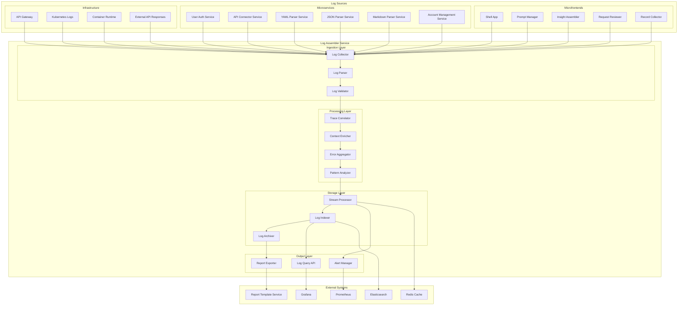
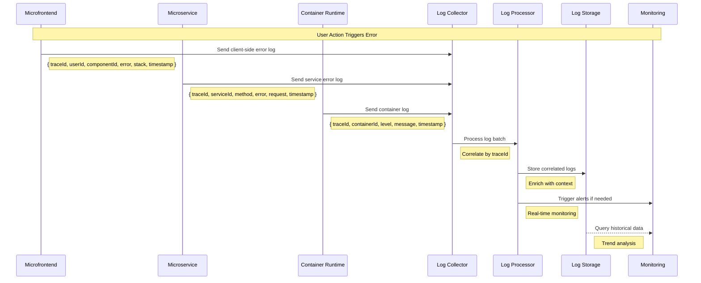

# Log Assembler Service

## 1. Executive Summary

The Log Assembler Service provides centralized log collection, correlation, and analysis capabilities for the Augment-It platform's distributed architecture. This service aggregates logs from microfrontends, microservices, containers, and external API interactions, providing unified observability across the entire Module Federation with Docker ecosystem.

The service handles log ingestion from multiple sources, correlates related events using trace IDs, enriches log data with contextual information, and provides structured outputs for monitoring, debugging, and compliance reporting.

## 2. Service Overview

### Responsibilities

- **Centralized Log Ingestion**: Collect logs from all microfrontends, microservices, and infrastructure components
- **Log Correlation**: Link related log events across distributed components using trace IDs and correlation tokens
- **Log Enrichment**: Add contextual metadata including user information, session data, and system state
- **Real-time Processing**: Stream processing for immediate alerting and monitoring
- **Historical Analysis**: Store and index logs for historical analysis and compliance
- **Error Aggregation**: Group and deduplicate similar errors across the distributed system
- **Performance Monitoring**: Track and correlate performance metrics with log events
- **Security Monitoring**: Detect and alert on suspicious activities and security events

### Key Features

- Multi-source log collection (containers, services, frontends)
- Distributed tracing correlation
- Real-time log streaming and processing
- Structured log parsing and normalization
- Error grouping and deduplication
- Performance correlation and analysis
- Security event detection
- Compliance log retention and archival
- Integration with Report Template Service
- Monitoring and alerting capabilities

## 3. Technical Architecture

### High-Level Architecture



### Log Collection Architecture



## 4. Detailed Implementation

### Log Schema and Standards

```typescript
// Common log schema across all sources
interface BaseLogEntry {
  timestamp: string; // ISO 8601 format
  traceId: string; // Distributed tracing ID
  spanId?: string; // Optional span ID for detailed tracing
  correlationId: string; // Request/session correlation
  source: LogSource;
  level: LogLevel;
  message: string;
  metadata: Record<string, any>;
}

interface LogSource {
  type: 'microfrontend' | 'microservice' | 'infrastructure' | 'external';
  name: string; // e.g., 'prompt-manager', 'user-auth-service'
  version: string;
  environment: 'development' | 'staging' | 'production';
  instance: string; // Container/pod identifier
}

type LogLevel = 'trace' | 'debug' | 'info' | 'warn' | 'error' | 'fatal';

// Microfrontend-specific log entry
interface MicrofrontendLogEntry extends BaseLogEntry {
  source: LogSource & { type: 'microfrontend' };
  user?: {
    id: string;
    sessionId: string;
    organizationId?: string;
  };
  component: {
    name: string;
    props?: Record<string, any>;
    state?: Record<string, any>;
  };
  browser: {
    userAgent: string;
    url: string;
    viewport: { width: number; height: number };
  };
  error?: {
    name: string;
    message: string;
    stack: string;
    componentStack?: string;
  };
}

// Microservice-specific log entry
interface MicroserviceLogEntry extends BaseLogEntry {
  source: LogSource & { type: 'microservice' };
  request?: {
    method: string;
    url: string;
    headers: Record<string, string>;
    body?: any;
    userId?: string;
  };
  response?: {
    statusCode: number;
    headers: Record<string, string>;
    body?: any;
    duration: number; // milliseconds
  };
  database?: {
    query?: string;
    duration?: number;
    affected?: number;
  };
  external?: {
    service: string;
    endpoint: string;
    duration: number;
    statusCode?: number;
  };
}

// Infrastructure log entry
interface InfrastructureLogEntry extends BaseLogEntry {
  source: LogSource & { type: 'infrastructure' };
  resource: {
    type: 'container' | 'kubernetes' | 'network' | 'storage';
    name: string;
    namespace?: string;
  };
  metrics?: {
    cpu?: number;
    memory?: number;
    network?: { in: number; out: number };
    disk?: { read: number; write: number };
  };
}
```

### Log Collection Implementation

```typescript
// Log Collector Service
export class LogCollectorService {
  private eventStream: EventEmitter;
  private logBuffer: Map<string, LogEntry[]>; // Keyed by traceId
  private redis: Redis;
  
  constructor() {
    this.eventStream = new EventEmitter();
    this.logBuffer = new Map();
    this.redis = new Redis(process.env.REDIS_URL);
    
    // Process buffered logs every 100ms
    setInterval(() => this.flushBuffer(), 100);
  }
  
  // Collect log from various sources
  async collectLog(logEntry: BaseLogEntry): Promise<void> {
    try {
      // Validate log entry
      const validatedEntry = await this.validateLogEntry(logEntry);
      
      // Add to buffer for correlation
      this.bufferLog(validatedEntry);
      
      // Emit for real-time processing
      this.eventStream.emit('log:received', validatedEntry);
      
      // Store in Redis for fast access
      await this.cacheLog(validatedEntry);
      
    } catch (error) {
      console.error('Failed to collect log:', error);
      // Don't let log processing failures break the application
    }
  }
  
  private bufferLog(logEntry: BaseLogEntry): void {
    const { traceId } = logEntry;
    
    if (!this.logBuffer.has(traceId)) {
      this.logBuffer.set(traceId, []);
    }
    
    this.logBuffer.get(traceId)!.push(logEntry);
  }
  
  private async flushBuffer(): Promise<void> {
    for (const [traceId, logs] of this.logBuffer.entries()) {
      if (logs.length > 0) {
        // Process correlated logs
        await this.processCorrelatedLogs(traceId, logs);
        
        // Clear processed logs
        this.logBuffer.set(traceId, []);
      }
    }
  }
  
  private async processCorrelatedLogs(traceId: string, logs: LogEntry[]): Promise<void> {
    const correlatedLog: CorrelatedLogGroup = {
      traceId,
      timestamp: new Date().toISOString(),
      logs: logs.sort((a, b) => new Date(a.timestamp).getTime() - new Date(b.timestamp).getTime()),
      summary: this.generateLogSummary(logs),
      severity: this.calculateGroupSeverity(logs),
      duration: this.calculateTraceDuration(logs),
    };
    
    // Emit correlated log group
    this.eventStream.emit('logs:correlated', correlatedLog);
  }
  
  private generateLogSummary(logs: LogEntry[]): LogSummary {
    const errorCount = logs.filter(log => log.level === 'error' || log.level === 'fatal').length;
    const warnCount = logs.filter(log => log.level === 'warn').length;
    const services = [...new Set(logs.map(log => log.source.name))];
    
    return {
      totalLogs: logs.length,
      errorCount,
      warnCount,
      servicesInvolved: services,
      timeSpan: this.calculateTraceDuration(logs),
    };
  }
}
```

### Error Aggregation and Pattern Analysis

```typescript
export class ErrorAggregatorService {
  private errorPatterns: Map<string, ErrorPattern>;
  private elasticsearch: Client;
  
  constructor() {
    this.errorPatterns = new Map();
    this.elasticsearch = new Client({ node: process.env.ELASTICSEARCH_URL });
  }
  
  async aggregateError(logEntry: BaseLogEntry): Promise<void> {
    if (logEntry.level !== 'error' && logEntry.level !== 'fatal') {
      return;
    }
    
    const errorSignature = this.generateErrorSignature(logEntry);
    const existingPattern = this.errorPatterns.get(errorSignature);
    
    if (existingPattern) {
      // Update existing pattern
      existingPattern.count++;
      existingPattern.lastOccurrence = logEntry.timestamp;
      existingPattern.affectedTraces.add(logEntry.traceId);
      existingPattern.recentLogs.push(logEntry);
      
      // Keep only recent logs (last 10)
      if (existingPattern.recentLogs.length > 10) {
        existingPattern.recentLogs = existingPattern.recentLogs.slice(-10);
      }
      
      // Check if this is a spike in errors
      if (this.isErrorSpike(existingPattern)) {
        await this.triggerErrorSpikeAlert(existingPattern);
      }
    } else {
      // Create new error pattern
      const newPattern: ErrorPattern = {
        signature: errorSignature,
        firstOccurrence: logEntry.timestamp,
        lastOccurrence: logEntry.timestamp,
        count: 1,
        affectedServices: new Set([logEntry.source.name]),
        affectedTraces: new Set([logEntry.traceId]),
        recentLogs: [logEntry],
        severity: this.calculateErrorSeverity(logEntry),
      };
      
      this.errorPatterns.set(errorSignature, newPattern);
      
      // Trigger alert for new critical errors
      if (newPattern.severity === 'critical') {
        await this.triggerNewCriticalErrorAlert(newPattern);
      }
    }
    
    // Store in Elasticsearch for historical analysis
    await this.indexError(logEntry, errorSignature);
  }
  
  private generateErrorSignature(logEntry: BaseLogEntry): string {
    const error = (logEntry as any).error || { message: logEntry.message };
    
    // Create a signature based on error type, service, and normalized message
    const normalizedMessage = this.normalizeErrorMessage(error.message);
    const signature = `${logEntry.source.name}:${error.name || 'UnknownError'}:${normalizedMessage}`;
    
    return crypto.createHash('sha256').update(signature).digest('hex').substring(0, 16);
  }
  
  private normalizeErrorMessage(message: string): string {
    // Normalize error messages by removing variable parts (IDs, timestamps, etc.)
    return message
      .replace(/\b[0-9a-f]{8}-[0-9a-f]{4}-[0-9a-f]{4}-[0-9a-f]{4}-[0-9a-f]{12}\b/gi, 'UUID')
      .replace(/\b\d{4}-\d{2}-\d{2}T\d{2}:\d{2}:\d{2}(\.\d{3})?Z\b/g, 'TIMESTAMP')
      .replace(/\b\d+\b/g, 'NUMBER')
      .replace(/\b[a-f0-9]{32,}\b/gi, 'HASH')
      .toLowerCase();
  }
}
```

### Performance Correlation

```typescript
export class PerformanceCorrelatorService {
  private traceMetrics: Map<string, TraceMetrics>;
  private prometheus: PromClient;
  
  constructor() {
    this.traceMetrics = new Map();
    this.prometheus = new PromClient();
  }
  
  async correlatePerformance(correlatedLogs: CorrelatedLogGroup): Promise<void> {
    const metrics = this.calculateTraceMetrics(correlatedLogs);
    
    // Store metrics for this trace
    this.traceMetrics.set(correlatedLogs.traceId, metrics);
    
    // Send metrics to Prometheus
    await this.exportMetrics(metrics);
    
    // Check for performance issues
    const issues = this.detectPerformanceIssues(metrics);
    if (issues.length > 0) {
      await this.triggerPerformanceAlerts(correlatedLogs.traceId, issues);
    }
  }
  
  private calculateTraceMetrics(correlatedLogs: CorrelatedLogGroup): TraceMetrics {
    const logs = correlatedLogs.logs;
    const serviceMetrics = new Map<string, ServiceMetrics>();
    
    // Calculate per-service metrics
    for (const log of logs) {
      const serviceName = log.source.name;
      
      if (!serviceMetrics.has(serviceName)) {
        serviceMetrics.set(serviceName, {
          name: serviceName,
          requestCount: 0,
          totalDuration: 0,
          errorCount: 0,
          maxDuration: 0,
        });
      }
      
      const service = serviceMetrics.get(serviceName)!;
      service.requestCount++;
      
      if (log.level === 'error' || log.level === 'fatal') {
        service.errorCount++;
      }
      
      // Extract duration from microservice logs
      if ('response' in log && log.response?.duration) {
        service.totalDuration += log.response.duration;
        service.maxDuration = Math.max(service.maxDuration, log.response.duration);
      }
    }
    
    return {
      traceId: correlatedLogs.traceId,
      totalDuration: correlatedLogs.duration,
      serviceMetrics: Array.from(serviceMetrics.values()),
      errorRate: correlatedLogs.summary.errorCount / correlatedLogs.summary.totalLogs,
      servicesInvolved: correlatedLogs.summary.servicesInvolved.length,
    };
  }
  
  private detectPerformanceIssues(metrics: TraceMetrics): PerformanceIssue[] {
    const issues: PerformanceIssue[] = [];
    
    // Check overall trace duration
    if (metrics.totalDuration > 5000) { // 5 seconds
      issues.push({
        type: 'slow_trace',
        severity: 'warning',
        description: `Trace took ${metrics.totalDuration}ms to complete`,
        affectedServices: metrics.serviceMetrics.map(s => s.name),
      });
    }
    
    // Check individual service performance
    for (const service of metrics.serviceMetrics) {
      const avgDuration = service.totalDuration / service.requestCount;
      
      if (avgDuration > 2000) { // 2 seconds average
        issues.push({
          type: 'slow_service',
          severity: 'warning',
          description: `Service ${service.name} averaged ${avgDuration.toFixed(0)}ms per request`,
          affectedServices: [service.name],
        });
      }
      
      if (service.errorRate > 0.1) { // 10% error rate
        issues.push({
          type: 'high_error_rate',
          severity: service.errorRate > 0.5 ? 'critical' : 'warning',
          description: `Service ${service.name} has ${(service.errorRate * 100).toFixed(1)}% error rate`,
          affectedServices: [service.name],
        });
      }
    }
    
    return issues;
  }
}
```

## 5. API Interface

### REST Endpoints

```yaml
basePath: /api/v1/logs
paths:
  /ingest:
    post:
      summary: Ingest log entries
      requestBody:
        required: true
        content:
          application/json:
            schema:
              oneOf:
                - $ref: '#/components/schemas/BaseLogEntry'
                - type: array
                  items:
                    $ref: '#/components/schemas/BaseLogEntry'
      responses:
        '202':
          description: Logs accepted for processing
        '400':
          description: Invalid log format

  /query:
    post:
      summary: Query logs
      requestBody:
        required: true
        content:
          application/json:
            schema:
              $ref: '#/components/schemas/LogQuery'
      responses:
        '200':
          description: Query results
          content:
            application/json:
              schema:
                $ref: '#/components/schemas/LogQueryResult'

  /errors:
    get:
      summary: Get error patterns
      parameters:
        - name: timeRange
          in: query
          schema:
            type: string
            enum: [1h, 6h, 24h, 7d, 30d]
        - name: service
          in: query
          schema:
            type: string
        - name: severity
          in: query
          schema:
            type: string
            enum: [low, medium, high, critical]
      responses:
        '200':
          description: Error patterns
          content:
            application/json:
              schema:
                type: array
                items:
                  $ref: '#/components/schemas/ErrorPattern'

  /traces/{traceId}:
    get:
      summary: Get correlated logs for a trace
      parameters:
        - name: traceId
          in: path
          required: true
          schema:
            type: string
      responses:
        '200':
          description: Correlated log group
          content:
            application/json:
              schema:
                $ref: '#/components/schemas/CorrelatedLogGroup'
        '404':
          description: Trace not found

  /metrics:
    get:
      summary: Get performance metrics
      parameters:
        - name: timeRange
          in: query
          schema:
            type: string
        - name: service
          in: query
          schema:
            type: string
      responses:
        '200':
          description: Performance metrics
          content:
            application/json:
              schema:
                $ref: '#/components/schemas/PerformanceMetrics'

  /health:
    get:
      summary: Health check
      responses:
        '200':
          description: Service health status
```

### WebSocket Interface

```typescript
// Real-time log streaming
interface LogStreamMessage {
  type: 'log' | 'error_pattern' | 'performance_alert' | 'trace_complete';
  data: any;
  timestamp: string;
}

// WebSocket endpoints
interface WebSocketEndpoints {
  '/ws/logs': {
    subscribe: {
      filters: {
        services?: string[];
        levels?: LogLevel[];
        traceIds?: string[];
      };
    };
    messages: LogStreamMessage[];
  };
  
  '/ws/errors': {
    subscribe: {
      severity?: 'warning' | 'critical';
    };
    messages: ErrorPattern[];
  };
  
  '/ws/performance': {
    subscribe: {
      thresholds: {
        duration?: number;
        errorRate?: number;
      };
    };
    messages: PerformanceIssue[];
  };
}
```

## 6. Integration Points

### Module Federation Integration

```typescript
// Client-side logging for microfrontends
export class MicrofrontendLogger {
  private logService: LogAssemblerClient;
  private traceId: string;
  private componentStack: string[];
  
  constructor(moduleName: string) {
    this.logService = new LogAssemblerClient();
    this.traceId = this.generateTraceId();
    this.componentStack = [moduleName];
  }
  
  // Module Federation error boundary integration
  logModuleError(error: Error, moduleName: string, errorInfo?: any): void {
    const logEntry: MicrofrontendLogEntry = {
      timestamp: new Date().toISOString(),
      traceId: this.traceId,
      correlationId: this.getCorrelationId(),
      source: {
        type: 'microfrontend',
        name: moduleName,
        version: process.env.APP_VERSION || '1.0.0',
        environment: process.env.NODE_ENV as any,
        instance: window.location.hostname,
      },
      level: 'error',
      message: `Module Federation Error: ${error.message}`,
      metadata: {
        errorInfo,
        url: window.location.href,
        userAgent: navigator.userAgent,
      },
      user: this.getCurrentUser(),
      component: {
        name: moduleName,
        props: errorInfo?.componentProps,
      },
      browser: {
        userAgent: navigator.userAgent,
        url: window.location.href,
        viewport: {
          width: window.innerWidth,
          height: window.innerHeight,
        },
      },
      error: {
        name: error.name,
        message: error.message,
        stack: error.stack || '',
        componentStack: errorInfo?.componentStack,
      },
    };
    
    this.logService.ingest(logEntry);
  }
  
  // Performance logging for module loading
  logModuleLoadTime(moduleName: string, duration: number): void {
    const logEntry: MicrofrontendLogEntry = {
      timestamp: new Date().toISOString(),
      traceId: this.traceId,
      correlationId: this.getCorrelationId(),
      source: {
        type: 'microfrontend',
        name: moduleName,
        version: process.env.APP_VERSION || '1.0.0',
        environment: process.env.NODE_ENV as any,
        instance: window.location.hostname,
      },
      level: 'info',
      message: `Module loaded: ${moduleName}`,
      metadata: {
        loadTime: duration,
        performance: {
          navigation: performance.navigation,
          timing: performance.timing,
        },
      },
    };
    
    this.logService.ingest(logEntry);
  }
}
```

### Docker Container Integration

```yaml
# docker-compose logging configuration
version: '3.8'
services:
  shell-app:
    logging:
      driver: "fluentd"
      options:
        fluentd-address: "log-assembler:24224"
        fluentd-async-connect: "true"
        tag: "microfrontend.shell-app"
        
  prompt-manager:
    logging:
      driver: "fluentd"
      options:
        fluentd-address: "log-assembler:24224"
        tag: "microfrontend.prompt-manager"
        
  user-auth-service:
    logging:
      driver: "fluentd"
      options:
        fluentd-address: "log-assembler:24224"
        tag: "microservice.user-auth"
        
  log-assembler:
    image: augment-it/log-assembler:latest
    ports:
      - "24224:24224"  # Fluentd port
      - "9090:9090"    # HTTP API
      - "8080:8080"    # WebSocket
    environment:
      - ELASTICSEARCH_URL=http://elasticsearch:9200
      - REDIS_URL=redis://redis:6379
      - PROMETHEUS_URL=http://prometheus:9090
```

### Kubernetes Integration

```yaml
# kubernetes logging configuration
apiVersion: v1
kind: ConfigMap
metadata:
  name: fluent-bit-config
data:
  fluent-bit.conf: |
    [INPUT]
        Name tail
        Path /var/log/containers/*augment-it*.log
        Parser docker
        Tag kube.*
        Mem_Buf_Limit 50MB
        Skip_Long_Lines On
        
    [FILTER]
        Name kubernetes
        Match kube.*
        Kube_URL https://kubernetes.default.svc:443
        Kube_CA_File /var/run/secrets/kubernetes.io/serviceaccount/ca.crt
        Kube_Token_File /var/run/secrets/kubernetes.io/serviceaccount/token
        Merge_Log On
        K8S-Logging.Parser On
        K8S-Logging.Exclude Off
        
    [OUTPUT]
        Name http
        Match *
        Host log-assembler-service
        Port 9090
        URI /api/v1/logs/ingest
        Format json_lines
```

## 7. Performance and Scalability

### Throughput Requirements

- **Log Ingestion Rate**: 10,000+ logs/second during peak load
- **Real-time Processing**: < 100ms latency for log correlation
- **Query Response Time**: < 500ms for typical log queries
- **Storage Retention**: 90 days hot storage, 1 year cold storage
- **Concurrent Users**: Support 100+ concurrent dashboard users

### Scaling Strategy

```yaml
# Kubernetes HPA configuration
apiVersion: autoscaling/v2
kind: HorizontalPodAutoscaler
metadata:
  name: log-assembler-hpa
spec:
  scaleTargetRef:
    apiVersion: apps/v1
    kind: Deployment
    name: log-assembler
  minReplicas: 2
  maxReplicas: 10
  metrics:
  - type: Resource
    resource:
      name: cpu
      target:
        type: Utilization
        averageUtilization: 70
  - type: Resource
    resource:
      name: memory
      target:
        type: Utilization
        averageUtilization: 80
  - type: Pods
    pods:
      metric:
        name: log_ingestion_rate
      target:
        type: AverageValue
        averageValue: "1000" # logs per second per pod
```

## 8. Security and Compliance

### Data Security

- **Encryption in Transit**: TLS 1.3 for all log transmission
- **Encryption at Rest**: AES-256 encryption for stored logs
- **Access Control**: Role-based access to log data
- **Audit Trail**: All log access and queries are audited
- **Data Anonymization**: PII scrubbing for compliance

### Compliance Features

- **GDPR Compliance**: Data retention policies and right to deletion
- **SOC 2 Compliance**: Access controls and audit trails
- **HIPAA Compliance**: PHI handling and encryption (if applicable)
- **Log Retention**: Configurable retention policies
- **Data Export**: Support for compliance reporting

## 9. Monitoring and Operations

### Service Health Monitoring

```typescript
export class LogAssemblerHealthMonitor {
  private healthMetrics: HealthMetrics;
  
  async getHealth(): Promise<HealthStatus> {
    const checks = await Promise.all([
      this.checkElasticsearch(),
      this.checkRedis(),
      this.checkLogIngestion(),
      this.checkProcessingLatency(),
      this.checkStorage(),
    ]);
    
    const overallStatus = checks.every(check => check.status === 'healthy') 
      ? 'healthy' 
      : checks.some(check => check.status === 'critical')
      ? 'critical'
      : 'degraded';
    
    return {
      status: overallStatus,
      timestamp: new Date().toISOString(),
      checks,
      metrics: this.healthMetrics,
    };
  }
  
  private async checkLogIngestion(): Promise<HealthCheck> {
    const recentLogs = await this.getRecentLogCount(60000); // Last minute
    const expectedRate = 100; // logs per minute minimum
    
    return {
      name: 'log_ingestion',
      status: recentLogs >= expectedRate ? 'healthy' : 'warning',
      message: `${recentLogs} logs ingested in the last minute`,
      metrics: { logsPerMinute: recentLogs },
    };
  }
}
```

### Operational Dashboards

```yaml
# Grafana dashboard configuration
dashboards:
  - name: "Log Assembler Overview"
    panels:
      - title: "Log Ingestion Rate"
        type: graph
        targets:
          - expr: rate(log_assembler_logs_ingested_total[5m])
      
      - title: "Error Patterns"
        type: table
        targets:
          - expr: topk(10, log_assembler_error_patterns_count)
      
      - title: "Service Response Times"
        type: heatmap
        targets:
          - expr: histogram_quantile(0.95, log_assembler_processing_duration_seconds_bucket)
      
      - title: "Alert Status"
        type: stat
        targets:
          - expr: log_assembler_active_alerts
```

## 10. Configuration

### Environment Configuration

```yaml
# Environment variables
environment:
  # Service Configuration
  LOG_ASSEMBLER_PORT: 9090
  LOG_ASSEMBLER_WS_PORT: 8080
  LOG_ASSEMBLER_FLUENTD_PORT: 24224
  
  # Storage Configuration
  ELASTICSEARCH_URL: http://elasticsearch:9200
  ELASTICSEARCH_INDEX_PREFIX: augment-it-logs
  REDIS_URL: redis://redis:6379
  REDIS_KEY_PREFIX: log-assembler
  
  # Processing Configuration
  LOG_BUFFER_SIZE: 1000
  LOG_BUFFER_FLUSH_INTERVAL: 100  # milliseconds
  LOG_CORRELATION_TIMEOUT: 30000  # milliseconds
  LOG_RETENTION_DAYS: 90
  
  # Alert Configuration
  ALERT_ERROR_SPIKE_THRESHOLD: 10  # errors per minute
  ALERT_PERFORMANCE_THRESHOLD: 5000  # milliseconds
  ALERT_ERROR_RATE_THRESHOLD: 0.1  # 10%
  
  # Security Configuration
  LOG_ENCRYPTION_ENABLED: true
  LOG_ANONYMIZATION_ENABLED: true
  ACCESS_TOKEN_SECRET: ${ACCESS_TOKEN_SECRET}
```

### Application Configuration

```yaml
# config/log-assembler.yml
service:
  name: log-assembler
  version: 1.0.0
  environment: production
  
ingestion:
  sources:
    - type: http
      port: 9090
      path: /api/v1/logs/ingest
      
    - type: fluentd
      port: 24224
      buffer_size: 64MB
      
    - type: websocket
      port: 8080
      max_connections: 1000
      
  validation:
    schema_validation: true
    required_fields: [timestamp, traceId, source, level, message]
    max_message_size: 1MB
    
processing:
  correlation:
    enabled: true
    timeout: 30s
    buffer_size: 10000
    
  enrichment:
    enabled: true
    user_context: true
    geolocation: false
    
  aggregation:
    error_patterns: true
    performance_metrics: true
    deduplication: true
    
storage:
  elasticsearch:
    enabled: true
    index_rotation: daily
    replicas: 1
    shards: 3
    
  redis:
    enabled: true
    ttl: 3600  # 1 hour
    max_memory: 2GB
    
  archival:
    enabled: true
    cold_storage_days: 90
    archive_format: gzip
    
alerting:
  channels:
    - type: webhook
      url: ${SLACK_WEBHOOK_URL}
      
    - type: prometheus
      enabled: true
      
  rules:
    - name: error_spike
      condition: error_rate > 10/min
      severity: warning
      
    - name: critical_error
      condition: level == "fatal"
      severity: critical
      
    - name: slow_performance
      condition: avg_duration > 5000ms
      severity: warning
```

This comprehensive Log Assembler Service provides the foundation for centralized logging across your distributed Module Federation architecture. It handles the complexity of correlating logs from multiple microfrontends, microservices, and infrastructure components while providing real-time monitoring, error aggregation, and performance analysis.

The service integrates seamlessly with your existing Docker and Kubernetes infrastructure and provides the data foundation needed for the Report Template Service to generate meaningful insights and reports.
