# Report Template Service

## 1. Executive Summary

The Report Template Service provides standardized reporting templates focused on operational health across the Augment-It platform's distributed architecture. This service generates concise, actionable summaries highlighting critical issues like error spikes, performance bottlenecks, and resource consumption problems that require immediate attention.

The service integrates with the Log Assembler Service to automatically generate reports on:
- **Error Summaries**: Grouped errors and failure patterns
- **Performance Issues**: Slow operations and user wait times
- **Resource Problems**: Memory usage spikes and CPU bottlenecks
- **User Impact**: Operations that frustrate or block users

## 2. Service Overview

### Core Focus Areas

1. **Error Summaries**
   - Grouped error patterns across services
   - Critical errors affecting multiple users
   - New error types that just appeared
   - Services with high error rates

2. **Performance Bottlenecks**
   - Operations taking too long (>2-5 seconds)
   - Database queries running slow
   - API calls timing out
   - Module Federation load times

3. **Resource Issues**
   - Memory usage spikes
   - CPU usage sustained above 80%
   - Container restart patterns
   - Services hitting resource limits

4. **User Impact**
   - Features users can't access
   - Operations that make users wait
   - Repeated user retry patterns
   - Failed user workflows

### Key Features

- **Simple Templates**: Focus on "what's broken" and "what's slow"
- **Automated Generation**: Reports triggered by thresholds
- **Action-Oriented**: Each report includes next steps
- **Multi-Format Output**: Slack, email, dashboard widgets
- **Historical Trending**: "Getting better" or "getting worse"

## 3. Report Templates

### Template 1: Error Summary Report

```yaml
template_id: error-summary
name: "System Error Summary"
trigger: 
  - error_rate > 5/minute
  - new_error_pattern_detected
  - critical_service_down

format:
  title: "🚨 Error Summary - {{timeRange}}"
  sections:
    - type: alert_summary
      content: |
        **Critical Issues:** {{criticalCount}}
        **New Errors:** {{newErrorCount}} 
        **Affected Users:** {{affectedUserCount}}
        **Worst Service:** {{worstService}} ({{worstServiceErrorRate}}% errors)
    
    - type: error_list
      limit: 5
      content: |
        **Top Errors:**
        {{#each topErrors}}
        • **{{service}}**: {{message}} ({{count}} times)
          - First seen: {{firstSeen}}
          - Affects: {{affectedUsers}} users
        {{/each}}
    
    - type: action_items
      content: |
        **Immediate Actions:**
        {{#if criticalErrors}}
        • 🔥 **CRITICAL**: Check {{criticalService}} - service may be down
        {{/if}}
        {{#if newErrors}}
        • 🆕 **NEW**: Investigate new error in {{newErrorService}}
        {{/if}}
        {{#if highErrorRate}}
        • ⚠️ **HIGH RATE**: {{highErrorRateService}} needs attention
        {{/if}}

example_output: |
  🚨 Error Summary - Last 30 minutes
  
  **Critical Issues:** 2
  **New Errors:** 1
  **Affected Users:** 47
  **Worst Service:** prompt-manager (12% errors)
  
  **Top Errors:**
  • **user-auth-service**: JWT token expired (23 times)
    - First seen: 2 minutes ago
    - Affects: 23 users
  • **api-connector**: OpenAI API timeout (15 times)
    - First seen: 15 minutes ago
    - Affects: 15 users
  
  **Immediate Actions:**
  • 🆕 **NEW**: Investigate new error in prompt-manager
  • ⚠️ **HIGH RATE**: api-connector needs attention
```

### Template 2: Performance Issues Report

```yaml
template_id: performance-issues
name: "Performance Issues Summary"
trigger:
  - avg_response_time > 3000ms
  - memory_usage > 85%
  - cpu_usage > 80%
  - slow_query_detected

format:
  title: "🐌 Performance Issues - {{timeRange}}"
  sections:
    - type: performance_summary
      content: |
        **Slow Operations:** {{slowOperationCount}}
        **Memory Issues:** {{memoryIssueCount}} services
        **Slowest Service:** {{slowestService}} ({{slowestTime}}ms avg)
        **Users Waiting:** {{usersAffected}} experiencing delays
    
    - type: slow_operations
      limit: 5
      content: |
        **Operations Taking Too Long:**
        {{#each slowOperations}}
        • **{{service}}**: {{operation}} ({{avgTime}}ms)
          - Normal time: {{normalTime}}ms
          - {{affectedRequests}} requests affected
        {{/each}}
    
    - type: resource_issues
      content: |
        **Resource Problems:**
        {{#each resourceIssues}}
        • **{{service}}**: {{resourceType}} at {{usage}}%
          - Trend: {{trend}}
          - Action needed: {{action}}
        {{/each}}

example_output: |
  🐌 Performance Issues - Last hour
  
  **Slow Operations:** 3
  **Memory Issues:** 2 services
  **Slowest Service:** insight-assembler (4.2s avg)
  **Users Waiting:** 12 experiencing delays
  
  **Operations Taking Too Long:**
  • **insight-assembler**: Generate insight report (4200ms)
    - Normal time: 800ms
    - 8 requests affected
  • **api-connector**: Claude API call (3100ms)
    - Normal time: 1200ms
    - 15 requests affected
  
  **Resource Problems:**
  • **prompt-manager**: Memory at 91%
    - Trend: Increasing
    - Action needed: Check for memory leaks
```

### Template 3: User Impact Report

```yaml
template_id: user-impact
name: "User Impact Summary"
trigger:
  - user_retry_rate > 20%
  - feature_unavailable
  - user_wait_time > 5000ms

format:
  title: "👥 User Impact Summary - {{timeRange}}"
  sections:
    - type: impact_summary
      content: |
        **Users Affected:** {{totalUsersAffected}}
        **Features Broken:** {{brokenFeatureCount}}
        **User Retries:** {{retryCount}} ({{retryRate}}%)
        **Longest Wait:** {{longestWait}}s for {{slowestFeature}}
    
    - type: broken_features
      content: |
        **Features Users Can't Access:**
        {{#each brokenFeatures}}
        • **{{feature}}**: {{issue}}
          - Users affected: {{userCount}}
          - Since: {{duration}} ago
        {{/each}}
    
    - type: user_frustration
      content: |
        **User Frustration Indicators:**
        {{#each frustrationPoints}}
        • {{description}}
          - Pattern: {{pattern}}
          - Impact: {{impact}}
        {{/each}}

example_output: |
  👥 User Impact Summary - Last 2 hours
  
  **Users Affected:** 34
  **Features Broken:** 1
  **User Retries:** 67 (23%)
  **Longest Wait:** 8.3s for AI response generation
  
  **Features Users Can't Access:**
  • **Template Library**: Database connection failed
    - Users affected: 12
    - Since: 45 minutes ago
  
  **User Frustration Indicators:**
  • Users clicking "Generate" button multiple times
    - Pattern: 15 users, avg 3 clicks
    - Impact: AI requests backing up
```

### Template 4: Resource Alert Report

```yaml
template_id: resource-alert
name: "Resource Alert Summary"
trigger:
  - container_restart_count > 3
  - memory_usage > 90%
  - disk_usage > 85%
  - pod_evicted

format:
  title: "⚡ Resource Alert - {{timeRange}}"
  sections:
    - type: resource_summary
      content: |
        **Services at Risk:** {{atRiskCount}}
        **Container Restarts:** {{restartCount}}
        **Memory Pressure:** {{memoryPressureServices}} services
        **Immediate Action Required:** {{actionRequired}}
    
    - type: resource_details
      content: |
        **Resource Problems:**
        {{#each resourceProblems}}
        • **{{service}}** ({{container}})
          - {{resourceType}}: {{currentUsage}} (limit: {{limit}})
          - Trend: {{trend}} over {{timeframe}}
          - Risk: {{riskLevel}}
        {{/each}}
    
    - type: actions
      content: |
        **Required Actions:**
        {{#each actions}}
        • {{priority}} **{{service}}**: {{action}}
        {{/each}}

example_output: |
  ⚡ Resource Alert - Current
  
  **Services at Risk:** 2
  **Container Restarts:** 4
  **Memory Pressure:** 3 services
  **Immediate Action Required:** YES
  
  **Resource Problems:**
  • **insight-assembler** (pod-xyz-123)
    - Memory: 1.8GB (limit: 2GB)
    - Trend: +200MB over 30min
    - Risk: HIGH - approaching limit
  • **api-connector** (pod-abc-456)
    - CPU: 850m (limit: 1000m)
    - Trend: sustained high over 20min
    - Risk: MEDIUM - performance impact
  
  **Required Actions:**
  • 🔥 **insight-assembler**: Increase memory limit or investigate leak
  • ⚠️ **api-connector**: Check for CPU-intensive operations
```

## 4. Technical Implementation

### Core Service Architecture

```typescript
export class ReportTemplateService {
  private logAssembler: LogAssemblerClient;
  private templates: Map<string, ReportTemplate>;
  private triggers: Map<string, TriggerCondition[]>;
  
  constructor() {
    this.logAssembler = new LogAssemblerClient();
    this.templates = this.loadTemplates();
    this.triggers = this.setupTriggers();
    
    // Check for triggered reports every minute
    setInterval(() => this.checkTriggers(), 60000);
  }
  
  async checkTriggers(): Promise<void> {
    const currentMetrics = await this.logAssembler.getCurrentMetrics();
    
    for (const [templateId, triggers] of this.triggers.entries()) {
      const triggeredConditions = triggers.filter(trigger => 
        this.evaluateTrigger(trigger, currentMetrics)
      );
      
      if (triggeredConditions.length > 0) {
        await this.generateReport(templateId, currentMetrics, triggeredConditions);
      }
    }
  }
  
  async generateReport(
    templateId: string, 
    metrics: SystemMetrics, 
    triggers: TriggerCondition[]
  ): Promise<GeneratedReport> {
    const template = this.templates.get(templateId);
    if (!template) throw new Error(`Template ${templateId} not found`);
    
    // Gather data based on template requirements
    const reportData = await this.gatherReportData(template, metrics);
    
    // Generate report content
    const report = await this.renderTemplate(template, reportData);
    
    // Determine severity and recipients
    const severity = this.calculateSeverity(triggers, reportData);
    const recipients = this.getRecipients(severity, template.channels);
    
    // Send the report
    await this.distributeReport(report, recipients, severity);
    
    return report;
  }
  
  private async gatherReportData(
    template: ReportTemplate, 
    metrics: SystemMetrics
  ): Promise<ReportData> {
    const timeRange = template.timeRange || '30m';
    
    // Get error data from Log Assembler
    const errors = await this.logAssembler.getErrorPatterns(timeRange);
    const performance = await this.logAssembler.getPerformanceMetrics(timeRange);
    const resources = await this.logAssembler.getResourceMetrics(timeRange);
    
    return {
      errors: this.processErrorData(errors),
      performance: this.processPerformanceData(performance),
      resources: this.processResourceData(resources),
      userImpact: await this.calculateUserImpact(errors, performance),
      timeRange,
      timestamp: new Date().toISOString(),
    };
  }
  
  private processErrorData(errors: ErrorPattern[]): ProcessedErrorData {
    const critical = errors.filter(e => e.severity === 'critical');
    const newErrors = errors.filter(e => 
      Date.now() - new Date(e.firstOccurrence).getTime() < 3600000 // 1 hour
    );
    const topErrors = errors
      .sort((a, b) => b.count - a.count)
      .slice(0, 5);
    
    return {
      criticalCount: critical.length,
      newErrorCount: newErrors.length,
      totalErrors: errors.length,
      topErrors: topErrors.map(error => ({
        service: error.affectedServices[0] || 'unknown',
        message: this.simplifyErrorMessage(error.signature),
        count: error.count,
        firstSeen: this.formatTime(error.firstOccurrence),
        affectedUsers: error.affectedTraces.size,
      })),
      worstService: this.findWorstService(errors),
    };
  }
  
  private simplifyErrorMessage(signature: string): string {
    // Convert technical error signatures into user-friendly messages
    const patterns = {
      'jwt.*expired': 'JWT token expired',
      'timeout.*api': 'API call timeout',
      'memory.*limit': 'Memory limit exceeded',
      'connection.*refused': 'Database connection failed',
      'module.*federation.*load': 'Module failed to load',
    };
    
    for (const [pattern, message] of Object.entries(patterns)) {
      if (new RegExp(pattern, 'i').test(signature)) {
        return message;
      }
    }
    
    return signature; // fallback to original
  }
}
```

### Template Engine

```typescript
export class TemplateRenderer {
  private handlebars: typeof Handlebars;
  
  constructor() {
    this.handlebars = Handlebars;
    this.registerHelpers();
  }
  
  private registerHelpers(): void {
    // Helper for formatting time ranges
    this.handlebars.registerHelper('timeAgo', (timestamp: string) => {
      const now = Date.now();
      const time = new Date(timestamp).getTime();
      const diff = Math.floor((now - time) / 1000);
      
      if (diff < 60) return `${diff} seconds ago`;
      if (diff < 3600) return `${Math.floor(diff / 60)} minutes ago`;
      return `${Math.floor(diff / 3600)} hours ago`;
    });
    
    // Helper for severity indicators
    this.handlebars.registerHelper('severityIcon', (severity: string) => {
      const icons = {
        critical: '🔥',
        high: '🚨',
        medium: '⚠️',
        low: '📋',
      };
      return icons[severity] || '📋';
    });
    
    // Helper for trend indicators
    this.handlebars.registerHelper('trendIcon', (trend: string) => {
      const icons = {
        increasing: '📈',
        decreasing: '📉',
        stable: '➡️',
      };
      return icons[trend] || '➡️';
    });
  }
  
  async renderTemplate(template: ReportTemplate, data: ReportData): Promise<string> {
    const compiled = this.handlebars.compile(template.format.content);
    return compiled(data);
  }
}
```

## 5. Integration with Log Assembler

### Data Flow

```mermaid
sequenceDiagram
    participant LA as Log Assembler
    participant RT as Report Template Service
    participant Alert as Alert System
    participant User as Operations Team
    
    Note over LA, User: Automated Report Generation
    
    LA->>RT: Metrics exceed threshold
    Note right of LA: Error rate > 5/min
    
    RT->>LA: Request detailed data
    Note right of RT: Last 30 min errors
    
    LA->>RT: Return error patterns, performance data
    Note right of LA: Grouped by service, impact
    
    RT->>RT: Generate report using template
    Note right of RT: Apply "error-summary" template
    
    RT->>Alert: Send formatted report
    Note right of RT: Slack, email, dashboard
    
    Alert->>User: Notify with actionable summary
    Note right of Alert: "🚨 prompt-manager has 12% error rate"
    
    User->>LA: Investigate specific errors
    Note right of User: Click through to detailed logs
```



## 6. Report Distribution

### Output Channels

```typescript
export class ReportDistributor {
  private channels: Map<string, ReportChannel>;
  
  constructor() {
    this.channels = new Map([
      ['slack', new SlackChannel()],
      ['email', new EmailChannel()],
      ['dashboard', new DashboardChannel()],
      ['webhook', new WebhookChannel()],
    ]);
  }
  
  async distributeReport(
    report: GeneratedReport, 
    recipients: string[], 
    severity: 'low' | 'medium' | 'high' | 'critical'
  ): Promise<void> {
    const channels = this.selectChannels(severity);
    
    for (const channelType of channels) {
      const channel = this.channels.get(channelType);
      if (channel) {
        await channel.send(report, recipients, severity);
      }
    }
  }
  
  private selectChannels(severity: string): string[] {
    switch (severity) {
      case 'critical':
        return ['slack', 'email']; // Immediate notification
      case 'high':
        return ['slack', 'dashboard'];
      case 'medium':
        return ['dashboard'];
      default:
        return ['dashboard']; // Low priority
    }
  }
}
```

### Slack Integration

```typescript
export class SlackChannel implements ReportChannel {
  private webhook: string;
  
  constructor() {
    this.webhook = process.env.SLACK_WEBHOOK_URL!;
  }
  
  async send(
    report: GeneratedReport, 
    recipients: string[], 
    severity: string
  ): Promise<void> {
    const color = this.getSeverityColor(severity);
    const icon = this.getSeverityIcon(severity);
    
    const message = {
      text: `${icon} ${report.title}`,
      attachments: [{
        color,
        text: this.formatForSlack(report.content),
        footer: `Generated at ${new Date().toLocaleString()}`,
        mrkdwn_in: ['text'],
      }],
      channel: this.getChannel(severity),
    };
    
    await fetch(this.webhook, {
      method: 'POST',
      headers: { 'Content-Type': 'application/json' },
      body: JSON.stringify(message),
    });
  }
  
  private formatForSlack(content: string): string {
    // Convert markdown-style formatting to Slack format
    return content
      .replace(/\*\*(.*?)\*\*/g, '*$1*') // Bold
      .replace(/• /g, '• ') // Keep bullets
      .substring(0, 3000); // Slack message limit
  }
  
  private getSeverityColor(severity: string): string {
    const colors = {
      critical: '#FF0000',
      high: '#FF8C00',
      medium: '#FFD700',
      low: '#32CD32',
    };
    return colors[severity] || colors.low;
  }
}
```

## 7. Configuration

```yaml
# Report Template Service Configuration
service:
  name: report-template-service
  port: 8090
  
templates:
  error-summary:
    enabled: true
    triggers:
      - error_rate > 5/minute
      - critical_error_detected
      - new_error_pattern
    channels: [slack, dashboard]
    
  performance-issues:
    enabled: true
    triggers:
      - avg_response_time > 3000ms
      - memory_usage > 85%
      - cpu_usage > 80%
    channels: [dashboard]
    
  user-impact:
    enabled: true
    triggers:
      - user_retry_rate > 20%
      - feature_unavailable
    channels: [slack, email]
    
  resource-alert:
    enabled: true
    triggers:
      - container_restart_count > 3
      - memory_usage > 90%
    channels: [slack, email]
    
channels:
  slack:
    webhook_url: ${SLACK_WEBHOOK_URL}
    channels:
      critical: "#alerts-critical"
      high: "#alerts-high"
      medium: "#alerts-medium"
      
  email:
    smtp_host: ${SMTP_HOST}
    recipients:
      critical: ["ops@company.com", "oncall@company.com"]
      high: ["ops@company.com"]
      
  dashboard:
    endpoint: "http://grafana:3000/api/alerts"
    
integrations:
  log_assembler:
    url: "http://log-assembler:9090"
    timeout: 5000ms
    
thresholds:
  error_rate: 5  # errors per minute
  response_time: 3000  # milliseconds
  memory_usage: 85  # percentage
  cpu_usage: 80  # percentage
  retry_rate: 20  # percentage
```

This focused Report Template Service gives you exactly what you need - simple, actionable summaries of the problems that actually matter: errors that are breaking things, performance issues slowing users down, and resource problems that could cause outages. Each report tells you what's wrong and what to do about it, without overwhelming detail.
