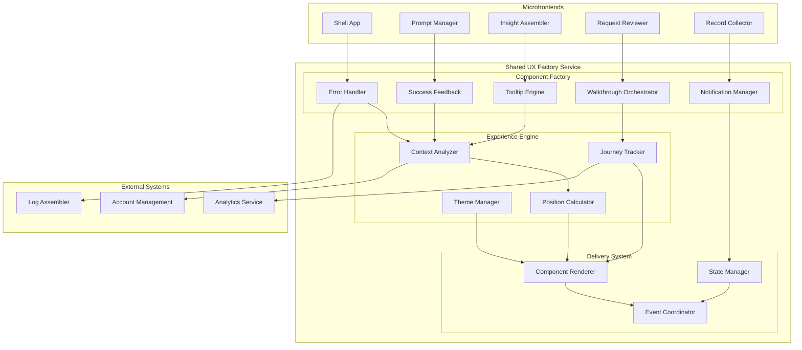
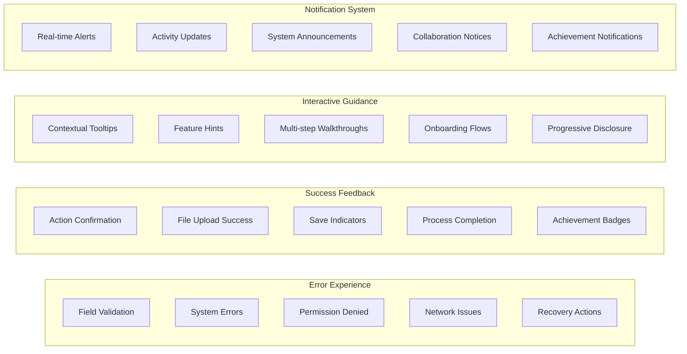
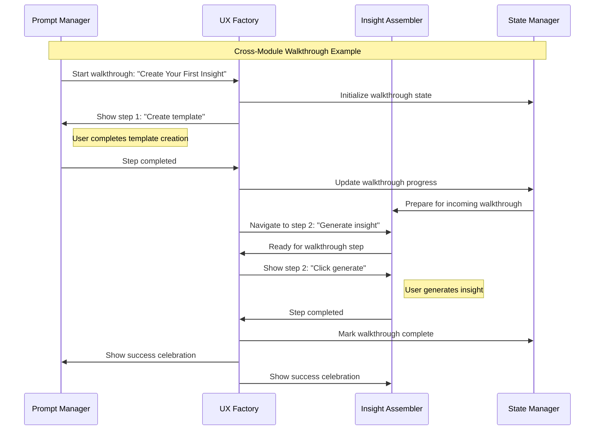

# Shared UX Factory Service

## 1. Executive Summary

The Shared UX Factory Service provides centralized user experience orchestration across the Augment-It platform's distributed Module Federation architecture. This service creates, manages, and coordinates all user-facing feedback including errors, success messages, tooltips, walkthroughs, and notifications, ensuring consistent UX across all microfrontends while enabling complex cross-module user journeys.

The service acts as the **single source of truth** for user experience components, providing:
- **Consistent Design Language**: All feedback follows the same visual patterns
- **Cross-Module Coordination**: Walkthroughs and notifications that span multiple microfrontends  
- **Contextual Intelligence**: Smart timing and positioning based on user state
- **Journey Tracking**: Analytics on user guidance effectiveness and completion rates
- **Centralized Management**: One place to update UX patterns across the entire platform

## 2. Service Overview

### Core Responsibilities

1. **Error Experience Management**
   - Consistent error presentation across all modules
   - Smart error recovery suggestions
   - Error escalation and user assistance workflows

2. **Success & Feedback Orchestration**
   - Positive reinforcement for completed actions
   - Progress indicators for multi-step processes
   - Achievement and milestone celebrations

3. **Interactive Guidance System**
   - Context-aware tooltips and hints
   - Multi-module walkthroughs and onboarding
   - Progressive disclosure for complex features

4. **Notification Ecosystem**  
   - Real-time notifications from system events
   - Cross-user activity updates
   - Priority-based notification management

5. **User Journey Analytics**
   - Track completion rates for guided experiences
   - Identify UX friction points
   - A/B testing for different UX approaches

### Key Features

- **Module-Agnostic Components**: Work seamlessly across any federated microfrontend
- **Smart Context Awareness**: Understand user state, permissions, and current workflow
- **Progressive Complexity**: Simple tooltips to complex multi-step guided experiences
- **Real-time Coordination**: Synchronize UX state across multiple open modules
- **Accessibility First**: All components meet WCAG 2.1 AA standards
- **Customizable Theming**: Consistent with Augment-It design system

## 3. UX Component Architecture

### High-Level Architecture



### UX Component Types



## 4. Component Implementation

### Error Experience Handler

```typescript
export class ErrorExperienceHandler {
  private uxFactory: UXFactoryCore;
  private analytics: AnalyticsClient;
  
  constructor(uxFactory: UXFactoryCore) {
    this.uxFactory = uxFactory;
    this.analytics = new AnalyticsClient();
  }
  
  // Handle validation errors with smart recovery
  async showValidationError(config: ValidationErrorConfig): Promise<void> {
    const context = await this.uxFactory.getContext(config.moduleId);
    
    const errorComponent: ErrorComponent = {
      id: this.generateId(),
      type: 'validation',
      severity: 'warning',
      message: config.message,
      target: config.fieldId,
      position: this.calculatePosition(config.fieldId, context),
      recoveryActions: this.generateRecoveryActions(config),
      styling: {
        variant: 'inline',
        theme: context.theme,
        animation: 'gentle-shake'
      },
      accessibility: {
        ariaLabel: `Error: ${config.message}`,
        focusManagement: 'return-to-field',
        announceToScreenReader: true
      },
      analytics: {
        errorType: config.validationType,
        field: config.fieldId,
        context: config.moduleId
      }
    };
    
    // Track error occurrence
    this.analytics.track('ux.error.shown', errorComponent.analytics);
    
    // Render and manage lifecycle
    await this.uxFactory.render(errorComponent);
    this.setupErrorLifecycle(errorComponent);
  }
  
  // Handle system errors with escalation options
  async showSystemError(config: SystemErrorConfig): Promise<void> {
    const errorComponent: ErrorComponent = {
      id: this.generateId(),
      type: 'system',
      severity: config.severity || 'error',
      message: this.humanizeSystemError(config.error),
      position: { strategy: 'modal-center' },
      recoveryActions: [
        {
          label: 'Try Again',
          action: () => config.retryAction?.(),
          style: 'primary'
        },
        {
          label: 'Report Issue',
          action: () => this.escalateToSupport(config),
          style: 'secondary'
        },
        {
          label: 'Continue Without This Feature',
          action: () => this.gracefulDegradation(config),
          style: 'tertiary'
        }
      ],
      styling: {
        variant: 'modal',
        theme: 'system-error',
        backdrop: true
      },
      autoActions: {
        autoRetry: config.autoRetry ? {
          attempts: 3,
          backoff: 'exponential',
          showCountdown: true
        } : undefined,
        autoEscalate: {
          afterSeconds: 30,
          escalationType: 'support-contact'
        }
      }
    };
    
    await this.uxFactory.render(errorComponent);
    this.trackSystemError(config, errorComponent);
  }
  
  private generateRecoveryActions(config: ValidationErrorConfig): RecoveryAction[] {
    const actions: RecoveryAction[] = [];
    
    switch (config.validationType) {
      case 'required':
        actions.push({
          label: 'Focus Field',
          action: () => document.getElementById(config.fieldId)?.focus(),
          style: 'primary'
        });
        break;
        
      case 'format':
        actions.push({
          label: 'Show Example',
          action: () => this.showFormatExample(config.fieldId),
          style: 'secondary'
        });
        break;
        
      case 'length':
        actions.push({
          label: `Needs ${config.expectedLength} characters`,
          action: () => this.highlightLengthRequirement(config.fieldId),
          style: 'info'
        });
        break;
    }
    
    return actions;
  }
}
```

### Success Feedback System

```typescript
export class SuccessFeedbackSystem {
  private uxFactory: UXFactoryCore;
  
  async showSuccess(config: SuccessConfig): Promise<void> {
    const context = await this.uxFactory.getContext(config.moduleId);
    
    const successComponent: SuccessComponent = {
      id: this.generateId(),
      type: config.type || 'action-confirmation',
      message: config.message,
      position: this.calculateSuccessPosition(config, context),
      celebration: this.determineCelebration(config),
      styling: {
        variant: config.variant || 'toast',
        theme: 'success',
        animation: config.celebratory ? 'celebrate' : 'gentle-slide'
      },
      duration: this.calculateDuration(config),
      followUpActions: config.followUpActions || []
    };
    
    // Add contextual enhancements
    if (config.type === 'file-upload') {
      successComponent.preview = await this.generateFilePreview(config.data);
    }
    
    if (config.type === 'process-completion') {
      successComponent.metrics = this.generateProcessMetrics(config.data);
    }
    
    await this.uxFactory.render(successComponent);
    this.trackSuccess(config, successComponent);
  }
  
  private determineCelebration(config: SuccessConfig): CelebrationLevel {
    const celebrationMap = {
      'first-time-action': 'confetti',
      'major-milestone': 'fireworks', 
      'process-completion': 'checkmark-burst',
      'file-upload': 'progress-complete',
      'save-action': 'gentle-pulse'
    };
    
    return celebrationMap[config.type] || 'gentle-pulse';
  }
}
```

### Interactive Guidance Engine

```typescript
export class InteractiveGuidanceEngine {
  private uxFactory: UXFactoryCore;
  private journeyTracker: JourneyTracker;
  
  // Context-aware tooltip system
  async showTooltip(config: TooltipConfig): Promise<void> {
    const context = await this.uxFactory.getContext(config.moduleId);
    const userState = await this.getUserLearningState(context.userId);
    
    // Smart tooltip logic - don't show if user has seen it before
    if (config.smartDisplay && userState.hasSeenTooltip(config.content)) {
      return;
    }
    
    const tooltip: TooltipComponent = {
      id: this.generateId(),
      content: config.content,
      target: config.targetElement,
      position: this.calculateOptimalPosition(config.targetElement, context),
      triggers: config.triggers || { hover: true, focus: true },
      styling: {
        variant: config.variant || 'contextual',
        theme: context.theme,
        arrow: true,
        maxWidth: this.calculateOptimalWidth(config.content)
      },
      behavior: {
        hideOnScroll: true,
        hideOnClickOutside: true,
        hideDelay: config.persistOnHover ? 0 : 200
      },
      accessibility: {
        role: 'tooltip',
        ariaDescribedBy: config.targetElement
      }
    };
    
    await this.uxFactory.render(tooltip);
    this.trackTooltipInteraction(config, tooltip);
  }
  
  // Multi-module walkthrough system
  async startWalkthrough(config: WalkthroughConfig): Promise<WalkthroughInstance> {
    const walkthrough: WalkthroughInstance = {
      id: config.id,
      steps: config.steps,
      currentStep: 0,
      state: 'starting',
      context: {
        userId: config.userId,
        startedAt: new Date().toISOString(),
        modules: [...new Set(config.steps.map(step => step.moduleId))]
      }
    };
    
    // Initialize walkthrough UI
    const walkthroughUI: WalkthroughComponent = {
      id: walkthrough.id,
      type: 'guided-tour',
      overlay: true,
      progressIndicator: {
        current: 1,
        total: config.steps.length,
        showStepNumbers: true
      },
      navigation: {
        showPrevious: false,
        showNext: true,
        showSkip: config.allowSkip !== false,
        customActions: config.customActions || []
      },
      styling: {
        variant: 'overlay',
        theme: 'walkthrough',
        backdrop: 'dim'
      }
    };
    
    // Start first step
    await this.executeWalkthroughStep(walkthrough, 0);
    
    // Track walkthrough start
    this.journeyTracker.startJourney(walkthrough.id, {
      type: 'walkthrough',
      steps: config.steps.length,
      modules: walkthrough.context.modules
    });
    
    return walkthrough;
  }
  
  async executeWalkthroughStep(
    walkthrough: WalkthroughInstance, 
    stepIndex: number
  ): Promise<void> {
    const step = walkthrough.steps[stepIndex];
    
    // Navigate to correct module if needed
    if (step.moduleId !== this.getCurrentModule()) {
      await this.navigateToModule(step.moduleId, step.route);
    }
    
    // Wait for element to be available
    await this.waitForElement(step.targetElement);
    
    // Create step component
    const stepComponent: WalkthroughStepComponent = {
      id: `${walkthrough.id}-step-${stepIndex}`,
      content: {
        title: step.title,
        description: step.description,
        media: step.media, // Screenshots, videos, etc.
      },
      target: step.targetElement,
      position: this.calculateStepPosition(step.targetElement, step.positioning),
      highlight: {
        element: step.targetElement,
        style: step.highlightStyle || 'glow',
        padding: 8
      },
      actions: this.generateStepActions(walkthrough, stepIndex),
      validation: step.validation // Optional - require user to perform action
    };
    
    await this.uxFactory.render(stepComponent);
    this.trackStepViewed(walkthrough.id, stepIndex);
  }
  
  private generateStepActions(
    walkthrough: WalkthroughInstance, 
    stepIndex: number
  ): StepAction[] {
    const actions: StepAction[] = [];
    
    // Previous button
    if (stepIndex > 0) {
      actions.push({
        label: 'Previous',
        action: () => this.goToPreviousStep(walkthrough),
        style: 'secondary',
        position: 'left'
      });
    }
    
    // Next/Complete button
    const isLastStep = stepIndex === walkthrough.steps.length - 1;
    actions.push({
      label: isLastStep ? 'Complete Tour' : 'Next',
      action: () => isLastStep 
        ? this.completeWalkthrough(walkthrough)
        : this.goToNextStep(walkthrough),
      style: 'primary',
      position: 'right'
    });
    
    // Skip button
    actions.push({
      label: 'Skip Tour',
      action: () => this.skipWalkthrough(walkthrough),
      style: 'tertiary',
      position: 'right'
    });
    
    return actions;
  }
}
```

### Notification Management System

```typescript
export class NotificationManager {
  private uxFactory: UXFactoryCore;
  private notificationQueue: NotificationQueue;
  private userPreferences: UserPreferenceService;
  
  async notify(config: NotificationConfig): Promise<void> {
    // Check user notification preferences
    const preferences = await this.userPreferences.get(config.userId);
    if (!this.shouldShowNotification(config, preferences)) {
      return;
    }
    
    const notification: NotificationComponent = {
      id: this.generateId(),
      type: config.type,
      priority: config.priority || 'normal',
      content: {
        title: config.title,
        message: config.message,
        icon: this.getNotificationIcon(config.type),
        avatar: config.fromUser ? await this.getUserAvatar(config.fromUser) : undefined
      },
      actions: config.actions || [],
      behavior: {
        autoHide: config.autoHide !== false,
        hideDelay: this.calculateHideDelay(config),
        persistUntil: config.persistUntil || 'auto',
        allowDismiss: config.allowDismiss !== false
      },
      targeting: {
        modules: config.targetModules || ['all'],
        position: config.position || 'top-right',
        stack: true
      },
      styling: {
        variant: this.getNotificationVariant(config.type),
        theme: config.theme || 'default',
        animation: 'slide-in'
      }
    };
    
    // Queue notification with priority handling
    await this.notificationQueue.enqueue(notification);
    
    this.trackNotificationSent(config, notification);
  }
  
  // Cross-module activity notifications
  async notifyActivity(activity: ActivityNotification): Promise<void> {
    const affectedUsers = await this.getAffectedUsers(activity);
    
    for (const userId of affectedUsers) {
      const userContext = await this.uxFactory.getUserContext(userId);
      
      const notification: NotificationComponent = {
        id: this.generateId(),
        type: 'activity',
        content: {
          title: this.generateActivityTitle(activity),
          message: this.generateActivityMessage(activity, userContext),
          icon: this.getActivityIcon(activity.type),
          avatar: await this.getUserAvatar(activity.fromUser)
        },
        actions: this.generateActivityActions(activity, userContext),
        behavior: {
          autoHide: false, // Activity notifications should be acknowledged
          persistUntil: 'acknowledged'
        },
        metadata: {
          activityId: activity.id,
          activityType: activity.type,
          fromUser: activity.fromUser,
          timestamp: activity.timestamp
        }
      };
      
      await this.notify({
        userId,
        ...notification,
        targetModules: this.getRelevantModules(activity, userContext)
      });
    }
  }
  
  private generateActivityMessage(
    activity: ActivityNotification, 
    userContext: UserContext
  ): string {
    const templates = {
      'comment': `${activity.fromUser.name} commented on your ${activity.targetType}`,
      'share': `${activity.fromUser.name} shared a ${activity.targetType} with you`,
      'mention': `${activity.fromUser.name} mentioned you in ${activity.targetType}`,
      'collaboration-invite': `${activity.fromUser.name} invited you to collaborate`,
      'status-change': `${activity.targetType} status changed to ${activity.newStatus}`,
      'approval-request': `${activity.fromUser.name} requested your approval`,
      'milestone-reached': `Your team reached the ${activity.milestone} milestone!`
    };
    
    return templates[activity.type] || `New activity: ${activity.type}`;
  }
}
```

## 5. Cross-Module Coordination

### State Synchronization

```typescript
export class UXStateManager {
  private moduleStates: Map<string, ModuleUXState>;
  private globalState: GlobalUXState;
  private eventBus: EventBus;
  
  constructor() {
    this.moduleStates = new Map();
    this.globalState = new GlobalUXState();
    this.eventBus = new EventBus();
    
    this.setupCrossModuleSync();
  }
  
  // Synchronize UX state across modules
  async syncState(moduleId: string, state: Partial<ModuleUXState>): Promise<void> {
    const currentState = this.moduleStates.get(moduleId) || {};
    const newState = { ...currentState, ...state };
    
    this.moduleStates.set(moduleId, newState);
    
    // Propagate relevant state changes to other modules
    await this.propagateStateChanges(moduleId, state);
    
    // Update global state
    this.updateGlobalState(moduleId, newState);
  }
  
  // Handle cross-module walkthrough navigation
  async navigateWalkthrough(
    walkthroughId: string, 
    fromModule: string, 
    toModule: string, 
    stepData: WalkthroughStepData
  ): Promise<void> {
    // Pause walkthrough in current module
    await this.pauseWalkthroughInModule(fromModule, walkthroughId);
    
    // Signal target module to prepare for walkthrough
    this.eventBus.emit('walkthrough:prepare', {
      walkthroughId,
      targetModule: toModule,
      stepData,
      transitionFrom: fromModule
    });
    
    // Navigate to target module
    await this.navigateToModule(toModule, stepData.route);
    
    // Resume walkthrough in target module
    await this.resumeWalkthroughInModule(toModule, walkthroughId, stepData);
  }
  
  private async propagateStateChanges(
    sourceModule: string, 
    changes: Partial<ModuleUXState>
  ): Promise<void> {
    // Propagate walkthrough state
    if (changes.activeWalkthrough) {
      for (const moduleId of this.getActiveModules()) {
        if (moduleId !== sourceModule) {
          this.eventBus.emit('walkthrough:sync', {
            targetModule: moduleId,
            walkthroughState: changes.activeWalkthrough
          });
        }
      }
    }
    
    // Propagate notification state
    if (changes.notifications) {
      this.eventBus.emit('notifications:sync', {
        notifications: changes.notifications,
        excludeModule: sourceModule
      });
    }
    
    // Propagate theme changes
    if (changes.theme) {
      for (const moduleId of this.getActiveModules()) {
        this.eventBus.emit('theme:update', {
          targetModule: moduleId,
          theme: changes.theme
        });
      }
    }
  }
}
```

### Event Coordination System



## 6. Analytics and Journey Tracking

### User Journey Analytics

```typescript
export class UXJourneyTracker {
  private analytics: AnalyticsService;
  private journeys: Map<string, UserJourney>;
  
  // Track user guidance effectiveness
  trackGuidanceInteraction(event: GuidanceInteractionEvent): void {
    const journey = this.getOrCreateJourney(event.userId, event.journeyId);
    
    journey.interactions.push({
      timestamp: new Date().toISOString(),
      type: event.type,
      component: event.componentId,
      action: event.action,
      context: event.context,
      success: event.success,
      timeToAction: event.timeToAction
    });
    
    // Real-time analysis
    this.analyzeJourneyProgress(journey);
  }
  
  // Identify UX friction points
  async identifyFrictionPoints(): Promise<FrictionAnalysis> {
    const allJourneys = Array.from(this.journeys.values());
    const frictionPoints: FrictionPoint[] = [];
    
    // Analyze common drop-off points
    const dropoffAnalysis = this.analyzeDropoffPoints(allJourneys);
    frictionPoints.push(...dropoffAnalysis);
    
    // Analyze repeated error patterns
    const errorAnalysis = this.analyzeErrorPatterns(allJourneys);
    frictionPoints.push(...errorAnalysis);
    
    // Analyze slow completion times
    const performanceAnalysis = this.analyzePerformanceIssues(allJourneys);
    frictionPoints.push(...performanceAnalysis);
    
    return {
      frictionPoints,
      recommendations: this.generateUXRecommendations(frictionPoints),
      impactScore: this.calculateFrictionImpact(frictionPoints)
    };
  }
  
  private generateUXRecommendations(frictionPoints: FrictionPoint[]): UXRecommendation[] {
    const recommendations: UXRecommendation[] = [];
    
    for (const point of frictionPoints) {
      switch (point.type) {
        case 'high-dropoff':
          recommendations.push({
            type: 'guidance-improvement',
            priority: 'high',
            suggestion: `Add clearer guidance at step "${point.step}" - ${point.dropoffRate}% of users drop off here`,
            implementation: 'Add contextual tooltip or inline help text'
          });
          break;
          
        case 'repeated-errors':
          recommendations.push({
            type: 'error-prevention',
            priority: 'medium',
            suggestion: `Improve validation for "${point.field}" - ${point.errorRate}% error rate`,
            implementation: 'Add real-time validation or format hints'
          });
          break;
          
        case 'slow-completion':
          recommendations.push({
            type: 'performance-optimization',
            priority: point.impact === 'high' ? 'high' : 'medium',
            suggestion: `Optimize "${point.action}" - taking ${point.averageTime}ms`,
            implementation: 'Add loading indicators or break into smaller steps'
          });
          break;
      }
    }
    
    return recommendations;
  }
}
```

## 7. API Interface

### REST Endpoints

```yaml
basePath: /api/v1/ux
paths:
  /error:
    post:
      summary: Show error component
      requestBody:
        required: true
        content:
          application/json:
            schema:
              $ref: '#/components/schemas/ErrorConfig'
      responses:
        '200':
          description: Error component created
          content:
            application/json:
              schema:
                $ref: '#/components/schemas/ComponentResponse'

  /success:
    post:
      summary: Show success feedback
      requestBody:
        required: true
        content:
          application/json:
            schema:
              $ref: '#/components/schemas/SuccessConfig'
      responses:
        '200':
          description: Success component created

  /tooltip:
    post:
      summary: Show contextual tooltip
      requestBody:
        required: true
        content:
          application/json:
            schema:
              $ref: '#/components/schemas/TooltipConfig'
      responses:
        '200':
          description: Tooltip component created

  /walkthrough:
    post:
      summary: Start guided walkthrough
      requestBody:
        required: true
        content:
          application/json:
            schema:
              $ref: '#/components/schemas/WalkthroughConfig'
      responses:
        '200':
          description: Walkthrough started
          content:
            application/json:
              schema:
                $ref: '#/components/schemas/WalkthroughInstance'

  /walkthrough/{id}/step:
    patch:
      summary: Navigate walkthrough step
      parameters:
        - name: id
          in: path
          required: true
          schema:
            type: string
      requestBody:
        required: true
        content:
          application/json:
            schema:
              type: object
              properties:
                action:
                  type: string
                  enum: [next, previous, skip, complete]
      responses:
        '200':
          description: Step navigation completed

  /notify:
    post:
      summary: Send notification
      requestBody:
        required: true
        content:
          application/json:
            schema:
              $ref: '#/components/schemas/NotificationConfig'
      responses:
        '202':
          description: Notification queued

  /state/{moduleId}:
    get:
      summary: Get module UX state
      parameters:
        - name: moduleId
          in: path
          required: true
          schema:
            type: string
      responses:
        '200':
          description: Module UX state
          content:
            application/json:
              schema:
                $ref: '#/components/schemas/ModuleUXState'
    
    patch:
      summary: Update module UX state
      parameters:
        - name: moduleId
          in: path
          required: true
          schema:
            type: string
      requestBody:
        required: true
        content:
          application/json:
            schema:
              $ref: '#/components/schemas/ModuleUXState'
      responses:
        '200':
          description: State updated

  /analytics/friction:
    get:
      summary: Get UX friction analysis
      parameters:
        - name: timeRange
          in: query
          schema:
            type: string
            default: "7d"
        - name: moduleId
          in: query
          schema:
            type: string
      responses:
        '200':
          description: Friction analysis
          content:
            application/json:
              schema:
                $ref: '#/components/schemas/FrictionAnalysis'

  /health:
    get:
      summary: Health check
      responses:
        '200':
          description: Service health
```

### WebSocket Interface

```typescript
interface UXWebSocketEvents {
  // Real-time UX state synchronization
  'ux:state:sync': {
    moduleId: string;
    state: Partial<ModuleUXState>;
  };
  
  // Cross-module walkthrough coordination
  'walkthrough:navigate': {
    walkthroughId: string;
    fromModule: string;
    toModule: string;
    stepData: WalkthroughStepData;
  };
  
  // Real-time notifications
  'notification:push': {
    userId: string;
    notification: NotificationComponent;
  };
  
  // Theme synchronization
  'theme:update': {
    theme: ThemeConfig;
    modules: string[];
  };
  
  // Analytics events
  'analytics:interaction': {
    userId: string;
    event: GuidanceInteractionEvent;
  };
}
```

## 8. Client SDK

### JavaScript/TypeScript SDK

```typescript
// UX Factory client for microfrontends
export class UXFactoryClient {
  private api: ApiClient;
  private websocket: WebSocketClient;
  private moduleId: string;
  
  constructor(moduleId: string, apiEndpoint: string) {
    this.moduleId = moduleId;
    this.api = new ApiClient(apiEndpoint);
    this.websocket = new WebSocketClient(apiEndpoint.replace('http', 'ws'));
    
    this.setupEventHandlers();
  }
  
  // Error handling
  async showError(config: ErrorDisplayConfig): Promise<void> {
    return this.api.post('/error', {
      ...config,
      moduleId: this.moduleId
    });
  }
  
  // Success feedback
  async showSuccess(config: SuccessDisplayConfig): Promise<void> {
    return this.api.post('/success', {
      ...config,
      moduleId: this.moduleId
    });
  }
  
  // Tooltips
  async showTooltip(config: TooltipDisplayConfig): Promise<void> {
    return this.api.post('/tooltip', {
      ...config,
      moduleId: this.moduleId
    });
  }
  
  // Walkthroughs
  async startWalkthrough(config: WalkthroughStartConfig): Promise<WalkthroughInstance> {
    return this.api.post('/walkthrough', {
      ...config,
      startModuleId: this.moduleId
    });
  }
  
  // Notifications
  async notify(config: NotificationDisplayConfig): Promise<void> {
    return this.api.post('/notify', {
      ...config,
      sourceModule: this.moduleId
    });
  }
  
  // React integration helpers
  useUXError() {
    return useCallback((config: ErrorDisplayConfig) => {
      this.showError(config);
    }, []);
  }
  
  useUXSuccess() {
    return useCallback((config: SuccessDisplayConfig) => {
      this.showSuccess(config);
    }, []);
  }
  
  useWalkthrough(walkthroughId: string) {
    const [instance, setInstance] = useState<WalkthroughInstance | null>(null);
    
    const start = useCallback(async (config: WalkthroughStartConfig) => {
      const walkthrough = await this.startWalkthrough({
        ...config,
        id: walkthroughId
      });
      setInstance(walkthrough);
      return walkthrough;
    }, [walkthroughId]);
    
    return { instance, start };
  }
}
```

### React Hooks

```typescript
// React hooks for easy UX Factory integration
export function useUXFactory(moduleId: string) {
  const uxClient = useMemo(
    () => new UXFactoryClient(moduleId, process.env.UX_FACTORY_API_URL),
    [moduleId]
  );
  
  return uxClient;
}

export function useUXError(moduleId: string) {
  const ux = useUXFactory(moduleId);
  
  return useCallback(
    (error: Error | string, config?: Partial<ErrorDisplayConfig>) => {
      ux.showError({
        message: typeof error === 'string' ? error : error.message,
        type: 'system',
        ...config
      });
    },
    [ux]
  );
}

export function useUXSuccess(moduleId: string) {
  const ux = useUXFactory(moduleId);
  
  return useCallback(
    (message: string, config?: Partial<SuccessDisplayConfig>) => {
      ux.showSuccess({
        message,
        type: 'action-confirmation',
        ...config
      });
    },
    [ux]
  );
}

// HOC for automatic error handling
export function withUXErrorBoundary<P extends object>(
  Component: React.ComponentType<P>,
  moduleId: string
) {
  return function UXErrorBoundaryWrapper(props: P) {
    const showError = useUXError(moduleId);
    
    return (
      <ErrorBoundary
        onError={(error, errorInfo) => {
          showError(error, {
            type: 'component-error',
            severity: 'error',
            recoveryActions: [
              {
                label: 'Reload Component',
                action: () => window.location.reload()
              }
            ],
            metadata: {
              componentStack: errorInfo.componentStack,
              errorBoundary: true
            }
          });
        }}
      >
        <Component {...props} />
      </ErrorBoundary>
    );
  };
}
```

## 9. Configuration

### Service Configuration

```yaml
# Shared UX Factory Service Configuration
service:
  name: shared-ux-factory
  port: 8095
  
components:
  error_handler:
    enabled: true
    auto_recovery: true
    escalation_enabled: true
    max_retry_attempts: 3
    
  success_feedback:
    enabled: true
    celebrations_enabled: true
    default_duration: 3000
    
  tooltip_engine:
    enabled: true
    smart_display: true
    position_optimization: true
    accessibility_mode: true
    
  walkthrough_orchestrator:
    enabled: true
    cross_module_navigation: true
    progress_persistence: true
    analytics_tracking: true
    
  notification_manager:
    enabled: true
    queue_size: 1000
    priority_levels: 4
    batch_processing: true

theming:
  default_theme: 'augment-it'
  custom_themes:
    - name: 'dark-mode'
      colors:
        primary: '#3b82f6'
        success: '#10b981'
        warning: '#f59e0b'
        error: '#ef4444'
    - name: 'high-contrast'
      accessibility: true
      
positioning:
  smart_positioning: true
  collision_detection: true
  responsive_adjustments: true
  rtl_support: true

analytics:
  enabled: true
  track_interactions: true
  track_completions: true
  friction_analysis: true
  a_b_testing: true

integrations:
  log_assembler:
    url: "http://log-assembler:9090"
    error_correlation: true
    
  account_management:
    url: "http://account-management:8080"
    user_preferences: true
    
  analytics_service:
    url: "http://analytics:9095"
    real_time_events: true

performance:
  component_caching: true
  lazy_loading: true
  animation_optimization: true
  memory_management: true

accessibility:
  wcag_compliance: "AA"
  screen_reader_support: true
  keyboard_navigation: true
  focus_management: true
  high_contrast_mode: true
```

### Module Integration Examples

```typescript
// Prompt Manager integration
export function PromptManagerApp() {
  const ux = useUXFactory('prompt-manager');
  const showError = useUXError('prompt-manager');
  const showSuccess = useUXSuccess('prompt-manager');
  
  const handleCreateTemplate = async (templateData: TemplateData) => {
    try {
      const result = await createTemplate(templateData);
      
      // Show success with celebration
      showSuccess('Template created successfully!', {
        type: 'first-time-action',
        celebratory: true,
        followUpActions: [
          {
            label: 'Create Another',
            action: () => setShowCreateForm(true)
          },
          {
            label: 'Generate Insight',
            action: () => navigateToInsightAssembler(result.id)
          }
        ]
      });
      
      // Start walkthrough for new users
      if (isFirstTemplate) {
        ux.startWalkthrough({
          id: 'first-template-success',
          steps: [
            {
              moduleId: 'prompt-manager',
              title: 'Great job!',
              description: 'You\'ve created your first template. Now let\'s generate some insights.',
              targetElement: '.template-card',
              actions: ['continue']
            },
            {
              moduleId: 'insight-assembler',
              route: '/insights/generate',
              title: 'Generate Insights',
              description: 'Click here to turn your template into actionable insights.',
              targetElement: '.generate-button'
            }
          ]
        });
      }
      
    } catch (error) {
      showError(error, {
        type: 'creation-failed',
        severity: 'error',
        recoveryActions: [
          {
            label: 'Try Again',
            action: () => handleCreateTemplate(templateData)
          },
          {
            label: 'Save as Draft',
            action: () => saveDraft(templateData)
          }
        ]
      });
    }
  };
  
  return (
    <div>
      {/* Component content */}
    </div>
  );
}
```

## 10. Recommended Third-Party Service Integrations

The Shared UX Factory Service can be enhanced with modern third-party services that provide advanced analytics, experimentation, and user experience capabilities.

### Modern Analytics & User Intelligence

#### **PostHog** - Product Analytics & Feature Flags
```typescript
// PostHog integration for advanced user analytics
import posthog from 'posthog-js';

export class PostHogAnalytics implements AnalyticsProvider {
  constructor() {
    posthog.init('your-api-key', {
      api_host: 'https://app.posthog.com',
      capture_pageview: false, // We'll handle this manually
      autocapture: false // More control over what we track
    });
  }
  
  trackUXInteraction(event: GuidanceInteractionEvent): void {
    posthog.capture('ux_interaction', {
      component_type: event.type,
      component_id: event.componentId,
      module_id: event.context.moduleId,
      user_action: event.action,
      success: event.success,
      time_to_action: event.timeToAction,
      walkthrough_id: event.walkthroughId
    });
  }
  
  // Feature flag for UX experiments
  async shouldShowExperimentalUX(userId: string, experiment: string): Promise<boolean> {
    return posthog.isFeatureEnabled(experiment, userId);
  }
}
```

#### **Amplitude** - Product Intelligence & Behavioral Analytics
```typescript
// Amplitude for deep behavioral insights
import * as amplitude from '@amplitude/analytics-browser';

export class AmplitudeAnalytics implements AnalyticsProvider {
  constructor() {
    amplitude.init('your-api-key', {
      defaultTracking: {
        sessions: true,
        pageViews: true,
        formInteractions: true
      }
    });
  }
  
  trackUserJourney(journey: UserJourney): void {
    amplitude.track('UX Journey Completed', {
      journey_id: journey.id,
      journey_type: journey.type,
      duration_ms: journey.durationMs,
      steps_completed: journey.completedSteps,
      total_steps: journey.totalSteps,
      completion_rate: journey.completionRate,
      friction_points: journey.frictionPoints,
      modules_involved: journey.modules
    });
  }
  
  // Cohort analysis for UX effectiveness
  async getUserCohort(userId: string): Promise<UserCohort> {
    // Integration with Amplitude's cohort API
    return amplitude.getUserCohort(userId);
  }
}
```

#### **Mixpanel** - Event Tracking & User Profiles
```typescript
// Mixpanel for detailed event tracking
import mixpanel from 'mixpanel-browser';

export class MixpanelAnalytics implements AnalyticsProvider {
  constructor() {
    mixpanel.init('your-project-token', {
      track_pageview: false,
      persistence: 'localStorage'
    });
  }
  
  trackTooltipEffectiveness(tooltip: TooltipComponent, interaction: TooltipInteraction): void {
    mixpanel.track('Tooltip Interaction', {
      tooltip_id: tooltip.id,
      content_type: tooltip.content.type,
      trigger_type: interaction.trigger,
      time_visible: interaction.timeVisible,
      user_action: interaction.action, // clicked_away, acknowledged, acted_upon
      help_effectiveness: interaction.helpfulness_rating,
      module_context: tooltip.moduleContext
    });
  }
}
```

### Modern A/B Testing & Experimentation

#### **LaunchDarkly** - Feature Management & Experimentation
```typescript
// LaunchDarkly for sophisticated feature flagging
import { LDClient } from 'launchdarkly-js-client-sdk';

export class LaunchDarklyExperiments implements ExperimentationProvider {
  private client: LDClient;
  
  constructor() {
    this.client = LDClient.initialize('your-client-side-id', {
      key: 'user-key',
      anonymous: false
    });
  }
  
  async getUXVariant(userId: string, experiment: string): Promise<UXVariant> {
    await this.client.waitForInitialization();
    
    const variant = this.client.variation(experiment, 'control');
    
    return {
      variant,
      config: this.client.variationDetail(experiment)
    };
  }
  
  // Dynamic UX configuration based on flags
  async getTooltipConfiguration(userId: string, moduleId: string): Promise<TooltipConfig> {
    const showSmartTooltips = this.client.variation('smart-tooltips-enabled', false);
    const tooltipStyle = this.client.variation('tooltip-style-variant', 'default');
    const maxTooltipsPerSession = this.client.variation('max-tooltips-per-session', 3);
    
    return {
      enabled: showSmartTooltips,
      style: tooltipStyle,
      maxPerSession: maxTooltipsPerSession,
      smartDisplay: showSmartTooltips
    };
  }
}
```

#### **Split** - Feature Flagging & Experimentation Platform
```typescript
// Split.io for advanced experimentation
import { SplitFactory } from '@splitsoftware/splitio';

export class SplitExperiments implements ExperimentationProvider {
  private client: any;
  
  constructor() {
    const factory = SplitFactory({
      core: {
        authorizationKey: 'your-client-key',
        key: 'user-key'
      }
    });
    
    this.client = factory.client();
  }
  
  async getWalkthroughVariant(userId: string): Promise<WalkthroughVariant> {
    await this.client.ready();
    
    const treatment = this.client.getTreatment(userId, 'walkthrough-experiment');
    const attributes = this.client.getTreatmentWithConfig(userId, 'walkthrough-config');
    
    return {
      treatment,
      config: attributes.config ? JSON.parse(attributes.config) : {},
      impressionData: attributes
    };
  }
}
```

### User Feedback & Research Platforms

#### **Hotjar** - Heatmaps & Session Recordings
```typescript
// Hotjar integration for visual user behavior
declare global {
  interface Window {
    hj: any;
  }
}

export class HotjarIntegration implements UserBehaviorProvider {
  constructor() {
    // Hotjar tracking code
    (function(h: any, o: any, t: any, j: any, a?: any, r?: any) {
      h.hj = h.hj || function(...args: any[]) { (h.hj.q = h.hj.q || []).push(args); };
      h._hjSettings = { hjid: 'your-hotjar-id', hjsv: 6 };
      a = o.getElementsByTagName('head')[0];
      r = o.createElement('script'); r.async = 1;
      r.src = t + h._hjSettings.hjid + j + h._hjSettings.hjsv;
      a.appendChild(r);
    })(window, document, 'https://static.hotjar.com/c/hotjar-', '.js?sv=');
  }
  
  tagUXComponent(componentId: string, componentType: string): void {
    if (window.hj) {
      window.hj('tagRecording', [`ux-component-${componentType}`, componentId]);
    }
  }
  
  trackErrorOccurrence(error: ErrorComponent): void {
    if (window.hj) {
      window.hj('event', 'ux_error_shown');
      window.hj('tagRecording', ['error-type', error.type]);
    }
  }
}
```

#### **FullStory** - Digital Experience Intelligence
```typescript
// FullStory for comprehensive user session capture
declare global {
  interface Window {
    FS: any;
  }
}

export class FullStoryIntegration implements SessionCaptureProvider {
  constructor() {
    window['_fs_debug'] = false;
    window['_fs_host'] = 'fullstory.com';
    window['_fs_script'] = 'edge.fullstory.com/s/fs.js';
    window['_fs_org'] = 'your-org-id';
    window['_fs_namespace'] = 'FS';
  }
  
  identifyUXEvent(event: UXEvent): void {
    if (window.FS) {
      window.FS('event', 'UX Interaction', {
        component_type: event.type,
        user_action: event.action,
        success_outcome: event.success,
        module_context: event.moduleId
      });
    }
  }
  
  setUserVars(userId: string, userProps: UserProperties): void {
    if (window.FS) {
      window.FS('setUserVars', {
        displayName: userProps.name,
        email: userProps.email,
        ux_proficiency: userProps.uxProficiency,
        module_usage_frequency: userProps.moduleUsage
      });
    }
  }
}
```

#### **Pendo** - Product Analytics & In-App Guidance
```typescript
// Pendo for product usage analytics and guided experiences
declare global {
  interface Window {
    pendo: any;
  }
}

export class PendoIntegration implements ProductAnalyticsProvider {
  constructor() {
    (function(apiKey) {
      (function(p,e,n,d,o){
        var v,w,x,y,z;o=p[d]=p[d]||{};o._q=o._q||[];
        v=['initialize','identify','updateOptions','pageLoad','track'];
        for(w=0,x=v.length;w<x;++w)(function(m){
          o[m]=o[m]||function(){o._q[m===v[0]?'unshift':'push']([m].concat([].slice.call(arguments,0)));};})(v[w]);
        y=e.createElement(n);y.async=!0;y.src='https://cdn.pendo.io/agent/static/'+apiKey+'/pendo.js';
        z=e.getElementsByTagName(n)[0];if(z)z.parentNode.insertBefore(y,z);else e.head.appendChild(y);
      })(window,document,'script','pendo');
    })('your-pendo-api-key');
  }
  
  trackFeatureUsage(feature: string, userId: string, metadata: any): void {
    if (window.pendo) {
      window.pendo.track('feature_used', {
        feature_name: feature,
        user_id: userId,
        ...metadata
      });
    }
  }
  
  launchGuidedTour(tourId: string): void {
    if (window.pendo) {
      window.pendo.launchGuide(tourId);
    }
  }
}
```

### Modern Error & Performance Monitoring

#### **Sentry** - Error Tracking & Performance Monitoring
```typescript
// Sentry for comprehensive error tracking
import * as Sentry from '@sentry/browser';
import { Integrations } from '@sentry/tracing';

export class SentryErrorTracking implements ErrorTrackingProvider {
  constructor() {
    Sentry.init({
      dsn: 'your-sentry-dsn',
      integrations: [
        new Integrations.BrowserTracing()
      ],
      tracesSampleRate: 1.0,
      beforeSend(event, hint) {
        // Enrich UX-related errors with additional context
        if (event.tags?.component_type === 'ux-component') {
          event.extra = {
            ...event.extra,
            ux_context: hint.originalException?.uxContext
          };
        }
        return event;
      }
    });
  }
  
  captureUXError(error: Error, component: UXComponent): void {
    Sentry.withScope((scope) => {
      scope.setTag('component_type', 'ux-component');
      scope.setTag('ux_component_id', component.id);
      scope.setContext('ux_component', {
        type: component.type,
        moduleId: component.moduleId,
        userAction: component.lastUserAction,
        state: component.currentState
      });
      scope.setLevel('error');
      
      Sentry.captureException(error);
    });
  }
}
```

#### **LogRocket** - Session Replay & Performance Monitoring
```typescript
// LogRocket for session replay and debugging
import LogRocket from 'logrocket';

export class LogRocketIntegration implements SessionReplayProvider {
  constructor() {
    LogRocket.init('your-logrocket-app-id', {
      network: {
        requestSanitizer: request => {
          // Don't log sensitive UX personalization data
          if (request.url.includes('/ux/personalization')) {
            request.body = undefined;
          }
          return request;
        }
      }
    });
  }
  
  identifyUser(userId: string, userInfo: UserInfo): void {
    LogRocket.identify(userId, {
      name: userInfo.name,
      email: userInfo.email,
      ux_skill_level: userInfo.uxSkillLevel,
      preferred_guidance_style: userInfo.guidanceStyle
    });
  }
  
  trackUXIssue(issue: UXIssue): void {
    LogRocket.track('UX Issue', {
      issue_type: issue.type,
      component_id: issue.componentId,
      user_frustration_level: issue.frustrationLevel,
      resolution_suggested: issue.suggestedResolution
    });
  }
}
```

### AI-Powered UX Enhancement

#### **Intercom** - AI-Powered Customer Messaging
```typescript
// Intercom integration for AI-powered user assistance
declare global {
  interface Window {
    Intercom: any;
  }
}

export class IntercomIntegration implements AIAssistanceProvider {
  constructor() {
    (function(){var w=window;var ic=w.Intercom;if(typeof ic==="function"){ic('reattach_activator');ic('update',w.intercomSettings);}else{var d=document;var i=function(){i.c(arguments);};i.q=[];i.c=function(args){i.q.push(args);};w.Intercom=i;var l=function(){var s=d.createElement('script');s.type='text/javascript';s.async=true;s.src='https://widget.intercom.io/widget/your-app-id';var x=d.getElementsByTagName('script')[0];x.parentNode.insertBefore(s, x);};if(document.readyState==='complete'){l();}else if(w.attachEvent){w.attachEvent('onload',l);}else{w.addEventListener('load',l,false);}}})();
  }
  
  triggerContextualHelp(context: UXContext): void {
    if (window.Intercom) {
      window.Intercom('showNewMessage', 
        `I'm having trouble with ${context.currentComponent} in the ${context.moduleId} module. Can you help?`
      );
      
      // Set context for the support team
      window.Intercom('update', {
        current_module: context.moduleId,
        current_component: context.currentComponent,
        user_skill_level: context.userSkillLevel,
        last_error: context.lastError
      });
    }
  }
}
```

#### **Drift** - Conversational AI for UX Assistance
```typescript
// Drift for conversational UX assistance
declare global {
  interface Window {
    drift: any;
  }
}

export class DriftIntegration implements ConversationalAIProvider {
  constructor() {
    !function() {
      var t = window.driftt = window.drift = window.driftt || [];
      if (!t.init) {
        if (t.invoked) return void (window.console && console.error && console.error("Drift snippet included twice."));
        t.invoked = !0, t.methods = ["identify", "config", "track", "reset", "debug", "show", "ping", "page", "hide", "off", "on"], 
        t.factory = function(e) {
          return function() {
            var n = Array.prototype.slice.call(arguments);
            return n.unshift(e), t.push(n), t;
          };
        }, t.methods.forEach(function(e) {
          t[e] = t.factory(e);
        }), t.load = function(t) {
          var e = 3e5, n = Math.ceil(new Date() / e) * e, o = document.createElement("script");
          o.type = "text/javascript", o.async = !0, o.crossorigin = "anonymous", o.src = "https://js.driftt.com/include/" + n + "/" + t + ".js";
          var i = document.getElementsByTagName("script")[0];
          i.parentNode.insertBefore(o, i);
        };
      }
    }();
    window.drift.load("your-drift-id");
  }
  
  provideContextualGuidance(guidance: ContextualGuidance): void {
    if (window.drift) {
      window.drift.api.showWelcomeMessage({
        message: guidance.message,
        context: {
          module: guidance.moduleId,
          component: guidance.componentId,
          user_action: guidance.suggestedAction
        }
      });
    }
  }
}
```

### Voice & Accessibility Enhancement

#### **Amazon Polly** - Text-to-Speech for Accessibility
```typescript
// AWS Polly for voice-enabled UX guidance
import AWS from 'aws-sdk';

export class PollyVoiceIntegration implements VoiceGuidanceProvider {
  private polly: AWS.Polly;
  
  constructor() {
    AWS.config.update({
      region: 'us-east-1',
      accessKeyId: process.env.AWS_ACCESS_KEY_ID,
      secretAccessKey: process.env.AWS_SECRET_ACCESS_KEY
    });
    
    this.polly = new AWS.Polly();
  }
  
  async speakTooltip(tooltip: TooltipComponent): Promise<void> {
    const params = {
      Text: tooltip.content,
      OutputFormat: 'mp3',
      VoiceId: 'Joanna',
      Engine: 'neural'
    };
    
    try {
      const result = await this.polly.synthesizeSpeech(params).promise();
      const audio = new Audio(URL.createObjectURL(new Blob([result.AudioStream as Buffer])));
      audio.play();
    } catch (error) {
      console.error('Voice synthesis failed:', error);
    }
  }
}
```

### Integration Architecture

```typescript
// Service integrations configuration
export class ThirdPartyIntegrations {
  private integrations: Map<string, IntegrationProvider>;
  
  constructor(config: IntegrationsConfig) {
    this.integrations = new Map();
    
    // Analytics
    if (config.analytics.posthog.enabled) {
      this.integrations.set('analytics-posthog', new PostHogAnalytics());
    }
    if (config.analytics.amplitude.enabled) {
      this.integrations.set('analytics-amplitude', new AmplitudeAnalytics());
    }
    
    // Experimentation
    if (config.experimentation.launchdarkly.enabled) {
      this.integrations.set('experiments-launchdarkly', new LaunchDarklyExperiments());
    }
    if (config.experimentation.split.enabled) {
      this.integrations.set('experiments-split', new SplitExperiments());
    }
    
    // User Feedback
    if (config.feedback.hotjar.enabled) {
      this.integrations.set('feedback-hotjar', new HotjarIntegration());
    }
    if (config.feedback.fullstory.enabled) {
      this.integrations.set('feedback-fullstory', new FullStoryIntegration());
    }
    
    // Error Tracking
    if (config.monitoring.sentry.enabled) {
      this.integrations.set('errors-sentry', new SentryErrorTracking());
    }
    
    // AI Assistance
    if (config.assistance.intercom.enabled) {
      this.integrations.set('ai-intercom', new IntercomIntegration());
    }
  }
  
  async trackUXEvent(event: UXEvent): Promise<void> {
    const analyticsProviders = Array.from(this.integrations.values())
      .filter(provider => provider instanceof AnalyticsProvider);
    
    await Promise.all(
      analyticsProviders.map(provider => provider.trackEvent(event))
    );
  }
  
  async getExperimentVariant(userId: string, experiment: string): Promise<ExperimentVariant> {
    const experimentProviders = Array.from(this.integrations.values())
      .filter(provider => provider instanceof ExperimentationProvider);
    
    // Return first available experiment result
    for (const provider of experimentProviders) {
      try {
        const variant = await provider.getVariant(userId, experiment);
        if (variant) return variant;
      } catch (error) {
        console.warn(`Experiment provider failed: ${error.message}`);
      }
    }
    
    return { variant: 'control', config: {} };
  }
}
```

### Configuration Example

```yaml
# Third-party service integrations
integrations:
  analytics:
    posthog:
      enabled: true
      api_key: "${POSTHOG_API_KEY}"
      features:
        - session_recording
        - feature_flags
        - cohort_analysis
    
    amplitude:
      enabled: true
      api_key: "${AMPLITUDE_API_KEY}"
      features:
        - behavioral_analytics
        - user_journey_mapping
    
    mixpanel:
      enabled: false
      api_key: "${MIXPANEL_API_KEY}"
  
  experimentation:
    launchdarkly:
      enabled: true
      client_side_id: "${LAUNCHDARKLY_CLIENT_ID}"
      features:
        - feature_flags
        - ux_experiments
        - progressive_rollouts
    
    split:
      enabled: false
      client_key: "${SPLIT_CLIENT_KEY}"
  
  feedback:
    hotjar:
      enabled: true
      site_id: "${HOTJAR_SITE_ID}"
      features:
        - heatmaps
        - session_recordings
        - feedback_polls
    
    fullstory:
      enabled: true
      org_id: "${FULLSTORY_ORG_ID}"
      features:
        - session_capture
        - error_tracking
        - conversion_funnels
  
  monitoring:
    sentry:
      enabled: true
      dsn: "${SENTRY_DSN}"
      features:
        - error_tracking
        - performance_monitoring
        - release_tracking
    
    logrocket:
      enabled: false
      app_id: "${LOGROCKET_APP_ID}"
  
  assistance:
    intercom:
      enabled: true
      app_id: "${INTERCOM_APP_ID}"
      features:
        - contextual_help
        - ai_resolution
        - user_onboarding
    
    drift:
      enabled: false
      widget_id: "${DRIFT_WIDGET_ID}"
  
  accessibility:
    aws_polly:
      enabled: true
      region: "us-east-1"
      features:
        - voice_guidance
        - multilingual_support
```

These modern third-party integrations provide cutting-edge capabilities that go far beyond traditional analytics, offering AI-powered assistance, voice guidance, advanced experimentation, and comprehensive user behavior insights that will make your Shared UX Factory Service truly world-class!

This Shared UX Factory Service creates a unified, intelligent user experience layer that works seamlessly across your entire Module Federation architecture. It ensures consistency, provides smart guidance, and tracks user journeys to continuously improve the experience!
