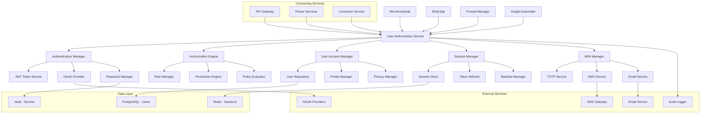

# User Authorization Service

## Executive Summary

The User Authorization Service is a centralized, secure authentication and authorization platform for the Augment-It ecosystem. It manages user accounts, credentials, and access control across all microfrontends and microservices, providing enterprise-grade security with JWT-based authentication, OAuth integration, multi-factor authentication (MFA), and comprehensive privacy compliance. Built with zero-trust architecture principles, it serves as the foundation for secure user management and access control throughout the distributed platform.

## Background & Motivation

### Problem Statement

The Augment-It platform operates as a distributed system with multiple microfrontends (Shell App, Prompt Template Manager, Insight Assembler, Request Reviewer, Record Collector) and numerous microservices (API Gateway, Parser Services, etc.). Each component needs secure user authentication and authorization, but implementing individual auth solutions leads to:

- **Fragmented Authentication**: Each service implementing its own user management and authentication logic
- **Security Vulnerabilities**: Inconsistent security implementations across services with potential attack vectors
- **User Experience Issues**: Multiple login forms, inconsistent sessions, and complex user management
- **Compliance Gaps**: Difficult to ensure GDPR, CCPA, and other privacy regulations across distributed services
- **Credential Management Complexity**: API keys, passwords, and tokens scattered across services without centralized control
- **Session Management Challenges**: No unified approach to session handling, token refresh, and logout across the platform

### Why This Solution
- **Centralized Security**: Single source of truth for authentication and authorization across all services
- **Zero-Trust Architecture**: Every request is authenticated and authorized regardless of source
- **Enterprise Features**: Multi-factor authentication, role-based access control, and audit logging
- **Privacy Compliance**: Built-in GDPR, CCPA compliance with data protection and user rights management
- **Developer Experience**: Simple, consistent APIs for authentication integration across all services
- **Scalable Architecture**: Designed to handle high-volume authentication with horizontal scaling

## Goals & Non-Goals

### Goals
1. **Secure User Management**: Comprehensive user account lifecycle management with security best practices
2. **Distributed Authentication**: JWT-based authentication that works across all microfrontends and services
3. **Enterprise Authorization**: Role-based and attribute-based access control with fine-grained permissions
4. **Multi-Factor Authentication**: Support for TOTP, SMS, email, and hardware-based MFA methods
5. **Privacy Compliance**: Full GDPR/CCPA compliance with user data protection and rights management
6. **OAuth Integration**: Support for third-party authentication providers (Google, Microsoft, GitHub)
7. **Security Monitoring**: Comprehensive audit logging, threat detection, and security analytics
8. **Developer Integration**: Simple SDKs and APIs for seamless service integration

### Non-Goals
1. **User Interface Components**: Backend service only, UI components handled by microfrontends
2. **Business Logic Authorization**: Service-specific business rules handled by individual services
3. **Content Management**: Focus on authentication/authorization, not user-generated content
4. **Payment Processing**: Financial transactions handled by dedicated payment services

## Technical Design

### High-Level Architecture



### Core Components

#### 1. Authentication Manager
**Responsibility**: Handle user login, registration, and credential verification
**Features**:
- Password-based authentication with secure hashing (bcrypt/Argon2)
- OAuth 2.0 / OpenID Connect integration
- JWT token generation and validation
- Account lockout and brute force protection

#### 2. Authorization Engine
**Responsibility**: Evaluate user permissions and access control policies
**Features**:
- Role-Based Access Control (RBAC)
- Attribute-Based Access Control (ABAC)
- Resource-level permissions
- Dynamic policy evaluation

#### 3. User Account Manager
**Responsibility**: Manage user profiles, preferences, and account lifecycle
**Features**:
- User registration and verification
- Profile management and updates
- Account deactivation and deletion
- Privacy controls and data export

#### 4. Session Manager
**Responsibility**: Handle user sessions, token refresh, and logout
**Features**:
- Distributed session management
- Token refresh and rotation
- Session invalidation and cleanup
- Concurrent session limits

#### 5. Multi-Factor Authentication (MFA) Manager
**Responsibility**: Implement additional authentication factors
**Features**:
- Time-based One-Time Passwords (TOTP)
- SMS and Email verification codes
- Backup codes and recovery
- Hardware token support

### API Specifications

#### Core Interfaces

```typescript
interface UserAuthorizationConfig {
  jwt: JWTConfig;
  oauth: OAuthConfig;
  mfa: MFAConfig;
  security: SecurityConfig;
  privacy: PrivacyConfig;
}

interface JWTConfig {
  issuer: string;
  audience: string[];
  accessTokenExpiry: number; // seconds
  refreshTokenExpiry: number; // seconds
  algorithm: 'RS256' | 'ES256' | 'HS256';
  publicKeyUrl?: string;
  secretKey?: string;
}

interface OAuthConfig {
  providers: OAuthProvider[];
  redirectUri: string;
  stateExpiry: number; // seconds
}

interface OAuthProvider {
  name: string;
  clientId: string;
  clientSecret: string;
  authorizationUrl: string;
  tokenUrl: string;
  userInfoUrl: string;
  scope: string[];
  enabled: boolean;
}

interface MFAConfig {
  required: boolean;
  methods: MFAMethod[];
  backupCodes: {
    enabled: boolean;
    count: number;
  };
  trustedDevices: {
    enabled: boolean;
    expiry: number; // days
  };
}

type MFAMethod = 'totp' | 'sms' | 'email' | 'hardware';

interface SecurityConfig {
  passwordPolicy: PasswordPolicy;
  accountLockout: LockoutPolicy;
  rateLimiting: RateLimitConfig;
  auditLogging: boolean;
}

interface PasswordPolicy {
  minLength: number;
  requireUppercase: boolean;
  requireLowercase: boolean;
  requireNumbers: boolean;
  requireSymbols: boolean;
  prohibitCommon: boolean;
  historyCount: number; // prevent reuse
  maxAge: number; // days
}

interface LockoutPolicy {
  enabled: boolean;
  maxAttempts: number;
  lockoutDuration: number; // minutes
  progressiveLockout: boolean;
}

interface User {
  id: string;
  email: string;
  username?: string;
  profile: UserProfile;
  status: UserStatus;
  roles: Role[];
  permissions: Permission[];
  mfaEnabled: boolean;
  lastLogin: Date;
  createdAt: Date;
  updatedAt: Date;
}

interface UserProfile {
  firstName?: string;
  lastName?: string;
  displayName?: string;
  avatar?: string;
  timezone?: string;
  locale?: string;
  preferences: Record<string, any>;
}

type UserStatus = 'active' | 'inactive' | 'suspended' | 'pending_verification';

interface Role {
  id: string;
  name: string;
  description: string;
  permissions: Permission[];
  isSystemRole: boolean;
}

interface Permission {
  id: string;
  resource: string;
  action: string;
  conditions?: PolicyCondition[];
}

interface PolicyCondition {
  attribute: string;
  operator: 'equals' | 'contains' | 'in' | 'greater_than' | 'less_than';
  value: any;
}

interface AuthenticationRequest {
  email?: string;
  username?: string;
  password: string;
  mfaCode?: string;
  rememberMe?: boolean;
  deviceId?: string;
}

interface AuthenticationResponse {
  success: boolean;
  accessToken?: string;
  refreshToken?: string;
  user?: User;
  mfaRequired?: boolean;
  error?: {
    code: string;
    message: string;
    details?: any;
  };
}

interface AuthorizationRequest {
  userId: string;
  resource: string;
  action: string;
  context?: Record<string, any>;
}

interface AuthorizationResponse {
  allowed: boolean;
  reason?: string;
  conditions?: PolicyCondition[];
}

// Main service interface
interface UserAuthorizationService {
  // Authentication
  authenticate(request: AuthenticationRequest): Promise<AuthenticationResponse>;
  refreshToken(refreshToken: string): Promise<AuthenticationResponse>;
  logout(userId: string, sessionId?: string): Promise<void>;
  logoutAll(userId: string): Promise<void>;
  
  // Authorization
  authorize(request: AuthorizationRequest): Promise<AuthorizationResponse>;
  checkPermission(userId: string, permission: string): Promise<boolean>;
  getUserPermissions(userId: string): Promise<Permission[]>;
  
  // User Management
  registerUser(userData: Partial<User>, password: string): Promise<User>;
  updateUser(userId: string, updates: Partial<User>): Promise<User>;
  deleteUser(userId: string): Promise<void>;
  getUserById(userId: string): Promise<User>;
  getUserByEmail(email: string): Promise<User>;
  
  // Password Management
  changePassword(userId: string, currentPassword: string, newPassword: string): Promise<void>;
  resetPassword(email: string): Promise<void>;
  confirmPasswordReset(token: string, newPassword: string): Promise<void>;
  
  // MFA Management
  enableMFA(userId: string, method: MFAMethod): Promise<MFASetupResponse>;
  disableMFA(userId: string, method: MFAMethod): Promise<void>;
  verifyMFA(userId: string, code: string): Promise<boolean>;
  generateBackupCodes(userId: string): Promise<string[]>;
  
  // Role and Permission Management
  assignRole(userId: string, roleId: string): Promise<void>;
  revokeRole(userId: string, roleId: string): Promise<void>;
  createRole(role: Omit<Role, 'id'>): Promise<Role>;
  updateRole(roleId: string, updates: Partial<Role>): Promise<Role>;
  deleteRole(roleId: string): Promise<void>;
  
  // OAuth Integration
  initiateOAuth(provider: string, state?: string): Promise<OAuthInitResponse>;
  handleOAuthCallback(provider: string, code: string, state: string): Promise<AuthenticationResponse>;
  linkOAuthAccount(userId: string, provider: string, oauthUserId: string): Promise<void>;
  unlinkOAuthAccount(userId: string, provider: string): Promise<void>;
  
  // Privacy and Compliance
  exportUserData(userId: string): Promise<UserDataExport>;
  deleteUserData(userId: string): Promise<void>;
  getDataProcessingConsent(userId: string): Promise<ConsentRecord[]>;
  updateDataProcessingConsent(userId: string, consent: ConsentUpdate): Promise<void>;
  
  // Administration
  getAuditLog(filters: AuditLogFilters): Promise<AuditLogEntry[]>;
  getSecurityMetrics(timeRange: TimeRange): Promise<SecurityMetrics>;
  getActiveUsers(timeRange: TimeRange): Promise<UserActivity[]>;
}
```

#### JWT Token Implementation

```typescript
class JWTTokenService {
  private publicKey: string;
  private privateKey: string;

  constructor(private config: JWTConfig) {
    this.loadKeys();
  }

  public async generateTokens(user: User, sessionId: string): Promise<TokenPair> {
    const now = Math.floor(Date.now() / 1000);
    
    const accessTokenPayload = {
      sub: user.id,
      email: user.email,
      roles: user.roles.map(r => r.name),
      permissions: this.flattenPermissions(user.permissions),
      session: sessionId,
      iat: now,
      exp: now + this.config.accessTokenExpiry,
      iss: this.config.issuer,
      aud: this.config.audience
    };

    const refreshTokenPayload = {
      sub: user.id,
      session: sessionId,
      type: 'refresh',
      iat: now,
      exp: now + this.config.refreshTokenExpiry,
      iss: this.config.issuer,
      aud: this.config.audience
    };

    const accessToken = await this.signToken(accessTokenPayload);
    const refreshToken = await this.signToken(refreshTokenPayload);

    return { accessToken, refreshToken };
  }

  public async validateToken(token: string): Promise<TokenValidationResult> {
    try {
      const payload = await this.verifyToken(token);
      
      // Check if token is blacklisted
      const isBlacklisted = await this.isTokenBlacklisted(token);
      if (isBlacklisted) {
        return { valid: false, reason: 'Token blacklisted' };
      }

      // Check session validity
      const sessionValid = await this.validateSession(payload.session, payload.sub);
      if (!sessionValid) {
        return { valid: false, reason: 'Session invalid' };
      }

      return { valid: true, payload };
    } catch (error) {
      return { valid: false, reason: error.message };
    }
  }

  public async refreshTokens(refreshToken: string): Promise<TokenPair> {
    const validation = await this.validateToken(refreshToken);
    if (!validation.valid || validation.payload.type !== 'refresh') {
      throw new Error('Invalid refresh token');
    }

    const user = await this.getUserById(validation.payload.sub);
    if (!user || user.status !== 'active') {
      throw new Error('User not found or inactive');
    }

    // Generate new token pair
    const newTokens = await this.generateTokens(user, validation.payload.session);
    
    // Blacklist old refresh token
    await this.blacklistToken(refreshToken);
    
    return newTokens;
  }

  public async blacklistToken(token: string): Promise<void> {
    const payload = this.decodeToken(token);
    if (payload && payload.exp) {
      const ttl = payload.exp - Math.floor(Date.now() / 1000);
      if (ttl > 0) {
        await this.addToBlacklist(token, ttl);
      }
    }
  }

  private async signToken(payload: any): Promise<string> {
    return jwt.sign(payload, this.privateKey, {
      algorithm: this.config.algorithm as jwt.Algorithm
    });
  }

  private async verifyToken(token: string): Promise<any> {
    return jwt.verify(token, this.publicKey, {
      issuer: this.config.issuer,
      audience: this.config.audience,
      algorithms: [this.config.algorithm as jwt.Algorithm]
    });
  }

  private flattenPermissions(permissions: Permission[]): string[] {
    return permissions.map(p => `${p.resource}:${p.action}`);
  }

  private async loadKeys(): Promise<void> {
    if (this.config.algorithm.startsWith('RS') || this.config.algorithm.startsWith('ES')) {
      // Load RSA/ECDSA keys from secure storage
      this.privateKey = await this.loadPrivateKey();
      this.publicKey = await this.loadPublicKey();
    } else {
      // Use shared secret for HMAC
      this.privateKey = this.publicKey = this.config.secretKey;
    }
  }
}

interface TokenPair {
  accessToken: string;
  refreshToken: string;
}

interface TokenValidationResult {
  valid: boolean;
  payload?: any;
  reason?: string;
}
```

#### Multi-Factor Authentication Implementation

```typescript
class MFAManager {
  constructor(
    private config: MFAConfig,
    private userRepository: UserRepository,
    private smsService: SMSService,
    private emailService: EmailService
  ) {}

  public async setupTOTP(userId: string): Promise<TOTPSetupResponse> {
    const user = await this.userRepository.findById(userId);
    if (!user) {
      throw new Error('User not found');
    }

    // Generate secret
    const secret = speakeasy.generateSecret({
      name: `Augment-It (${user.email})`,
      issuer: 'Augment-It Platform',
      length: 32
    });

    // Store secret (encrypted) temporarily
    await this.storeTempMFASecret(userId, 'totp', secret.base32);

    return {
      secret: secret.base32,
      qrCodeUrl: secret.otpauth_url,
      backupCodes: await this.generateBackupCodes(userId)
    };
  }

  public async verifyTOTP(userId: string, token: string, confirm: boolean = false): Promise<boolean> {
    const secret = await this.getMFASecret(userId, 'totp', !confirm);
    if (!secret) {
      throw new Error('TOTP not configured');
    }

    const verified = speakeasy.totp.verify({
      secret: secret,
      encoding: 'base32',
      token: token,
      window: 2 // Allow 2 time periods of drift
    });

    if (verified && confirm) {
      // Confirm setup and enable TOTP
      await this.confirmMFASetup(userId, 'totp', secret);
      await this.removeTempMFASecret(userId, 'totp');
    }

    return verified;
  }

  public async sendSMSCode(userId: string, phoneNumber: string): Promise<void> {
    // Generate 6-digit code
    const code = Math.floor(100000 + Math.random() * 900000).toString();
    
    // Store code with expiry
    await this.storeMFACode(userId, 'sms', code, 300); // 5 minutes
    
    // Send SMS
    await this.smsService.sendMessage(phoneNumber, 
      `Your Augment-It verification code is: ${code}. Valid for 5 minutes.`
    );
  }

  public async sendEmailCode(userId: string, email: string): Promise<void> {
    // Generate 6-digit code
    const code = Math.floor(100000 + Math.random() * 900000).toString();
    
    // Store code with expiry
    await this.storeMFACode(userId, 'email', code, 300); // 5 minutes
    
    // Send email
    await this.emailService.sendTemplate(email, 'mfa-verification', {
      code: code,
      expiryMinutes: 5
    });
  }

  public async verifyCode(userId: string, method: MFAMethod, code: string): Promise<boolean> {
    if (method === 'totp') {
      return this.verifyTOTP(userId, code);
    }

    // Verify SMS/Email code
    const storedCode = await this.getMFACode(userId, method);
    if (!storedCode) {
      return false;
    }

    const verified = storedCode === code;
    if (verified) {
      await this.removeMFACode(userId, method);
    }

    return verified;
  }

  public async generateBackupCodes(userId: string): Promise<string[]> {
    const codes = [];
    for (let i = 0; i < this.config.backupCodes.count; i++) {
      codes.push(this.generateRandomCode(8));
    }

    // Store hashed backup codes
    const hashedCodes = await Promise.all(
      codes.map(code => bcrypt.hash(code, 12))
    );

    await this.storeBackupCodes(userId, hashedCodes);
    
    return codes; // Return unhashed codes to user
  }

  public async verifyBackupCode(userId: string, code: string): Promise<boolean> {
    const backupCodes = await this.getBackupCodes(userId);
    
    for (const hashedCode of backupCodes) {
      if (await bcrypt.compare(code, hashedCode)) {
        // Remove used backup code
        await this.removeBackupCode(userId, hashedCode);
        return true;
      }
    }
    
    return false;
  }

  private generateRandomCode(length: number): string {
    const chars = 'ABCDEFGHIJKLMNOPQRSTUVWXYZ0123456789';
    let result = '';
    for (let i = 0; i < length; i++) {
      result += chars.charAt(Math.floor(Math.random() * chars.length));
    }
    return result;
  }

  private async storeMFACode(userId: string, method: MFAMethod, code: string, ttlSeconds: number): Promise<void> {
    const key = `mfa:${method}:${userId}`;
    await this.redis.setex(key, ttlSeconds, code);
  }

  private async getMFACode(userId: string, method: MFAMethod): Promise<string | null> {
    const key = `mfa:${method}:${userId}`;
    return await this.redis.get(key);
  }

  private async removeMFACode(userId: string, method: MFAMethod): Promise<void> {
    const key = `mfa:${method}:${userId}`;
    await this.redis.del(key);
  }
}

interface TOTPSetupResponse {
  secret: string;
  qrCodeUrl: string;
  backupCodes: string[];
}

interface MFASetupResponse {
  method: MFAMethod;
  setupData?: TOTPSetupResponse;
  backupCodes?: string[];
}
```

### OAuth Integration

```typescript
class OAuthManager {
  constructor(
    private config: OAuthConfig,
    private userRepository: UserRepository
  ) {}

  public async initiateOAuth(provider: string, state?: string): Promise<OAuthInitResponse> {
    const providerConfig = this.config.providers.find(p => p.name === provider);
    if (!providerConfig || !providerConfig.enabled) {
      throw new Error(`OAuth provider ${provider} not supported or disabled`);
    }

    const stateValue = state || this.generateState();
    await this.storeOAuthState(stateValue, provider);

    const authUrl = new URL(providerConfig.authorizationUrl);
    authUrl.searchParams.append('client_id', providerConfig.clientId);
    authUrl.searchParams.append('redirect_uri', this.config.redirectUri);
    authUrl.searchParams.append('scope', providerConfig.scope.join(' '));
    authUrl.searchParams.append('state', stateValue);
    authUrl.searchParams.append('response_type', 'code');

    return {
      authorizationUrl: authUrl.toString(),
      state: stateValue
    };
  }

  public async handleCallback(provider: string, code: string, state: string): Promise<AuthenticationResponse> {
    // Validate state
    const storedProvider = await this.validateOAuthState(state);
    if (storedProvider !== provider) {
      throw new Error('Invalid OAuth state');
    }

    const providerConfig = this.config.providers.find(p => p.name === provider);
    if (!providerConfig) {
      throw new Error(`OAuth provider ${provider} not found`);
    }

    // Exchange code for access token
    const tokenResponse = await this.exchangeCodeForToken(providerConfig, code);
    
    // Get user info from OAuth provider
    const userInfo = await this.getUserInfo(providerConfig, tokenResponse.access_token);
    
    // Find or create user
    let user = await this.userRepository.findByEmail(userInfo.email);
    if (!user) {
      user = await this.createUserFromOAuth(userInfo, provider);
    } else {
      // Link OAuth account if not already linked
      await this.linkOAuthAccount(user.id, provider, userInfo.id);
    }

    // Generate JWT tokens
    const sessionId = this.generateSessionId();
    const tokens = await this.jwtService.generateTokens(user, sessionId);
    
    return {
      success: true,
      accessToken: tokens.accessToken,
      refreshToken: tokens.refreshToken,
      user: user
    };
  }

  private async exchangeCodeForToken(provider: OAuthProvider, code: string): Promise<OAuthTokenResponse> {
    const response = await fetch(provider.tokenUrl, {
      method: 'POST',
      headers: {
        'Content-Type': 'application/x-www-form-urlencoded',
        'Accept': 'application/json'
      },
      body: new URLSearchParams({
        grant_type: 'authorization_code',
        client_id: provider.clientId,
        client_secret: provider.clientSecret,
        code: code,
        redirect_uri: this.config.redirectUri
      })
    });

    if (!response.ok) {
      throw new Error(`OAuth token exchange failed: ${response.statusText}`);
    }

    return await response.json();
  }

  private async getUserInfo(provider: OAuthProvider, accessToken: string): Promise<OAuthUserInfo> {
    const response = await fetch(provider.userInfoUrl, {
      headers: {
        'Authorization': `Bearer ${accessToken}`,
        'Accept': 'application/json'
      }
    });

    if (!response.ok) {
      throw new Error(`Failed to fetch user info: ${response.statusText}`);
    }

    return await response.json();
  }

  private generateState(): string {
    return crypto.randomBytes(32).toString('hex');
  }

  private async storeOAuthState(state: string, provider: string): Promise<void> {
    await this.redis.setex(`oauth:state:${state}`, this.config.stateExpiry, provider);
  }

  private async validateOAuthState(state: string): Promise<string | null> {
    const provider = await this.redis.get(`oauth:state:${state}`);
    if (provider) {
      await this.redis.del(`oauth:state:${state}`);
    }
    return provider;
  }
}

interface OAuthInitResponse {
  authorizationUrl: string;
  state: string;
}

interface OAuthTokenResponse {
  access_token: string;
  token_type: string;
  expires_in: number;
  refresh_token?: string;
  scope?: string;
}

interface OAuthUserInfo {
  id: string;
  email: string;
  name?: string;
  given_name?: string;
  family_name?: string;
  picture?: string;
}
```

### Security Considerations

1. **Password Security**
   - Use Argon2 or bcrypt for password hashing with high cost factors
   - Implement password policy enforcement
   - Prevent password reuse with history tracking
   - Support password expiration policies

2. **Token Security**
   - Use RSA256 or ES256 for JWT signing (never HS256 in production)
   - Implement token rotation with refresh tokens
   - Maintain token blacklist for immediate revocation
   - Use short-lived access tokens (15-30 minutes)

3. **Session Security**
   - Implement secure session management with Redis
   - Support concurrent session limits
   - Track device fingerprinting for anomaly detection
   - Implement automatic logout on inactivity

4. **Brute Force Protection**
   - Account lockout after failed attempts
   - Progressive lockout with increasing delays
   - IP-based rate limiting
   - CAPTCHA integration for suspicious activity

5. **Data Protection**
   - Encrypt sensitive data at rest
   - Use secure communication (TLS 1.3)
   - Implement proper key management
   - Regular security audits and penetration testing

6. **Privacy Compliance**
   - GDPR Article 17 (Right to Erasure) implementation
   - Data portability (Article 20) support
   - Consent management and tracking
   - Data processing audit trails

### Performance Optimization

1. **Caching Strategy**
   - Cache user permissions and roles in Redis
   - Implement distributed caching for scalability
   - Cache OAuth provider configurations
   - Use cache warming for frequently accessed data

2. **Database Optimization**
   - Proper indexing on user lookup fields
   - Connection pooling for database connections
   - Read replicas for authorization checks
   - Archival strategy for inactive users

3. **Token Optimization**
   - Minimize JWT payload size
   - Use token introspection for high-security operations
   - Implement token caching for validation
   - Optimize cryptographic operations

4. **Horizontal Scaling**
   - Stateless service design
   - Load balancing with session affinity
   - Distributed session storage
   - Auto-scaling based on authentication load

## Implementation Plan

### Phase 1: Core Authentication (Weeks 1-2)
1. **Basic User Management**
   - User registration and login
   - Password hashing and validation
   - JWT token generation and validation
   - Basic session management

2. **Database Schema**
   - User table with authentication fields
   - Session storage in Redis
   - Basic audit logging

### Phase 2: Authorization & MFA (Weeks 3-4)
1. **Authorization Engine**
   - Role-based access control
   - Permission management
   - Policy evaluation engine

2. **Multi-Factor Authentication**
   - TOTP implementation
   - SMS/Email verification
   - Backup codes and recovery

### Phase 3: OAuth & Advanced Features (Weeks 5-6)
1. **OAuth Integration**
   - Google, Microsoft, GitHub providers
   - Account linking and unlinking
   - Social login workflows

2. **Security Features**
   - Brute force protection
   - Anomaly detection
   - Advanced audit logging

### Phase 4: Privacy & Compliance (Week 7)
1. **Privacy Features**
   - GDPR compliance implementation
   - Data export and deletion
   - Consent management

2. **Monitoring & Analytics**
   - Security metrics dashboard
   - User activity tracking
   - Performance monitoring

### Dependencies
- **Internal**: API Gateway, Redis Cache, PostgreSQL Database
- **External**: SMS Gateway, Email Service, OAuth Providers
- **Development**: TypeScript 5+, Jest for testing, security libraries (bcrypt, speakeasy, jsonwebtoken)

### Testing Strategy
1. **Unit Tests**
   - Authentication logic
   - Authorization engine
   - Token management
   - MFA verification

2. **Integration Tests**
   - End-to-end authentication flows
   - OAuth provider integration
   - Database operations
   - Security scenarios

3. **Security Testing**
   - Penetration testing
   - OWASP security verification
   - Brute force testing
   - Token security validation

## Alternatives Considered

### Third-Party Authentication Services
- **Approach**: Use services like Auth0, AWS Cognito, or Firebase Auth
  - **Pros**: Proven security, extensive features, managed infrastructure
  - **Cons**: Vendor lock-in, cost scaling, limited customization
  - **Decision**: Custom solution provides better control and integration

### Session-Based Authentication
- **Approach**: Traditional server-side sessions instead of JWT
  - **Pros**: Easier revocation, smaller client footprint
  - **Cons**: Scalability challenges, sticky sessions required
  - **Decision**: JWT provides better scalability for microservices

### Microservice vs Monolithic Auth
- **Approach**: Embed authentication in each service
  - **Pros**: Service independence, no network overhead
  - **Cons**: Inconsistent security, update challenges
  - **Decision**: Centralized service ensures consistent security

## Open Questions

1. **MFA Adoption**: Should MFA be mandatory for all users or role-based?
2. **Token Refresh**: What's the optimal refresh token lifetime and rotation strategy?
3. **OAuth Providers**: Which additional OAuth providers should we support?
4. **Audit Retention**: How long should we retain audit logs and user activity data?
5. **Geographic Distribution**: How do we handle multi-region deployments?
6. **Emergency Access**: What's the procedure for emergency account access/recovery?

## Appendix

### Glossary

- **JWT (JSON Web Token)**: Compact, URL-safe token format for securely transmitting claims between parties
- **OAuth 2.0**: Authorization framework for third-party application access
- **RBAC (Role-Based Access Control)**: Access control method based on user roles
- **ABAC (Attribute-Based Access Control)**: Access control method based on attributes and policies
- **MFA (Multi-Factor Authentication)**: Authentication method requiring multiple verification factors
- **TOTP (Time-based One-Time Password)**: Algorithm for generating time-sensitive one-time passwords
- **GDPR (General Data Protection Regulation)**: EU regulation on data protection and privacy
- **Zero-Trust Architecture**: Security model requiring verification for every user and device
- **Session Hijacking**: Attack where an attacker takes over a user's session
- **Brute Force Attack**: Systematic attempt to guess passwords or keys
- **Token Blacklisting**: Mechanism to invalidate specific tokens before expiration
- **Circuit Breaker**: Design pattern to prevent cascade failures in distributed systems

### References

- [JWT Best Practices](https://tools.ietf.org/html/rfc8725)
- [OAuth 2.0 Security Best Practices](https://tools.ietf.org/html/draft-ietf-oauth-security-topics)
- [OWASP Authentication Cheat Sheet](https://cheatsheetseries.owasp.org/cheatsheets/Authentication_Cheat_Sheet.html)
- [NIST Digital Identity Guidelines](https://pages.nist.gov/800-63-3/)
- [GDPR Article 17 - Right to Erasure](https://gdpr-info.eu/art-17-gdpr/)
- [Module Federation with Docker Architecture](../Module-Federation-with-Docker.md)
- [API Connector Service Specification](./apiConnectorService.md)

### Revision History

- v0.1.0 (2025-08-12): Complete comprehensive specification with security, MFA, OAuth, and privacy compliance
- v0.0.0.1 (2025-01-12): Initial stub file creation
