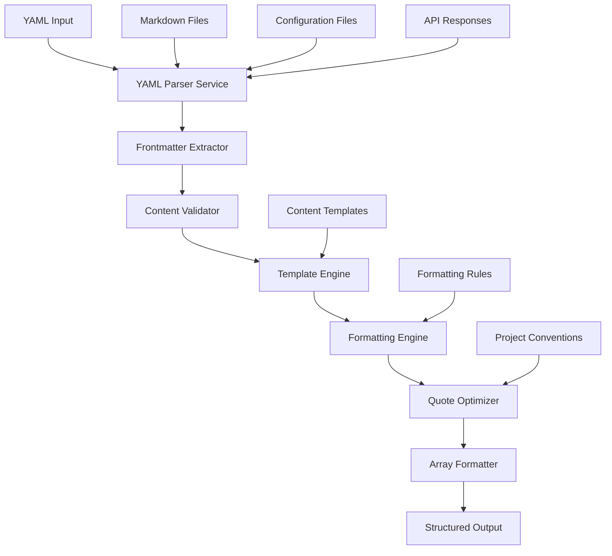

# YAML Parser Service

## 1. Executive Summary
The YAML Parser Service is a specialized shared service that provides comprehensive YAML processing capabilities tailored for the Augment-It platform's extensive use of YAML frontmatter in markdown content, configuration management, and data consistency workflows. Built from existing implementations, it offers advanced frontmatter extraction, intelligent formatting with consistent quoting rules, template-based validation, and seamless integration with content management systems. The service is optimized for handling thousands of markdown files with robust error handling and performance-oriented processing.

## 2. Background & Motivation
### Problem Statement
The Augment-It platform processes extensive YAML frontmatter across thousands of markdown files with inconsistent formatting, validation, and error handling, leading to content management challenges and data integrity issues.

### Current Limitations
- **Inconsistent YAML Formatting**: Multiple approaches to quoting, array formatting, and property ordering across files
- **Manual Frontmatter Management**: No centralized system for validating and updating metadata across content collections
- **Template Inconsistencies**: Different content types require different metadata templates without systematic enforcement
- **Error-Prone Processing**: Basic regex-based parsing without comprehensive error recovery
- **Performance Issues**: Inefficient processing of large content repositories
- **Quoting Confusion**: Inconsistent rules for when to quote YAML values, especially for URLs and special characters

### Why This Solution
- **Content-First Design**: Optimized specifically for markdown frontmatter processing based on actual usage patterns
- **Template-Based Validation**: Systematic approach to ensuring content metadata consistency
- **Performance Optimized**: Built for processing thousands of files efficiently
- **Intelligent Formatting**: Consistent, project-specific formatting rules based on existing implementations
- **Error Recovery**: Robust handling of malformed YAML with detailed error reporting

## 3. Goals & Non-Goals
### Goals
1. **Frontmatter Excellence**: Specialized processing of YAML frontmatter in markdown files
2. **Consistent Formatting**: Project-specific formatting rules with intelligent quoting and array handling
3. **Template Validation**: Schema-based validation against content type templates
4. **Bulk Processing**: Efficient handling of large content repositories
5. **Content Migration**: Tools for updating and migrating frontmatter across collections
6. **API Integration**: Process YAML from external APIs with consistent formatting
7. **Error Recovery**: Intelligent handling of malformed YAML with correction suggestions

### Non-Goals
1. **General YAML Processing**: Focus on frontmatter and configuration use cases, not general-purpose YAML
2. **Complex Data Structures**: Optimized for flat/shallow YAML structures typical in frontmatter
3. **Real-time Collaboration**: Batch processing focus, not collaborative editing
4. **Binary Data**: Text-only YAML processing

## 4. Technical Design
### High-Level Architecture


### Core Components

#### 1. Frontmatter Processor
- **Responsibility**: Extract and manipulate YAML frontmatter from markdown content
- **Features**:
  - Regex-based extraction for performance
  - Support for complex array formats (both list and bracket notation)
  - Intelligent property ordering based on templates
  - Special handling for common frontmatter patterns

#### 2. Intelligent Formatting Engine
- **Responsibility**: Apply consistent, project-specific formatting rules
- **Features**:
  - Conditional quoting based on content analysis
  - Array format optimization (bracket vs. list format)
  - Property ordering based on templates
  - Special handling for URLs, dates, and tags

#### 3. Template Validation System
- **Responsibility**: Validate YAML against content type templates
- **Features**:
  - Required/optional field validation
  - Type checking and coercion
  - Missing field detection and reporting
  - Template inheritance for content hierarchies

#### 4. Bulk Processing Engine
- **Responsibility**: Efficiently process large numbers of files
- **Features**:
  - Concurrent processing with configurable limits
  - Progress reporting and error aggregation
  - Selective processing based on file patterns
  - Change detection to avoid unnecessary updates

### API Specifications

#### Primary Interfaces
```typescript
interface YAMLParserOptions {
  templateOrder?: string[]; // Property ordering preference
  strictMode?: boolean; // Default: false - allows relaxed parsing
  preserveQuotes?: boolean; // Default: false - optimize quotes
  arrayFormat?: 'auto' | 'bracket' | 'list'; // Default: 'auto'
  dateFormat?: string; // Default: 'YYYY-MM-DD'
  maxDepth?: number; // Default: 10 for frontmatter
  allowDuplicateKeys?: boolean; // Default: false
  trimWhitespace?: boolean; // Default: true
}

interface FrontmatterResult {
  success: boolean;
  data?: Record<string, any>;
  formatted?: string; // Consistently formatted YAML
  errors: YAMLError[];
  warnings: YAMLWarning[];
  metadata: {
    hasChanges: boolean;
    originalLength: number;
    formattedLength: number;
    processingTime: number;
    propertiesCount: number;
    arrayFields: string[];
    reorderedFields: string[];
  };
}

interface YAMLError {
  line?: number;
  column?: number;
  property?: string;
  message: string;
  code: YAMLErrorCode;
  severity: 'error' | 'warning' | 'info';
  suggestion?: string;
  context?: string;
}

interface TemplateValidationResult {
  valid: boolean;
  missingFields: string[];
  extraFields: string[];
  typeErrors: TemplateError[];
  warnings: TemplateWarning[];
  suggestions: string[];
}

// Main parsing functions
function parseFrontmatter(content: string, options?: YAMLParserOptions): Promise<FrontmatterResult>;
function extractFrontmatter(content: string): Record<string, any> | null;
function formatFrontmatter(frontmatter: Record<string, any>, templateOrder?: string[]): string;
function validateAgainstTemplate(frontmatter: Record<string, any>, template: ContentTemplate): TemplateValidationResult;
function updateFileFrontmatter(filePath: string, updates: Record<string, any>): Promise<void>;
function bulkProcessFiles(pattern: string, processor: (frontmatter: Record<string, any>) => Record<string, any>): Promise<BulkProcessResult>;
```

#### Core Implementation
```typescript
// Based on existing implementations from yamlFrontmatter.ts files
class YAMLParser {
  private options: Required<YAMLParserOptions>;
  private formattingRules: FormattingRules;
  
  constructor(options: YAMLParserOptions = {}) {
    this.options = {
      templateOrder: [],
      strictMode: false,
      preserveQuotes: false,
      arrayFormat: 'auto',
      dateFormat: 'YYYY-MM-DD',
      maxDepth: 10,
      allowDuplicateKeys: false,
      trimWhitespace: true,
      ...options
    };
    this.formattingRules = new FormattingRules();
  }

  // Frontmatter extraction optimized for markdown
  public extractFrontmatter(content: string): Record<string, any> | null {
    if (!content) return null;

    const frontmatterRegex = /^---\n((?:.|\n)*?)\n---/;
    const match = content.match(frontmatterRegex);
    if (!match || !match[1]) return null;

    return this.parseFrontmatterContent(match[1].trim());
  }

  private parseFrontmatterContent(yamlContent: string): Record<string, any> {
    const frontmatter: Record<string, any> = {};
    const lines = yamlContent.split('\n');
    let currentArrayProperty: string | null = null;
    let arrayValues: any[] = [];
    
    for (let line of lines) {
      line = line.trim();
      if (!line) continue;
      
      // Handle array items
      if (line.startsWith('- ') && currentArrayProperty) {
        arrayValues.push(this.parseValue(line.substring(2).trim()));
        continue;
      }
      
      // Finalize current array if we're starting a new property
      if (currentArrayProperty && !line.startsWith('- ')) {
        frontmatter[currentArrayProperty] = arrayValues;
        currentArrayProperty = null;
        arrayValues = [];
      }
      
      // Parse key-value pairs
      const colonIndex = line.indexOf(':');
      if (colonIndex > 0) {
        const key = line.substring(0, colonIndex).trim();
        const value = line.substring(colonIndex + 1).trim();
        
        if (!value) {
          // Start of array property
          currentArrayProperty = key;
          arrayValues = [];
          continue;
        }
        
        frontmatter[key] = this.parseValue(value, key);
      }
    }
    
    // Handle final array
    if (currentArrayProperty) {
      frontmatter[currentArrayProperty] = arrayValues;
    }
    
    return frontmatter;
  }

  private parseValue(value: string, key?: string): any {
    // Handle special cases for known properties
    if (key === 'tags' && value.startsWith('[') && value.endsWith(']')) {
      return this.parseBracketArray(value);
    }
    
    // Handle quoted values
    if ((value.startsWith('"') && value.endsWith('"')) || 
        (value.startsWith("'") && value.endsWith("'"))) {
      return value.substring(1, value.length - 1);
    }
    
    // Handle boolean values
    if (value === 'true') return true;
    if (value === 'false') return false;
    if (value === 'null') return null;
    
    // Handle numeric values
    if (!isNaN(Number(value)) && !value.startsWith('0') && value !== '') {
      return value.includes('.') ? parseFloat(value) : parseInt(value);
    }
    
    return value;
  }

  private parseBracketArray(value: string): string[] {
    const content = value.substring(1, value.length - 1).trim();
    if (content === '') return [];
    
    return content.split(',').map(item => {
      const trimmed = item.trim();
      // Remove quotes if present
      if ((trimmed.startsWith('"') && trimmed.endsWith('"')) || 
          (trimmed.startsWith("'") && trimmed.endsWith("'"))) {
        return trimmed.substring(1, trimmed.length - 1);
      }
      return trimmed;
    }).filter(item => item !== '');
  }

  // Intelligent formatting with project-specific rules
  public formatFrontmatter(frontmatter: Record<string, any>, templateOrder?: string[]): string {
    const formatted = { ...frontmatter };
    const arrayFields = ['tags', 'authors', 'aliases'];
    const extractedArrays: Record<string, any[]> = {};
    
    // Extract arrays for special handling
    for (const field of arrayFields) {
      if (formatted[field] && Array.isArray(formatted[field])) {
        extractedArrays[field] = formatted[field];
        delete formatted[field];
      }
    }
    
    let yamlContent = '';
    
    // Handle template ordering
    if (templateOrder && Array.isArray(templateOrder)) {
      for (const key of templateOrder) {
        if (key in formatted) {
          yamlContent += this.formatProperty(key, formatted[key]);
          delete formatted[key];
        }
      }
    }
    
    // Add remaining properties
    for (const [key, value] of Object.entries(formatted)) {
      if (!arrayFields.includes(key)) {
        yamlContent += this.formatProperty(key, value);
      }
    }
    
    // Add arrays at the end
    for (const [field, values] of Object.entries(extractedArrays)) {
      yamlContent += this.formatArrayProperty(field, values);
    }
    
    return yamlContent;
  }

  private formatProperty(key: string, value: any): string {
    // Special handling for date fields
    if (key.startsWith('date_') && value) {
      return `${key}: ${this.formatDate(value)}\n`;
    }
    
    // Special handling for error messages
    if (key.endsWith('_error') || key.endsWith('_error_message')) {
      return `${key}: ${this.quoteForYAML(String(value))}\n`;
    }
    
    if (value === null) return `${key}: null\n`;
    if (typeof value === 'boolean') return `${key}: ${value}\n`;
    if (typeof value === 'number') return `${key}: ${value}\n`;
    if (typeof value === 'string') return `${key}: ${this.quoteForYAML(value)}\n`;
    
    // Fallback for complex types
    return `${key}: ${JSON.stringify(value)}\n`;
  }

  private formatArrayProperty(field: string, values: any[]): string {
    if (!values || values.length === 0) {
      return `${field}: []\n`;
    }
    
    // Determine format based on complexity
    const hasComplexValues = values.some(value => 
      typeof value === 'string' && /[\s:{}\[\]|>*&!%#`@,]/.test(value)
    );
    
    if (hasComplexValues || field === 'authors') {
      // Use list format
      let result = `${field}:\n`;
      for (const value of values) {
        result += `  - ${value}\n`;
      }
      return result;
    } else {
      // Use bracket format for simple arrays
      const valueList = values.join(', ');
      return `${field}: [${valueList}]\n`;
    }
  }

  // Intelligent quoting based on YAML reserved characters and project rules
  private quoteForYAML(value: string): string {
    // YAML reserved characters that require quoting
    const yamlReserved = /[:#>|{}\[\],&*!?\-<>=\%@`'"]/;
    
    // Don't quote if no special characters
    if (!yamlReserved.test(value) && value !== '') {
      return value;
    }
    
    // Handle mixed quotes
    if (value.includes("'") && value.includes('"')) {
      return `"${value.replace(/"/g, '\\"')}"`;
    }
    
    // Use double quotes if string contains single quotes
    if (value.includes("'")) {
      return `"${value}"`;
    }
    
    // Use single quotes if string contains double quotes
    if (value.includes('"')) {
      return `'${value}'`;
    }
    
    // Default to single quotes for reserved characters
    return `'${value}'`;
  }

  // Template validation
  public validateAgainstTemplate(
    frontmatter: Record<string, any>, 
    template: ContentTemplate
  ): TemplateValidationResult {
    const result: TemplateValidationResult = {
      valid: true,
      missingFields: [],
      extraFields: [],
      typeErrors: [],
      warnings: [],
      suggestions: []
    };
    
    // Check required fields
    for (const field of Object.keys(template.required || {})) {
      if (!(field in frontmatter)) {
        result.missingFields.push(field);
        result.valid = false;
      }
    }
    
    // Check for extra fields
    const allowedFields = new Set([
      ...Object.keys(template.required || {}),
      ...Object.keys(template.optional || {})
    ]);
    
    for (const field of Object.keys(frontmatter)) {
      if (!allowedFields.has(field)) {
        result.extraFields.push(field);
        result.warnings.push(`Unexpected field: ${field}`);
      }
    }
    
    return result;
  }

  // Bulk processing for large content repositories
  public async bulkProcessFiles(
    pattern: string,
    processor: (frontmatter: Record<string, any>) => Record<string, any>
  ): Promise<BulkProcessResult> {
    // Implementation would use file system operations
    // to process multiple files efficiently
    const result: BulkProcessResult = {
      totalFiles: 0,
      processedFiles: 0,
      errors: [],
      changes: [],
      processingTime: 0
    };
    
    // Actual implementation would iterate through files
    // apply the processor function, and track changes
    
    return result;
  }
}

// Supporting interfaces
interface ContentTemplate {
  required: Record<string, any>;
  optional: Record<string, any>;
  arrayFields?: string[];
  dateFields?: string[];
}

interface BulkProcessResult {
  totalFiles: number;
  processedFiles: number;
  errors: YAMLError[];
  changes: FileChange[];
  processingTime: number;
}

interface FileChange {
  filePath: string;
  changeType: 'updated' | 'formatted' | 'validated';
  details: string;
}

enum YAMLErrorCode {
  SYNTAX_ERROR = 'SYNTAX_ERROR',
  MISSING_REQUIRED = 'MISSING_REQUIRED',
  INVALID_TYPE = 'INVALID_TYPE',
  DUPLICATE_KEY = 'DUPLICATE_KEY',
  TEMPLATE_VIOLATION = 'TEMPLATE_VIOLATION',
  FORMATTING_ISSUE = 'FORMATTING_ISSUE'
}
```

### Integration Points

#### 1. Content Management System
- **Frontmatter Updates**: Batch update metadata across content collections
- **Template Enforcement**: Validate content against type-specific templates
- **Migration Tools**: Update frontmatter structures during content migrations

#### 2. File System Observer
- **Change Detection**: Monitor frontmatter changes across the repository
- **Automated Validation**: Run template validation on content updates
- **Consistency Checking**: Ensure formatting consistency across similar files

#### 3. API Data Processing
- **External Data Integration**: Process YAML from external APIs
- **Format Standardization**: Apply consistent formatting to imported data
- **Error Handling**: Robust processing of potentially malformed external YAML

### Error Handling
#### Expected Error Cases
1. **Frontmatter Syntax Errors**
   - Malformed YAML structure
   - Invalid indentation
   - Missing colons or quotes
   - Illegal characters in keys

2. **Template Validation Errors**
   - Missing required fields
   - Incorrect field types
   - Extra/unknown fields
   - Format constraint violations

3. **File Processing Errors**
   - File access permissions
   - Encoding issues
   - Large file handling
   - Concurrent access conflicts

#### Error Recovery Strategies
- **Graceful Degradation**: Continue processing valid parts when possible
- **Detailed Error Context**: Provide line numbers and suggestions for fixes
- **Automatic Correction**: Fix common formatting issues automatically
- **Rollback Capability**: Maintain backups for bulk operations

### Performance Considerations
1. **Regex Optimization**: Efficient pattern matching for frontmatter extraction
2. **Streaming Processing**: Handle large files without full memory loading
3. **Concurrent Processing**: Parallel processing of multiple files
4. **Change Detection**: Skip processing unchanged files
5. **Memory Management**: Efficient handling of large content repositories

### Security Considerations
1. **Input Sanitization**: Prevent YAML injection attacks
2. **File System Security**: Safe file operations with permission checking
3. **Content Validation**: Ensure processed YAML doesn't contain malicious content
4. **Access Control**: Respect file system permissions and access controls

## 5. Implementation Plan
### Phase 1: Core YAML Processing (Week 1-2)
1. **Frontmatter Extraction**
   - Regex-based extraction optimized for markdown
   - Support for complex array formats
   - Property parsing with type inference

2. **Intelligent Formatting**
   - Project-specific formatting rules
   - Conditional quoting system
   - Array format optimization

### Phase 2: Template System (Week 3-4)
1. **Template Validation Engine**
   - Content type template support
   - Required/optional field validation
   - Type checking and constraints

2. **Bulk Processing Tools**
   - File pattern matching
   - Concurrent processing
   - Progress reporting and error aggregation

### Phase 3: Integration & Optimization (Week 5)
1. **File System Integration**
   - Observer system integration
   - Change detection optimization
   - Performance monitoring

2. **Advanced Features**
   - Content migration tools
   - API data processing
   - Error recovery enhancements

### Dependencies
- **Internal**: File system observer, content templates, reporting services
- **External**: File system APIs, potential YAML validation libraries
- **Development**: TypeScript 5+, Jest for testing, performance profiling tools

### Testing Strategy
1. **Unit Tests**
   - Frontmatter extraction accuracy
   - Formatting consistency
   - Template validation correctness
   - Error handling scenarios

2. **Integration Tests**
   - File system operations
   - Bulk processing performance
   - Template system integration
   - Real-world content processing

3. **Performance Tests**
   - Large repository processing
   - Memory usage optimization
   - Concurrent processing efficiency

## 6. Alternatives Considered
### Third-Party YAML Libraries
- **js-yaml**: Full-featured YAML parser
  - **Pros**: Complete YAML 1.2 support, well-tested
  - **Cons**: Larger bundle size, general-purpose (not frontmatter optimized)
  - **Decision**: Custom implementation for better performance and frontmatter-specific features

### Gray-Matter Library
- **gray-matter**: Popular frontmatter parsing library
  - **Pros**: Specialized for frontmatter, good ecosystem support
  - **Cons**: Less control over formatting rules, dependencies
  - **Decision**: Custom implementation for project-specific requirements

### Server-Side Processing
- **Backend YAML Processing**: Move complex operations to server
  - **Pros**: More processing power, centralized logic
  - **Cons**: Network latency, reduced offline capability
  - **Decision**: Client-side for real-time feedback, server for bulk operations

## 7. Open Questions
1. **Content Type Evolution**: How should we handle template changes across existing content?
2. **Internationalization**: Should we support locale-specific date formats and content?
3. **Version Control Integration**: How should we integrate with Git for content tracking?
4. **Performance Scaling**: What are the practical limits for bulk processing?
5. **Custom Validators**: Should we support plugin-based custom validation rules?
6. **Conflict Resolution**: How should we handle concurrent modifications to the same files?

## 8. Appendix
### Glossary
- **Frontmatter**: YAML metadata at the beginning of markdown files
- **Template Order**: Preferred sequence of properties in YAML output
- **Bracket Format**: Array notation like `[item1, item2]`
- **List Format**: Array notation with dash prefixes on separate lines
- **Gray Matter**: Common term for frontmatter in static site generators

### References
- [YAML Specification 1.2](https://yaml.org/spec/1.2/spec.html)
- [Existing yamlFrontmatter.ts Implementation](../../site/src/utils/yamlFrontmatter.ts)
- [AI Labs YAML Utilities](../../ai-labs/utils/yamlFrontmatter.ts)
- [Content Templates and Validation](../../tidyverse/observers/templates/)
- [Markdown Frontmatter Best Practices](https://www.markdownguide.org/hacks/#front-matter)

### Revision History
- v0.1.0 (2025-08-12): Initial comprehensive specification based on existing implementations
- v0.0.0.1 (2025-08-09): Initial file creation
