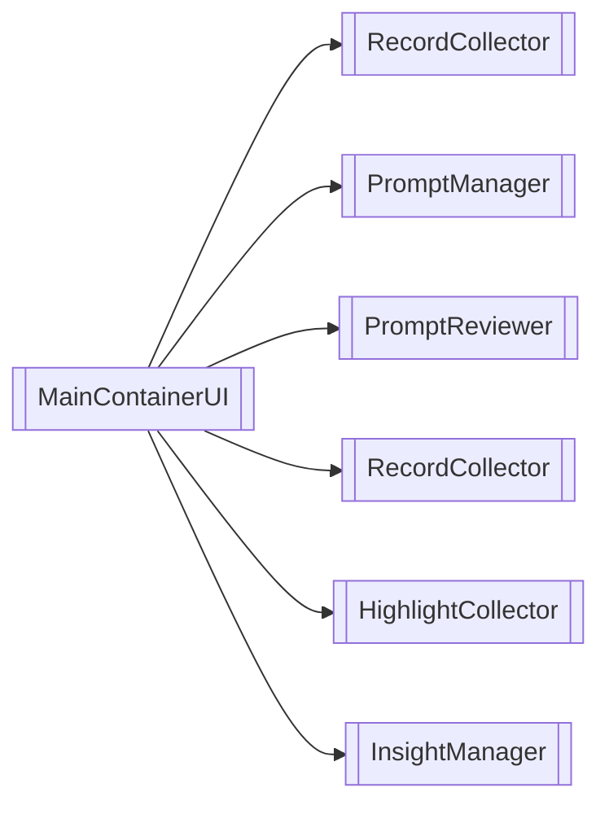
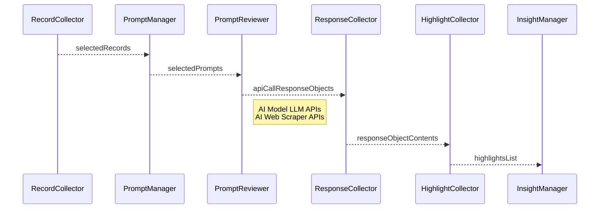

## Purpose
The [[projects/Augment-It/Specs/shell-ui/MainContainerUI|MainContainerUI]] dynamically loads [[Microfrontend Architecture|Microfrontends]] in a columnar layout. Each column functions as a Window, and the root directory uses a [[Vocabulary/Module Federation]] library to load the Microfrontend "Apps" within these Windows. 

###### Barebones Layout
As of February 21st, 2025

## Components
[[projects/Augment-It/Specs/shell-ui/AppWindow|AppWindow]]
[[projects/Augment-It/Specs/shared-ui-elements/SharedHeader|SharedHeader]]

### Custom Components
[[OptionsBar]]
[[SharedLeftPanel]]
[[SharedRightPanel]]

### Shared Components

