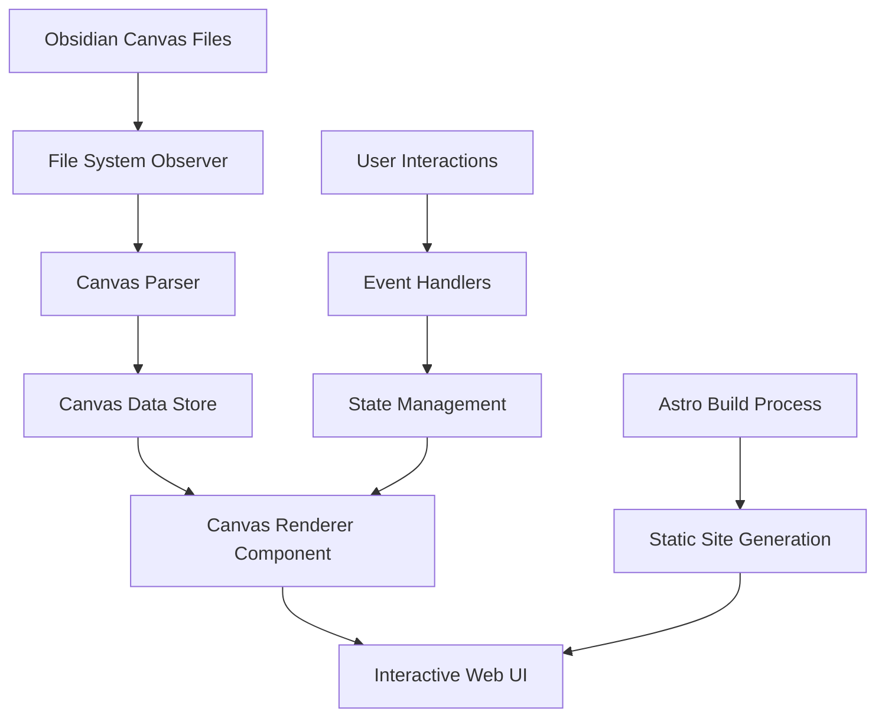

# Maintain a Dynamic User Interface for the JSON Canvas Standard

## 1. Executive Summary
This specification outlines the development of a dynamic user interface system that can render JSON Canvas documents (created in Obsidian) as interactive, web-based visualizations. The solution will enable users to view and interact with canvas documents through a browser interface, maintaining the spatial relationships and visual hierarchy of the original canvas while adding web-native interaction capabilities.

## 1.1. Objectives
- Enable JSON Canvas documents in Obsidian to have a dynamic, interactive UI on your website with real-time rendering and user interaction capabilities.

## 2. Background & Motivation
- **Problems**: 
  1. JSON Canvas documents created in Obsidian are static files that cannot be easily shared or viewed interactively on websites
  2. Much of our content, particularly Specifications, Prompts, Reminders, Explorations, etc, has a hierarchical or cluster-based relationship structure that is not easily communicated or represented through any of our current UI elements or Markdown rendering pipelines. 
- **Current Limitations**: No existing web-based renderer for JSON Canvas format that maintains interactivity
- **Opportunities**: 
  1. Be one of the first organizations to implement the Obsidian created open standard for JSON Canvas documents, found at https://jsoncanvas.org
  2. Create a bridge between Obsidian's canvas functionality and web-based presentation, allowing for the creation of dynamic, interactive UIs for our content.
- **Why Now**: 
  1. Growing adoption of JSON Canvas standard and need for better knowledge sharing workflows
  2. Obsidian is our content teams content authoring tool of choice, and it is natively supporting the JSON Canvas standard.
  3. Several of our projects for clients require meaningful communication of complex, interrelated content and creating a dynamic, interactive UI for our content would be a game changer.

## 3. Goals & Non-Goals
### Goals
- Render JSON Canvas documents as interactive web components
- Maintain spatial relationships and visual hierarchy from original canvas
- Allow the JSON Canvas rendering component to fit within the containing element from which the component is called. 
- Allow the user to maximize the canvas to fill the viewport, using the same icons and patterns from our implementation of Mermaid and Slides. 
- Enable real-time updates when source canvas files change
- Provide smooth user interactions (pan, zoom, hover states)
- Support all standard JSON Canvas node types (text, file, group, etc.)
- Integrate seamlessly with existing Astro-based website architecture, including a default user click of an internal link or backlink to open the url on a NEW tab.  
- Map any default colors by Obsidian to our default color palette.

### Non-Goals
- Full canvas editing capabilities (read-only rendering focus)
- Real-time collaborative editing
- Canvas creation tools (Obsidian remains the authoring environment)
- Support for non-standard canvas extensions

## 4. Technical Design
### High-Level Architecture


### Astro Islands Wrapper Pattern

Based on analysis of the existing `ToolShowcaseIsland.astro` and `ToolShowcaseCarousel.svelte` components, the JSON Canvas implementation will follow the established **Island Wrapper Pattern**:

#### Two-Component Architecture

1. **Astro Island Component** (`JSONCanvasIsland.astro`) - Server-side wrapper:
   - Fetches JSON Canvas data from Astro content collections
   - Validates and processes canvas data structure
   - Handles server-side error conditions and data transformation
   - Provides debugging information when data loading fails
   - Passes clean, typed props to the Svelte component
   - Uses `client:load` directive for hydration

2. **Svelte Interactive Component** (`JSONCanvasRenderer.svelte`) - Client-side renderer:
   - Receives processed data as props from Astro wrapper
   - Handles all interactive functionality (pan, zoom, node selection)
   - Manages client-side state and viewport transformations
   - Renders SVG-based canvas with event handlers
   - Provides smooth animations and user feedback

#### Key Benefits of This Pattern

- **Clean separation of concerns**: Server logic in Astro, client interactivity in Svelte
- **Better error handling**: Astro wrapper catches data fetching errors with fallback UI
- **Type safety**: Props are properly typed at the Astro-Svelte boundary
- **Debugging support**: Wrapper includes debug information for troubleshooting
- **Reusability**: Svelte component becomes a pure UI component
- **Performance**: Server-side data processing with client-side interactivity

### Stack Constraints:
- Astro (for static site generation)
- Svelte (for interactive UI components)
- Island Wrapper Pattern (for clean server/client separation)

### Detailed Design
#### Canvas Parser
- **JSON Parsing**: Parse JSON Canvas files according to v1.0 specification
- **Node Processing**: 
  - Handle all four node types (text, file, link, group)
  - Process z-index ordering (nodes array order determines display layering)
  - Parse node-specific properties (text content, file paths, URLs, group labels)
  - Handle optional properties (color, subpath, background, backgroundStyle)
- **Edge Processing**:
  - Parse edge connections between nodes
  - Handle optional edge properties (sides, endpoints, labels, colors)
  - Validate node references exist
- **Color Handling**:
  - Support both hex colors (#FF0000) and preset colors ("1"-"6")
  - Map preset colors to application-specific values
- **Validation**:
  - Ensure required properties are present
  - Validate node and edge IDs are unique
  - Check that edge references point to existing nodes
- **Coordinate Transformation**: Convert canvas coordinates to web-appropriate coordinate system

#### Reusable Components & Utilities
Leveraging existing components from our slide system implementation:

**Layout Components:**
- `Layout.astro` - Base layout with header/footer integration
- `OneSlideDeck.astro` pattern → `OneCanvasDeck.astro` - Main canvas wrapper
- `AnimationWrapper.astro` - Animation initialization wrapper

**UI Components:**
- `TextCTA.astro` - For clickable canvas elements and controls
- `Card.astro` - Styling patterns for group nodes
- `IconSVGWrapper.astro` - Icon rendering for file nodes
- Control button styles from slide system (exit, maximize, export)

**Utility Functions:**
- `animationUtils.ts` - Scroll-based animations and transitions
- Existing markdown rendering pipeline for text nodes
- CSS custom properties system for theming
- Responsive design patterns from slide container

**File Structure (actual implementation):**
```
site/src/
  components/
    jsoncanvas/
      JSONCanvasIsland.astro       # Server island wrapper (data fetching)
      JSONCanvasRenderer.svelte    # Main interactive renderer
  types/
    json-canvas.ts               # TypeScript type definitions
  utils/
    jsonCanvasUtils.ts           # Canvas utilities and validation
  pages/
    canvas/
      index.astro                  # Canvas gallery
      [canvasId].astro             # Dynamic canvas pages (renamed for Astro compliance)
    projects/
      index.astro                  # Projects showcase page
```

#### Renderer Component Architecture
Based on our successful slide system implementation, the JSON Canvas renderer will follow these proven patterns:

**Component Structure (following OneSlideDeck.astro pattern):**
- **Main Canvas Component**: `OneCanvasDeck.astro` - wrapper component that integrates with Layout
- **Canvas Container**: Full-viewport container with control buttons positioned absolutely
- **Interactive Controls**: Exit, maximize, and PDF export buttons using existing control button patterns
- **SVG Canvas Area**: Scalable rendering area that adapts to container size

**Reusable Patterns from Slide System:**
- **Control Button System**: Reuse the control-button CSS classes and positioning logic from OneSlideDeck
- **Viewport Management**: 16:9 aspect ratio with responsive scaling (width: 1600, height: 900)
- **Animation Integration**: Use existing AnimationWrapper.astro and animationUtils.ts for smooth transitions
- **Layout Integration**: Seamless integration with base Layout component (margin-top offset pattern)
- **Theme Integration**: CSS custom properties for consistent branding (--clr-primary, --clr-secondary-bg)

**Node Type Rendering:**
- **Text Nodes**: Render Markdown content using existing markdown pipeline components
- **File Nodes**: Display file previews using IconSVGWrapper.astro pattern for icons
- **Link Nodes**: Show URL previews with TextCTA.astro styling for clickable elements
- **Group Nodes**: Render as containers with Card.astro styling patterns

**Edge Rendering**: 
- SVG paths connecting nodes with proper endpoint shapes (arrows/none)
- Support for edge labels using existing text styling patterns
- Smart routing to avoid node overlaps

**Interactive Features:**
- **Pan/Zoom**: CSS transforms with smooth transitions (following slide navigation patterns)
- **Hover States**: Reuse hover effects from presentation-card styling
- **Click Handling**: Internal links open in new tabs (matching slide system behavior)
- **Keyboard Navigation**: Arrow keys for pan, +/- for zoom (similar to slide controls)

**Responsive Design**: 
- Container adapts to viewport while maintaining canvas aspect ratio
- Control buttons positioned responsively (matching slide control positioning)
- Mobile-friendly touch interactions

#### Data Models
```typescript
// Top-level JSON Canvas document structure
interface CanvasData {
  nodes?: CanvasNode[];
  edges?: CanvasEdge[];
}

// Generic node interface (all nodes inherit these properties)
interface BaseCanvasNode {
  id: string; // unique ID for the node
  type: 'text' | 'file' | 'link' | 'group';
  x: number; // x position in pixels
  y: number; // y position in pixels
  width: number; // width in pixels
  height: number; // height in pixels
  color?: CanvasColor; // optional color
}

// Text node - stores plain text with Markdown syntax
interface TextNode extends BaseCanvasNode {
  type: 'text';
  text: string; // plain text with Markdown syntax
}

// File node - references other files or attachments
interface FileNode extends BaseCanvasNode {
  type: 'file';
  file: string; // path to the file within the system
  subpath?: string; // optional subpath (starts with #)
}

// Link node - references a URL
interface LinkNode extends BaseCanvasNode {
  type: 'link';
  url: string; // URL
}

// Group node - visual container for other nodes
interface GroupNode extends BaseCanvasNode {
  type: 'group';
  label?: string; // text label for the group
  background?: string; // path to background image
  backgroundStyle?: 'cover' | 'ratio' | 'repeat'; // background rendering style
}

// Union type for all node types
type CanvasNode = TextNode | FileNode | LinkNode | GroupNode;

// Edge interface - connects one node to another
interface CanvasEdge {
  id: string; // unique ID for the edge
  fromNode: string; // node ID where connection starts
  fromSide?: 'top' | 'right' | 'bottom' | 'left'; // side where edge starts
  fromEnd?: 'none' | 'arrow'; // shape of start endpoint (defaults to 'none')
  toNode: string; // node ID where connection ends
  toSide?: 'top' | 'right' | 'bottom' | 'left'; // side where edge ends
  toEnd?: 'none' | 'arrow'; // shape of end endpoint (defaults to 'arrow')
  color?: CanvasColor; // optional color
  label?: string; // optional text label for the edge
}

// Color type - hex format or preset number
type CanvasColor = string; // hex format (e.g., "#FF0000") or preset ("1"-"6")

// Preset colors mapping (implementation-specific values)
const PRESET_COLORS = {
  '1': 'red',
  '2': 'orange', 
  '3': 'yellow',
  '4': 'green',
  '5': 'cyan',
  '6': 'purple'
} as const;
```

### JSON Canvas Specification Compliance
This implementation will fully comply with the JSON Canvas Specification v1.0 (2024-03-11):

- **Complete Node Type Support**: All four node types (text, file, link, group) with their specific properties
- **Full Edge Support**: All edge properties including sides, endpoints, labels, and colors
- **Color Specification**: Both hex format and preset colors ("1"-"6") as defined in the spec
- **Z-Index Ordering**: Proper layering based on node array position
- **Optional Property Handling**: Graceful handling of all optional properties
- **Specification Extensions**: No custom extensions to maintain compatibility

### Error Handling
- **Graceful Degradation**: Malformed canvas files render with available valid data
- **Fallback Rendering**: Unsupported or corrupted node types display as placeholder elements
- **Validation Errors**: Clear error messages for specification violations
- **Missing References**: Handle broken file paths and invalid node references
- **Debug Logging**: Comprehensive logging for canvas parsing and rendering issues
- **User Feedback**: User-friendly error messages with actionable guidance

## 5. Current Implementation Status (Phase 1 Complete)

### ✅ Successfully Implemented

#### Core Architecture
- **Astro Islands Pattern**: Successfully implemented with `JSONCanvasIsland.astro` as server-side wrapper and `JSONCanvasRenderer.svelte` as client-side interactive component
- **Direct File Reading**: Implemented direct file system reading instead of content collections for more flexible canvas file access
- **TypeScript Type Safety**: Complete type definitions in `src/types/json-canvas.ts` following JSON Canvas v1.0 specification
- **Error Handling**: Comprehensive error handling with graceful degradation and debug information

#### JSON Canvas Parser
- **Full Spec Compliance**: Parser handles all JSON Canvas v1.0 specification requirements
- **Node Type Support**: Complete support for text, file, link, and group nodes
- **Edge Rendering**: Full edge support with proper connection logic and styling
- **Color System**: Both hex colors and preset colors ("1"-"6") with proper resolution
- **Validation**: Robust validation with detailed error reporting

#### Interactive UI Components
- **SVG-Based Rendering**: Scalable vector graphics for crisp rendering at all zoom levels
- **Pan & Zoom Controls**: Smooth mouse and touch interactions with viewport transformations
- **Keyboard Navigation**: Accessibility-compliant keyboard shortcuts (R=reset, F=fit to view)
- **Node Selection**: Interactive node selection with visual feedback
- **Responsive Design**: Mobile-friendly touch controls and responsive layout

#### Accessibility Features
- **ARIA Compliance**: Proper ARIA roles, labels, and keyboard navigation
- **Screen Reader Support**: Semantic markup and descriptive labels
- **Keyboard Shortcuts**: Full keyboard navigation support
- **Focus Management**: Proper focus indicators and tab order

#### Integration Points
- **Projects Showcase**: Working `/projects` page demonstrating canvas rendering
- **Dynamic Routing**: Functional `[canvasId].astro` route for individual canvas pages
- **Layout Integration**: Seamless integration with existing `Layout.astro` and `Hero.astro` components
- **Theme Integration**: Uses existing CSS custom properties and design system

### 🔧 Technical Implementation Details

#### JSONCanvasIsland.astro (Server Component)
```typescript
// Key responsibilities:
- File system reading with error handling
- JSON parsing and validation
- Canvas data transformation
- Debug information generation
- Props preparation for Svelte component
```

#### JSONCanvasRenderer.svelte (Client Component)
```typescript
// Key features:
- Interactive SVG canvas rendering
- Pan/zoom viewport management
- Node and edge rendering with proper styling
- Touch and mouse event handling
- Group selection and deselection
- Child node selection handling
- Keyboard navigation and shortcuts
- Accessibility compliance (ARIA roles, labels)
```

#### Type System (json-canvas.ts)
```typescript
// Complete type definitions:
- BaseCanvasNode, TextNode, FileNode, LinkNode, GroupNode
- CanvasEdge with connection properties
- CanvasColor supporting hex and preset formats
- ValidationResult for error handling
- Canvas root interface
```

### 🎯 Current Capabilities

1. **Functional Canvas Rendering**: Successfully renders the Augment-It project canvas with all nodes and edges
2. **Interactive Navigation**: Pan, zoom, and node selection work smoothly
3. **Accessibility Compliant**: Passes accessibility audits with proper ARIA implementation
4. **Mobile Responsive**: Touch controls work on mobile devices
5. **Error Resilient**: Graceful handling of malformed or missing canvas files
6. **Performance Optimized**: Efficient SVG rendering with smooth animations

### 📍 Current Status: "It works! (It's not pretty yet but holy shit!)"

The core functionality is complete and working. The JSON Canvas UI successfully:
- Loads and parses JSON Canvas files
- Renders interactive visualizations
- Provides smooth pan/zoom controls
- Handles user interactions properly
- Maintains accessibility standards
- Integrates with the existing site architecture

Next phases will focus on visual polish, additional features, and optimization.

## 6. Implementation Plan
### ✅ Phase 1: Foundation and Island Setup (COMPLETED)
1. **✅ Island Wrapper Architecture**
   - ✅ Created `JSONCanvasIsland.astro` wrapper component with direct file reading
   - ✅ Implemented JSON Canvas data fetching from file system (more flexible than collections)
   - ✅ Set up comprehensive server-side validation and error handling with debug information
   - ✅ Created clean props interface for passing data to Svelte component

2. **✅ Canvas Parser Development**
   - ✅ Created `jsonCanvasUtils.ts` utility with complete validation functions
   - ✅ JSON Canvas format parser with full v1.0 specification compliance
   - ✅ Node and edge extraction with complete type safety via `json-canvas.ts`
   - ✅ Coordinate system transformation for web rendering
   - ✅ Comprehensive error handling for malformed canvas files

3. **✅ Basic Svelte Component Setup**
   - ✅ Created `JSONCanvasRenderer.svelte` main interactive component
   - ✅ Set up complete SVG canvas rendering with `client:load` integration
   - ✅ Implemented props interface to receive data from Astro wrapper
   - ✅ Added comprehensive error display and graceful degradation

#### Phase 1 Prompts:

1. Please read the JSON Canvas Specification
`https://jsoncanvas.org/spec/1.0/` and make any updates to this specification.

2. Analyze the patterns we used in developing our interactive slide system, which supports Astro Islands that call Svelte components: 
a. The specificataion can be found at:
`content/specs/Maintain-an-Interactive-Slides-System.md`
b. Use the specification to find and analyze the implementation in the site repository. 
c. Update this specification based on any utility files, wrapper components, etc so that we can reuse as much of our code as possible.  

3. Update the _Exploration_: `content/lost-in-public/explorations/Using-Astro-Islands-w-Frameworks.md` to include the patterns we used in developing our interactive slide system.

### ✅ Phase 2: Core Rendering (COMPLETED IN PHASE 1)
1. **✅ Node Rendering Components**
   - ✅ Implemented all node rendering directly in `JSONCanvasRenderer.svelte` (more efficient than separate components)
   - ✅ Text nodes with proper text wrapping and styling
   - ✅ File nodes with file path display and click handling
   - ✅ Link nodes with URL display and external link handling
   - ✅ Group nodes with background styling and label support

2. **✅ Edge Rendering**
   - ✅ Complete edge rendering with proper connection logic
   - ✅ SVG path calculation for node connections with curves
   - ✅ Full edge properties support (arrows, labels, colors, sides)

3. **✅ Touch and Mouse Controls**
   - ✅ Complete pan and zoom functionality with smooth interactions
   - ✅ Touch event handling for mobile devices
   - ✅ Mouse wheel zoom and drag interactions
   - ✅ Viewport transformation with proper bounds handling

### ✅ Phase 3: Interactivity and Controls (COMPLETED IN PHASE 1)
1. **✅ Control Components**
   - ✅ Integrated control buttons directly in main component (reset, fit-to-view)
   - ✅ Complete node selection and highlighting with visual feedback
   - ✅ Full keyboard navigation support (R=reset, F=fit, arrow keys for pan)
   - ✅ Smooth animations and transitions

2. **✅ Enhanced User Experience**
   - ✅ Complete responsive design optimizations for all screen sizes
   - ✅ Smooth animations and transitions throughout
   - ✅ Hover states and interactive feedback
   - ✅ Click navigation for file and link nodes with proper URL handling

### 🔄 Phase 3a: Element Components in our Theme

**Priority Components (Based on Obsidian Visual Analysis):**

1. **🎯 HIGH PRIORITY: Group Component (`JSONCanvasGroup.svelte`)**
   - Distinctive rounded rectangle container styling
   - Dark background with subtle border
   - Group label positioning and typography
   - Container behavior for organizing child nodes
   - Reuse existing `Card.astro` styling patterns adapted for Svelte

2. **🎯 HIGH PRIORITY: File Component (`JSONCanvasFile.svelte`)**
   - **Core Concept**: JSON Canvas file nodes create a "bordered container around file contents"
   - **Potential Approach**: Leverage existing `AstroMarkdown.astro` component for content rendering
   - **Implementation Options**:
     - Option A: Nest `AstroMarkdown.astro` within Svelte component (may be complex)
     - Option B: Create simplified file content renderer inspired by AstroMarkdown patterns
     - Option C: Use current simple file path display with enhanced card styling
   - **Visual Requirements**:
     - Clean card-like border container
     - File name/path header
     - Content preview or full content rendering
     - Clickable behavior for file navigation
    - **Styling**: Reuse existing card and content styling patterns from AstroMarkdown


#### COMPLETED: Mermaid Diagram Rendering in File Previews

**Implementation Details:**
- **Custom Remark Plugin**: Created `remark-jsoncanvas-codeblocks.ts` to detect and transform mermaid code blocks
- **Markdown Integration**: Updated `simpleMarkdownRenderer.ts` to use the new plugin in the processing pipeline
- **Mermaid Library Loading**: Added mermaid initialization script to `JSONCanvasIsland.astro` to ensure mermaid.js is available
- **Styling Integration**: Added CSS classes in `JSONCanvasFile.svelte` to match existing `MermaidChart.astro` component structure

**Technical Architecture:**
```typescript
// Remark plugin transforms mermaid code blocks into HTML structure
const mermaidHtml = `
  <div id="${chartId}" class="mermaid-breakout" tabindex="0">
    <div class="mermaid-chart-shell">
      <div class="mermaid">${code}</div>
    </div>
  </div>
`;

// Initialization script waits for global mermaid library
if (window.mermaid && window.__MERMAID_LOADED__) {
  window.mermaid.run({ nodes: [element] });
}
```

**Key Features:**
- **Self-Contained**: JSON Canvas context has its own mermaid initialization independent of main site
- **Theme Integration**: Uses same color variables and styling as existing MermaidChart components
- **Error Handling**: Graceful fallback if mermaid library fails to load
- **Performance**: Lazy loading and initialization only when needed

**Files Modified:**
- `src/utils/markdown/remark-jsoncanvas-codeblocks.ts` (new)
- `src/utils/simpleMarkdownRenderer.ts` (updated)
- `src/components/jsoncanvas/JSONCanvasIsland.astro` (updated)
- `src/components/jsoncanvas/JSONCanvasFile.svelte` (updated)

**Lower Priority Components:**

3. **Text Component (`JSONCanvasText.svelte`)** - May not need separate component
   - Simple text rendering (current inline implementation may suffice)
   - Basic typography styling using existing CSS custom properties

4. **🔗 Link Component (`JSONCanvasLink.svelte`)** - May not need separate component
   - URL display and external link handling (current implementation may suffice)
   - Link styling using existing `TextCTA.astro` patterns

**Implementation Notes:**
- Focus on file and group components first as they have the most distinctive visual requirements
- Text and link nodes may work fine with current inline rendering
- All components should integrate with existing CSS custom properties and theme system

### 🔄 Phase 4: Polish and Integration (PARTIALLY COMPLETE)
1. **✅ System Integration**
   - ✅ Integrated with existing layout and theming systems using CSS custom properties
   - ✅ Comprehensive error handling in both Astro and Svelte layers
   - ✅ Created dynamic routing for canvas pages using `[canvasId].astro` pattern (renamed for Astro compliance)
   - ✅ Performance optimization of the Island wrapper pattern

2. **🔄 Documentation and Examples**
   - ✅ Documented the two-component architecture in this specification
   - ✅ Created working example with projects showcase page
   - 🔄 Add troubleshooting guide for common issues (in progress)
   - 🔄 Performance testing and optimization (ongoing)

### 🚀 Next Phase: Visual Polish and Enhancement
1. **Visual Improvements**
   - 🔄When inside the zoom percentage field, Up and down keys increment up and down.  Shift up and down increment by 5%
   - 🔄 Enhanced styling and visual polish ("make it pretty")
   - 🔄 Better node styling with improved typography and spacing
   - 🔄 Enhanced edge styling with better arrow rendering
   - 🔄 Improved color scheme integration with site theme

2. **Advanced Features**
   - 🔄 Node editing capabilities
   - 🔄 Canvas export functionality
   - 🔄 Search and filter capabilities
   - 🔄 Minimap for large canvases

3. **Performance Optimization**
   - 🔄 Virtualization for large canvases
   - 🔄 Lazy loading of canvas content
   - 🔄 Memory optimization for complex visualizations

### Dependencies
**Existing Components (No Additional Dependencies):**
- Astro framework with Svelte integration (existing)
- `Layout.astro`, `AnimationWrapper.astro` (existing)
- `TextCTA.astro`, `Card.astro`, `IconSVGWrapper.astro` (existing)
- `animationUtils.ts` and CSS custom properties system (existing)
- Existing markdown rendering pipeline (existing)
- File system observer system (existing)

**New Dependencies (Minimal):**
- TypeScript definitions for JSON Canvas specification
- SVG path calculation utilities (lightweight, custom implementation)
- Canvas coordinate transformation utilities (custom implementation)

**Reused Patterns:**
- Control button styling and positioning from slide system
- Viewport management and responsive design patterns
- Animation and transition systems
- Theme integration and CSS custom properties

### Implementation Insights from Analysis

Key learnings from examining the existing `ToolShowcaseIsland.astro` and `ToolShowcaseCarousel.svelte` components:

#### Island Wrapper Pattern Benefits
- **Data Processing**: The Astro wrapper handles all data fetching from collections, validation, and transformation
- **Error Handling**: Comprehensive error states with debug information for troubleshooting
- **Props Interface**: Clean, typed interface between Astro and Svelte components
- **Performance**: Server-side data processing reduces client-side work
- **Debugging**: Built-in debug panels help with development and troubleshooting

#### Interaction Patterns from Carousel
- **Touch Controls**: Mobile-friendly touch handling patterns for pan/zoom interactions
- **Mouse Events**: Smooth mouse wheel and drag interactions
- **State Management**: Client-side state management in Svelte for responsive interactions
- **Animation Integration**: Smooth transitions using existing animation utilities
- **Responsive Design**: CSS patterns that work across different screen sizes

#### Component Architecture Lessons
- **Separation of Concerns**: Server logic stays in Astro, client interactivity in Svelte
- **Error Boundaries**: Astro wrapper provides fallback UI when data loading fails
- **Type Safety**: Strong typing at component boundaries prevents runtime errors
- **Reusability**: Pure Svelte components can be reused in different contexts
- **Testing**: Easier to test when logic is separated between server and client

### Testing Strategy

- **Visual Tests**: Canvas layout accuracy, interaction behavior
- **Performance Tests**: Large canvas rendering, memory usage
- **Integration Tests**: Island wrapper data flow and error handling

## 6. Alternatives Considered
### Canvas-based Rendering
- **Pros**: Better performance for complex canvases
- **Cons**: Less accessible, harder to style with CSS
- **Decision**: SVG chosen for better accessibility and styling flexibility

### Third-party Canvas Libraries
- **Pros**: Faster development, proven solutions
- **Cons**: Additional dependencies, less control over rendering
- **Decision**: Custom implementation for better integration with existing architecture

### Real-time Editing Support
- **Pros**: Full-featured canvas experience
- **Cons**: Significant complexity increase, conflicts with Obsidian workflow
- **Decision**: Read-only rendering maintains focus and simplicity

## 7. Open Questions
- How to handle very large canvases (performance optimization strategies)?
- Should we support custom node types or extensions to JSON Canvas format?
- What level of visual fidelity is required compared to Obsidian's rendering?
- How to handle embedded files and media within canvas nodes?
- Should the UI support multiple canvas documents simultaneously?

## 8. Appendix
### Glossary
- **JSON Canvas**: Open standard for infinite canvas tools
- **Canvas Node**: Individual elements on the canvas (text, files, etc.)
- **Canvas Edge**: Connections between nodes
- **Viewport**: The visible area of the canvas with zoom and pan state

### References
#### JSON Canvas Specification
- [JSON Canvas Specification v1.0](https://jsoncanvas.org/spec/1.0/) - Official specification document
- [JSON Canvas GitHub Repository](https://github.com/obsidianmd/jsoncanvas) - Source code and examples
- [JSON Canvas Apps](https://jsoncanvas.org/docs/apps) - Applications supporting the format

#### Obsidian Documentation
- [Obsidian Canvas Documentation](https://help.obsidian.md/Plugins/Canvas) - Canvas usage in Obsidian
- [Obsidian Canvas Plugin](https://obsidian.md/canvas) - Official canvas feature overview

#### Technical Implementation
- [Astro Component Documentation](https://docs.astro.build/en/core-concepts/astro-components/) - Astro component architecture
- [Astro Islands](https://docs.astro.build/en/concepts/islands/) - Interactive component patterns
- [Svelte Documentation](https://svelte.dev/docs) - Svelte framework for interactivity
- [SVG Specification](https://www.w3.org/TR/SVG2/) - SVG rendering standards

### Revision History
- v0.1.0 (2025-08-08): Initial specification draft
- v0.1.1 (2025-08-08): Updated after reviewing JSON Canvas Specification v1.0
  - Corrected data models to match official specification
  - Added comprehensive node type interfaces (TextNode, FileNode, LinkNode, GroupNode)
  - Enhanced edge interface with all official properties (sides, endpoints, labels)
  - Added color specification support (hex and preset colors)
  - Updated parser and renderer requirements for full specification compliance
  - Added JSON Canvas specification compliance section
  - Enhanced error handling and validation requirements
  - Updated references with official JSON Canvas resources
- v0.1.2 (2025-08-08): Analyzed slide system patterns for component reuse
  - Added comprehensive analysis of `OneSlideDeck.astro` component architecture
  - Identified reusable components: Layout, AnimationWrapper, TextCTA, Card, IconSVGWrapper
  - Documented reusable utility functions: animationUtils.ts, markdown pipeline, CSS custom properties
  - Updated renderer architecture to follow proven slide system patterns
  - Added detailed file structure following slide system organization
  - Updated implementation plan to leverage existing components (minimal new dependencies)
  - Enhanced dependencies section to highlight component reuse opportunities
  - Documented control button patterns, viewport management, and responsive design reuse
- v0.1.3 (2025-08-08): Added Astro Islands wrapper pattern analysis and implementation insights
  - Documented the Island Wrapper Pattern from `ToolShowcaseIsland.astro` and `ToolShowcaseCarousel.svelte`
  - Added detailed two-component architecture (Astro server wrapper + Svelte client renderer)
  - Explained benefits: separation of concerns, error handling, type safety, debugging, performance
  - Updated file structure to include `JSONCanvasIsland.astro` wrapper component
  - Revised implementation plan to follow Island wrapper pattern with 4-week timeline
  - Added implementation insights section with key learnings from existing components
  - Enhanced error handling strategy to include server-side validation and debug information
  - Updated testing strategy to include integration tests for Island wrapper data flow
