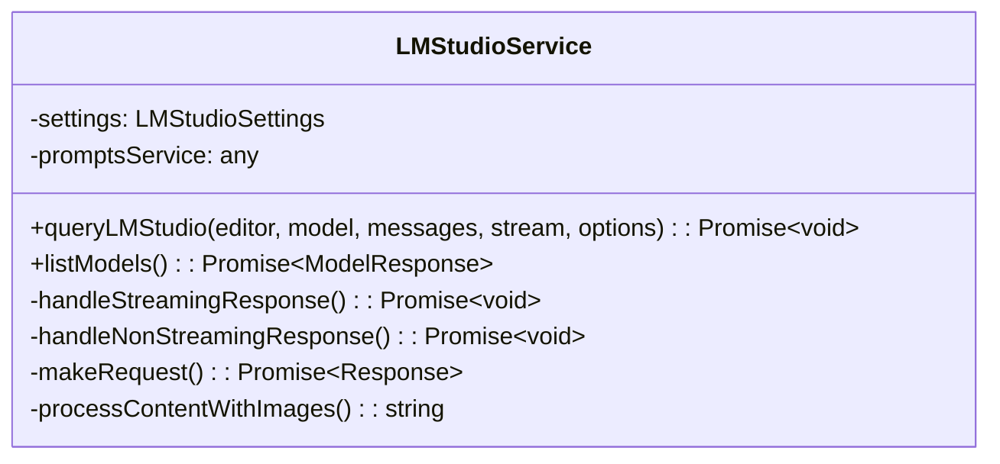
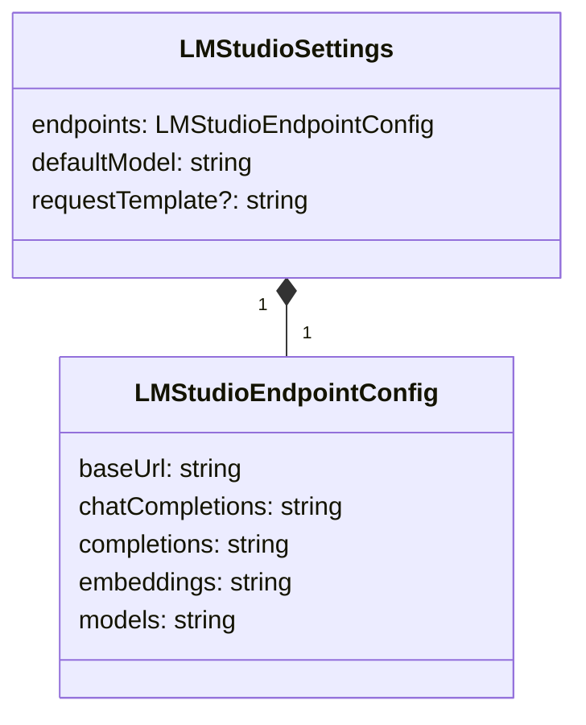
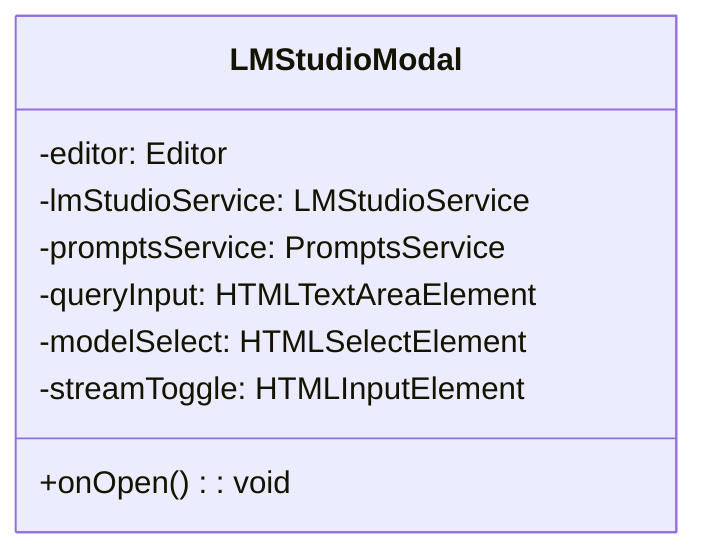
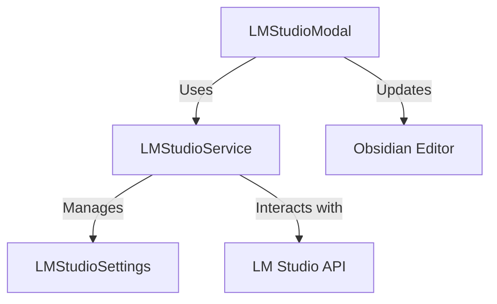
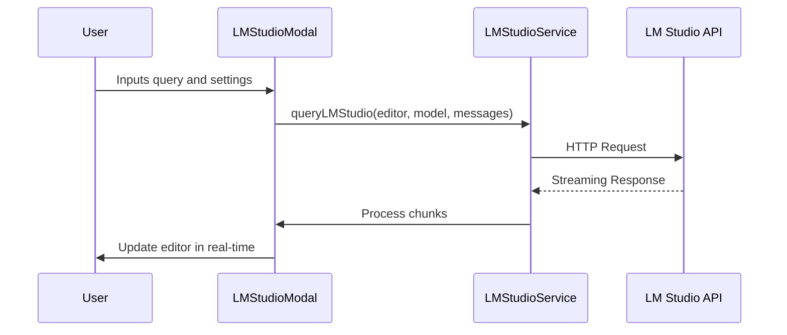

# Result


# Purpose

This specification outlines the requirements for maintaining a local LM Studio Obsidian Plugin. The plugin will allow users to connect to their local LM Studio instance from Obsidian, enabling them to access and manage their models, as well as to generate text using their models.

# Background

We have included the LM Studio API functionality with the Perplexed plugin, but the complexity of the Perplexed plugin has made it difficult to maintain. 

Given our recent success with dissecting the "Content Farm" functionality into smaller plugins, we believe that we can create a more maintainable and scalable plugin for LM Studio and let it stay indpendent of Perplexed.

## Analysis of LM Studio Functionality in Perplexed

### Core Components

#### 1. LMStudioService (`src/services/lmStudioService.ts`)
The main service class that handles all LM Studio API interactions.



**Key Features:**
- Manages API requests to a local LM Studio instance
- Supports both streaming and non-streaming responses
- Handles model listing and chat completions
- Processes responses with image placeholders
- Implements error handling and retry logic

**Notable Methods:**
- `queryLMStudio()`: Main method for sending queries to LM Studio
- `handleStreamingResponse()`: Processes streaming responses in real-time
- `listModels()`: Retrieves available models from the LM Studio instance
- `makeRequest()`: Generic method for making HTTP requests

#### 2. LMStudioSettings (`src/settings/LMStudioSettings.ts`)
Manages configuration for the LM Studio integration.



**Configuration Options:**
- Base URL configuration (default: `http://localhost:1234`)
- API endpoint paths (completions, chat, embeddings, models)
- Default model selection
- Request template customization

**UI Components:**
- Settings panel for configuring the LM Studio connection
- Input validation for API endpoints
- Test connection functionality

#### 3. LMStudioModal (`src/modals/LMStudioModal.ts`)
The user interface for interacting with LM Studio.



**Features:**
- Model selection dropdown
- System prompt configuration
- Temperature and max tokens settings
- Streaming toggle
- Image generation options

### Integration Points



1. **PerplexedPluginCore Integration**
   - LM Studio settings are loaded and saved alongside other plugin settings
   - The service is initialized with the plugin's configuration

2. **Editor Integration**
   - Responses are inserted directly into the active editor
   - Supports both streaming and block-based responses
   - Maintains proper cursor positioning during streaming

3. **Prompt Processing**
   - Handles system prompts and message history
   - Processes templates for request customization
   - Supports image placeholders in responses

### Technical Implementation



**API Communication:**
- Uses the Fetch API for HTTP requests
- Implements proper error handling and user feedback
- Supports streaming responses with chunked processing

**Response Handling:**
- Processes markdown responses
- Converts image placeholders to markdown images
- Handles both streaming and non-streaming modes

**State Management:**
- Manages connection state
- Tracks available models
- Maintains request/response history

### Strengths and Considerations

#### Strengths
- Clean separation of concerns between UI, service, and configuration
- Comprehensive error handling and user feedback
- Support for both streaming and non-streaming responses
- Extensible design for future features

#### Considerations
- The service is tightly coupled with the Obsidian editor
- Some error messages could be more user-friendly
- Limited model configuration options in the UI
- Image generation support appears to be a work in progress

### Recommendations for Extraction

1. **Create a Standalone Plugin**
   - Move LM Studio functionality to a dedicated Obsidian plugin
   - Maintain the same clean architecture with service, settings, and UI layers

2. **Enhance Configuration**
   - Add more model configuration options
   - Improve error handling for common connection issues
   - Add support for model presets

3. **Improve UI/UX**
   - Add a dedicated panel for LM Studio interactions
   - Implement conversation history
   - Add keyboard shortcuts for common actions

4. **Documentation**
   - Document the API requirements
   - Provide setup instructions for LM Studio
   - Include examples of request templates

This analysis provides a solid foundation for extracting and enhancing the LM Studio functionality as a standalone Obsidian plugin.

#### Important Functions

1. **`queryLMStudio(editor: Editor, model: string, messages: ChatMessage[], stream = true, options: LMStudioOptions = {}): Promise<void>`**
   Main method for sending queries to LM Studio.

   ```typescript
   async queryLMStudio(editor: Editor, model?: string, messages: ChatMessage[] = [], stream = true, options: LMStudioOptions = {}): Promise<void> {
       if (!editor) throw new Error('Editor instance is required');

       const cursor = editor.getCursor();
       const timestamp = new Date().toLocaleString();
       const modelToUse = model || this.settings.defaultModel || 'unknown-model';

       // Prepare and insert query header
       const processedQuery = messages.length > 0 
           ? messages.map(message => `> ${message.content}`).join('\n') 
           : '';
           
       const headerText = `\n\n***\n> [!info] **LM Studio Query** (${timestamp})\n> **Question:**\n${processedQuery}\n> **Model:** ${modelToUse}\n> \n> ### **Response from ${modelToUse}**:\n\n`;
       
       editor.replaceRange(headerText, cursor);
       const headerLines = headerText.split('\n');
       const lastLine = headerLines[headerLines.length - 1] || '';
       const responseCursor = {
           line: cursor.line + headerLines.length - 1,
           ch: lastLine.length
       };
       
       try {
           // Prepare messages with system prompt if provided
           const messagesToSend = [...messages];
           if (options.system_prompt) {
               messagesToSend.unshift({
                   role: 'system',
                   content: options.system_prompt
               });
           }
           
           // Build and send request
           const payload: Record<string, unknown> = {
               model: modelToUse,
               messages: messagesToSend,
               stream,
               temperature: options.temperature ?? 0.7,
               max_tokens: options.max_tokens ?? 2048,
               top_p: options.top_p ?? 0.9
           };
           
           const response = await this.makeRequest(
               this.settings.endpoints.chatCompletions,
               'POST',
               payload
           );
           
           // Handle response based on streaming preference
           if (stream) {
               await this.handleStreamingResponse(response, editor, responseCursor, options);
           } else {
               await this.handleNonStreamingResponse(response, editor, responseCursor, options);
           }
           
           // Add separator after response
           editor.replaceRange('\n\n---\n\n', editor.getCursor());
       } catch (error) {
           console.error('Error querying LM Studio:', error);
           const errorMessage = `Error: ${error instanceof Error ? error.message : String(error)}`;
           editor.replaceRange(`\n\n${errorMessage}\n\n`, editor.getCursor());
       }
   }
   ```

2. **`listModels(): Promise<{data: Array<{id: string}>, error?: string}>`**
   Retrieves available models from the LM Studio instance.

   ```typescript
   async listModels(): Promise<{data: Array<{id: string}>, error?: string}> {
       try {
           const response = await this.makeRequest(this.settings.endpoints.models, 'GET');
           return await response.json();
       } catch (error) {
           console.error('Error listing models:', error);
           throw error;
       }
   }
   ```

#### Important Components

1. **`LMStudioModal`**
   The user interface for interacting with LM Studio.

```typescript
class LMStudioModal extends Modal {
    private editor: Editor;
    private lmStudioService: LMStudioService;
    private promptsService: PromptsService;
    private queryInput: HTMLTextAreaElement;
    private modelSelect: HTMLSelectElement;
    private streamToggle: HTMLInputElement;

    // ... other fields and constructor

    onOpen() {
        const { contentEl } = this;
        contentEl.empty();

        // Model selection
        contentEl.createEl('h3', { text: 'Model Selection' });
        this.modelSelect = contentEl.createEl('select');
        this.populateModels();

        // Query input
        contentEl.createEl('h3', { text: 'Your Query' });
        this.queryInput = contentEl.createEl('textarea', {
            placeholder: 'Enter your query here...',
            attr: { rows: '4' },
            cls: 'lm-studio-query-input'
        });

        // Streaming toggle
        const toggleContainer = contentEl.createDiv('setting-item');
        toggleContainer.createDiv('setting-item-info')
            .createEl('label', { text: 'Stream Response' });
        this.streamToggle = toggleContainer.createEl('input', { type: 'checkbox' });
        this.streamToggle.checked = true;

        // Submit button
        const buttonContainer = contentEl.createDiv('modal-button-container');
        buttonContainer.createEl('button', {
            text: 'Send',
            cls: 'mod-cta',
            click: () => this.submitQuery()
        });
    }

    private async populateModels() {
        try {
            const { data: models } = await this.lmStudioService.listModels();
            models.forEach(model => {
                this.modelSelect.createEl('option', {
                    value: model.id,
                    text: model.id
                });
            });
        } catch (error) {
            console.error('Failed to load models:', error);
            new Notice('Failed to load models. Check console for details.');
        }
    }

    private async submitQuery() {
        const query = this.queryInput.value.trim();
        if (!query) return;

        const messages: ChatMessage[] = [{
            role: 'user',
            content: query
        }];

        try {
            await this.lmStudioService.queryLMStudio(
                this.editor,
                this.modelSelect.value,
                messages,
                this.streamToggle.checked,
                {
                    system_prompt: 'You are a helpful assistant.',
                    temperature: 0.7,
                    max_tokens: 2048,
                    return_images: true
                }
            );
        } catch (error) {
            console.error('Query failed:', error);
            new Notice(`Query failed: ${error instanceof Error ? error.message : 'Unknown error'}`);
        }
    }
}
```

2. **`LMStudioSettings`**
   Manages configuration for the LM Studio integration.

```typescript
interface LMStudioEndpointConfig {
    baseUrl: string;
    chatCompletions: string;
    completions: string;
    embeddings: string;
    models: string;
}

interface LMStudioSettings {
    endpoints: LMStudioEndpointConfig;
    defaultModel: string;
    requestTemplate?: string;
}

const DEFAULT_ENDPOINTS: LMStudioEndpointConfig = {
    baseUrl: 'http://localhost:1234/v1',
    chatCompletions: '/chat/completions',
    completions: '/completions',
    embeddings: '/embeddings',
    models: '/models'
};

class LMStudioSettingsTab extends PluginSettingTab {
    private plugin: LMStudioPlugin;

    constructor(app: App, plugin: LMStudioPlugin) {
        super(app, plugin);
        this.plugin = plugin;
    }

    display(): void {
        const { containerEl } = this;
        containerEl.empty();

        containerEl.createEl('h2', { text: 'LM Studio Settings' });

        // Base URL
        new Setting(containerEl)
            .setName('Base URL')
            .setDesc('Base URL for LM Studio API')
            .addText(text => text
                .setPlaceholder('http://localhost:1234/v1')
                .setValue(this.plugin.settings.endpoints.baseUrl)
                .onChange(async (value) => {
                    this.plugin.settings.endpoints.baseUrl = value.endsWith('/') 
                        ? value.slice(0, -1) 
                        : value;
                    await this.plugin.saveSettings();
                }));

        // Default Model
        new Setting(containerEl)
            .setName('Default Model')
            .setDesc('Default model to use for completions')
            .addText(text => text
                .setPlaceholder('model.gguf')
                .setValue(this.plugin.settings.defaultModel)
                .onChange(async (value) => {
                    this.plugin.settings.defaultModel = value;
                    await this.plugin.saveSettings();
                }));

        // Test Connection Button
        new Setting(containerEl)
            .setName('Test Connection')
            .setDesc('Verify connection to LM Studio')
            .addButton(button => button
                .setButtonText('Test')
                .onClick(async () => {
                    try {
                        await this.plugin.lmStudioService.listModels();
                        new Notice('✅ Connection successful!');
                    } catch (error) {
                        new Notice(`❌ Connection failed: ${error instanceof Error ? error.message : 'Unknown error'}`);
                    }
                }));
    }
}
```

```typescript

```
