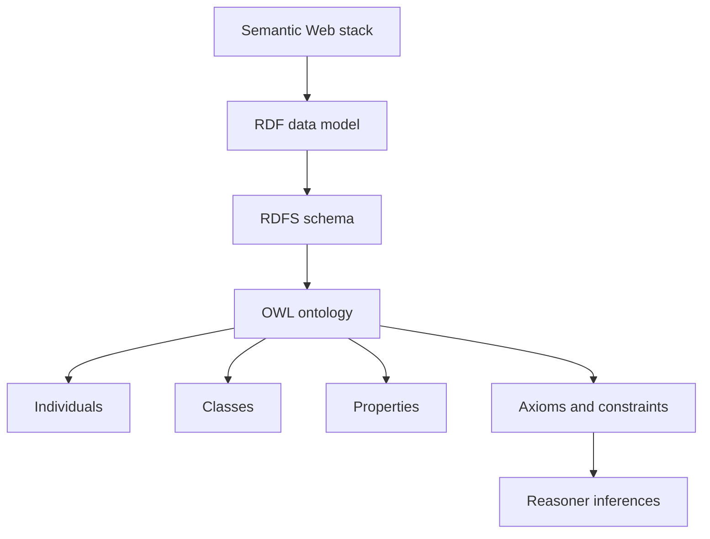

Web Ontology Language (OWL) is a semantic web language used to represent rich knowledge about things, groups of things, relations between things, and properties of those things within a domain. It's built on top of RDF (Resource Description Framework), which is another key technology for the [[Semantic Web]]. 

OWL adds more vocabulary than RDF to express complex constraints, enabling detailed descriptions and relationships among resources in ways that machines can process. This includes the ability to define classes, properties, and individuals, and to specify constraints or axioms about them. 

The impact of OWL on the pace of innovation is significant:

1. **Semantic Interoperability**: By providing a standard way to represent knowledge, OWL helps different systems understand each other better. This semantic interoperability allows for more effective data integration and sharing across diverse platforms and applications, fostering innovation by breaking down data silos.

2. **Reasoning Capabilities**: Unlike simpler [[projects/Emergent-Innovation/Standards/Resource Description Framework|RDF]], [[projects/Emergent-Innovation/Examples/Web Ontology Language|OWL]] supports complex [[concepts/Explainers for AI/AI Reasoning|AI Reasoning]] about the data it describes. This means that software can draw conclusions from the information provided, enabling smarter, more automated decision-making processes - a boon for AI and machine learning applications.

3. **Enhanced Search Capabilities**: By clearly defining relationships between entities, OWL facilitates more precise and powerful search queries. This could lead to better recommendations, improved data discovery, and more efficient information retrieval systems.

4. **Domain-specific Languages**: OWL allows for the creation of domain-specific ontologies - formal naming and definition of types, properties, and interrelationships of entities within a particular domain. These can serve as a common language for experts in that field, promoting collaboration and knowledge sharing.

As for its mainstream adoption: While OWL has been influential in the realm of semantic web technologies and AI, it hasn't achieved widespread "mainstream" use outside these fields. This is primarily due to its complexity - understanding and implementing OWL requires specialized knowledge and resources. 

However, elements of OWL are indirectly used more broadly through other technologies. For instance, [[projects/Emergent-Innovation/Examples/Schema.org|Schema.org]], a collaborative project by Google, Microsoft, Yahoo, and Yandex to enhance the web's semantic markup, uses [[projects/Emergent-Innovation/Standards/Resource Description Framework|RDF]], which is compatible with OWL. Furthermore, many big data and AI platforms incorporate or build upon semantic web principles, including OWL, even if they don't explicitly mention it. 

In conclusion, while not yet a household term like [[Tooling/Software Development/Programming Languages/HTML|HTML]] or [[projects/Emergent-Innovation/Standards/SQL|SQL]], Web Ontology Language has significantly influenced the pace of innovation in areas such as artificial intelligence, data science, and knowledge management. Its impact is more profound than its broad adoption might suggest.

[[organizations/DARPA|DARPA]]
[[Semantic Web]]
[[Vocabulary/Semantic HTML|Semantic HTML]]
[[concepts/Explainers for AI/Knowledge Graphs|Knowledge Graph]]
[[Vocabulary/Knowledge Bases|Knowledge Bases]]
[[concepts/Explainers for AI/Knowledge Base AI|Knowledge Base AI]]

https://www.w3.org/OWL/

# Defining and Describing Web Ontology Language

*_The Web Ontology Language (OWL) is how the Semantic Web says not just “what data is,” but “what that data means and implies.”_[^i9n4gt] [^1shj24]*

The **Web Ontology Language (OWL)** is a family of formal **knowledge representation languages** standardized by the W3C for authoring *ontologies*—machine-readable models of classes, properties, and individuals, together with logical constraints between them. [^i9n4gt] [^bc1rfh] [^0p1727] Ontologies in OWL are used to describe domain knowledge (for example, in biomedicine, engineering, or e‑commerce) in a way that automated reasoners can interpret to infer implicit facts from explicitly stated ones. [^i9n4gt] [^1shj24] [^su1n9d] OWL builds on RDF and RDFS but adds much richer vocabulary (e.g., class equivalence, disjointness, property characteristics, cardinalities) and is designed to support decidable logical reasoning under an *open world assumption*. [^i9n4gt] [^0z064n] [^1shj24] It matters because it underpins many semantic technologies, knowledge graphs, and domain ontologies where correctness, interoperability, and automated inference are critical. [^i9n4gt] [^1shj24] [^0p1727]

# Uses in Context

- OWL is described by W3C as a **“Web Ontology Language”** designed for **“representing rich and complex knowledge about things, groups of things, and relations between things”** on the Semantic Web. [^i9n4gt] [^bc1rfh]
- In knowledge graph engineering, OWL is cited as a core technology that **“plays a key role in modeling and representing complex domains with ontologies”** and supporting reasoning over them. [^0p1727] [^su1n9d]
- In building information modeling (BIM), the **ifcOWL** project explicitly uses OWL as **“a W3C standard for representing ontologies (formal, machine-readable models of concepts and relationships)”** to publish IFC building data on the web. [^bc1rfh]
- In teaching materials on ontologies and reasoning, OWL is used to formalize constraints such as **“Student ⊑ Person” (“Every student is a person”)** and then apply tableau-based reasoning to detect contradictions and derive entailments. [^su1n9d]
- In semantic web tutorials, OWL is introduced as a declarative language where **“an ontology is really just a formal precise description of some part of the world”**, using classes, properties, and individuals so **“a computer can finally understand what’s going on”** and infer new facts. [^1shj24]

# History of Use

## Origins

- OWL originated in early Semantic Web research as an evolution of earlier description-logic-based languages such as **SHOE**, **OIL**, and **DAML+OIL**, which were developed by academic and research groups in the late 1990s and early 2000s rather than large commercial vendors. [^i9n4gt] The W3C’s Web Ontology Working Group combined these efforts into a unified language that became **OWL 1**, standardized as a W3C Recommendation in 2004. [^i9n4gt]
- The foundational specification *“OWL Web Ontology Language Reference”* and related W3C documents formally introduced OWL as a web ontology standard, defining its abstract syntax, semantics, and exchange syntaxes in the context of the Semantic Web architecture. [^i9n4gt]

## Evolution

- **2004 – OWL 1 Recommendation:** W3C publishes the original OWL specification (often called OWL 1), defining three species—**OWL Lite**, **OWL DL**, and **OWL Full**—to balance expressivity and decidability for different use cases. [^i9n4gt]
- **2009 – OWL 2 Recommendation:** W3C upgrades the standard to **OWL 2 Web Ontology Language**, adding profiles **OWL 2 EL**, **OWL 2 QL**, and **OWL 2 RL** for scalable reasoning, plus richer modeling features such as property chains and keys; OWL 2 became a W3C Recommendation in 2009. [^i9n4gt] [^0z064n] [^1shj24] [^su1n9d]
- **2012 – OWL 2 Second Edition:** A **second edition** of the OWL 2 Recommendation was released in 2012, aligning it with RDF 1.1 and clarifying syntax and conformance aspects, while keeping the core semantics stable. [^0z064n]
- **2010s–2020s – Tooling & profiles in practice:** Over the 2010s and 2020s, OWL 2 profiles (EL/QL/RL) and reasoning techniques such as tableau algorithms became widely used in domains like biomedical ontologies and knowledge graphs, supported by mature tools and APIs in Java and, more recently, Python (e.g., OWLAPY). [^su1n9d] [^0p1727]

# Best Real-World Examples

- [SNOMED CT](https://www.snomed.org) – a large-scale clinical terminology whose logical core is expressed in a description logic compatible with OWL 2 EL, enabling powerful subsumption reasoning over hundreds of thousands of medical concepts. [^1shj24] [^su1n9d]
- [Gene Ontology](http://geneontology.org) – a widely used bioinformatics ontology whose OWL representation captures classes, relations, and axioms for gene product function, process, and location, supporting automated reasoning in tools and pipelines. [^i9n4gt]
- [Protégé](https://protege.stanford.edu) – an open-source ontology editor developed at Stanford that is one of the most widely used tools for authoring and maintaining OWL ontologies with integrated reasoner support. [^i9n4gt] [^su1n9d]
- [ifcOWL](https://technical.buildingsmart.org/standards/ifc/ifc-formats/ifcowl/) – an OWL-based representation of the Industry Foundation Classes (IFC) standard, allowing building information models to be published as web ontologies and interlinked with other datasets. [^bc1rfh]
- [OWLAPY](https://arxiv.org/html/2511.08232v1) – a Pythonic framework for OWL ontology engineering that exposes OWL 2 constructs and reasoning to Python developers, reflecting the spread of OWL beyond its original Java-centric tooling. [^0p1727]
- [DBpedia Ontology](https://www.dbpedia.org) – an ontology derived from Wikipedia infoboxes and modeled in OWL to provide typed classes and properties for DBpedia’s knowledge graph, enabling semantic querying and inference over web data. [^i9n4gt]

# Case Studies

## OWL 2 EL in Large-Scale Biomedical Ontologies

In biomedicine, ontology engineers use OWL 2 EL—a tractable OWL 2 profile—so that reasoners can classify very large terminologies like **SNOMED CT** and related clinical ontologies. [^1shj24] [^su1n9d] Teaching materials on OWL 2 highlight that profiles such as OWL 2 EL are tailored for **“handling complex categories”** and large taxonomies where polynomial-time reasoning is critical. [^1shj24] [^su1n9d] In practice, modelers encode axioms like subclass relationships, property chains, and existential restrictions, and then apply description-logic reasoners to compute inferred hierarchies and detect logical inconsistencies at scale. [^su1n9d] This case shows how OWL’s design—particularly its specialized profiles—directly enables industrial-strength reasoning over complex, safety-critical domains without relying on proprietary formats from large incumbents. [^1shj24] [^su1n9d]

## ifcOWL: Bringing Building Information Models to the Semantic Web

The **ifcOWL** initiative, driven by the buildingSMART community, maps the Industry Foundation Classes (IFC) schema into an OWL ontology so that building information models can be represented as linked data. [^bc1rfh] buildingSMART describes ifcOWL by first explaining that **“Web Ontology Language (OWL) is a W3C standard for representing ontologies (formal, machine-readable models of concepts and relationships)”**, and then using it to encode IFC concepts such as building elements, spaces, and relationships as OWL classes and properties. [^bc1rfh] This allows BIM data to be integrated with other web datasets, queried with SPARQL, and processed by generic OWL reasoners, rather than locking it into proprietary BIM tools. [^bc1rfh] The case illustrates how an industry consortium, not a big-tech platform, applied OWL to lift a domain-specific standard into the broader Semantic Web ecosystem, improving interoperability and long-term data accessibility. [^bc1rfh]

## OWLAPY: Opening OWL Ontology Engineering to Python Ecosystems

The **OWLAPY** project introduces a **“Pythonic framework for OWL ontology engineering”** to bridge the gap between OWL’s traditionally Java-centric tooling and the rapidly growing Python data and AI ecosystem. [^0p1727] Its authors emphasize that **“The Web Ontology Language (OWL) plays a key role in modeling and representing complex domains with ontologies”**, and present OWLAPY as a way to create, manipulate, and reason over OWL ontologies directly from Python code. [^0p1727] By wrapping OWL constructs and operations in idiomatic Python APIs, OWLAPY enables data scientists and AI practitioners—often working outside traditional semantic web communities—to incorporate ontological reasoning into their workflows. [^0p1727] This example shows how independent open-source efforts can expand OWL’s reach into new technical communities, reinforcing its role as a general-purpose knowledge representation standard beyond any particular vendor stack. [^0p1727]

***

# Sources

[^i9n4gt]: [Web Ontology Language - Wikipedia](https://en.wikipedia.org/wiki/Web_Ontology_Language)
[^0z064n]: [No, an ontology isn't 'just RDF' - Keet blog](https://keet.wordpress.com/2025/11/15/no-an-ontology-isnt-just-rdf/)
[^1shj24]: [Understanding OWL 2: The Semantic Web's Secret Weapon](https://www.youtube.com/watch?v=CWXiNNLuJow)
[^su1n9d]: [[PDF] IE650 Knowledge Graphs | Web Ontology Language (OWL) Part II](https://www.uni-mannheim.de/media/Einrichtungen/dws/Files_Teaching/Knowledge_Graphs/HWS2025/IE650_KG_09-OWL2.pdf)
[5]: [Ontological Modeling Language v2 - openCAESAR](https://www.opencaesar.io/oml)
[^bc1rfh]: [ifcOWL - buildingSMART Technical](https://technical.buildingsmart.org/standards/ifc/ifc-formats/ifcowl/)
[^0p1727]: [OWLAPY: A Pythonic Framework for OWL Ontology Engineering](https://arxiv.org/html/2511.08232v1)
