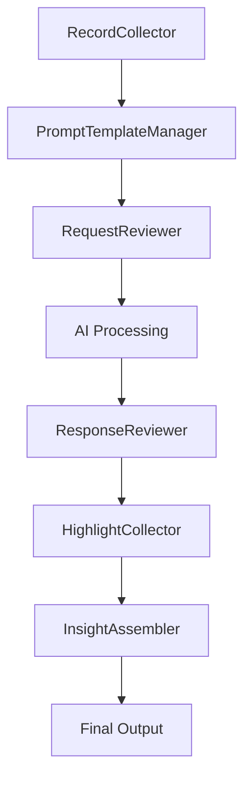

# Data Augmentation Workflow
## with Microfrontends

*A comprehensive specification for implementing distributed, scalable data processing*

---

## Executive Summary

This specification defines a **data augmentation workflow** implemented through a **microfrontend architecture** using module federation.

- Distributed processing of content
- Specialized applications for each stage
- AI-assisted content enhancement
- Independent development & deployment

---

## The Problem

### Traditional Monolithic Workflows

- 🔗 **Tight coupling** between processing stages
- 📈 **Difficult to scale** individual components
- 🚀 **Complex deployment** processes
- 👥 **Team collaboration** challenges

--

### Current Limitations

- Difficulty in independent deployment
- Challenges in team collaboration
- Limited extensibility for new capabilities
- Single points of failure

---

## Our Solution: Microfrontends

### Why Microfrontends?

- 🧩 **Modular architecture**
- 🔄 **Independent deployment**
- 📊 **Scalable components**
- 🤝 **Seamless integration**

--

### Key Benefits

- **Independent Development** - Teams work autonomously
- **Technology Flexibility** - Choose the right tool for each job
- **Fault Isolation** - Failures don't cascade
- **Scalable Teams** - Organize around business capabilities

---

## Architecture Overview

### Seven Specialized Applications

1. **RecordCollector** - Data collection & ingestion
2. **PromptTemplateManager** - AI prompt templates
3. **RequestReviewer** - Request validation
4. **ResponseReviewer** - Quality assurance
5. **HighlightCollector** - Key insights extraction
6. **InsightAssembler** - Final synthesis
7. **Additional Component** - *To be defined*

---

## Data Flow Architecture

---

## Component Deep Dive

### RecordCollector
- **Purpose**: Initial data collection and ingestion
- **Responsibilities**: Data validation, format standardization
- **Integration**: Feeds into PromptTemplateManager

--

### PromptTemplateManager
- **Purpose**: Template management for AI prompts
- **Responsibilities**: Template versioning, prompt optimization
- **Integration**: Provides templates to RequestReviewer

--

### RequestReviewer
- **Purpose**: Review and validation of processing requests
- **Responsibilities**: Quality gates, approval workflows
- **Integration**: Gates AI processing pipeline

--

### ResponseReviewer
- **Purpose**: Quality assurance for AI-generated responses
- **Responsibilities**: Content validation, quality scoring
- **Integration**: Feeds validated content to HighlightCollector

--

### HighlightCollector
- **Purpose**: Extraction and collection of key insights
- **Responsibilities**: Pattern recognition, insight extraction
- **Integration**: Provides insights to InsightAssembler

--

### InsightAssembler
- **Purpose**: Final assembly and synthesis of processed data
- **Responsibilities**: Content synthesis, final formatting
- **Integration**: Produces final output

---

## Technical Implementation

### Module Federation Architecture

- **Independent Deployment** - Each app deploys separately
- **Shared Dependencies** - Managed through module federation
- **Common Components** - Shared UI library
- **Event-Driven Communication** - Loose coupling between apps

--

### Docker & Monorepo Integration

- **Containerized Development** - Consistent environments
- **Monorepo Structure** - Unified codebase management
- **Unified Build Process** - Single Dockerfile
- **Environment Isolation** - Independent testing

---

## API Specifications

### Communication Patterns

- **RESTful APIs** - Inter-service communication
- **GraphQL Endpoints** - Complex data queries
- **WebSocket Connections** - Real-time status updates
- **Standardized Schemas** - Consistent data formats

--

### Error Handling Strategy

- **Graceful Degradation** - Service unavailability handling
- **Retry Mechanisms** - Failed processing recovery
- **Comprehensive Logging** - Error tracking & debugging
- **Rollback Capabilities** - Failed augmentation recovery

---

## Implementation Roadmap

### Phase 1: Core Infrastructure
- Docker development environment setup
- Module federation framework configuration
- Base microfrontend shell implementation
- Shared component library creation

--

### Phase 2: Individual Applications
- Develop each microfrontend application
- Implement data processing logic
- Create user interfaces
- Establish testing frameworks

--

### Phase 3: Integration & Optimization
- End-to-end workflow testing
- Performance optimization
- User experience refinement
- Documentation and training

---

## Dependencies & Requirements

### Technical Stack
- **Module Federation** - Webpack 5+
- **Containerization** - Docker platform
- **Package Management** - pnpm workspace
- **Version Control** - Git submodule support
- **UI Components** - Shared component library

--

### Testing Strategy
- **Unit Tests** - Individual microfrontend logic
- **Integration Tests** - Inter-service communication
- **End-to-End Tests** - Complete workflow validation
- **Performance Tests** - Load and stress testing

---

## Alternatives Considered

### Monolithic Architecture
- ✅ **Pros**: Simpler deployment, easier debugging
- ❌ **Cons**: Difficult to scale, tight coupling
- 🚫 **Decision**: Rejected due to scalability concerns

--

### Microservices with Traditional Frontend
- ✅ **Pros**: Backend scalability, clear boundaries
- ❌ **Cons**: Frontend remains monolithic
- 🚫 **Decision**: Rejected for full microfrontend approach

---

## Open Questions

### Technical Considerations
- Specific AI service integration patterns
- Data persistence strategy across microfrontends
- User authentication and authorization
- Performance monitoring implementation

--

### Operational Considerations
- Deployment orchestration design
- CI/CD pipeline architecture
- Container registry strategy
- Orchestration approach (Docker Compose vs Kubernetes)

---

## Key Takeaways

### Success Factors
- **Modular Design** - Independent, focused components
- **Clear Boundaries** - Well-defined interfaces
- **Shared Standards** - Common data schemas
- **Robust Testing** - Comprehensive validation

--

### Next Steps
- Begin Phase 1 infrastructure setup
- Define detailed API specifications
- Establish development team structure
- Create proof-of-concept implementation

---

## Questions & Discussion

### Let's Discuss
- Implementation priorities
- Technical challenges
- Team organization
- Timeline considerations

**Thank you for your attention!**

---

## Appendix

### Glossary
- **Microfrontend**: Independently deployable frontend application
- **Module Federation**: Webpack feature for code sharing
- **Data Augmentation**: Process of enhancing existing data

--

### References
- [Micro Frontends Architecture](https://micro-frontends.org/)
- [Webpack Module Federation Documentation](https://webpack.js.org/concepts/module-federation/)
- Individual application specifications

--

### Revision History
- v0.0.0.1 (2025-07-24): Initial draft
- v0.0.0.1 (2025-08-09): Applied specification template
- Current: Presentation format adaptation