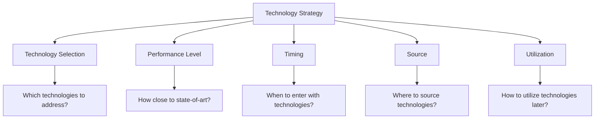
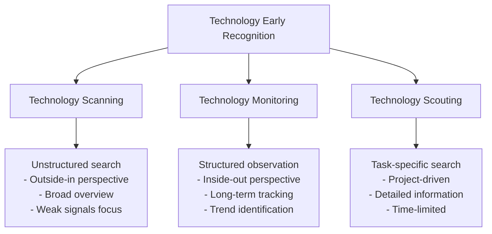
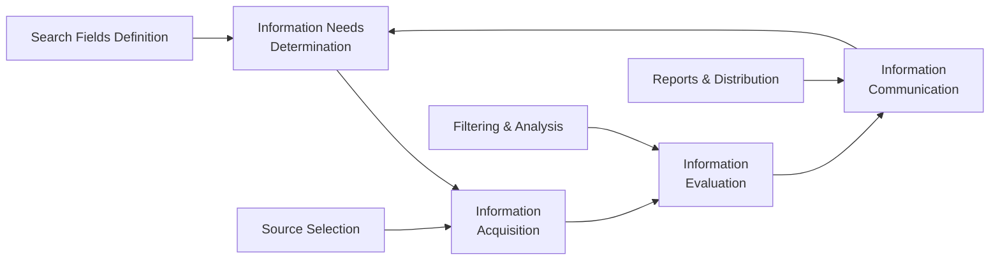
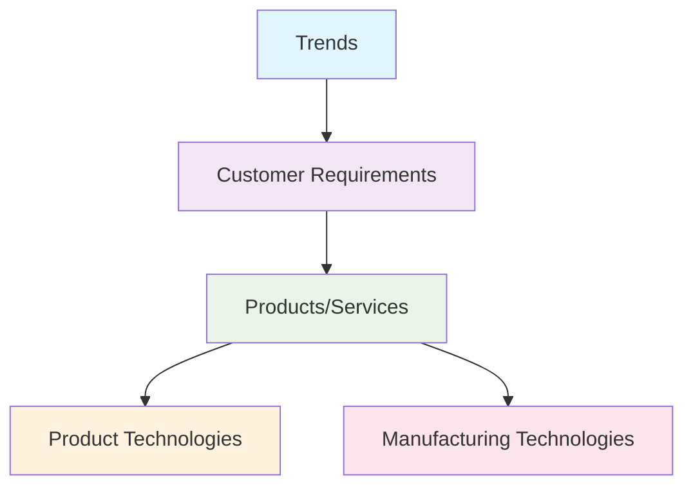
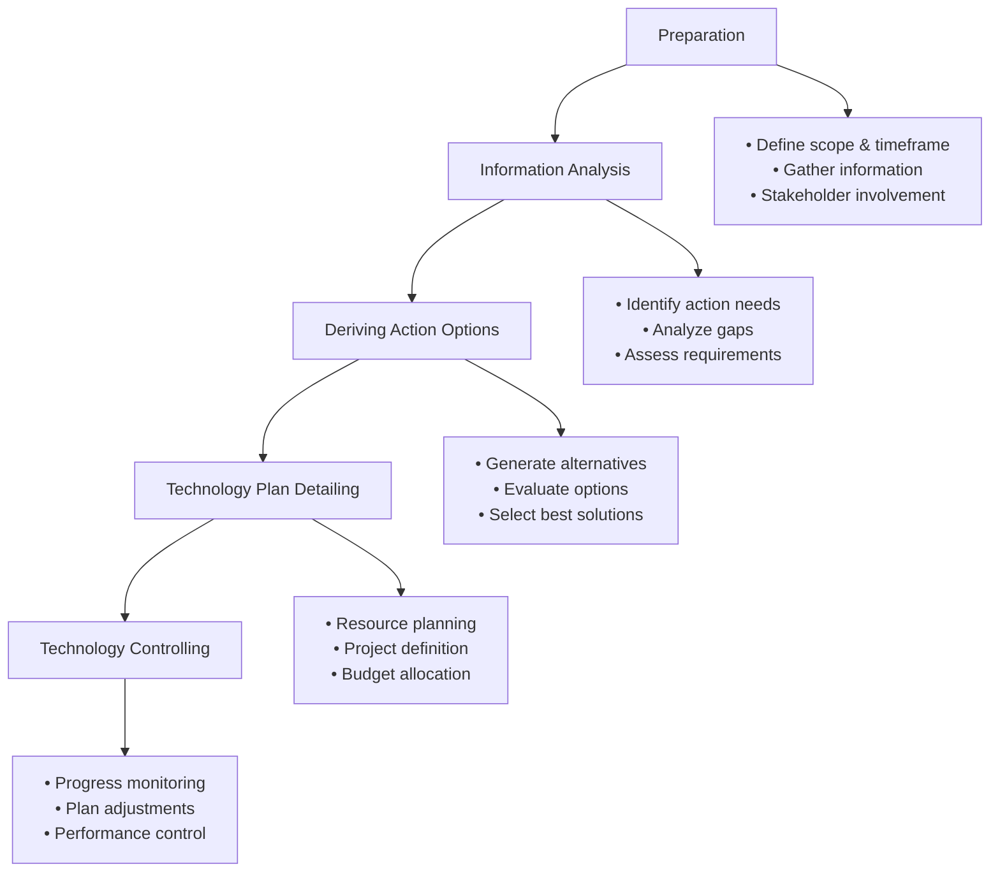
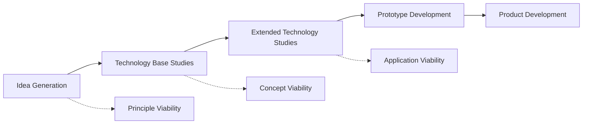
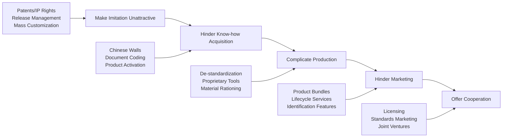
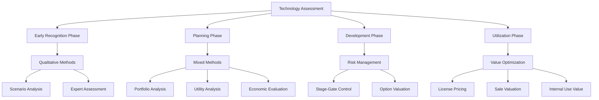

## Chapter 1: The Framework for Production and Management

This chapter introduces a comprehensive framework derived from the St. Gallen Management Model, adapted specifically for manufacturing companies. The framework structures three main dimensions: internal business aspects (company structure, development, and processes), stakeholder groups (customers, employees, suppliers, competitors, etc.), and environmental spheres (society, nature, technology, economy, norms and values). The company structure encompasses organizational design, resources, information systems, and culture. Company development includes strategy, development modes, and finance/controlling. The business processes cover technology-oriented and business processes that transform inputs into outputs. The framework emphasizes that companies exist to create value for stakeholders through interactions, while being influenced by broader environmental factors. This systematic approach helps understand the complex relationships within manufacturing enterprises and provides a foundation for the subsequent technology management concepts.

## Chapter 2: Introduction and Delineation

This chapter establishes technology management as a strategic planning function focused on long-term market positioning through targeted changes in technology, products, or production processes. Technology management aims to provide required technologies (product, production, and material technologies) at the right time and appropriate costs to secure competitive advantages. The chapter differentiates technology management from related disciplines: while technology management focuses on technological capabilities, innovation management centers on concrete products. R&D management represents the intersection between technology and innovation management. Technology management encompasses acquisition, storage, and utilization of technological knowledge, whether developed internally or acquired externally. The authors emphasize that technology management is not necessarily a specialized organizational unit but rather a cross-functional responsibility distributed throughout technology-intensive companies. The chapter addresses the increasing importance of systematic technology management as technical progress accelerates and product lifecycles shorten.

## Chapter 3: Technology Management Framework

This chapter develops a detailed framework specifically for technology management as part of the broader production and management system. The framework identifies relevant stakeholder groups including external parties (competitors, suppliers, customers, government, public) and internal functions (R&D, production, purchasing, management, marketing, sales, personnel, service, logistics, finance). The core technology management processes include: technology intelligence (early identification of technological developments), technology planning (operationalizing technology strategy), technology development (implementing planned technologies), technology utilization (internal and external technology exploitation), technology protection (safeguarding technological knowledge), and technology assessment (evaluating technologies throughout all phases). The chapter extensively discusses organizational anchoring options, from implicit integration across departments to explicit forms like committees, project organizations, staff functions, line integration, centers, or external service providers. A case study from the automotive industry illustrates matrix organization along production areas and technology fields. The framework emphasizes technology strategy as the central element of business development.

## Chapter 4: Fundamentals of Technology Management

This chapter establishes the conceptual foundation of technology management by exploring:

**Technology vs. Technique**: The chapter distinguishes between technology (knowledge, skills, and capabilities for solving technical problems) and technique (the materialization/application of technology). It adopts an integrative understanding where technique is viewed as a subsystem of technology.

**Technology Classification Systems**: Technologies can be categorized by:

- Application area/function (product, production, material technologies)
- Interdependencies (individual vs. system technologies, complementary vs. competing technologies)
- Application breadth across industries (cross-cutting vs. specialized technologies)
- Internal application scope and competitive potential (core competence vs. peripheral technologies)
- Product relationship (core vs. supporting technologies)
- Lifecycle phase (pacemaker, key, basic, displaced technologies)

**Technology Lifecycle Models**: Several models are examined:

- Ford and Ryan's 6-phase model tracking technology diffusion over time
- Ansoff's model distinguishing stable, dynamic, and turbulent technology development
- Gartner's Hype Cycle showing expectations vs. time
- McKinsey's S-curve concept relating performance to cumulative R&D investment
- Arthur D. Little's lifecycle classification system

**Technology Diffusion**: The chapter explores how technologies spread through markets, covering adoption theory and the factors influencing technology acceptance (relative advantage, compatibility, complexity, trialability, observability).

## Chapter 5: Technology Strategy

This chapter focuses on developing and implementing technology strategies:

**Strategic Foundations**: Technology strategy is grounded in resource-based theory and core competence approaches, emphasizing inside-out perspective for technology-oriented companies.

**Five Key Dimensions of Technology Strategy**:

1. **Technology Selection**: Which technologies to pursue
2. **Technological Performance Level**: Leadership vs. presence strategies
3. **Technology Timing**: Pioneer vs. follower approaches
4. **Technology Source**: Internal development vs. external acquisition (make-or-buy)
5. **Technology Utilization**: Internal use vs. external commercialization (keep-or-sell)

**Strategic Context**: Technology strategies must align with corporate, business unit, competitive, and functional strategies. The chapter emphasizes the interconnected nature of these strategic levels.

**Development Process**: A five-step process for developing technology strategy:

1. Internal analysis of technology base
2. External analysis of technology environment
3. Technology field differentiation
4. Strategy formulation across dimensions
5. Consistency checking

### Key Diagrams

#### Technology Classification Criteria:

```
Technology Classification Dimensions
├── Application Area/Function
│   ├── Product Technologies
│   ├── Production Technologies
│   └── Material Technologies
├── Interdependencies
│   ├── Individual vs. System Technologies
│   └── Complementary vs. Competing Technologies
├── Industry Application Breadth
│   ├── Cross-cutting Technologies
│   └── Specialized Technologies
├── Internal Application Scope
│   ├── Core Competence Technologies
│   └── Peripheral Technologies
├── Product Relationship
│   ├── Core Technologies
│   └── Supporting Technologies
└── Lifecycle Phase
    ├── Pacemaker Technologies
    ├── Key Technologies
    ├── Basic Technologies
    └── Displaced Technologies
```

#### Technology Strategy Dimensions:

mermaid



#### S-Curve Technology Development:

```
Performance
    ^
    |     Substitution Technology
    |    /
    |   /
    |  /    Lock-in
    | /____/
    |/     \
    |       \_ Lock-out
    |         \
    |          \_ Mature Technology
    |___________________________>
                Cumulative R&D Investment
```

The chapters emphasize that effective technology management requires systematic approaches to both understanding technology dynamics and developing coherent strategies that align with broader business objectives.

## Chapter 6: Technology Early Recognition

### Core Definition & Purpose

Technology early recognition is a systematic process for identifying relevant information about changes in a company's technological environment to detect potential opportunities and risks early. It serves as a link between strategy formulation and technology planning by creating a transparent information base for strategic technology decisions.

### Key Challenges

- **Information explosion**: Global knowledge doubles every 5-7 years (some sources say 20 months)
- **Increased mobility** of experts and internet access
- **Growing integration** of technological systems across industries
- **Multidisciplinary development** requiring high transfer capabilities

### Core Activities (Three Perspectives)



### The Early Recognition Process



### Information Sources Classification

**By Type:**

- **Artifacts**: Documents, databases, publications
- **Individuals**: Experts, consultants, researchers
- **Institutions**: Companies, universities, research centers

**By Access:**

- **Internal sources**: Company employees, databases
- **External sources**: Publications, patents, conferences
- **Cooperative sources**: Joint ventures, partnerships

### Key Methods

- **Lead User Analysis**: Identifying innovative customers
- **Patent/Publication Analysis**: Tracking research intensity
- **Scenario Techniques**: Exploring multiple futures
- **Expert Surveys**: Gathering specialist knowledge

## Chapter 7: Technology Planning

### Definition & Scope

Technology planning operationalizes technology strategy by determining which technologies should be used when, for what purpose, and how they should be acquired. It creates concrete, implementable guidelines for technology development and deployment.

### Seven Core Tasks

```ascii
┌─────────────────────────────────────────────────────────────┐
│                    TECHNOLOGY PLANNING TASKS               │
├─────────────────────────────────────────────────────────────┤
│ 1. Technology Selection                                     │
│ 2. Determining Technology Performance Capability           │
│ 3. Defining Technology Application Timeframe               │
│ 4. Establishing Technology Sources                         │
│ 5. Synchronizing Product & Technology Planning             │
│ 6. Economic Evaluation of Technologies                     │
│ 7. Project Planning & Resource Allocation                  │
└─────────────────────────────────────────────────────────────┘
```

### Planning Levels (Five-Layer Cascade)



### Technology Planning Process



### Technology Roadmapping Method

**Core Elements:**

- **Time axis**: Planning horizon
- **Multiple levels**: Market, product, technology
- **Objects**: Represented as bars
- **Linkages**: Connections between levels

**Success Factors:**

1. Clear goal definition
2. Company-specific customization
3. Creating commitment and binding agreements
4. Methodical process support
5. Interdisciplinary collaboration
6. Allowing uncertainty and thinking in alternatives

### Key Differences Between Chapter 6 and 7

|Aspect|Technology Early Recognition|Technology Planning|
|---|---|---|
|**Focus**|Information gathering & analysis|Decision making & implementation|
|**Timeframe**|Continuous monitoring|Periodic planning cycles|
|**Output**|Technology intelligence|Technology roadmaps & plans|
|**Uncertainty**|High (exploring unknowns)|Medium (structured decisions)|
|**Methods**|Scanning, monitoring, scouting|Roadmapping, portfolio analysis|

I'll summarize these two chapters on technology development and technology commercialization from what appears to be a German technology management textbook.

## Chapter 8: Technologieentwicklung (Technology Development)

This chapter outlines the systematic process of developing technologies from initial ideas to application-ready solutions that can be transferred to product development.

### Key Concepts:

**Technology Development Process** - A structured multi-phase approach:

1. **Idea Generation** - Initial concepts from various sources
2. **Technology Base Studies** - Theoretical analysis of feasibility
3. **Extended Technology Studies** - Practical testing and validation
4. **Prototype Development** - Creating functional demonstrations

**Milestones** mark the transition between phases:

- Principle viability
- Concept viability
- Application viability

### Technology Development Process Flow:



### Key Distinctions:

**Technology vs. Product Development:**

- Technology Development: Focuses on effectiveness, customer benefit, creativity, innovation
- Product Development: Focuses on quality, cost, time

The chapter emphasizes that technology development should be decoupled from product development when technical uncertainty is high, allowing for higher-risk, more radical innovations.

## Chapter 9: Technologieverwertung (Technology Commercialization)

This chapter covers strategies for maximizing the economic value of technologies through various internal and external commercialization approaches.

### Internal Technology Commercialization:

**Technology-based Diversification:**

- Leveraging core technologies across multiple products/markets
- Building on resource and core competency theory

**Technology Platforms:**

- Networks of technologies, resources, and capabilities
- Enable "technology leveraging" across multiple applications
- Provide sustainable competitive advantages

### External Technology Commercialization:

**Three Main Categories:**

1. **Collaborative Use:**
    
    - R&D Cooperations
    - Strategic Alliances
    - Joint Ventures
2. **Licensing:**
    
    - Patent licensing
    - Know-how licensing
    - Mixed forms (patent + know-how + trademark)
3. **Technology Sales:**
    
    - Direct technology sales
    - Sale of business units
    - Spin-offs

### Technology Commercialization Overview:

```
Internal Technology Commercialization:
├── Use in existing products/markets
├── Use in new products/markets
│   ├── Technology-based diversification
│   └── Technology platforms

External Technology Commercialization:
├── Collaborative Use
│   ├── R&D Cooperations
│   ├── Strategic Alliances
│   └── Joint Ventures
├── Licensing
│   ├── Patent licensing
│   ├── Know-how licensing
│   └── Technology sales
└── Technology Sales
    ├── Technology sales
    ├── Sale of business units
    └── Spin-offs
```

### Decision Factors for External Commercialization:

The choice depends on:

- **Technology performance level** (high vs. normal performance)
- **Technology source** (own R&D, licensing, cooperation, acquisition)
- **Innovation timing** (pioneer, early follower, late follower)
- **Technology lifecycle stage** (development, growth, maturity, decline)

### Technology Marketing:

The chapter concludes with technology marketing challenges:

- **Knowledge gap** between suppliers and customers
- **Trust building** difficulties with new technologies
- **Market positioning** and timing challenges

### Technology Marketing Dilemma:

```
Knowledge/Trust over Time:
                    
Supplier Knowledge  ╲
(Technology Viability) ╲
                       ╲
                        ╲___
                            ╲___
                  ___---‾‾‾     ╲___
            ___---‾‾‾              ╲
      ___---‾‾‾                     ╲
___---‾‾‾ Customer Trust              ╲
        (Willingness to Pay)           ╲

Market Entry ────────────────────→ Market Exit
            Time
```

### Critical Success Factors:

Both chapters emphasize the importance of:

- Systematic processes with clear milestones
- Cross-functional integration
- Strategic alignment with business objectives
- Risk management through portfolio approaches
- Effective knowledge transfer mechanisms

The text provides a comprehensive framework for managing technology from development through commercialization, recognizing that successful technology management requires both technical excellence and strategic market positioning.

## Chapter 10 Technology Protection.

**Technology Protection (Technologieschutz)** addresses the growing challenge of product imitation and piracy that threatens innovative companies' ability to recoup R&D investments. The chapter provides systematic approaches for companies to protect their innovations through sophisticated protection mechanisms.

### Key Takeaways

#### 1. **The Problem Scale**

- 5-7% of global trade involves counterfeit products
- This figure has grown >100% in the past decade
- Companies can lose >5% of revenue to product piracy
- Quality of imitations is improving dramatically

#### 2. **Types of Imitations**

- **Counterfeits (Fälschungen)**: Products falsely claiming another's origin
- **Plagiarism (Plagiate)**: Using others' intellectual property as one's own
- **Slavish copies**: Exact detail-for-detail reproductions
- **Concept copies**: "Me-too" products copying core ideas

#### 3. **Customer Scenarios**

Three scenarios based on customer ability to differentiate and preferences:

- **Scenario 1**: Can differentiate, willing to buy imitations for better value
- **Scenario 2**: Can differentiate, exclusively prefers originals
- **Scenario 3**: Cannot differentiate between original and imitation

#### 4. **Five-Stage Protection Framework**



#### 5. **Protection Strategies by Category**

**Making Imitation Unattractive:**

- Industrial property rights (patents, utility models, design rights)
- Release management (rapid product cycles)
- Product differentiation
- Fixed-cost intensive production methods

**Hindering Know-how Acquisition:**

- Chinese Walls (information barriers)
- Document codification
- Product activation systems
- Self-destruction mechanisms
- Black boxes (functional and fake)

**Complicating Production:**

- De-standardization of components
- Increasing power density requirements
- In-house development of production equipment
- Raw material rationing

**Hindering Marketing:**

- Product bundling
- Extended lifecycle services
- Product identification features

**Cooperation Offers:**

- Licensing intellectual property
- Standard marketing
- Direct cooperation/joint ventures

#### 6. **Risk Assessment Framework**

The chapter provides a systematic approach to evaluate imitation risk based on:

- Cost position analysis
- Imitator type profiling
- Market, product, and process characteristics

#### 7. **Cost Advantage Analysis**

```ascii
Original Manufacturer Costs    |    Imitator Costs
─────────────────────────     |    ──────────────
Development Costs             |    Adaptation Costs (much lower)
Material Costs                |    Material Costs (similar/lower)
Production Costs              |    Production Costs (often lower)
Marketing/Sales Costs         |    Marketing/Sales Costs (minimal)
Logistics Costs              |    Logistics Costs (lower)
Warranty/Liability Costs     |    Warranty/Liability Costs (none)
```

### Critical Assessment

**Strengths:**

- Comprehensive, systematic approach
- Practical categorization of protection methods
- Recognizes that traditional IP protection alone is insufficient
- Includes economic analysis framework

**Limitations:**

- Some protection methods may increase costs significantly
- Effectiveness varies greatly by industry and market
- May require substantial organizational changes
- Some methods could negatively impact customer experience

**Practical Considerations:**

- Companies need to balance protection costs against potential losses
- Multiple protection layers often more effective than single measures
- Industry-specific adaptation of methods required
- Regular updating needed as imitators adapt

This framework provides a valuable starting point for companies facing imitation threats, though implementation requires careful consideration of specific circumstances and cost-benefit analysis.

## Chapter 11: Technology Assessment (Technologiebewertung) 

### Overview

This chapter presents a comprehensive framework for technology assessment - the systematic evaluation of technologies across different phases of technology management to support strategic decision-making.

### Key Definitions and Concepts

**Technology Assessment** is defined as the evaluation of technologies against various criteria in different decision contexts to determine fulfillment of target states and support technology development, implementation, and utilization decisions.

The chapter distinguishes between:

- **Technology Assessment (Technologiebewertung)**: Internal company evaluation for management decisions
- **Technology Impact Assessment (Technologiefolgenabschätzung)**: Analysis of broader societal effects

### Core Framework: Technology Management Process Phases

Technology assessment occurs across four main phases:

#### 1. Technology Early Recognition (Technologiefrüherkennung)

- **Focus**: Identifying weak signals and emerging technologies
- **Characteristics**: High uncertainty, incomplete information, qualitative assessment
- **Methods**: Primarily qualitative (scenario techniques, Delphi method, expert assessments)
- **Key Challenge**: Evaluating technologies in early development stages

#### 2. Technology Planning (Technologieplanung)

- **Focus**: Strategic technology selection and investment decisions
- **Characteristics**: Multi-dimensional decisions, economic evaluation emphasis
- **Methods**: Mix of qualitative and quantitative (portfolio analysis, utility value analysis)
- **Key Challenge**: Determining economic value and competitive advantage

#### 3. Technology Development (Technologieentwicklung)

- **Focus**: Stage-gate project control and continuation decisions
- **Characteristics**: Risk management, flexibility options
- **Methods**: Qualitative discussion, decision tree analysis, real options
- **Key Challenge**: Managing uncertainty while maintaining innovation potential

#### 4. Technology Utilization (Technologieverwertung)

- **Focus**: Internal vs. external exploitation decisions
- **Characteristics**: Value maximization through licensing, selling, or internal use
- **Methods**: Quantitative financial methods, licensing valuation
- **Key Challenge**: Optimizing technology commercialization strategy

### Assessment Method Categories

#### Qualitative Methods

1. **Argument Balance (Argumentenbilanz)**
    
    - Simple pro/con listing
    - Suitable when monetary evaluation impossible
2. **Checklists**
    
    - Systematic criteria evaluation
    - Flexible and adaptable to specific situations
3. **Utility Value Analysis (Nutzwertanalyse)**
    
    - Multi-criteria evaluation with weighting
    - Quantifies subjective expert assessments
4. **Portfolio Approaches**
    
    - Visual technology positioning
    - Multiple portfolio variants (Arthur D. Little, Pfeiffer, McKinsey, etc.)

#### Quantitative Methods

1. **Machine Hour Rate Calculation**
    
    - Production cost evaluation
    - Detailed cost allocation for manufacturing technologies
2. **Amortization Analysis**
    
    - Payback period calculation
    - Risk assessment tool
3. **Total Cost of Ownership (TCO)**
    
    - Lifecycle cost analysis
    - Make-or-buy decision support
4. **Capital Value Method**
    
    - Net present value calculation
    - Standard investment evaluation
5. **Break-Even Analysis**
    
    - Critical volume determination
    - Profitability threshold identification
6. **Decision Tree Analysis**
    
    - Sequential decision modeling
    - Flexibility and options consideration
7. **Real Options Approach**
    
    - Advanced flexibility valuation
    - Risk-adjusted option pricing

### Key Assessment Framework Diagram



### Technology Portfolio Matrix (Arthur D. Little Model)

```
Technology Lifecycle Stage
     |
     |  Emergence    Growth    Maturity
-----+--------------------------------
Strong |    [A]        [B]        [C]
Position|              
     |
Medium |    [D]        [E]        [F]
Position|
     |
Weak   |    [G]        [H]        [I]
Position|
```

Strategic recommendations:

- A,B: Leadership/Presence
- C: Focus/Rationalization
- D,E: Selective Investment
- F,G,H,I: Cooperation/Withdrawal

### Critical Success Factors

1. **Method Selection**: Choose appropriate methods for specific decision contexts
2. **Understanding Logic**: Deep comprehension of underlying evaluation principles
3. **Balanced Approach**: Combine quantitative precision with qualitative insights
4. **Stakeholder Involvement**: Include relevant experts and decision-makers
5. **Uncertainty Management**: Acknowledge and address information limitations

### Key Recommendations

- **Early Phases**: Emphasize qualitative methods due to high uncertainty
- **Later Phases**: Apply quantitative financial methods for investment decisions
- **Integrated Approach**: Use multiple complementary methods rather than single techniques
- **Continuous Assessment**: Regular re-evaluation as information improves
- **Quality Focus**: Prioritize qualified discourse over reductionist metrics

The chapter emphasizes that technology assessment should enable informed decision-making rather than provide false precision through oversimplified numerical indicators. The goal is structured information processing that supports strategic technology management across all phases of the technology lifecycle.