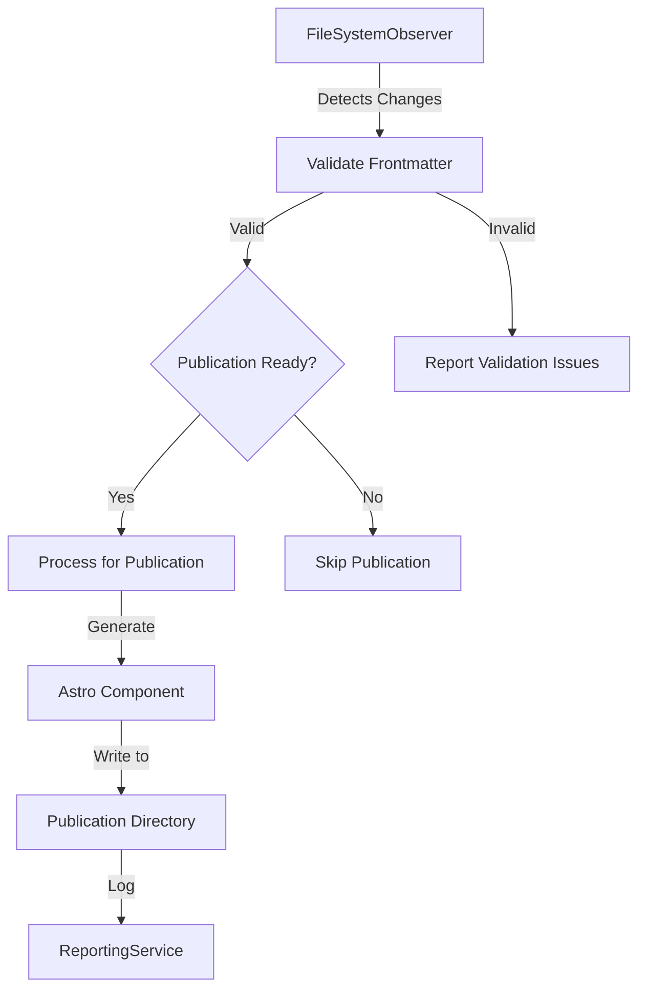

# Robust Standard Publication Pipeline

## Overview

This specification outlines the design and implementation of a standardized publication pipeline for the lossless-monorepo project. The pipeline will transform content from source directories (`content/lost-in-public/prompts` and `content/specs`) into web-ready Astro components for the public website, ensuring consistent formatting, metadata, and organization.

## Objectives

1. Automate the conversion of Markdown content to Astro components
2. Implement content-type specific validation and publication criteria
3. Maintain relationships between source files and published files
4. Provide comprehensive reporting on publication status and issues
5. Ensure content security through appropriate validation checks

## System Architecture



## Technical Specifications

### 1. Publication Readiness Criteria

Different content types have different criteria for determining publication readiness:

| Content Type | Publication-Ready Status Values |
|-------------|----------------------------------|
| Prompts     | "Implemented", "Published"       |
| Specifications | "Approved", "Implemented"     |

### 2. Directory Structure

The publication pipeline will maintain a clear separation between source and published content:

```
/content/
  /lost-in-public/
    /prompts/
      /category1/
        file1.md
        file2.md
  /specs/
    file1.md
    file2.md

/site/public/
  /prompts/
    file1.astro
    file2.astro
  /specs/
    file1.astro
    file2.astro
```

### 3. Astro Component Generation

The pipeline will generate Astro components with appropriate layouts based on content type:

```typescript
// For prompts
const layoutComponent = 'PromptLayout';

// For specifications
const layoutComponent = 'SpecificationLayout';

const astroContent = `---
// Generated from ${filePath}
// Publication date: ${new Date().toISOString()}
layout: '@layouts/${layoutComponent}.astro'
title: ${JSON.stringify(frontmatter.title)}
lede: ${JSON.stringify(frontmatter.lede || '')}
date: ${JSON.stringify(frontmatter.date_modified || frontmatter.date_created)}
tags: ${JSON.stringify(frontmatter.tags || [])}
site_uuid: ${JSON.stringify(frontmatter.site_uuid)}
---

${content}
`;
```

### 4. Required Metadata

All published content must include the following metadata:

- `title`: The main title of the content
- `lede`: A brief description or summary
- `date`: The last modification date or creation date
- `tags`: Categorization tags for filtering and discovery
- `site_uuid`: Unique identifier for the resource on the website

### 5. Publication Process

The publication process will be implemented as a method in the FileSystemObserver class:

```typescript
async processFileForPublication(filePath: string, frontmatter: any, content: string) {
  // Only process prompts and specifications
  if (!filePath.includes('lost-in-public/prompts') && !filePath.includes('specs')) {
    return;
  }
  
  // Check if the resource is ready for publication
  const isPrompt = filePath.includes('lost-in-public/prompts');
  const isSpec = filePath.includes('specs');
  
  // Different publication criteria based on content type
  let readyForPublication = false;
  
  if (isPrompt) {
    // Prompts are ready when status is 'Implemented' or 'Published'
    readyForPublication = ['Implemented', 'Published'].includes(frontmatter.status);
  } else if (isSpec) {
    // Specs are ready when status is 'Approved' or 'Implemented'
    readyForPublication = ['Approved', 'Implemented'].includes(frontmatter.status);
  }
  
  if (!readyForPublication) {
    console.log(`${filePath} is not ready for publication. Status: ${frontmatter.status}`);
    return;
  }
  
  // Determine publication directory based on content type
  let publicationDir;
  if (isPrompt) {
    publicationDir = path.join(this.contentRoot, 'public', 'prompts');
  } else if (isSpec) {
    publicationDir = path.join(this.contentRoot, 'public', 'specs');
  }
  
  // Create directory if it doesn't exist
  await fs.promises.mkdir(publicationDir, { recursive: true });
  
  // Generate filename from title or original filename
  const filename = frontmatter.title 
    ? frontmatter.title.toLowerCase().replace(/\s+/g, '-') + '.astro'
    : path.basename(filePath, '.md') + '.astro';
  
  const publicationPath = path.join(publicationDir, filename);
  
  // Generate Astro component with appropriate layout
  const layoutComponent = isPrompt ? 'PromptLayout' : 'SpecificationLayout';
  
  const astroContent = `---
// Generated from ${filePath}
// Publication date: ${new Date().toISOString()}
layout: '@layouts/${layoutComponent}.astro'
title: ${JSON.stringify(frontmatter.title)}
lede: ${JSON.stringify(frontmatter.lede || '')}
date: ${JSON.stringify(frontmatter.date_modified || frontmatter.date_created)}
tags: ${JSON.stringify(frontmatter.tags || [])}
site_uuid: ${JSON.stringify(frontmatter.site_uuid)}
---

${content}
`;
  
  // Write the Astro file
  await fs.promises.writeFile(publicationPath, astroContent, 'utf8');
  
  // Log the publication
  this.reportingService.logPublication(filePath, publicationPath);
}
```

### 6. Reporting Service Enhancements

The ReportingService will need to be extended to track and report on publication activities:

```typescript
// Add to ReportingService class
private publicationLog: Array<{source: string, target: string, timestamp: string}> = [];

/**
 * Log a publication event
 * @param sourcePath The source file path
 * @param targetPath The target publication path
 */
logPublication(sourcePath: string, targetPath: string): void {
  const timestamp = new Date().toISOString();
  this.publicationLog.push({ 
    source: sourcePath, 
    target: targetPath,
    timestamp
  });
  console.log(`✅ Published ${sourcePath} to ${targetPath}`);
}

/**
 * Format the publication log for the report
 * @returns A formatted string
 */
private formatPublicationLog(): string {
  if (this.publicationLog.length === 0) {
    return 'No publications were performed.';
  }
  
  let result = '';
  
  // Group by source file
  const publicationsBySource = new Map<string, Array<{target: string, timestamp: string}>>();
  
  for (const pub of this.publicationLog) {
    if (!publicationsBySource.has(pub.source)) {
      publicationsBySource.set(pub.source, []);
    }
    publicationsBySource.get(pub.source)!.push({
      target: pub.target,
      timestamp: pub.timestamp
    });
  }
  
  for (const [source, publications] of publicationsBySource.entries()) {
    const basename = path.basename(source);
    
    result += `#### [[${basename}]]\n`;
    for (const pub of publications) {
      const targetBasename = path.basename(pub.target);
      const date = new Date(pub.timestamp).toLocaleString();
      result += `- Published to \`${targetBasename}\` at ${date}\n`;
    }
    result += '\n';
  }
  
  return result;
}
```

## Implementation Plan

### Phase 1: Core Publication Infrastructure

1. **Add Publication Method to FileSystemObserver**:
   - Implement the `processFileForPublication` method
   - Add logic to determine publication readiness
   - Create directory structure for published files

2. **Extend ReportingService**:
   - Add `logPublication` method
   - Implement publication reporting in generated reports
   - Track publication statistics

3. **Create Layout Components**:
   - Implement `PromptLayout.astro` for prompts
   - Implement `SpecificationLayout.astro` for specifications

### Phase 2: Enhanced Features

1. **Staging Environment**:
   - Add support for staging before production publication
   - Implement preview functionality for content authors

2. **Publication Triggers**:
   - Add manual publication triggers via CLI
   - Implement scheduled publication for time-sensitive content

3. **Validation Enhancements**:
   - Add pre-publication validation checks
   - Implement content security scanning

### Phase 3: Reporting and Analytics

1. **Publication Dashboard**:
   - Create a web dashboard for publication status
   - Implement real-time publication monitoring

2. **Analytics Integration**:
   - Track publication performance metrics
   - Implement content engagement analytics

## Best Practices

1. **Content Security**:
   - Never publish content with sensitive information
   - Implement validation checks for publication-ready content
   - Require explicit approval for publication

2. **Error Handling**:
   - Implement robust error handling for all publication steps
   - Log detailed error information for troubleshooting
   - Provide clear error messages for content authors

3. **Performance Considerations**:
   - Optimize file operations for large content repositories
   - Implement batching for bulk publications
   - Consider asynchronous processing for large files

4. **Code Organization**:
   - Maintain separation of concerns between validation and publication
   - Share utility functions across the publication pipeline
   - Follow the single source of truth principle

## Constraints and Limitations

1. **Non-Destructive Operations**:
   - Publication should never modify source files
   - All transformations should be applied during the publication process

2. **Backward Compatibility**:
   - Support existing content formats and structures
   - Provide migration paths for legacy content

3. **Resource Utilization**:
   - Monitor memory usage during large publication operations
   - Implement throttling for high-volume publication requests

## Future Considerations

1. **Multi-Format Output**:
   - Support additional output formats beyond Astro (e.g., PDF, ePub)
   - Implement format-specific transformations

2. **Internationalization**:
   - Support for multiple languages and locales
   - Implement translation workflows

3. **Version Control Integration**:
   - Track publication history in version control
   - Implement rollback capabilities for published content

## Conclusion

This robust standard publication pipeline will provide a consistent, reliable mechanism for transforming internal content into web-ready resources. By implementing this specification, we will ensure that all published content meets quality standards, contains required metadata, and is properly organized for discovery and consumption.