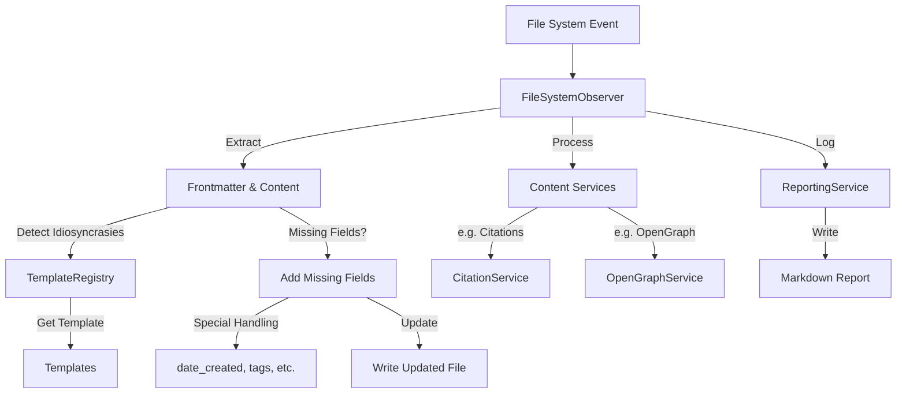

# Context

## Goal:
1. To assert both frontmatter consistency in markdown files, as well as 
2. process markdown content, making targeted transformations to assert consistent extended markdown syntax for safe and consistent rendering. 
3. Maintain an "index" style registry of important, shared content across markdown files across our content library.  
4. Have confidence our code is stable and maintainable, and follows patterns and conventions well known to developers and AI Code Assistant LLMs.

## Unique cases caused by favored tool use.
A content team uses Obsidian as a markdown editor. Obsidian has a built-in YAML frontmatter manager, but it is not always perfect. The way Obsidian handles various frontmatter properties and their values, especially the "data type" -- to the extent it can be called that -- is often inconsistent with various other common YAML frontmatter related-libraries.  (Particularly, grey-matter and js-yaml.) 

The content team is naturally focused on generating content, and not on maintaining metadata. Therefore, the metadata is often incomplete or has errors or does not exist at all.  

## Circles and circles of scripting
Much effort has gone into write and running javascript scripts to correct frontmatter inconsistencies. We have scripts that try to solve all the problems at once, and scripts that try to correct one problem at a time. The result is that the volume of code was out of hand, and with using AI Code Assistants for expediency, we were often solving one problem while recreating another. 

For fun, here are some examples:
- In correcting the "tags" array formatting, and standardizing the values on the unordered list format with Train-Case values and no quote delimiters, the script somehow put "block-scalar" syntax on multi-line URLs. (Which can break obsidian, or other scripts). 
- In correcting "block scalar" syntax, a script put quote delimiters around URLs, often inconsistently, often unbalanced. This created errors in being able to parse the frontmatter, which then led to enormous inconsistencies across hundreds of files. 

## Disorderly and nonsensical massive code volume.

The volume of scripting code became so large, we needed to move it to its own submodule.  

At this point, barely anyone can make sense of it. No one can tell you what works or how to use it.  

No one wants to try to refactor it, yet we all know there is plenty of "good stuff" in there somewhere.  

## Early promise: Initial attempt at a Filesystem observer. 

Our initial attempt at implementing a filesystem observer was a success in the first, very limited functionality we implemented.

We were able to: 

Initiate a pattern that made sense with `templates` and `services`, managed by an orchestrator and initiated with a `watcher`.

The main directory is 
@[tidyverse/observers/]

Initializer: @[tidyverse/observers/index.ts]
Orchestrator: @[tidyverse/observers/fileSystemObserver.ts]

Subdirectories:
- Templates: @[tidyverse/observers/templates/]
   - prompts.ts
   - specifications.ts
   - tooling.ts
   - vocabulary.ts

- Services: @[tidyverse/observers/services/]
   - openGraphService.ts
   - reportingService.ts
   - templateRegistry.ts

This pattern was able to assert frontmatter consistency in a limited way for specific directories for which we authored a template. 

Notably, it was able to orchestrate making requests of the OpenGraph.io API on our 'tooling' directory, generating Open Graph metadata for any new content file. Hyperfast, and with no errors. 

## The Snag: complexity and who knows what caused the error. 

Getting excited, one of our next features we wanted was to enhance the markdown citations capability by asserting our "flavor", and creating a content-wide registry for both unique "sources" as well as any number of connected "citations".

So, a more comprehensive and sophisticated service, the `citationService.ts`. Accompanied, the template `citations.ts`

### The Infinite Loop: 

Observers watch for file changes, and when a change is detected, they process the file. If the file is modified, the observer will detect the change and process it again, creating an infinite loop. This is particularly true because as a file is modified, it updates the "date_modified" property in the frontmatter, which triggers the observer to process the file again.

### Side Effects of Corruption in unintended properties:

IT WORKED. But, a day later we noticed that something had corrupted our markdown files and their frontmatter, throughout our content library. We traced the issue back to the observer, and the infinite loop. Yet, the properties that were corrupted were generally NOT PART OF THE OBSERVER SYSTEM.  Yet nothing else had programmatically altered files.  

Unable to diagnose the source and correct it, we gave up. 

## Prior Prompts related to the Observer intention:

1. [[lost-in-public/prompts/data-integrity/Use-Filesystem-Observer-to-Assert-Frontmatter-Updated.md|Use Filesystem Observer to Assert Frontmatter Updated]]

2. [[lost-in-public/prompts/data-integrity/Refactored-Citations-Observer.md|Refactored Citations Observer]]

# Product Management Vision & Implementation Roadmap

## Executive Summary

The Filesystem Observer system is the backbone of our content integrity and metadata consistency strategy. Its success is measured not only by technical correctness, but by its ability to empower content teams to focus on writing, while ensuring our build, search, and publication pipelines are always working with clean, reliable, and richly annotated Markdown files. This document outlines a vision and actionable roadmap for evolving our observer system into a robust, extensible, and developer-friendly platform.

---

## 1. System Pillars
- **No YAML Libraries**: The observer must never use YAML libraries to parse frontmatter or assure frontmatter consistency.  Even though this feels like the most straightforward way, the libraries all have their own implicit syntax preferences and do not handle various data types or edge cases in the desired way. We have had consistent experiences that out-of-the-box YAML libraries will corrupt the entire content library without even knowing it is happening. All frontmatter parsing must be done using a custom parser, preferrably ONLY ONE so there is a single source of truth.
- **Non-Destructive Automation**: The observer must never overwrite or destructively edit user content. All corrections and updates should be idempotent, traceable, and reversible.
- **Template-Driven Consistency**: All detection, correction, and augmentation of frontmatter and content must be governed by clearly versioned templates, with single sources of truth for each content type.
- **Transparent Reporting**: Every observer action must be logged to a persistent, human-readable report file. Reports should follow a markdown template, include absolute file paths, and summarize all property conversions, validation issues, and actions taken.
- **Extensibility by Design**: Adding new content types, metadata fields, or processing logic should require only a new template and (optionally) a new service, without core refactoring.
- **Feedback Loops**: The system must provide actionable feedback to both developers and content authors, enabling continuous improvement in both code and content.

---

## 2. Architecture Overview



***

## 3. Reporting: The Heart of Trust

### Requirements
- Reports are generated on every INITIAL observer run, and then accumulated alterations to content will update a period-based report, (e.g. once per day), and on shut down.
- The report file lives in `/content/reports` and is never overwritten, always updated, appended, or newly created. Bloat will be solved by users and the content team who will decide a report has already been reviewed and is no longer important, they will delete them manually.

- Reports must:
  - List all files processed, using Obsidian backlink syntax, in paragraph form with each file processed comma separated. 
    - (e.g. `[[lost-in-public/prompts/workflow/Maintain-Consistent-Reporting-Templates.md|Maintain-Consistent-Reporting-Templates.md]]`)
  - Changes will be aggregated and listed for each type of change, to whatever field or set of fields were changed. 
    - (e.g. Property key syntax changes:
      - `tags: kebab-case → snake_case`
      - `category -> categories)
  - Summarize validation errors, warnings, and any auto-corrections
  - Include a timestamp and observer version
  - Follow a markdown template with frontmatter for traceability

### Example Report Structure
```markdown
---
title: Filesystem Observer Report
date: 2025-04-16
observer_version: 0.2.0
---

# Summary
- Files processed: 124
- Files with changes: 37
- Validation errors: 3
- Auto-corrections: 12

# File Details
## /absolute/path/to/file1.md
- **Property conversions:**
    - tags: kebab-case → snake_case
    - date_created: added from file birthtime
- **Validation:**
    - Missing required: authors (auto-added)

## /absolute/path/to/file2.md
...

# Conversion Map
| Property | Before | After |
|----------|--------|-------|
| tags     | ["Data-Integrity"] | ["data_integrity"] |
| ...      | ...    | ...   |

# Observer Activity Log
- 15:21:02 Processed [[/path/to/file1.md|file1]]
- 15:21:03 Processed [[/path/to/file2.md|file2]]
...

---

## 4. Implementation Roadmap

### Phase 1: Foundation & Stability
- Refactor observer to ensure all file writes are atomic and idempotent.
- Set USER_OPTIONS at the top of any file to assure easy changes by the user. 
  - Most importantly, the paths of directories to process using which detection, correction, and reporting templates. 
- Strictly enforce the two-phase processing model (initial batch, then watch mode) to prevent infinite loops.
- Centralize all template definitions and ensure versioning.
- Implement a robust ReportingService (if not already) that handles all report writing, using a markdown template as above.
  - If possible, try to reference or import from standardardized reporting templates.  If none exists, do not create it within the observer or detection templates. Instead, search for ask where reporting templates are being maintained. 

### Phase 2: Extensibility & Registry
- Modularize content processors (citations, OpenGraph, etc.) so new ones can be plugged in via template config.
- Ensure the citation registry and any future registries are single sources of truth, updated atomically, and referenced in reports.
- Add cross-file validation (e.g., duplicate UUIDs, missing registry entries).

### Phase 3: Developer & Author Experience
- Create a CLI or dashboard for running observer tasks, viewing reports, and managing templates.
- Add hooks for pre-commit or CI validation using the observer.
- Provide clear, actionable feedback in both logs and reports for content authors (e.g., how to fix validation errors).

---

## 5. Conventions & Best Practices

- **File/Function Naming:** All observer-related files and functions should be named for clarity (e.g., `addMissingRequiredFields`, `processCitationsInFile`).
- **Directory Structure:** All observer code lives in `tidyverse/observers/` with clear subfolders for templates, services, and utils.
- **Template Versioning:** Each template should specify a version and be referenced in reports for traceability.
- **Error Handling:** All errors, warnings, and changes -- even unintentional -- must be caught and logged, never silently swallowed. Reports should include a section for errors encountered, warnings, and changes.
- **DRY Principle:** Utilities (e.g., date formatting, YAML generation) must be single-source-of-truth and imported everywhere needed.

---

## 6. Open Questions & Next Steps

- How do we assure that any AI Code Assistant or developer consultant uses our existing templates, functions, utilities, patterns and conventions?  How do we prevent runaway code bloat? 
- How can we implement an out of the box test suite for observers, such as Vitest?  
- Should we autogenerate a test content library with files that will be processed, thus having a standardized way of assessing observer behavior? 
- Is there a low-commitment, low-maintenance way for users/developers to work through any edge cases or scenarios that require user-input? 
- How do we ensure the observer NEVER EVER EVER makes unintential changes that are not immediately recorded, and thus challenging to restore? 

---

## 7. References
- [Use Filesystem Observer to Assert Frontmatter Updated](../lost-in-public/prompts/data-integrity/Use-Filesystem-Observer-to-Assert-Frontmatter-Updated.md)
- [Refactored Citations Observer](../lost-in-public/prompts/data-integrity/Refactored-Citations-Observer.md)
- [Handle Citations in Markdown Content](../lost-in-public/prompts/render-logic/Handle-Citations-Logic-and-Render-Citations-Component.md)
- [Cases and Corrections for YAML Content Wide](Cases-and-Corrections-for-YAML-Content-Wide.md)
- [Create a Content Registry for Markdown Files](Create-a-Content-Registry-for-Markdown-Files.md)

---

# End of Product Management Section

---

# Implementation Details & Developer Reference

## 1. Template Definition Example

**Source:** `tidyverse/observers/templates/tooling.ts` and `citations.ts`

```typescript
// tooling.ts (abridged for clarity)
const toolingTemplate: MetadataTemplate = {
  id: 'tooling',
  name: 'Tooling Document',
  appliesTo: { directories: ['content/tooling/**/*'] },
  required: {
    site_uuid: {
      type: 'string',
      description: 'Unique identifier for the tool/service',
      validation: (value) => typeof value === 'string' && value.length > 0,
      defaultValueFn: () => generateUUID()
    },
    tags: {
      type: 'array',
      description: 'Categorization tags',
      validation: (value) => Array.isArray(value) && value.length > 0,
      defaultValueFn: (filePath: string) => { /* ... */ }
    },
    date_created: {
      type: 'date',
      description: 'Creation date',
      defaultValueFn: (filePath: string) => getFileCreationDate(filePath)
    },
    date_modified: {
      type: 'date',
      description: 'Last modification date',
      defaultValueFn: () => getCurrentDate()
    }
  },
  optional: {
    url: { type: 'string', description: 'Official website URL', validation: (value) => typeof value === 'string' && value.startsWith('http') },
    // ... other optional fields
  }
};
```

**Content Processing Example** (`citations.ts`):
```typescript
export const citationsTemplate: MetadataTemplate = {
  id: 'citations',
  appliesTo: { directories: ['content/lost-in-public/prompts/**/*', 'content/specs/**/*'] },
  citationConfig: { registryPath: 'site/src/content/citations/citation-registry.json', hexLength: 6 },
  contentProcessing: {
    enabled: true,
    processor: async (content: string, filePath: string) => {
      return await processCitations(content, filePath, citationsTemplate.citationConfig);
    }
  }
};
```

---

## 2. ReportingService API Contract

**Source:** `tidyverse/observers/services/reportingService.ts`  
**Reference:** `content/lost-in-public/prompts/workflow/Maintain-Consistent-Reporting-Templates.md`

### Main Methods (TypeScript signatures):

```typescript
class ReportingService {
  constructor(baseDir: string);

  logConversion(file: string, fromKey: string, toKey: string): void;
  logValidation(file: string, result: ValidationResult): void;
  logOpenGraphProcessing(filePath: string, status: 'success' | 'failure' | 'skipped'): void;
  logScreenshotProcessing(filePath: string, status: 'success' | 'failure'): void;
  logCitationConversion(filePath: string, count: number): void;
  logFieldAdded(file: string, field: string, value: any): void;
  hasProcessedFiles(): boolean;
  resetStats(): void;

  generateReport(): string | null;
  writeReport(): Promise<string | null>;
}
```

**How to Use:**
- Log every mutation, validation, and service action with the appropriate method.
- Call `generateReport()` to get the markdown report as a string.
- Call `writeReport()` to persist the report and reset stats.
- All errors during report generation/writing are caught and logged.

**Flush Timing:**  
Flush (write) after major batch operations, on shutdown, or at periodic intervals (e.g., every 5 minutes).

---

## 3. FileSystemObserver Event Flow

**Checklist for Each File Event:**

1. **Assure Metadata**
   - Parse frontmatter.
   - Validate against the template.
   - Add missing required fields with default values.
   - Log all conversions and additions.

2. **Preprocess Markdown**
   - Apply any custom preprocessing for markdown “flavors” not handled by remark/unified (e.g., citations, custom code blocks).
   - Transform content ahead of time so the AST and downstream renderers can process it safely.

3. **AST Creation & Rendering**
   - Parse markdown to AST.
   - Apply remark/unified plugins in the correct order.
   - Ensure all custom transformations are injected into the AST before rendering to HTML.

4. **Registry Updates**
   - If citations or other registries are involved, update the registry (e.g., JSON file) atomically.
   - Log registry changes in the report.

5. **Error Handling**
   - If the file is malformed, log the error, skip destructive changes, and report the issue.
   - If a template is missing, log a warning and skip processing.
   - If a registry update fails, log the error and roll back changes if possible.

---

## 4. Registry Update Example

**Citation Registry Example:**  
`site/src/content/citations/citation-registry.json`
```json
{
  "sources": {
    "hex123abc": {
      "title": "Some Book",
      "author": "Author Name",
      "year": 2022,
      "url": "https://example.com"
    }
  },
  "citations": {
    "file/path/to/doc.md": [
      { "hex": "hex123abc", "context": "Used in section 2" }
    ]
  }
}
```

**TypeScript Interface:**
```typescript
interface CitationRegistry {
  sources: Record<string, { title: string; author: string; year: number; url: string }>;
  citations: Record<string, Array<{ hex: string; context: string }>>;
}
```
- Updates are performed by the citation service and logged in the report.

---

## 5. Edge Cases & Error Handling

**Sources:**  
- `tidyverse/getKnownErrorsAndFixes.cjs`
- `content/specs/Cases-and-Corrections-for-YAML-Content-Wide.md`

**Key Patterns:**
- If frontmatter is missing required fields (e.g., `site_uuid`), attempt to auto-correct; if not possible, log and skip.
- If tags are in the wrong format, normalize or log and skip.
- If YAML is malformed (unbalanced quotes, block scalars, duplicate keys), attempt to correct using known fix functions; otherwise, log for manual intervention.
- If the registry file is locked or corrupted, log the error, skip the update, and flag for manual review.
- Never delete or overwrite user content unless the fix is idempotent and reversible.

---

## 5A. OpenGraph Error Handling Requirements (Addendum, 2025-04-20)

**OpenGraph API Error Logging:**
- If the OpenGraph API call fails for any reason (network, parsing, invalid response, etc.), the observer **must**:
    - Write the error string to the `og_error_message` field in the frontmatter.
    - Write the timestamp of the error (ISO format) to the `og_last_error` field in the frontmatter.
    - **Both values must be wrapped in single quote delimiters** (`'`) to ensure YAML safety, as these may contain unsafe or special characters.
    - Never overwrite or drop any other user field in the process.
    - Log these actions aggressively to both the console and the reporting service for traceability.
    - These fields must be updated atomically and only upon a true error from the OpenGraph fetch operation.

**Example:**
```yaml
og_error_message: 'Request failed with status 404: Not Found'
og_last_error: '2025-04-20T18:41:47-05:00'
```

- These requirements are canonical and take precedence over prior error logging patterns for OpenGraph.
- See also: [Implementation Requirements] and [Edge Cases & Error Handling] above for general error handling principles.

---

## 6. Testing Expectations

**Recommendations:**
- Use **Vitest** for unit and integration testing.
- Each observer service (template validation, reporting, registry updates) should have:
  - Unit tests for all edge cases (malformed YAML, missing fields, registry errors).
  - Integration tests simulating file changes and verifying correct logging, reporting, and registry updates.
  - A “dry-run” mode to validate changes without writing to disk.
- CI should run all tests and fail on any unhandled error or regression.
- “Done” means: all required tests pass, reports are generated as expected, and no destructive changes occur on real content during dry-run.

---

## 7. [DRAFT] Proposed Property Collector Pattern for Observer-Service Architecture

### Rationale
To maximize atomicity, maintainability, and auditability, the observer should orchestrate all service operations and write to disk only once, after all operations have completed. Each service is responsible for determining whether it needs to run and returns only the properties it intends to update. This enables clear separation of concerns and extensibility.

### Rule
**UNDER NO CIRCUMSTANCES, LIFE AND DEATH, COMPANY LIVE OR DIE, SHOULD OUR OBSERVER OPERATIONS CORRUPT OUR FILES.**

- The observer must NEVER:
  - Delete or overwrite existing required fields (e.g., `url`) unless explicitly instructed and validated.
  - Replace valid URLs with screenshot URLs or any other data.
  - Use block scalar syntax (`>-` or `|-`) for any URL or screenshot fields.
  - Produce malformed YAML of any kind.
- All observer operations must be atomic, non-destructive, and fully validated before writing to disk.
- Any operation that would result in the loss or corruption of a field must be aborted and logged as a critical error.
- All changes must be reviewed for correctness before being committed.
- If any operation fails validation, the file must be left untouched and the error reported.

### Examples of Catastrophic Failure
```yaml
# ❌ BAD (corrupted)
url: >-
https: //og-screenshots-prod.s3.amazonaws.com/1920x1080/80/false/1c9130e65f488a59a8a4b45dddd2a47e645d778065e48ba904c49e612c16bd37.jpeg
og_screenshot_url: >-

# ✅ GOOD
url: "https://www.intel.com/arc"
og_screenshot_url: "https://og-screenshots-prod.s3.amazonaws.com/1920x1080/80/false/1c9130e65f488a59a8a4b45dddd2a47e645d778065e48ba904c49e612c16bd37.jpeg"
```

### Implementation Requirements
- The observer must always read, validate, and preserve existing field values unless a new value is explicitly and validly provided.
- All YAML output must be validated for correctness (no block scalar, no broken lines, no accidental whitespace or splitting).
- If the observer cannot guarantee atomic, non-destructive output, it must NOT write to disk.
- All destructive or overwriting actions must be logged and require explicit user approval.
- **The observer orchestration MUST await all asynchronous API responses (such as OpenGraph metadata and screenshot fetches) before writing any changes to disk.**
  - No fire-and-forget or background API calls are permitted if their results are required for the final frontmatter.
  - All field updates (e.g., `og_screenshot_url`, OpenGraph fields) must be present in the merged frontmatter before a write occurs.
  - This guarantees atomicity, prevents race conditions, and ensures no required data is lost due to asynchronous timing issues.
- The observer must never drop, overwrite, or remove user-provided fields such as `tags` unless an explicit, validated update is provided.
- **The observer must maintain an in-memory expectation store outside the YAML object to track which subroutine results are pending.**
- **The orchestrator must wait for all subroutines to return a response or error before proceeding.**
- **After all subroutines have completed, the orchestrator must serialize the would-be YAML output and compare it byte-for-byte to the current file contents. Only if there is a true difference should a write occur.**
- **The orchestrator must always retain all previous values written to file, unless an explicit overwrite instruction is given for a key. Never drop or replace a value unless explicitly instructed.**

---

## Next Steps

- Integrate these examples and checklists into the specification (done here).
- Review with developers for feedback and further clarifications.

---

## 7. Configurable Sequenced Operations for Observer Services (2025-04-17)

### Motivation
To support advanced, non-destructive workflows and ensure atomic, DRY metadata operations, the observer now supports a configurable sequence of operations per directory. This enables:
- Prioritizing critical fields (e.g., `site_uuid`) before secondary processes (e.g., OpenGraph fetch)
- Inserting delays between steps to avoid file watcher race conditions or infinite loops
- Re-extracting frontmatter after each write for single-source-of-truth processing
- User-level control over the order and timing of all observer actions

### USER_OPTIONS Example
```typescript
directories: [
  {
    path: 'tooling',
    template: 'tooling',
    services: {
      openGraph: true,
      citations: false
    },
    operationSequence: [
      { op: 'addSiteUUID' },
      { op: 'updateDateModified' },
      { op: 'extractFrontmatter', delayMs: 25 },
      { op: 'fetchOpenGraph', delayMs: 25 }
    ]
  },
  // ...other configs
]
```

### Implementation Pattern
- Each operation in the sequence is implemented as a modular handler (e.g., `addSiteUUID`, `updateDateModified`, `fetchOpenGraph`).
- The observer executes the sequence for each file, passing the latest frontmatter and file path to each handler.
- After each write, frontmatter is re-extracted for the next operation.
- Delays (`delayMs`) are honored between steps using `setTimeout` or async sleep utilities.
- Guards are in place to prevent infinite recursion or loops if the same file is processed multiple times rapidly.

### Example Flow
1. **addSiteUUID:**
   - Checks for `site_uuid` and adds if missing. Writes to disk.
2. **updateDateModified:**
   - Sets/updates `date_modified` after `site_uuid` is present. Writes to disk.
3. **extractFrontmatter (delay 25ms):**
   - Waits 25ms, then re-extracts frontmatter from file.
4. **fetchOpenGraph (delay 25ms):**
   - Waits 25ms, then passes latest frontmatter to OpenGraph service, which evaluates conditions and updates metadata if appropriate. Writes to disk only if changes are made.

### Benefits
- Ensures critical fields are present before dependent services run
- Prevents race conditions and file watcher loops
- Provides user-level configurability for all observer workflows
- Maintains atomicity and non-destructive guarantees

### Non-Destructive Guarantee
- No operation in the sequence ever deletes or overwrites user content unless explicitly configured and validated
- All changes are reviewed for correctness before being committed
- The observer will abort any sequence if atomic, non-destructive output cannot be guaranteed

### Future Extensions
- Additional operations (e.g., custom metadata enrichment, registry sync) can be added as new handlers and referenced in `operationSequence`
- Sequence and delay logic is fully extensible for new content types or workflows

---

## 8. Batch Reporting Service: Implementation and Specification (2025-04-17)

### Overview
A batch reporting service ensures that all observer actions and content changes are periodically summarized in a human-readable, persistent markdown report. This is critical for transparency, auditing, and continuous quality control of content metadata.

### Single Source of Truth for Periodicity
- The batch reporting interval is defined in a single location: `USER_OPTIONS.batchReportIntervalMinutes` in `tidyverse/observers/services/reportingService.ts`.
- This value is imported wherever batch reporting orchestration occurs, ensuring DRY and consistent configuration.

### Orchestration Logic
- The periodic batch reporting process is orchestrated at the observer system level (e.g., in `fileSystemObserver.ts` or `index.ts`), not within the reporting service itself.
- On observer start, a timer is set up using `setInterval`, with the interval determined by `USER_OPTIONS.batchReportIntervalMinutes * 60 * 1000`.
- On each interval tick:
    - If there are unreported changes (`reportingService.hasUnsavedReportChanges()`), a batch report is written (`await reportingService.writeReport()`).
    - Each report is appended or newly created in `/content/reports`, never overwritten.
- On shutdown (SIGINT, SIGTERM):
    - If no report has been written this session, or there are unreported changes, a final report is written before exit.

### DRY and Modularity Principles
- All change-tracking logic is encapsulated in `ReportingService`.
- The periodicity value is never duplicated or hardcoded elsewhere.
- All batch reporting triggers (timer and shutdown) reference the same service and configuration.

### Example Orchestrator Pseudocode
```typescript
import { USER_OPTIONS } from './services/reportingService';
const intervalMs = USER_OPTIONS.batchReportIntervalMinutes * 60 * 1000;
setInterval(async () => {
  if (reportingService.hasUnsavedReportChanges()) {
    await reportingService.writeReport();
  }
}, intervalMs);

process.on('SIGINT', async () => {
  if (!reportingService.hasWrittenReport() || reportingService.hasUnsavedReportChanges()) {
    await reportingService.writeReport();
  }
  process.exit(0);
});
```

### Requirements Recap (additions)
- Batch reports are generated:
    - On every initial observer run
    - Periodically, at the interval set in `USER_OPTIONS`
    - On shutdown, if needed
- No destructive changes: reports are always appended or newly created
- All configuration is centralized for maintainability

---

## 9. Traceability: Logging All Processed Files

A core requirement for the observer system is that **every file processed by any operation handler must be logged for traceability**, regardless of whether the file was changed or the filePath was otherwise used in the operation logic.

- Each operation handler must record the `filePath` of any file it processes by calling a dedicated reporting service method (e.g., `logProcessedFile(filePath: string)`).
- This ensures that every file touched by the observer is included in the batch report, supporting full auditability.
- The reporting service must:
    - Store a list of all processed files for the current batch.
    - Convert each file's absolute path to a relative path after the `/content/` directory.
    - Format each entry as an Obsidian-style wikiLink/backlink using the following template syntax:
      
      `[[relative/path/to/File-Name-for-Backlink.md|File Name for Backlink]]`

      - The link target is the relative path to the file (with correct case and dashes).
      - The link text is the file name, with dashes replaced by spaces and the extension removed, in title case (e.g., `File Name for Backlink`).

- The report template must always include a section listing all processed files using this syntax, even if no changes were made.

### Example Handler Pattern
```typescript
async someOperation(frontmatter: Record<string, any>, filePath: string) {
  // ...operation logic...
  reportingService.logProcessedFile(filePath);
  return { frontmatter, changed: false };
}
```

### Example ReportingService Method
```typescript
logProcessedFile(filePath: string): void {
  // Convert to relative path after /content/
  const relPath = filePath.split('/content/')[1];
  // Generate link text: remove extension, replace dashes with spaces, title case
  const fileName = relPath.split('/').pop() || '';
  const linkText = fileName
    .replace(/\.md$/, '')
    .replace(/-/g, ' ')
    .replace(/\b\w/g, c => c.toUpperCase());
  const backlink = `[[${relPath}|${linkText}]]`;
  if (!this.processedFiles.includes(backlink)) {
    this.processedFiles.push(backlink);
  }
}
```

### Example Report Output
```markdown
### Files Processed
[[tooling/Foo-Bar.md|Foo Bar]], [[vocabulary/Example-File.md|Example File]], ...
```

This traceability requirement ensures that the observer system provides a complete and auditable record of all files it interacts with, supporting robust reporting and compliance with project standards.

***

## Observer Logging, Reporting, and Audit Trail Logic

### Conditional Console Logging (Standard Practice)
- All pipeline and observer steps (e.g., `addSiteUUID`, OpenGraph fetch, YAML reordering) include `console.log` statements for stepwise debugging and traceability.
- **All log statements remain in the codebase** but are wrapped in user-configurable flags under `services.logging` in the directory config (see `userOptionsConfig.ts`).
- Example config:
  ```typescript
  services: {
    logging: {
      addSiteUUID: true,
      openGraph: false
    }
  }
  ```
- Example usage in observer:
  ```typescript
  if (logging?.addSiteUUID) {
    console.log('After addSiteUUID:', updatedFrontmatter);
  }
  ```
- This pattern ensures logs can be toggled on/off for each step, per directory, without deleting code or editing the pipeline.

### Reporting Service Integration
- The observer pipeline passes a `reportingService` instance to all file write operations (e.g., `writeFrontmatterToFile`).
- After each write, the reporting service is called with full context (file path, new frontmatter, template order, etc.).
- The reporting service logs and tracks events such as YAML property reordering, frontmatter changes, and other structural mutations.
- Example event logging (inside the write function):
  ```typescript
  reportingService.logFileYamlReorder({
    filePath,
    previousOrder,
    newOrder,
    changedFields
  });
  ```
- This provides a robust audit trail for all significant changes, supporting debugging, traceability, and confidence in the automation pipeline.

---

**This logic is mandatory for all observer and pipeline operations that mutate file metadata or structure.**

---

## Modular Watchers Architecture

#### Motivation
- The previous monolithic observer file that watched all directories was too large, difficult to maintain, and hard to decouple working and non-ideal logic.
- To address this, the observer now supports modular "watchers"—dedicated modules that watch specific directories or content collections.

#### Design
- Each watcher is responsible for:
  - Watching a specific directory or content collection (e.g., reminders, prompts, specs).
  - Calling the appropriate services, templates, utilities, and reporting functions for its scope.
  - Sending all reporting and results back to the main observer for aggregation and final report writing.
- The observer is responsible for:
  - Managing the lifecycle of all active watchers.
  - Receiving and aggregating reports and results from all watchers.
  - Maintaining atomicity, non-destructive guarantees, and overall orchestration.

#### User Options
- Inclusion or exclusion of individual watchers is specified in the user options/configuration (e.g., `USER_OPTIONS`).
- Users can enable or disable watchers for specific directories or content types as needed.
- This provides fine-grained control and extensibility for future content collections.

#### Benefits
- Greatly improves code modularity, maintainability, and testability.
- Allows for targeted debugging and decoupling of logic.
- Makes it easy to add, remove, or update support for new content collections without impacting the entire observer system.

#### Example Flow (with Watchers)
1. **Observer** initializes and reads user options to determine which watchers to activate.
2. **Each Watcher** starts and monitors its assigned directory for Markdown file changes.
3. **Watcher** extracts frontmatter, calls relevant services/templates, and collects reporting.
4. **Watcher** sends reporting/results back to the observer.
5. **Observer** aggregates all results and writes final reports/updates as needed.

#### Non-Destructive Guarantee
- No watcher or observer operation ever deletes or overwrites user content unless explicitly configured and validated.
- All changes are reviewed for correctness before being committed.
- The observer will abort any sequence if atomic, non-destructive output cannot be guaranteed.

---

**Does this fit our architecture?**

This modular watcher approach fits well within the general architecture of `tidyverse/observers/fileSystemObserver.ts`:
- The observer is already config-driven and supports extensible logic for multiple directories.
- Refactoring to modular watchers can be accomplished incrementally—no huge refactor is needed if the watcher interface matches the observer's event and reporting patterns.
- The main observer will delegate directory-specific logic to watcher modules, which then call services and report back.
- Only the watcher registration, lifecycle management, and reporting aggregation logic need to be added or updated.

**Conclusion:**
- Modular watchers are a natural, DRY, and maintainable evolution of the current observer architecture.
- You can proceed to implement or refactor to this pattern without a disruptive overhaul.

---

## 8. Property Collector Pattern & Observer-Service Orchestration (2025-04-17)

The following section is an additive update and does not remove or replace any previous content. It is intended to clarify and extend the architecture for atomic, non-destructive, and auditable metadata operations in the filesystem observer.

### Property Collector Pattern Overview

- **Service Contract:**
  - Each service receives the current frontmatter and filePath.
  - Each service determines internally if it needs to run (e.g., missing UUID, missing OpenGraph fields).
  - If it runs, it returns a partial object with only the properties it intends to update (e.g., `{ og_image, og_url }`).
  - If not, it returns an empty object or a status indicating no change.

- **Observer Orchestration:**
  - The observer initializes a `propertyCollector` object (e.g., `{}`).
  - As each service runs, it merges the returned properties into the collector.
  - The collector accumulates only the changed/added properties.

- **Final Merge & Write:**
  - At the end, the observer merges the original frontmatter with the collected properties (overwriting only changed/added keys).
  - If the collector is not empty, the observer writes the updated frontmatter to disk.
  - If the collector is empty, no write occurs.

- **Aggressive Commenting & Logging:**
  - All logic is aggressively commented.
  - Logging at each step shows what properties were changed/added by each service.

#### Example (Pseudocode)
```typescript
const propertyCollector: Record<string, any> = {};
const originalFrontmatter = extractFrontmatter(fileContent);

for (const step of operationSequence) {
  if (step.op === 'addSiteUUID') {
    const result = addSiteUUIDService(originalFrontmatter, filePath);
    Object.assign(propertyCollector, result);
  }
  if (step.op === 'fetchOpenGraph') {
    const result = await openGraphService(originalFrontmatter, filePath);
    Object.assign(propertyCollector, result);
  }
  // ...etc
}

const updatedFrontmatter = { ...originalFrontmatter, ...propertyCollector };

if (Object.keys(propertyCollector).length > 0) {
  await writeFrontmatterToFile(filePath, updatedFrontmatter);
}
```

#### Benefits
- Only changed properties are tracked and written.
- No unnecessary writes.
- Extremely clear audit trail of what changed, and why.
- Extensible for future validation, rollback, or preview logic.

---

*This section is an additive draft. All prior logic, requirements, and reporting/audit trail sections remain in effect and should be considered canonical unless superseded by explicit future edits.*
