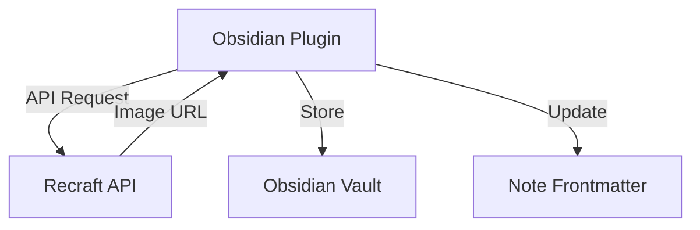

# Maintain an Image Generator Obsidian Plugin

## 1. Executive Summary
This specification outlines the development of an Obsidian plugin that integrates with the Recraft API to generate and manage images directly within the Obsidian note-taking environment. The plugin will allow users to generate images based on text prompts and automatically update their notes' frontmatter with the generated image URLs.

## 2. Background & Motivation
### Problem Statement
Users need an efficient way to generate and manage images within their Obsidian vault without leaving the application. Current workflows require switching between multiple tools and manually updating note metadata.

### Background
The Lossless Group has implemented the image generation functionality twice:

1. In the AI-Labs project 
```zsh
ai-labs/apis/recraft/generate-banner-and-portrait-images-recraft.py`
ai-labs/apis/imagekit/convertImageToImagkitUrl.cjs`
```

2. In the Tidyverse Observer System
```zsh
tidyverse/observers/services/imageKitService.ts
```


### Why This Is Important Now
- Streamlines content creation workflow
- Reduces context switching for users
- Maintains consistency in image generation and management
- Integrates with existing Obsidian ecosystem

### Current Limitations
- Manual process for generating and adding images
- No native Obsidian solution for AI image generation
- Inconsistent metadata management across notes

### a) Reference Projects and Starter Code
- Recraft API Documentation
- Obsidian Plugin Developer Documentation
- Example implementations in ``ai-labs/apis/recraft/generate-banner-and-portrait-images-recraft.py` and `ai-labs/apis/imagekit/convertImageToImagkitUrl.cjs``

### b) Nuances for Consideration
- We will start with our own starter code, which has its own project architecture.  We will clone the code from: [The Lossless Group's Obsidian Plugin Starter Code](https://github.com/lossless-group/obsidian-plugin-starter)
   - All functionality there will need to be replaced with custom to this project. However, the architecture, patterns and styles should be preserved.
- Obsidian plugins run on [[ES Build]], which does not allow for typical console related logging.  We will need to develop a logging and reporting mechanism in the future, but for now let's get this running.  
- Secure API key management through Obsidian's settings. Obsidian handles this elegantly.  No use of .env files unless for development only. 
- Support for Recraft API's potential image types (e.g., `vector_illustration`)
	- Support for a "Custom Style" file to include in the Recraft API Call
- Correct handling of image generation requests and responses according to Recraft API's API Docs. 
- Error handling through Obsidian notifications.

### c) Constraints and Applicable Lessons Learned
- Do not use TSX or any other library other than pure typescript. 
- Clearly declare types for all variables and functions, and do not use generic types.
   - Maintain types in the types directory.
   - Define interfaces in the working file.
- Do not "lump" code into one or two files.  We have a project architecture, use it. 
- API rate limits are only necessary in batch processes.
- Can only show errors through Obsidian notifications API. 
	- logging to be developed and streamlined later.
- Handle frontmatter rigorously in extract and write processes using only string operations.
	- Must use our battle-tested `yamlFrontmatter.ts` utility.
	- MAY NOT USE YAML LIBRARIES because they may corrupt the current YAML syntax developed by users for Obsidian.
	- EXTREMELY IMPORTANT on any file or batch operations as the user is likely to not notice corruptions until well after the fact. 

## 3. Goals & Non-Goals
### Goals
- Generate images using Recraft API from within Obsidian
- Securely manage API keys through Obsidian settings
- Automatically update frontmatter with generated image URLs according to user specifications in the modal.  Defaults may be in the settings. 
- Support for custom styles and parameters
- User may evaluate the response images and resend for touch up or new generation.

### Non-Goals
- Image editing capabilities
- Support for image generation APIs other than Recraft (initially)
- Offline image generation (initially)

## 4. Technical Design
### High-Level Architecture


```bash
obsidian-image-generator/
├── src/
│   ├── services/
│   │   ├── RecraftService.ts     # Handles Recraft API calls
│   │   ├── ImageKitService.ts    # Handles ImageKit uploads
│   │   └── fileService.ts        # Handles file operations
│   │   └── directoryService.ts # Handles directory operations
│   ├── ui/
│   │   ├── CurrentFileModal.ts
│   │   ├── TargetDirectoryModal.ts
│   │   └── settings.ts
│   └── styles/
│        └── styles.css                   # Plugin entry point
└── main.ts
```
**Note**: the `main.ts` file must be the entry point and must be in the root directory, and must be named `main.ts`. This is enforced and required by the Obsidian Plugin Marketplace.

### Detailed Design
#### API Integration
- Use Recraft API for image generation
- Support for custom styles (default: `vector_illustration`)
- Secure API key storage using Obsidian's settings
- Eventual support for batch processing for a target directory.
- Eventual support for the ImageKit API for image storage.
- Eventual support for Model Context Protocol SDK.


#### File Operations
- Update frontmatter with `banner_image` and `portrait_image` URLs, or the properties set by the user in settings or in the modal.
- Preserve existing frontmatter structure and formatting while only using string operations.

#### Services
1. **File Operations Service** `fileService.ts`
   - `extractAndDisplayImagePromptInModal`: Extract markdown headers
   - `extractYamlFrontmatter()`: Get YAML frontmatter
   - `updateImagePromptBeforeRequest()`: Update frontmatter values
   - `writeResponseInYamlProperty()`: Maintain consistent frontmatter order
   - `writeResponseInContentAtCursor()`: Uses correct image embed syntax `.`

1. **Recraft API Service:** `RecraftService.ts`
   - Manage Recraft API communication
   - Handle authentication and rate limiting
   - Process responses and error handling

### Error Handling
- Send notifications through Obsidian's notification API
- Network request failures
- Invalid API keys
- File system errors
- Invalid frontmatter

## 5. Prior to Implementation

#### Review and Discuss Prompts

#### Review and Discuss Code

##### Key Components from Current Implementation

###### Image Generation (Python Script)
- Uses Recraft API for generating both banner and portrait images
- Handles YAML frontmatter manipulation via string operations
- Supports custom styles through a JSON configuration
- Includes comprehensive error handling and logging

###### Image Upload (Node.js Script)
- Handles uploading to ImageKit.io
- Processes markdown files to find and update image URLs
- Preserves YAML formatting and comments
- Supports both single file and directory processing

##### Key Observations

###### Critical Dependencies
- Recraft API for image generation
- ImageKit for image hosting
- Environment variables for API keys

#### Important Constraints
- Must handle YAML frontmatter carefully (no YAML libraries)
- Needs to preserve all existing frontmatter formatting
- Must handle API keys securely

#### Performance Considerations
- Current implementation processes files asynchronously
- Includes rate limiting and error handling

## 6. Implementation Plan
### Phases and Step by Step
1. **Phase 1:** Initialize Settings Infrastructure
	- [x] Create settings infrastructure using Obsidian's plugin API
	- [x] Offer user Base URL and API Key, Image Sizes. 
	- [x] Add support for custom styles
	- [x] Update the Code Changelog file. 

Finished on 2025-07-20


2. **Phase 2:** Test API Calls
	- [x] Create basic image generation command using curl or typescript APIs
	- [x] Analyze response object. 
	- [x] Document example requests and response objects.
	- [x] Update the Code Changelog file. 

Finished on 2025-07-20

3. **Phase 3: Iterate on Modal**
	- [ ] Assure proper YAML extraction and `image_prompt:` value extraction using the `yamlFrontmatter.ts` utility.
	- [x] Load settings from data.json that display in the modal.
		- [ ] Request Portrait?
		- [ ] Request Banner?
		- [ ] Request Square?
		- [x] Confirm style?
		- [x] Use Custom Styles?
	- [x] Create a button to submit the `image_prompt` value to the Recraft API as part of the curl based request JSON object.
		- [ ] Add progress indicators using the OpenGraphFetcher example
		- [x] Successfully send the `image_prompt` value to the Recraft API and receive a response, 
            - [x] updating the progress bar.
	- [ ] Audit the implementation of proper Obsidian classes through Obsidian Class Variables
	- [ ] Implement error handling and recovery. Errors need to be sent through Obsidian notifications. 
	- [x] Update the Code Changelog file. 

Partially Finished on 2025-07-21


**Note:** Only supports [[Tooling/AI-Toolkit/Generative AI/Recraft|Recraft]] as of July 21st, 2025. 

4.  **Phase 4: Introduce ImageKit API Settings & Upload Functionality**
	- [ ] Introduce ImageKit API Settings 
	    - [ ] Setting to remove downloaded Recraft Generated images from the download folder but only after successfully uploading to ImageKit with a response object from ImageKit with the unique image URL written to file in place of the Recraft generated image URL.
        - [ ] Toggle on Modal for removing downloaded Recraft Generated images for the above, default to the user preference in settings.
	- [ ] Update the Code Changelog file. 


**Note:** Only supports [[Tooling/Software Development/Lego-Kit Engineering Tools/ImageKit|ImageKit]] as of July 21, 2025. 

Finished on 2025-07-21

5. **Phase 5: Polish and Optimization**
	1. Assure write operations to YAML are flawless.
	2. Performance optimizations
	3. Add configuration options
		1. Figure out how to include the custom styles into the API request object. 
		2. Analyze other request options for Recraft API
	4. Update the Code Changelog file. 

6. **Phase 6: User Documentation and user guides**
	1. Audit Settings and Modal for helpful user instructions and tooltips.
	2. Update README with thorough user instructions.

7. **Phase 7: Developer Documentation**
	1. Update README for potential contributors
	2. Update Astro Starlight documentation. 

### Future Iterations
   1. Implement proper download/upload system to back up into an image delivery service. 
   2. Implement batch processing for multiple images in a single file. 
   3. Implement target directory processing for multiple images across multiple files. 
	   1. Identify and match the list of possible image generations.
	   2. Identify and match the list of possible local images to send to image delivery service. 
   4. Implement MCP for using LLM API calls to generate potential image prompts. 

### Dependencies
- [[pnpm]]
- Obsidian API
- Recraft API
- Node.js libraries for HTTP requests
- YAML parsing utility cloned through 

### Testing Strategy
- Unit tests for utility functions
- Integration tests for API communication
- End-to-end tests for plugin functionality
- Manual testing in Obsidian environment

## 6. Alternatives Considered
### Alternative 1: Browser Extension
- Pros: Could work across multiple applications
- Cons: Less integrated with Obsidian, more complex security model
- Decision: Chose native plugin for better integration and user experience

### Alternative 2: Local Image Generation
- Pros: No API dependencies
- Cons: Higher resource requirements, potentially lower quality
- Decision: Use Recraft API for consistent quality and performance

## 7. Open Questions
- Should we implement local caching of generated images?
- What are the rate limits for the Recraft API?
- How should we handle API key rotation?

## 8. Appendix
### Glossary
- **Frontmatter**: YAML metadata at the beginning of markdown files
- **Recraft API**: The image generation service being integrated
- **Obsidian Plugin**: The custom extension being developed

### References
- [Recraft API Documentation](https://recraft.ai/docs)
- [Obsidian Plugin Development Guide](https://docs.obsidian.md/Plugins)
- [Example Implementations](ai-labs/recraft/recraft-examples.md)

### Revision History
- 2025-07-20: Initial draft created
- 2025-07-19: Project conception
# Objective

# Basics
## Inputs

### Model API
We will use the Recraft API to generate images.

#### Example Requests and Responses
`ai-labs/recraft/recraft-examples.md`

# Recraft Styles Implementation

## Settings Structure

```typescript
interface ImageGinSettings {
    // ... existing settings
    style: {
        useCustomStyle: boolean;
        presetStyle: {
            base: 'realistic_image' | 'digital_illustration' | 'vector_illustration' | 'icon';
            substyle?: string;  // e.g., 'b_and_w', 'enterprise', etc.
        };
        customStyleId?: string;  // For user-created styles
    };
}
```

## Default Configuration

```typescript
const DEFAULT_SETTINGS: ImageGinSettings = {
    // ... other settings
    style: {
        useCustomStyle: false,
        presetStyle: {
            base: 'digital_illustration',
            substyle: 'graphic_intensity'
        }
    }
};
```

## UI Components

### Style Selection
- **Style Type Toggle**
  - Radio buttons: "Use Preset Style" / "Use Custom Style"

### Preset Style Mode
- **Base Style Dropdown**
  - Options: realistic_image, digital_illustration, vector_illustration, icon
- **Substyle Dropdown**
  - Dynamically updates based on selected base style

### Custom Style Mode
- **Style Selector**
  - Dropdown to select from user's custom styles
- **Create New Style** (Future)
  - Button to create new style from reference images

## Helper Functions

### Style Parameter Builder

```typescript
function buildStyleParams(settings: ImageGinSettings) {
    if (settings.style.useCustomStyle && settings.style.customStyleId) {
        return { style_id: settings.style.customStyleId };
    } else {
        const params: any = { 
            style: settings.style.presetStyle.base 
        };
        if (settings.style.presetStyle.substyle) {
            params.substyle = settings.style.presetStyle.substyle;
        }
        return params;
    }
}
```

### Style Options Configuration

```typescript
const STYLE_OPTIONS = {
    realistic_image: {
        label: 'Realistic Image',
        substyles: [
            { id: 'b_and_w', label: 'Black & White' },
            { id: 'enterprise', label: 'Enterprise' },
            // ... other substyles
        ]
    },
    digital_illustration: {
        label: 'Digital Illustration',
        substyles: [
            { id: '2d_art_poster', label: '2D Art Poster' },
            { id: 'graphic_intensity', label: 'Graphic Intensity' },
            // ... other substyles
        ]
    },
    // ... other base styles
};
```

#### API Key
The Recraft API key will be accessed through Obsidian's Settings, which keeps things like API keys secure, private, and local.

## Target Output

Put the response back into the YAML frontmatter of the input file, preserving all other frontmatter structure and formatting.

`banner_image: <URL>`
`portrait_image: <URL>`

# Output Script in:


## Including Custom Styles from Recraft

> **How to Use Your Generated Custom Style**
>
> You can include a custom style generated by the Recraft API in your model request by referencing its style ID or by loading the style JSON object. Example below uses the style you generated and saved at:
>
> `ai-labs/recraft/styles-recraft-2025-04-14T21-24-01.json`
>
> **Sample Style JSON:**
> ```json
> {
>   "creation_time": "2025-04-15T02:24:01.574783871Z",
>   "credits": 40,
>   "id": "73a249b2-879e-4240-9973-c6fb1715a882",
>   "is_private": true,
>   "style": "digital_illustration"
> }
> ```
>
> **Example (Python):**
> ```python
> import json
> with open('ai-labs/recraft/styles-recraft-2025-04-14T21-24-01.json') as f:
>     style_obj = json.load(f)
> # Use style_obj['id'] as the style identifier in your API request
> payload = {
>     'prompt': 'Your image prompt here',
>     'style': style_obj['id'],
>     # ...other parameters
> }
> ```
>
> **Example (JS/TS):**
> ```js
> const style = require('./ai-labs/recraft/styles-recraft-2025-04-14T21-24-01.json');
> // Use style.id as the style identifier in your API request
> const payload = {
>   prompt: 'Your image prompt here',
>   style: style.id,
>   // ...other parameters
> };
> ```

## Services

## Modals

#### CurrentFileModal.ts
This modal allows you to interact with the current file in focus. It includes sections for:


#### BatchDirectoryModal.ts
This modal is for batch processing of files within a directory. It includes:

With these modals, you have full interaction capabilities for both individual files and whole directories, allowing you to perform comprehensive text operations directly within Obsidian.