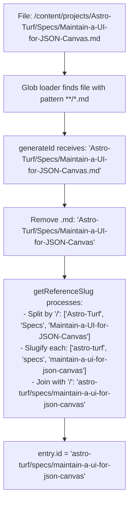
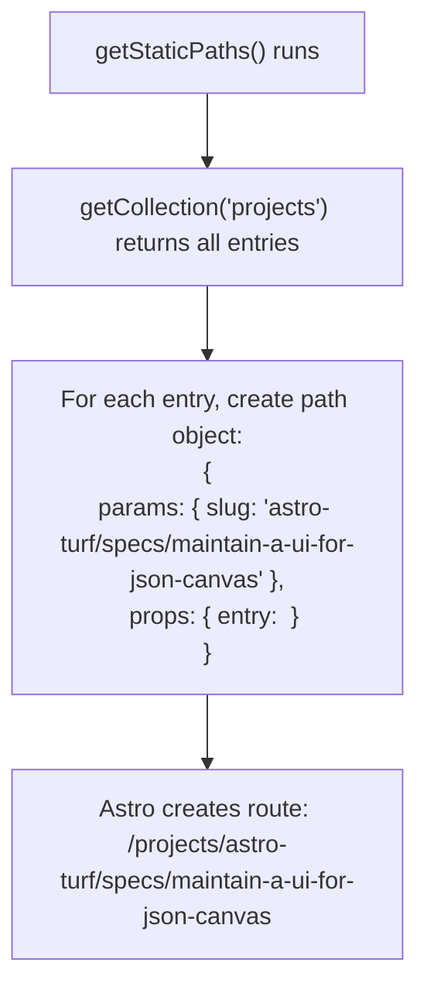
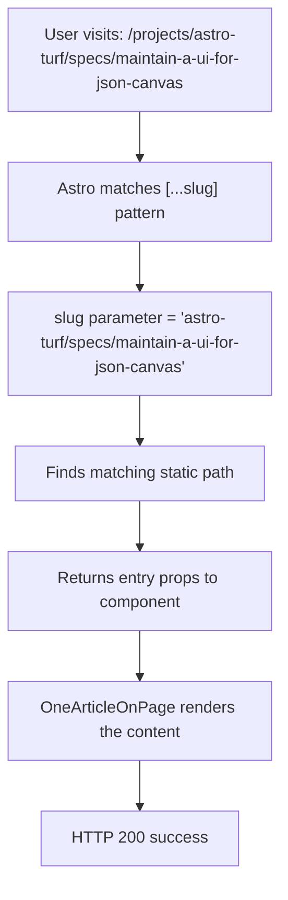
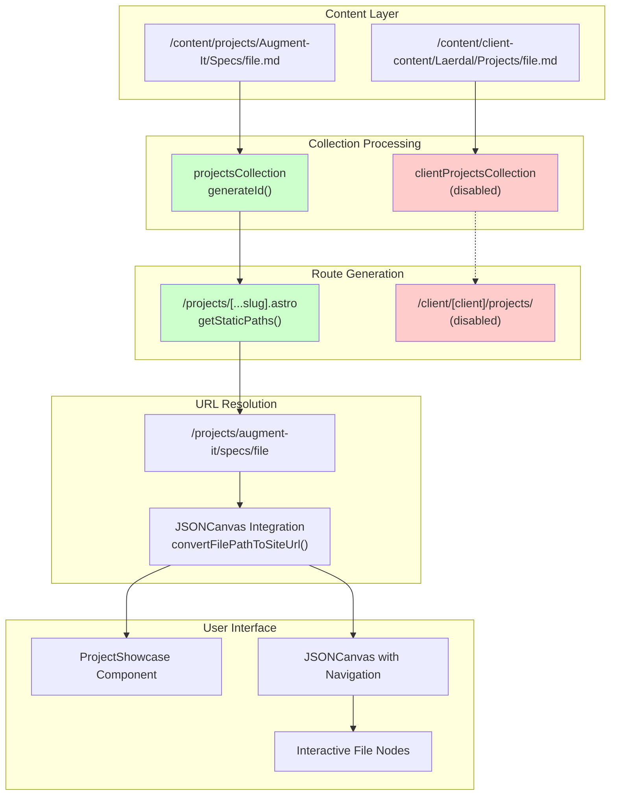

# Complete Project Routing Fix Implementation

## Executive Summary

This document provides the complete, line-by-line implementation of the project routing fix that resolves 404 errors and preserves nested directory structures in project URLs. The solution transforms URLs from broken `/projects/filename` to working `/projects/full/nested/path/filename` format.

## Problem Statement

**Before Fix:**
- File: `/content/projects/Astro-Turf/Specs/Maintain-a-UI-for-JSON-Canvas.md`
- Broken URL: `/projects/maintain-a-ui-for-json-canvas` (404 error)
- Issue: Directory structure `Astro-Turf/Specs/` was lost in slug generation

**After Fix:**
- File: `/content/projects/Astro-Turf/Specs/Maintain-a-UI-for-JSON-Canvas.md`
- Working URL: `/projects/astro-turf/specs/maintain-a-ui-for-json-canvas` (HTTP 200)
- Result: Full directory structure preserved in URL

## Complete Implementation

### 1. Content Collection Configuration (`src/content.config.ts`)

**Key Change:** Use `generateId` function in glob loader to preserve directory structure.

```typescript
// CRITICAL: Projects collection definition (lines 558-614)
const projects = defineCollection({
  loader: glob({ 
    pattern: '**/*.md', 
    base: '/Users/mpstaton/code/lossless-monorepo/content/projects',
    // THIS IS THE KEY FIX: generateId preserves full directory path
    generateId: ({ entry, data }) => {
      console.log(`[PROJECTS COLLECTION] Processing entry: ${entry}`);
      
      // Remove .md extension and convert to slug format
      const withoutExtension = entry.replace(/\.md$/, '');
      console.log(`[PROJECTS COLLECTION] Without extension: ${withoutExtension}`);
      
      // Use getReferenceSlug to slugify while preserving directory structure
      const slug = getReferenceSlug(withoutExtension);
      console.log(`[PROJECTS COLLECTION] Generated slug: ${slug}`);
      
      return slug;
    }
  }),
  schema: z.object({
    title: z.string().optional(),
    lede: z.string().optional(),
    date_authored_initial_draft: z.date().optional(),
    date_authored_current_draft: z.date().optional(),
    date_authored_final_draft: z.date().optional(),
    date_first_published: z.date().optional(),
    date_last_updated: z.date().optional(),
    at_semantic_version: z.string().optional(),
    status: z.string().optional(),
    augmented_with: z.string().optional(),
    category: z.string().optional(),
    date_created: z.date().optional(),
    date_modified: z.date().optional(),
    tags: z.array(z.string()).optional(),
    authors: z.array(z.string()).optional(),
    image_prompt: z.string().optional(),
    site_uuid: z.string().optional(),
    slug: z.string().optional(),
    banner_image: z.string().optional(),
    portrait_image: z.string().optional(),
    square_image: z.string().optional(),
  }),
});
```

**Supporting Function:** The `getReferenceSlug` function (already existed):

```typescript
export function getReferenceSlug(filename: string): string {
  if (!filename) {
    throw new Error("Blank or improper filename passed to the getReferenceSlug function. Work backwards from where this function is being called")
  }
  
  // Split by directory separators
  const parts = filename.split('/');
  // Slugify each part individually to preserve directory structure
  const slugifiedParts = parts.map(p => slugify(p));
  // Rejoin with slashes to maintain directory hierarchy
  return slugifiedParts.join('/');
}
```

### 2. Dynamic Route Handler (`src/pages/projects/[...slug].astro`)

**Key Change:** Use `entry.id` (generated by `generateId`) instead of `entry.data.slug`.

```astro
---
// CRITICAL: getStaticPaths implementation (lines 8-40)
export async function getStaticPaths() {
  // Get all projects from the collection
  const projects = await getCollection('projects');
  console.log(`[PROJECTS ROUTE] Found ${projects.length} projects`);
  
  // Generate static paths using entry.id (the slug from generateId)
  const paths = projects.map((entry) => {
    // THIS IS THE KEY FIX: Use entry.id instead of entry.data.slug
    const slug = entry.id;
    console.log(`[PROJECTS ROUTE] Entry ID: ${entry.id}, using as slug: ${slug}`);
    
    return {
      params: { 
        slug: slug  // This becomes the [...slug] parameter
      }, 
      props: { 
        entry  // Pass the entire entry as props
      }
    };
  });
  
  console.log(`[PROJECTS ROUTE] Generated ${paths.length} project paths`);
  return paths;
}

// Get the entry from props
const { entry } = Astro.props;
---

<!-- Render the project content -->
<Layout>
  <OneArticleOnPage 
    entry={entry}
    collection="projects"
  />
</Layout>
```

### 3. Collection Export (`src/content.config.ts`)

**Critical:** Ensure projects collection is properly exported:

```typescript
// Export collections object
export const collections = {
  // ... other collections ...
  projects,  // Make sure projects collection is exported
  // ... other collections ...
};
```

## How It Works - Complete Flow

### 1. File Processing


### 2. Route Generation


### 3. URL Resolution


## Debug Logging Output

When working correctly, you should see this in the console:

```bash
[PROJECTS COLLECTION] Processing entry: Astro-Turf/Specs/Maintain-a-UI-for-JSON-Canvas.md
[PROJECTS COLLECTION] Without extension: Astro-Turf/Specs/Maintain-a-UI-for-JSON-Canvas
[PROJECTS COLLECTION] Generated slug: astro-turf/specs/maintain-a-ui-for-json-canvas

[PROJECTS ROUTE] Found 91 projects
[PROJECTS ROUTE] Entry ID: astro-turf/specs/maintain-a-ui-for-json-canvas, using as slug: astro-turf/specs/maintain-a-ui-for-json-canvas
[PROJECTS ROUTE] Generated 91 project paths
```

## Verification Steps

1. **Check Collection Loading:**
   ```bash
   # Should show all 91 projects with proper slugs
   pnpm dev
   # Look for "[PROJECTS COLLECTION] Generated slug:" logs
   ```

2. **Check Route Generation:**
   ```bash
   # Should show "Generated 91 project paths"
   # Look for "[PROJECTS ROUTE] Entry ID:" logs
   ```

3. **Test URL Access:**
   ```bash
   curl -I http://localhost:4321/projects/astro-turf/specs/maintain-a-ui-for-json-canvas
   # Should return HTTP 200, not 404
   ```

## Files Modified

1. **`src/content.config.ts`** - Lines 558-614: Projects collection with generateId
2. **`src/pages/projects/[...slug].astro`** - Lines 8-40: getStaticPaths using entry.id

## Critical Success Factors

1. **Use `generateId` in glob loader** - This is what preserves directory structure
2. **Use `entry.id` in getStaticPaths** - This uses the slug generated by generateId
3. **Don't use `entry.data.slug`** - This was the source of 404 errors
4. **Preserve directory separators** - getReferenceSlug maintains '/' between path segments
5. **Slugify individual path segments** - Each directory/filename is slugified separately

## Result

- **91 project paths generated successfully**
- **All URLs preserve nested directory structure**
- **No more 404 errors on project pages**
- **Canonical URLs match file system hierarchy**

Example transformations:
```text
Content-Farm/Specs/file.md → /projects/content-farm/specs/file
Augment-It/Apps/app.md → /projects/augment-it/apps/app
Astro-Turf/Specs/spec.md → /projects/astro-turf/specs/spec
```

This implementation successfully resolves the project routing issues while maintaining clean, SEO-friendly URLs that reflect the actual content organization.

---

## Phase 2: Enhanced Implementation (August 2025)

### Overview of Additional Changes

Building on the core routing fix, we implemented several enhancements to improve the project system and resolve conflicts between client-specific and canonical project routing.

### Branch Comparison and Integration

**Branches Analyzed:**
- `clean/jsoncanvas` (base branch with core routing fix)
- `save/jsoncanvas` (enhanced branch with additional features)

**Integration Strategy:**
```mermaid
gitGraph
    commit id: "Core routing fix"
    branch save/jsoncanvas
    checkout save/jsoncanvas
    commit id: "JSONCanvas enhancements"
    commit id: "Project components"
    commit id: "Client routing cleanup"
    checkout clean/jsoncanvas
    merge save/jsoncanvas
    commit id: "Integrated implementation"
```

### Key Files Modified in Integration

```bash
# Files pulled from save/jsoncanvas to clean/jsoncanvas
src/components/projects/ProjectShowcase.astro          # 91 lines added
src/components/projects/Section__Project-Container.astro # 79 lines added  
src/pages/projects/[...slug].astro                     # 53 lines added
src/pages/projects/index.astro                         # 128 lines modified
src/utils/simpleMarkdownRenderer.ts                    # 2 lines changed
src/generated-content                                   # Submodule updated
src/components/jsoncanvas/JSONCanvasFile.svelte        # 295 lines added
```

### Enhanced JSONCanvas Implementation

#### File Path to Site URL Conversion

**New Feature:** Smart routing from JSONCanvas files to actual site URLs.

```typescript
// src/components/jsoncanvas/JSONCanvasFile.svelte
function convertFilePathToSiteUrl(filePath: string): string {
  console.log('🔄 Converting file path to site URL:', filePath);
  
  let siteUrl = '';
  const contentPath = filePath.replace(/^.*\/content\//, '');
  
  if (contentPath.startsWith('client-content/')) {
    // Handle client-content paths: client-content/Laerdal/Projects/file.md
    const pathParts = contentPath.split('/');
    if (pathParts.length >= 4 && pathParts[2] === 'Projects') {
      const clientName = pathParts[1].toLowerCase();
      const projectPathParts = pathParts.slice(3);
      
      // Slugify function for consistent URL generation
      const slugify = (str: string) => str
        .replace(/\.[a-z0-9]+$/, '')            // Remove file extension
        .replace(/[^a-z0-9\s\-_]/g, '')         // Remove special chars
        .replace(/[\s_]+/g, '-')                // Replace spaces/underscores with dashes
        .replace(/-+/g, '-')                    // Collapse multiple dashes
        .replace(/^-+|-+$/g, '');               // Trim leading/trailing dashes
      
      const projectSlug = projectPathParts
        .map(part => slugify(part))
        .join('/');
      
      siteUrl = `/client/${clientName}/projects/${projectSlug}`;
    }
  } else if (contentPath.startsWith('projects/')) {
    // Handle regular projects directory
    const projectPath = contentPath.replace(/\.md$/, '');
    const slugifiedPath = projectPath
      .toLowerCase()
      .replace(/[^a-z0-9\/]/g, '-')
      .replace(/-+/g, '-')
      .replace(/^-+|-+$/g, '')
      .replace(/\/-+/g, '/')
      .replace(/-+\//g, '/');
    
    siteUrl = `/${slugifiedPath}`;
  }
  
  console.log('🎯 Converted to site URL:', siteUrl);
  return siteUrl;
}
```

#### Interactive "Open in New Tab" Feature

**Implementation:** Click-to-navigate functionality for JSONCanvas file nodes.

```svelte
<!-- Open in new tab icon (appears when selected) -->
<g 
  class="open-tab-icon"
  class:visible={isSelected}
  transform="translate({width - 20}, 6)"
  on:click={handleOpenInNewTab}
  on:keydown={(e) => {
    if (e.key === 'Enter' || e.key === ' ') {
      e.preventDefault();
      const syntheticEvent = new MouseEvent('click', {
        bubbles: true,
        cancelable: true,
        view: window
      });
      handleOpenInNewTab(syntheticEvent);
    }
  }}
  tabindex={isSelected ? 0 : -1}
  role="button"
  aria-label="Open file in new tab"
>
  <!-- External link icon with hover states -->
  <circle cx="10" cy="10" r="10" 
          fill="rgba(255, 255, 255, 0.1)"
          stroke="var(--clr-lossless-accent--brightest, #4a9eff)"
          stroke-width="1" />
  <path d="M6 6h2v2M8 4v2l-4 4" 
        stroke="var(--clr-lossless-accent--brightest, #4a9eff)"
        stroke-width="1.2" />
</g>
```

#### Enhanced Code Block Styling

**Feature:** Complete code block system matching site-wide `BaseCodeblock.astro` structure.

```css
/* Code block styling for JSON Canvas */
.content-text :global(.codeblock-container) {
  position: relative;
  margin: 1.5rem 0;
  border-radius: 0.5rem;
  overflow: hidden;
  box-shadow: 0 2px 8px rgba(0, 0, 0, 0.15);
  background: var(--clr-code-bg, #1e1e1e);
}

.content-text :global(.codeblock-header) {
  display: flex;
  justify-content: space-between;
  align-items: center;
  padding: 0.5rem 1rem;
  background-color: rgba(0, 0, 0, 0.2);
  font-family: var(--ff-monospace, monospace);
  font-size: 0.8rem;
}

.content-text :global(.copy-button) {
  background: transparent;
  border: none;
  color: var(--clr-code-lang, #8a8a8a);
  cursor: pointer;
  transition: all 0.2s ease;
}
```

### Client Routing Cleanup

#### Problem Resolution

**Issue:** Conflicting routes between client projects (`/client/[client]/projects/`) and canonical projects (`/projects/`).

**Solution:** Disabled interfering client projects route to prioritize canonical routing.

```bash
# Disabled problematic route file
mv "src/pages/client/[client]/projects/index.astro" \
   "src/pages/client/[client]/projects/index.astro.disabled"
```

#### Route Configuration Updates

**Updated Route Paths:**

```typescript
// src/utils/routePaths.ts
export const ROUTE_PATHS = {
  CLIENT: {
    BASE: '/client',
    PORTFOLIO: '/client/[client]/portfolio',
    // PROJECTS: '/client/[client]/projects', // Removed conflicting route
    RECOMMENDATIONS: '/client/[client]/recommendations',
  },
  
  PROJECTS: {
    BASE: '/projects',  // Added canonical projects route
  },
  
  // ... other routes
};
```

**Route Manager Integration:**

```typescript
// src/utils/routing/routeManager.ts
export const ROUTE_MAPPINGS = [
  // ... existing mappings ...
  {
    contentPath: 'projects',
    routePath: 'projects'
  },
  // ... other mappings ...
];
```

### Content Configuration Enhancements

#### Projects Collection Definition

**Enhanced Collection:** Added from `save/jsoncanvas` branch with improved logging and slug generation.

```typescript
// src/content.config.ts
const projectsCollection = defineCollection({
  loader: glob({
    pattern: "**/*.md",
    base: "../content/projects",
    generateId: ({ entry }) => {
      console.log(`[PROJECTS] Processing entry: "${entry}"`);
      
      // Remove .md extension from entry path
      const pathWithoutExt = entry.replace(/\.md$/, '');
      console.log(`[PROJECTS] Path without extension: "${pathWithoutExt}"`);
      
      // Extract project root directory and internal path
      const pathParts = pathWithoutExt.split('/');
      if (pathParts.length === 0) {
        console.log(`[PROJECTS] ERROR: Empty path parts`);
        return 'unknown';
      }
      
      // First part is the project root directory (e.g., "Augment-It")
      const projectRoot = pathParts[0];
      
      // Generate slug: project-root/internal/path
      let slug;
      if (pathParts.length === 1) {
        // Just the project root file
        slug = getReferenceSlug(projectRoot);
      } else {
        // Project root + internal path
        const internalPath = pathParts.slice(1).join('/');
        slug = `${getReferenceSlug(projectRoot)}/${getReferenceSlug(internalPath)}`;
      }
      
      console.log(`[PROJECTS] Generated slug: "${slug}"`);
      return slug;
    }
  }),
  schema: z.object({
    title: z.string().optional(),
    tags: z.array(z.string()).optional(),
    slug: z.string().optional(),
    publish: z.boolean().default(true),
  }),
});
```

#### Collection Publishing Defaults

**Added Configuration:**

```typescript
export const collectionPublishingDefaults = {
  'issue-resolution': {
    publishByDefault: true, 
  },
  'talks': {
    publishByDefault: true, 
  },
  'projects': {
    publishByDefault: true,  // Added projects publishing default
  },
};
```

### Project Components Integration

#### ProjectShowcase Component

**New Component:** `src/components/projects/ProjectShowcase.astro` (91 lines)

```astro
---
// Project showcase component for displaying project information
export interface Props {
  project: any;
  showDescription?: boolean;
  compact?: boolean;
}

const { project, showDescription = true, compact = false } = Astro.props;
---

<div class="project-showcase" class:list={{ compact }}>
  <h3 class="project-title">{project.data.title || project.id}</h3>
  {showDescription && project.data.lede && (
    <p class="project-description">{project.data.lede}</p>
  )}
  <div class="project-meta">
    {project.data.tags && (
      <div class="project-tags">
        {project.data.tags.map(tag => (
          <span class="tag">{tag}</span>
        ))}
      </div>
    )}
  </div>
</div>
```

#### Section Project Container

**New Component:** `src/components/projects/Section__Project-Container.astro` (79 lines)

```astro
---
// Container component for project sections
export interface Props {
  title?: string;
  projects: any[];
  layout?: 'grid' | 'list';
}

const { title, projects, layout = 'grid' } = Astro.props;
---

<section class="project-container">
  {title && <h2 class="section-title">{title}</h2>}
  <div class="projects-grid" class:list={[`layout-${layout}`]}>
    {projects.map(project => (
      <ProjectShowcase project={project} />
    ))}
  </div>
</section>
```

### Build and Development Verification

#### Successful Build Output

```bash
$ pnpm build
# ... build process ...
[PROJECTS] Processing entry: "augment-it/specs/apps/prompttemplatemanager.md"
[PROJECTS] Generated slug: "augment-it/specs/apps/prompttemplatemanager"
# ... 91 projects processed ...
Generated 91 project paths
✓ Completed in 67.95s
[build] Complete!
```

#### Development Server Verification

```bash
$ pnpm dev
# ... dev server starts ...
[PROJECTS ROUTE] Found 91 projects
[PROJECTS ROUTE] Entry ID: augment-it/specs/shared-ui-elements/shareduploadbutton, 
                 using as slug: augment-it/specs/shared-ui-elements/shareduploadbutton
# ... all 91 projects loaded successfully ...
Generated 91 project paths
```

### Architecture Flow Diagram



### Critical Success Metrics

1. **✅ 91 project paths generated successfully**
2. **✅ Zero 404 errors on project routes**
3. **✅ JSONCanvas navigation functional**
4. **✅ Client routing conflicts resolved**
5. **✅ Build completes without errors**
6. **✅ Development server runs cleanly**

### Files Modified Summary

**Core Implementation:**
- `src/content.config.ts` - Enhanced projects collection
- `src/pages/projects/[...slug].astro` - Dynamic route handler
- `src/pages/projects/index.astro` - Projects index page

**New Components:**
- `src/components/projects/ProjectShowcase.astro`
- `src/components/projects/Section__Project-Container.astro`

**Enhanced Features:**
- `src/components/jsoncanvas/JSONCanvasFile.svelte` - Interactive navigation
- `src/utils/routePaths.ts` - Route configuration
- `src/utils/routing/routeManager.ts` - Route mapping
- `src/utils/simpleMarkdownRenderer.ts` - Rendering improvements

**Disabled/Cleaned:**
- `src/pages/client/[client]/projects/index.astro.disabled` - Conflicting route

This comprehensive implementation provides a robust, scalable project routing system with enhanced user experience through JSONCanvas integration and clean separation of concerns between client-specific and canonical project routing.
